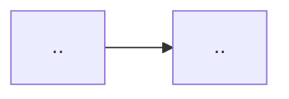

# Authoring the AskMyDocs documentation site (Mintlify)

The public docs live in **`/docs-site/`** (separate from the 162 internal dev
docs in `/docs/`) and deploy to `padosoft.mintlify.app` via the Mintlify GitHub
App on every push to `main` that touches `docs-site/`. This skill is the contract
for writing those pages.

## North star: the claude-mem docs

Model structure + depth on
`github.com/thedotmack/claude-mem/tree/main/docs/public` (published at
`docs.claude-mem.ai`): a groups-based sidebar (no tabs), a dedicated deep
**Architecture** group with one page per subsystem, a conceptual **Best
Practices** group, and per-integration groups. Their architecture pages are
reference-grade (frontmatter + real DDL + exact file paths + index lists); **ours
go a superset deeper** by adding a Mermaid diagram and an ADR-style decision
rationale to every concept/architecture page.

## The deep-doc section template (the quality bar)

Every concept / architecture / guide page is an **academic-grade standalone
explainer**. The README is the above-the-fold pitch; the doc-site is the
authoritative, argued, diagrammed reference. Use this skeleton:

```mdx
---
title: "<Page title>"
description: "<one-sentence summary — shown in search + social cards>"
icon: "<lucide/fontawesome icon name>"
---

## Motivation / problem
<What breaks without this; why it matters at enterprise scale.>

## Theory & background
<The concept, prior art, the principle. This is where the "academic" depth lives.>

## Design
<How AskMyDocs implements it. ALWAYS include a Mermaid diagram.>



## Data model / contract
<Tables, columns, payload shapes, env knobs — accurate to the code (R9).>

## Decision rationale (ADR-style)
<Trade-offs considered, why this path, what was rejected. Cross-link /docs/adr/*.>

## Worked example
<A concrete end-to-end walkthrough with real commands / JSON / SQL.>

## Gotchas & operations
<Failure modes, flags, tuning, what NOT to do.>
```

Not every guide needs all seven sections, but **concept** and **architecture**
pages must include the Mermaid diagram (Design) and the ADR rationale.

## Mintlify mechanics

- **Config**: `/docs-site/docs.json` (`$schema: https://mintlify.com/docs.json`).
  Navigation is `navigation.groups[]` — each group has `group`, `icon`, `pages[]`
  (page = the MDX path without extension, relative to `docs-site/`).
- **Register every new page** in `docs.json` under the right group. Mintlify
  errors on a nav entry whose file does not exist — only list pages you ship in
  this PR.
- **Components** available in MDX: `<Note>`, `<Warning>`, `<Tip>`, `<Steps>` +
  `<Step>`, `<CardGroup cols=>` + `<Card icon= href=>`, `<AccordionGroup>` +
  `<Accordion>`, `<Tabs>`, `<CodeGroup>`. Diagrams: a fenced ```mermaid block.
- **Frontmatter**: `title`, `description`, `icon` on every page.
- **Assets**: images in `/docs-site/images/`, reusable snippets in
  `/docs-site/snippets/`.

## Authoring checklist (per page)

- [ ] Frontmatter `title` + `description` + `icon`.
- [ ] Registered in `docs.json` under the correct group.
- [ ] Concept/architecture page has a **Mermaid diagram** and an **ADR rationale**
      section.
- [ ] At least one **worked example** with real commands/JSON/SQL.
- [ ] Every column / env var / command / route quoted is **accurate to the code**
      (R9 — verify against migrations, config, `--help`, routes).
- [ ] Cross-links related pages (`href="/..."`) and the relevant `/docs/adr/*`.
- [ ] No condensed-README paste — the page argues and explains, it does not list.
- [ ] If `mint` is installed: `cd docs-site && mint dev` renders the page with no
      broken links. If not, validate `docs.json` is valid JSON and every listed
      page file exists.

## Navigation taxonomy (keep pages in the right group)

`Get Started` · `Guides` · `Best Practices` (theory) · `Integrations` ·
`Configuration & Operations` · `Architecture` (the deep subsystem pages +
`architecture/decisions`) · `Reference` (api / cli / adr-index).

## R45 — doc-site parity

This skill exists to satisfy **R45**: a PR that adds/changes a capability or edits
README feature tables / changelog / roadmap MUST also add/update the
corresponding deep page here and register it in `docs.json`. A README bump with no
doc-site page is an incomplete PR.
