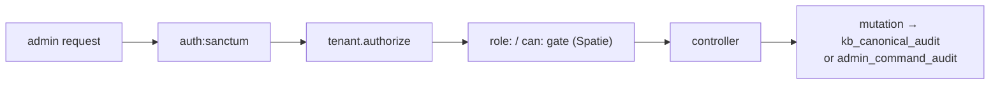

## Motivation

A self-hostable KB needs an operations surface, not just an API. AskMyDocs ships a
full **React admin SPA** at `/app/admin/*`, every page behind Spatie role-based
access control, every mutation audit-trailed, and every destructive command
gated by a single-use confirm token.

## What's in it

- **Dashboard** — KPIs, health checks, charts from real seeded metrics.
- **Users / Roles / RBAC** — the five roles (super-admin / admin / dpo / editor /
  viewer), permission matrix, role editor.
- **Projects** — the first-class [project registry](/projects-registry): name +
  describe `project_key`s, with an immutable key and an in-use delete-guard.
- **KB explorer** — browse the canonical tree, an inline source editor
  (CodeMirror), a graph viewer, PDF export, the **Cloud Time Machine** (browse /
  diff / restore any version).
- **Auto-Wiki admin** — Wiki Health (lint + safe auto-fix), Wiki Indices (hub +
  roll-ups + operation log + rebuild), Wiki Explorer (promote auto→human /
  discard), Auto-Wiki Settings — see [Auto-Wiki](/auto-wiki).
- **Doc Insights** — content-gap analytics + obsolescence intelligence on every
  change *and delete*, with an audited Apply engine.
- **Tabular Review & Workflows** — spreadsheet-style document extraction +
  AI-suggested workflow templates.
- **Log viewer** — five tabs (application / chat / failed jobs / audit / …).
- **Maintenance runner** — a whitelisted Artisan runner (see below).
- **AI Insights** — a daily computed insights panel.
- **Sister admins** — PII Redactor, Flow, Eval Harness, AI Act, MCP, Evidence &
  Risk Review — each cross-mounted natively.

## RBAC + audit (every page)



Every protected route is in the **R32 authorization matrix** test — a new screen
or endpoint that forgets its `role:` / `can:` gate fails CI. The five roles plus
the guest are asserted against the exact allow-set for each group.

## The maintenance runner (6 gates)

Destructive Artisan commands run through `CommandRunnerService`, which enforces:
(1) whitelist lookup in `config('admin.allowed_commands')`, (2) args-schema
validation, (3) a DB-backed **single-use confirm token** consumed inside a
`lockForUpdate()` transaction (R21 atomic), (4) the Spatie permission gate,
(5) audit-before-execute, (6) a per-user rate limit. The confirm-token table
carries a composite UNIQUE so a single-use bypass is structurally impossible.

## Tri-surface (R44)

Every admin capability is one thin layer over a shared core service — the same
core is also reachable as an Artisan command (PHP) and, where applicable, an MCP
tool. Code-only is never "done": a capability lands on all three surfaces or the
omission is a documented choice.

## Worked example — running a maintenance command

```bash
# 1. Request a single-use confirm token (POST, RBAC-gated)
curl -X POST https://host/api/admin/maintenance/token \
  -H "Authorization: ******" \
  -d '{"command":"kb:prune-deleted","args":{"--days":30}}'
# → { "nonce": "tok_abc123", "expires_in": 300 }

# 2. Execute — token is consumed atomically (lockForUpdate inside DB::transaction)
curl -X POST https://host/api/admin/maintenance/run \
  -H "Authorization: ******" \
  -d '{"command":"kb:prune-deleted","args":{"--days":30},"nonce":"tok_abc123"}'
# → { "output": "Pruned 47 documents.", "exit_code": 0, "audit_id": 1991 }
```

The nonce is single-use and backed by a composite UNIQUE constraint — a second
identical request with the same `nonce` returns 409 Conflict, not a re-execution.

## Gotchas & operations

- A new protected route / screen / gate / role MUST be added to the R32
  authorization-matrix test in the same PR.
- Destructive commands always require the single-use confirm token — never add a
  bypass.
- Every admin mutation audit-trails; bypassing the audit path is a defect even
  when the change works.

<CardGroup cols={2}>
  <Card title="Multi-tenant isolation" icon="building-shield" href="/multi-tenant-isolation">
    How admin reads stay scoped to one tenant.
  </Card>
  <Card title="Architecture overview" icon="sitemap" href="/architecture/overview">
    Where the admin surface sits in the system.
  </Card>
</CardGroup>
