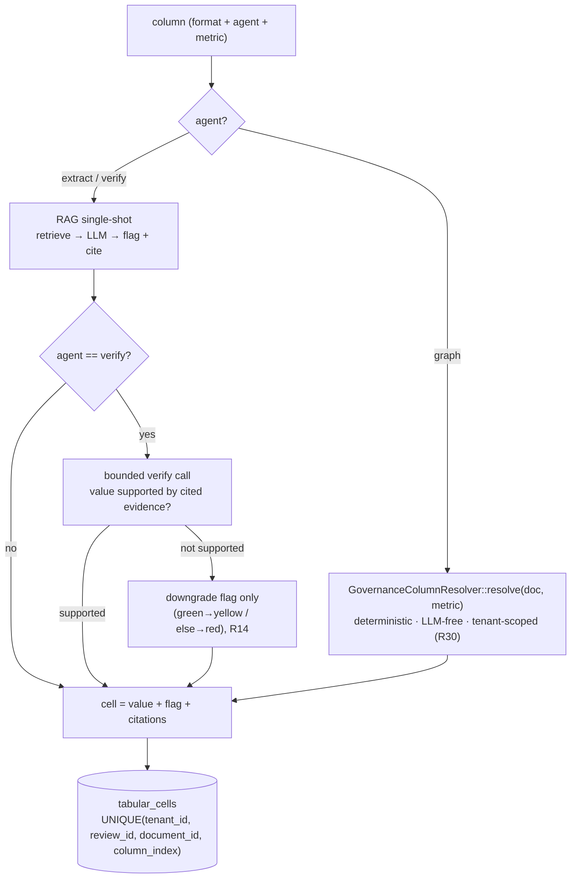

## Motivation / problem

The v4.7 Tabular Review engine turned a set of documents into a spreadsheet: rows
are documents, columns are questions, and each cell is a RAG-grounded extraction with
a flag (green/yellow/red) and cited chunks. It answers *"what does each document say
about X?"* well. But every column was the **same kind** of question — a single-shot
LLM extraction — so two things were out of reach:

1. **Governance questions that the graph already knows the answer to.** *"Is this doc
   canonical? Orphaned in the graph? Superseded? What's its evidence tier?"* are
   deterministic facts in the canonical layer, not LLM judgments. Asking an LLM to
   guess them is slower, costs money, and can hallucinate.
2. **Anti-hallucination on the extraction itself.** A green flag means the model was
   confident — not that the value is actually supported by the cited evidence.

**Agentic Knowledge Reports** (v8.19) promotes the engine to first-class **agentic
columns**: a column now has an `agent` dimension orthogonal to its `format`, so a
single report can mix RAG extraction, deterministic graph governance, and a verified
anti-hallucination pass — and ship as a one-click, per-cell-cited, exportable audit
matrix.

## Theory & background

The unit of the engine is still a **cell** = (document row × column). What changes is
that a column declares **how** its cell is produced, via the `agent` kind
(`App\Support\TabularReview\AgentKind`):

- **`extract`** — today's behaviour, unchanged and the default. One RAG single-shot
  per (doc, column): retrieve, ask the LLM, flag + cite. Every pre-v8.19 review is
  byte-identical (the field is absent → `extract`).
- **`graph`** — a **deterministic, LLM-free** governance metric resolved from the
  canonical graph + document columns. No model call, no cost, no hallucination — the
  value is a fact (`is_canonical = true`, `incoming_edges = 4`, …). The `graph` agent
  *wins over* the `json_path` shortcut when both are set.
- **`verify`** — a bounded anti-hallucination **second pass**. After an `extract`
  produces a value, a verify call re-checks it against the document's cited evidence
  and can only **downgrade** the flag (green → yellow / else → red) when the value
  isn't supported. It is **never worse than extract**: a verify-call failure keeps the
  original cell (R14).

This is the agentic ladder — cheap-and-certain (`graph`) → grounded
(`extract`) → grounded-and-checked (`verify`) — expressed as a per-column choice
rather than a whole-report mode.

The governance metrics come from one place — `App\Services\TabularReview\GovernanceColumnResolver`
— which reads the **real** taxonomies (`EvidenceTier`, `CanonicalStatus` enums) and
the canonical graph (`kb_edges`), tenant-scoped (R30). It exposes 10 metrics:

| Metric | Meaning |
| --- | --- |
| `evidence_tier` | The document's evidence tier (guideline / peer_reviewed / official / … / unverified), ranked; low-confidence tiers flag amber/red. |
| `frontmatter_completeness` | How complete the canonical frontmatter is. |
| `canonical_status` | draft / review / accepted / superseded / deprecated / archived. |
| `is_canonical` | Whether the doc is canonical at all. |
| `incoming_edges` / `outgoing_edges` | Degree in the canonical graph. |
| `graph_connectivity` | Whether the doc is wired into the graph at all. |
| `is_orphan` | Canonical but with zero edges — a governance smell. |
| `supersession_status` | Whether the doc declares a `superseded_by` (outgoing `InvalidatedBy` edge). |
| `staleness_days` | Days since the doc was last updated. |

## Design

The router lives in `App\Services\TabularReview\TabularReviewExtractor`, which now
takes the `GovernanceColumnResolver` as a constructor dependency. Per column, it picks
a path by `agent` (graph wins over `json_path`, both LLM-free; otherwise `extract`,
optionally followed by `verify`):



The verify pass is **bounded and order-stable**: it `ksort`s the columns it checks and
only ever downgrades, so a report's verified run is deterministic and can never invent
a *better* flag than the extraction earned.

The flagship **"Canonical KB Governance Audit"** preset (#16 in the seeded library)
is the headline application: rows = canonical docs, columns = 8 `graph` governance
auditors + 1 `verify` contradiction check. Running it turns the whole KB into a
per-cell-cited, exportable governance matrix — *"which canonical docs are orphaned,
stale, superseded, low-evidence-tier, or self-contradictory?"* answered in one grid.

The FE (built on the existing accessible DOM matrix) adds three surfaces: an **agentic
column editor** (the governance metric picker appears only for `graph` columns; submit
is gated so a `graph`-without-`metric` can't 422), a per-cell **evidence side-panel**
(summary + flag + reasoning + cited chunks), and a one-click **template gallery** of
the built-in system reports.

## Data model / contract

The engine reuses the v4.7 tables — **no new tables** for the agentic upgrade. The
agentic dimension is additive on the column config:

| Table | Holds |
| --- | --- |
| `tabular_reviews` | One report: title, project, and the `columns_config` JSON array. Each column now carries the additive `agent` (`extract`/`graph`/`verify`) + `metric` (for `graph`) keys, alongside the existing `name` / `prompt` / `format` / `enum_values` / `json_path`. |
| `tabular_cells` | One cell per (review, document, column): `content` (summary + flag + reasoning + citations), upserted on the composite `UNIQUE (tenant_id, review_id, document_id, column_index)` so concurrent generate/regenerate never duplicates a row. |

The ready-made library reuses `workflows` (`type = tabular`, `is_system = true`) —
`BuiltInWorkflowSeeder` now mints **16** system templates (the +1 is the governance
preset), each with a sensible `columns_config`. Both `agent` and `metric` are validated
on `Store/UpdateTabularReviewRequest` (`metric` is `required_if` the agent is `graph`
and must be one of the 10 `GovernanceColumnResolver::METRICS`).

The capability is reachable on all three R44 surfaces over one shared core:

- **PHP** — `TabularReviewExtractor` + `GovernanceColumnResolver` + the
  `BuiltInWorkflowSeeder` library.
- **HTTP** — the existing `api/admin/tabular-reviews/*` (list / show / create /
  generate), now accepting agentic columns.
- **MCP** — `App\Mcp\Tools\KbRunReportTool` on the `enterprise-kb` server (read a
  saved report's matrix, tenant-scoped R30, OFF-path safe R43), bounded by
  `COUNT(DISTINCT) + LIMIT` so an agent can't pull an unbounded matrix.

## Security & flags (R32 / R30 / R43)

- **RBAC.** Every tabular-review route is behind `can:viewTabularReviews` /
  `can:manageTabularReviews`, R32-matrix-locked. The agentic upgrade adds no new route
  group — it extends the existing controllers' request contracts.
- **Tenant isolation (R30).** `GovernanceColumnResolver` scopes every `kb_edges` /
  document query to the active tenant; `KbRunReportTool` filters the report + cells by
  tenant. A client cannot read another tenant's report or widen scope through a filter.
- **OFF-path safe (R43).** `KbRunReportTool` returns a well-formed empty payload when
  the report/cells are absent rather than throwing; `verify` failures and `graph`
  unknowns degrade to a grey/red cell (R14) instead of erroring the whole generate.

## Decision rationale (ADR-style)

- **A per-column `agent` dimension, not a report-level mode.** Governance audits mix
  deterministic facts and grounded judgments in the *same* grid; a whole-report mode
  would force a false choice. Making `agent` a column property lets one report carry
  `graph` facts next to `extract`/`verify` answers. See
  [architecture decisions](/architecture/decisions).
- **Deterministic graph metrics over LLM guesses.** Canonical status, edge degree,
  orphan-ness and supersession are *facts* in the graph. Resolving them with
  `GovernanceColumnResolver` (no model call) is faster, free, and cannot hallucinate —
  and it reuses the real `EvidenceTier`/`CanonicalStatus` enums so the taxonomy never
  drifts (R9).
- **`verify` can only downgrade.** An anti-hallucination pass that could *raise* a flag
  would itself be a hallucination risk. Constraining it to downgrade-only (and keeping
  the original cell on failure) makes the verified run monotonic and never worse than
  the extraction (R14).
- **Reuse `workflows` for the library.** The ready-made "precotte" templates are just
  system-owned tabular workflows — no new model, no new admin surface, and they show up
  in the existing workflow gallery for free.
- **Glide canvas grid deferred.** The accessible DOM matrix (per-cell testids + ARIA,
  R11/R15) ships now; the canvas grid + SSE progressive-paint are documented v8.19.x
  follow-ups because canvas cells can't carry per-cell testids/ARIA — testability and
  a11y come first.

## Worked example

Create a governance report from the flagship preset, then read its matrix over MCP. A
`graph` column is computed with **no LLM call**:

```sql
-- a graph governance cell — a fact, not a guess
SELECT column_index, content->>'summary' AS value, content->>'flag' AS flag
FROM tabular_cells
WHERE review_id = 7 AND column_index = 3   -- the "is_orphan" column
ORDER BY document_id LIMIT 1;
-- 3 | "orphan" | "red"   (canonical doc with zero edges)
```

A `verify` column downgrades a too-confident extraction:

```text
extract → "Yes, the policy mandates 30-day retention" (green)
verify  → the cited chunk says "retention is configurable", not "30-day"
result  → flag downgraded to yellow; original value kept (R14)
```

Read the whole report through the **MCP** surface — an agent on the `enterprise-kb`
server calls `KbRunReportTool` and gets the tenant's report matrix, bounded by
`COUNT(DISTINCT) + LIMIT`:

```json
{ "tool": "run-report", "input": { "review_id": 7, "max_rows": 50 } }
// → { "summary": { "documents": 42, "total_documents": 213 }, "columns": [ { "metric": "is_orphan", ... } ], ... }
```

In the admin SPA at `/app/admin/tabular-reviews`, "From template" opens the gallery,
picks "Canonical KB Governance Audit", and pre-fills the create dialog; clicking a
populated cell opens the **evidence side-panel** with the summary, flag, reasoning and
the cited KB chunks.

## Gotchas & operations

- **`graph` needs a `metric`.** A `graph` column without a governance metric is a
  misconfiguration — the FE gates submit on it and the BE validator rejects it
  (`required_if`), so a bad column can't reach generation and 422.
- **`graph` wins over `json_path`.** If a column sets both, the deterministic graph
  resolver runs; `json_path` is the LLM-free shortcut for `extract`-family columns.
- **`verify` adds a bounded second call.** It is the one agent kind that costs extra
  per cell (one verify call after the extract). Use it for the columns where
  anti-hallucination matters, not blanket-on every column.
- **Existing reviews are unchanged.** A pre-v8.19 review has no `agent` on its columns
  → every column is `extract` → byte-identical output. The agentic upgrade is purely
  additive (R27).
- **Re-run after canonical changes.** `graph` cells reflect the canonical graph at
  generate time; promote/supersede/delete a doc and re-generate to refresh the
  governance matrix.

<CardGroup cols={2}>
  <Card title="Canonical & promotion" icon="diagram-project" href="/canonical-and-promotion">
    The canonical graph (kb_edges, status, evidence tiers) the graph columns read.
  </Card>
  <Card title="Grounding & evidence tiers" icon="layer-group" href="/grounding-and-evidence-tiers">
    The EvidenceTier taxonomy a governance audit ranks each doc by.
  </Card>
  <Card title="Multi-tenant isolation" icon="building-lock" href="/multi-tenant-isolation">
    The TenantContext every report, cell and graph query is scoped to (R30).
  </Card>
  <Card title="MCP server" icon="plug" href="/mcp-server">
    The KbRunReportTool reader on the enterprise-kb server.
  </Card>
</CardGroup>
