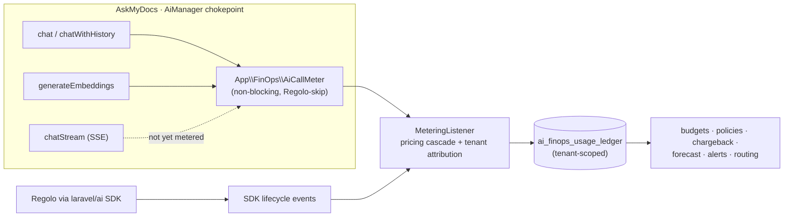

## Motivation / problem

A multi-provider RAG system spends real money on every chat turn and every
ingestion embedding, across five providers with different price sheets. Without a
governance layer you get the classic FinOps failure mode: the bill is only legible
*after* it arrives, there is no per-tenant attribution for chargeback, and nothing
stops a runaway agent loop or a mispriced model from burning the monthly budget in
an afternoon.

AskMyDocs answers this with [`padosoft/laravel-ai-finops`](https://github.com/padosoft/laravel-ai-finops)
(+ the companion React cockpit
[`padosoft/laravel-ai-finops-admin`](https://github.com/padosoft/laravel-ai-finops-admin)):
an immutable usage **ledger**, hierarchical **budgets**, a declarative **policy
DSL**, **chargeback**/cost-centers, **forecasting** + anomaly detection,
cost-aware routing, price-watch and multi-channel **alerts** — all tenant-scoped.

## Theory & background

FinOps splits into three loops: **inform** (meter every call, price it, attribute
it), **govern** (budgets + policies that can warn or block), and **optimize**
(forecast, route by quality-per-dollar, watch for price changes). The package
implements all three; AskMyDocs ships **inform** on by default and leaves
**govern**'s hard blocks opt-in (observe-first).

The package meters at a **single point**: it listens on the `laravel/ai` SDK
lifecycle events (`PromptingAgent` / `AgentPrompted` / `EmbeddingsGenerated`). Any
call that flows through the SDK is metered and priced automatically — for free.

AskMyDocs has one wrinkle that shapes the whole integration: only **Regolo** is
wired through the `laravel/ai` SDK. OpenAI / Anthropic / Gemini / OpenRouter are
called over raw `Illuminate\Support\Facades\Http` (a deliberate transport choice —
see the [architecture decisions](/architecture/decisions)). So the SDK's automatic
metering, left alone, would see *only* Regolo and leave the default `openrouter`
traffic invisible. The bridge below closes that gap for synchronous calls.

## Design

`AiManager` is the one chokepoint every chat + embedding call already passes
through. After a provider returns, `App\FinOps\AiCallMeter` feeds the result into
the package's own pricing + recording pipeline by calling the metering listener's
public `record*` methods directly — so the raw-`Http::` providers land in the
ledger with the **same** pricing cascade, tenant attribution and subscription
coverage as the SDK path. Regolo is skipped (it already meters itself through the
SDK), so it is never double-counted. The bridge is non-blocking and fully
`try/catch`'d (the [`ChatLogManager`](/chat-and-retrieval) discipline): a metering
failure never breaks a chat turn or an ingestion run.



Tenant attribution is wired through `App\FinOps\HostTenantResolver` (a
config-cacheable class-string, not a closure), which returns the request-scoped
tenant id from [`App\Support\TenantContext`](/multi-tenant-isolation) — so every
ledger row, budget and rollup belongs to the active tenant (R30).

## Data model / contract

The package owns its tables under the `ai_finops_` prefix (created by `php artisan
migrate` after install). The load-bearing ones:

| Table | Holds |
| --- | --- |
| `ai_finops_usage_ledger` | One immutable row per metered call: provider, model, tokens, cost, `cost_method`, `tenant_id`, trace tags. |
| `ai_finops_budgets` | N-scope budgets (global → tenant → user → cost-center → provider → model → agent → purpose), soft/hard, daily→yearly + rolling. |
| `ai_finops_policies` / `ai_finops_approvals` | Declarative policy DSL (block / require-approval / downgrade / throttle / queue) + the approval workflow. |
| `ai_finops_kill_switches` | Global + scoped kill switches. |
| `ai_finops_cost_centers` | Chargeback / showback allocation. |
| `ai_finops_pricing_overrides` / `ai_finops_subscription_windows` | Manual price overrides + flat-rate coverage windows (covered calls cost 0; tokens still tracked). |
| `ai_finops_routing_rules` / `ai_finops_whatif_scenarios` | Cost-aware routing + the what-if re-pricing simulator. |
| `ai_finops_price_watch_*` / `ai_finops_alerts_*` / `ai_finops_anomaly_acks` | Provider price-change watch, alert channels/rules/log, anomaly acks. |
| `ai_finops_audit_log` | Immutable governance-mutation trail (budgets, policies, kill-switches, …). |

The HTTP surface mounts under `api/admin/ai-finops` (read `dashboard/kpis`,
`usage`, `budgets`, `pricing/models`, `forecast`, `audit`, `settings`, … ; write
`budgets`, `policies`, `cost-centers`, `settings/kill-switch`, …). Key env knobs:

```env
AI_FINOPS_ENABLED=true          # master switch (routes + metering hook)
AI_FINOPS_METERING=true         # record usage into the ledger
AI_FINOPS_ENFORCEMENT=false     # hard budget/policy HTTP-402 blocks (opt-in)
AI_FINOPS_CURRENCY=USD          # base = provider list-price currency
AI_FINOPS_DISPLAY_CURRENCY=EUR
AI_FINOPS_RETENTION_DAYS=730
AI_FINOPS_ADMIN_ENABLED=false   # React cockpit at /admin/ai-finops (opt-in)
```

Tier-1 maintenance crons (staggered in the 04:xx window):
`ai-finops:capture-prices`, `ai-finops:check-alerts`, `ai-finops:prune`
(`ai-finops:report` is on-demand).

## Security & flags (R32 / R30 / R43)

- **Method-aware authorization.** Every privileged route sits behind
  `App\Http\Middleware\FinOpsAuthorize`: safe methods (GET/HEAD) require the
  `viewAiFinOps` gate (**super-admin + admin**); mutating methods
  (POST/PUT/PATCH/DELETE) require `manageAiFinOps` (**super-admin only**). The
  package controllers do no internal authorization — this middleware *is* the
  boundary, and it is regression-locked in `AdminAuthorizationMatrixTest` (R32).
- **Secure-by-host override.** The package default route stack is `['api']` +
  `['auth']` (no Sanctum, no tenant scope). The host `config/ai-finops.php`
  replaces it with `EncryptCookies + StartSession + auth:sanctum +
  tenant.authorize` (+ `finops.authorize`). The package's `health` probe is
  wrapped too, so it is **authenticated**, not an anonymous uptime endpoint.
- **Tenant isolation (R30).** `HostTenantResolver` binds every ledger row to the
  active tenant; cross-tenant cost leakage is not possible through the API.
- **Default-OFF surfaces (R43).** Both master `AI_FINOPS_ENABLED` and the admin
  SPA `AI_FINOPS_ADMIN_ENABLED` degrade cleanly when off (routes unregistered →
  404, never a 500). Hard enforcement (`AI_FINOPS_ENFORCEMENT`) is also default-OFF
  — observe first, then turn on blocking once budgets/policies are seeded.

## Decision rationale (ADR-style)

- **Package over a hand-rolled cost table.** AskMyDocs already kept static
  `cost_rates` in `config/ai.php`, but that is a price sheet, not governance — no
  ledger, no budgets, no per-tenant rollup, no enforcement. Adopting the
  maintained package buys the entire FinOps loop (and multi-source live pricing)
  instead of reinventing it. See [architecture decisions](/architecture/decisions).
- **A metering bridge, not an SDK migration.** Routing the four raw-`Http::`
  providers through the `laravel/ai` SDK would fire the events natively, but it
  reverses a deliberate transport decision (full control over auth/retries/parsing
  + `Http::fake()` testability — CLAUDE.md §6) and rewrites the provider + test
  surface. The bridge reuses the *same* `MeteringListener` pricing pipeline the SDK
  uses, so the ledger is correct without touching transport.
- **Known limitation — streaming is not metered.** `AiManager::chatStream()` (the
  SSE endpoint) bypasses the bridge: a turn served over streaming is **not**
  recorded in the ledger. This is a documented follow-up, not full coverage today.
- **Pre-flight enforcement is bounded to the SDK path.** Because the bridge records
  *after* the call, hard budget/policy blocks (HTTP 402) fire only for SDK-routed
  (Regolo) calls; the raw-`Http::` providers are metered but not pre-flight blocked.

## Worked example

A normal chat turn (default `openrouter`) writes one tenant-scoped ledger row — no
extra wiring:

```sql
SELECT provider, model, prompt_tokens, completion_tokens, cost, tenant_id, cost_method
FROM ai_finops_usage_ledger
ORDER BY id DESC LIMIT 1;
-- openrouter | openai/gpt-4o-mini | 812 | 143 | 0.000241 | acme | computed
```

Read the dashboard KPIs over the API (super-admin or admin session):

```bash
curl https://host/api/admin/ai-finops/dashboard/kpis \
  -H "Cookie: <authenticated SPA session>" \
  -H "X-Tenant-Id: acme"
# 200 → { "spend_today": 1.84, "spend_month": 47.10, "top_model": "...", ... }
```

The same call as a `viewer` returns **403** (gate denied); unauthenticated returns
**401**. Turn the cockpit on with `AI_FINOPS_ADMIN_ENABLED=true` and
`php artisan vendor:publish --tag=ai-finops-admin-assets --force`, then open
`/admin/ai-finops`.

## Gotchas & operations

<Warning>
Streaming chat is **not** in the ledger yet (see the rationale above). If clients
use the SSE endpoint heavily, spend is undercounted until streaming metering ships.
</Warning>

- **Currency.** Budgets compare against spend in the **base** currency (`USD`,
  matching provider list prices); `EUR` is display-only. Set an FX provider to
  budget in another currency.
- **Enforcement is off by default.** Seed budgets/policies first, then flip
  `AI_FINOPS_ENFORCEMENT=true` — turning it on with no budgets does nothing; with a
  mis-scoped hard budget it can 402 live traffic.
- **MCP surface is not shipped.** The package exposes PHP (Artisan) + HTTP + the
  React admin, but no MCP tool yet — so FinOps spend is not queryable by agents
  (a tri-surface R44 follow-up).
- **Regolo manual pricing.** Regolo is feed-less; enter its rates via
  `pricing/overrides` or it prices at zero.

<CardGroup cols={2}>
  <Card title="AI providers" icon="plug" href="/ai-providers">
    The five-provider federation FinOps meters — and why four use raw `Http::`.
  </Card>
  <Card title="Multi-tenant isolation" icon="building-lock" href="/multi-tenant-isolation">
    The `TenantContext` every ledger row, budget and rollup is scoped to.
  </Card>
  <Card title="Scheduler & maintenance" icon="clock" href="/scheduler-and-maintenance">
    Where the `ai-finops:*` Tier-1 crons run.
  </Card>
  <Card title="Architecture decisions" icon="diagram-project" href="/architecture/decisions">
    The raw-`Http::` transport decision the metering bridge works around.
  </Card>
</CardGroup>
