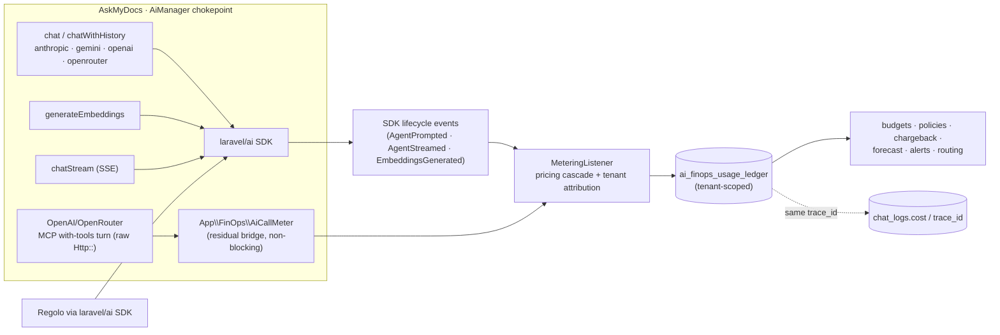

## Motivation / problem

A multi-provider RAG system spends real money on every chat turn and every
ingestion embedding, across five providers with different price sheets. Without a
governance layer you get the classic FinOps failure mode: the bill is only legible
*after* it arrives, there is no per-tenant attribution for chargeback, and nothing
stops a runaway agent loop or a mispriced model from burning the monthly budget in
an afternoon. Worse, AskMyDocs historically *guessed* per-turn cost from a static
`config/ai.php` price sheet resolved **client-side** — a number that drifted from
the real bill the moment a provider changed its rates.

AskMyDocs answers this with [`padosoft/laravel-ai-finops`](https://github.com/padosoft/laravel-ai-finops)
(+ the companion React cockpit
[`padosoft/laravel-ai-finops-admin`](https://github.com/padosoft/laravel-ai-finops-admin)):
an immutable usage **ledger**, hierarchical **budgets**, a declarative **policy
DSL**, **chargeback**/cost-centers, **forecasting** + anomaly detection,
cost-aware routing, price-watch and multi-channel **alerts** — all tenant-scoped,
all priced by the package's own multi-source cost cascade.

## Theory & background

FinOps splits into three loops: **inform** (meter every call, price it, attribute
it), **govern** (budgets + policies that can warn or block), and **optimize**
(forecast, route by quality-per-dollar, watch for price changes). The package
implements all three; AskMyDocs ships **inform** on by default and leaves
**govern**'s hard blocks opt-in (observe-first).

The package meters at a **single point**: it listens on the `laravel/ai` SDK
lifecycle events (`AgentPrompted` / `AgentStreamed` / `EmbeddingsGenerated`). Any
call that flows through the SDK is metered and priced automatically — for free.

The shape of the integration changed in **v8.16/W2**. AskMyDocs used to call four
of its five providers (OpenAI / Anthropic / Gemini / OpenRouter) over raw
`Illuminate\Support\Facades\Http`, leaving the SDK's automatic metering blind to
everything but Regolo. W2 **migrated provider transport onto the `laravel/ai`
SDK** ([ADR 0015](/architecture/decisions)): Anthropic, Gemini and Regolo now run
fully through the SDK, and OpenAI / OpenRouter run through it for ordinary chat +
embeddings. The SDK's native metering therefore covers almost all traffic. A thin
**residual bridge** closes the one remaining gap (below).

## Design

Native SDK metering does the heavy lifting: every Anthropic / Gemini / Regolo call
and every no-tools OpenAI / OpenRouter chat + embedding fires a lifecycle event the
package's `MeteringListener` records and prices automatically.

The one path the SDK cannot see is the **MCP tool-calling turn** for the two hybrid
providers (OpenAI / OpenRouter): a with-tools turn is still issued over raw
`Http::` because the SDK's tool-call surface does not yet match the host's MCP loop.
`App\FinOps\AiCallMeter` is the **residual bridge** for exactly that turn — it feeds
the raw-`Http::` result into the *same* `MeteringListener` pricing pipeline so the
tool turn lands in the ledger with identical pricing, tenant attribution and
subscription coverage. `App\Ai\AiManager::bridgeShouldMeterChat()` gates it: the
bridge fires **only** when a hybrid provider issues a with-tools turn
(`array_key_exists('tools', …)` or the history contains a tool turn), so an
SDK-metered call is never double-counted. The bridge is non-blocking and fully
`try/catch`'d (the [`ChatLogManager`](/chat-and-retrieval) discipline): a metering
failure never breaks a chat turn or an ingestion run.



Tenant attribution is wired through `App\FinOps\HostTenantResolver` (a
config-cacheable class-string, not a closure), which returns the request-scoped
tenant id from [`App\Support\TenantContext`](/multi-tenant-isolation) — so every
ledger row, budget and rollup belongs to the active tenant (R30).

### Real per-turn cost on every chat log (W3)

The old "guess from a static sheet, client-side" cost model is gone. At
`ChatLogManager` time, `App\FinOps\ChatTurnCostResolver` resolves the **real**
cost of the turn through the package's `CostResolutionService` cascade (actual
billed → tokens × tariff → estimated) and persists it onto the `chat_logs` row
(`cost`, `cost_currency`), plus a `trace_id` that joins the row to its
`ai_finops_usage_ledger` row(s). The chat API echoes the resolved cost in
`meta.cost` / `meta.cost_currency` (additive — R27), and the chat UI's cost meter
reads the **server** value instead of recomputing. Streaming turns stamp the same
cost + `trace_id`. The whole path is gated on `AI_FINOPS_METERING` so a deployment
with FinOps off pays no price-feed cost and writes no dangling trace id.

## Data model / contract

The package owns its tables under the `ai_finops_` prefix (created by `php artisan
migrate` after install). The load-bearing ones:

| Table | Holds |
| --- | --- |
| `ai_finops_usage_ledger` | One immutable row per metered call: provider, model, tokens, `cost_total`, `cost_method`, `tenant_id`, trace tags. |
| `ai_finops_budgets` | N-scope budgets (global → tenant → user → cost-center → provider → model → agent → purpose), soft/hard, daily→yearly + rolling. |
| `ai_finops_policies` / `ai_finops_approvals` | Declarative policy DSL (block / require-approval / downgrade / throttle / queue) + the approval workflow. |
| `ai_finops_kill_switches` | Global + scoped kill switches. |
| `ai_finops_cost_centers` | Chargeback / showback allocation. |
| `ai_finops_pricing_overrides` / `ai_finops_subscription_windows` | Manual price overrides + flat-rate coverage windows (covered calls cost 0; tokens still tracked). |
| `ai_finops_routing_rules` / `ai_finops_whatif_scenarios` | Cost-aware routing + the what-if re-pricing simulator. |
| `ai_finops_price_watch_*` / `ai_finops_alerts_*` / `ai_finops_anomaly_acks` | Provider price-change watch, alert channels/rules/log, anomaly acks. |
| `ai_finops_audit_log` | Immutable governance-mutation trail (budgets, policies, kill-switches, …). |

The host adds an **additive** cost surface to its own `chat_logs` table (v8.16/W3):
`cost` `decimal(18,8)`, `cost_currency` `char(3)`, and an indexed `trace_id`
`string(64)` — the join key back to the ledger. The precision mirrors the ledger's
`cost_total` so the two never round apart.

The capability is reachable on all three R44 surfaces over one shared core:

- **PHP** — the `ai-finops:*` Artisan commands (`report`, `capture-prices`,
  `check-alerts`, `prune`) + the package services.
- **HTTP** — `api/admin/ai-finops/*` (read `dashboard/kpis`, `usage`, `budgets`,
  `footprint/summary`, `forecast`, `audit`, … ; write `budgets`, `policies`,
  `cost-centers`, `settings/kill-switch`, …).
- **MCP** — three read tools on the `enterprise-kb` server (v8.16/W4),
  tenant-scoped (R30) and OFF-path safe (R43):
  `FinOpsSpendSummaryTool` (total cost + tokens + per-(provider, model) breakdown
  over a window), `FinOpsTopModelsTool` (costliest models with cost-share), and
  `FinOpsBudgetStatusTool` (each tenant-scoped budget's limit / spend / state,
  delegating to `Budget::status()`).

Key env knobs:

```env
AI_FINOPS_ENABLED=true          # master switch (routes + metering hook)
AI_FINOPS_METERING=true         # record usage into the ledger + resolve chat cost
AI_FINOPS_ENFORCEMENT=false     # hard budget/policy HTTP-402 blocks (opt-in)
AI_FINOPS_CURRENCY=USD          # base = provider list-price currency
AI_FINOPS_DISPLAY_CURRENCY=EUR
AI_FINOPS_RETENTION_DAYS=730
AI_FINOPS_ADMIN_ENABLED=false   # React cockpit at /admin/ai-finops (opt-in)
```

Tier-1 maintenance crons (staggered in the 04:xx window):
`ai-finops:capture-prices`, `ai-finops:check-alerts`, `ai-finops:prune`
(`ai-finops:report` is on-demand).

## Security & flags (R32 / R30 / R43)

- **Method-aware authorization.** Every privileged route sits behind
  `App\Http\Middleware\FinOpsAuthorize`: safe methods (GET/HEAD) require the
  `viewAiFinOps` gate (**super-admin + admin**); mutating methods
  (POST/PUT/PATCH/DELETE) require `manageAiFinOps` (**super-admin only**). The
  package controllers do no internal authorization — this middleware *is* the
  boundary, and it is regression-locked in `AdminAuthorizationMatrixTest` (R32).
- **Secure-by-host override.** The package default route stack is `['api']` +
  `['auth']` (no Sanctum, no tenant scope). The host `config/ai-finops.php`
  replaces it with `EncryptCookies + StartSession + auth:sanctum +
  tenant.authorize` (+ `finops.authorize`). The package's `health` probe is
  wrapped too, so it is **authenticated**, not an anonymous uptime endpoint.
- **Tenant isolation (R30).** `HostTenantResolver` binds every ledger row to the
  active tenant; the MCP read tools filter every ledger / budget query by the
  active tenant and deliberately exclude global/cross-scope budgets (whose spend
  aggregates across tenants) — cross-tenant cost leakage is not possible through
  the API or MCP.
- **Default-OFF surfaces (R43).** Both master `AI_FINOPS_ENABLED` and the admin
  SPA `AI_FINOPS_ADMIN_ENABLED` degrade cleanly when off (routes unregistered →
  404, never a 500); the MCP tools return an empty, well-formed payload when the
  ledger/budgets tables are absent. Hard enforcement (`AI_FINOPS_ENFORCEMENT`) is
  also default-OFF — observe first, then turn on blocking once budgets/policies
  are seeded.

## Decision rationale (ADR-style)

- **Package over a hand-rolled cost table.** AskMyDocs used to keep static
  `cost_rates` in `config/ai.php`, but that is a price sheet, not governance — no
  ledger, no budgets, no per-tenant rollup, no enforcement. Adopting the
  maintained package buys the entire FinOps loop (and multi-source live pricing)
  instead of reinventing it. See [architecture decisions](/architecture/decisions).
- **Provider transport migrated to the SDK (ADR 0015).** v8.16/W2 reversed the
  long-standing raw-`Http::` decision for the metered providers: routing chat +
  embeddings through `laravel/ai` makes metering, pricing and tenant attribution
  fire **natively** on the SDK's own lifecycle events, instead of being bolted on
  by a bridge. Anthropic / Gemini / Regolo are fully SDK; OpenAI / OpenRouter are
  SDK for chat + embeddings.
- **A bounded residual bridge, not a half-migration.** The single path still on
  raw `Http::` is the OpenAI / OpenRouter **MCP with-tools turn**, whose tool-call
  shape the SDK does not yet match the host's loop on. `AiCallMeter` bridges only
  that turn into the same pricing pipeline, gated by `bridgeShouldMeterChat()` so
  nothing is double-counted. It retires entirely once the SDK's tool surface lands.
- **Server-side cost authority (W3).** Per-turn cost is resolved once,
  server-side, at `ChatLogManager` time and persisted on `chat_logs` with a
  `trace_id` join to the ledger. The client no longer guesses cost from a static
  sheet — it renders the authoritative server number. The whole resolver is gated
  on `AI_FINOPS_METERING` so an off deployment pays nothing and stamps no dangling
  trace id.

## Worked example

A normal chat turn (default `openrouter`, no tools) is metered natively by the SDK
and writes one tenant-scoped ledger row — no host bridge involved:

```sql
SELECT provider, model, tokens_input, tokens_output, cost_total, tenant_id, cost_method
FROM ai_finops_usage_ledger
ORDER BY id DESC LIMIT 1;
-- openrouter | openai/gpt-4o-mini | 812 | 143 | 0.00024100 | acme | computed
```

The same turn's `chat_logs` row carries the resolved cost and the join key:

```sql
SELECT ai_provider, cost, cost_currency, trace_id FROM chat_logs ORDER BY id DESC LIMIT 1;
-- openrouter | 0.00024100 | USD | 9f1c…  (== the ledger row's trace_id)
```

Read the dashboard KPIs over the API (super-admin or admin session):

```bash
curl https://host/api/admin/ai-finops/dashboard/kpis \
  -H "Cookie: <authenticated SPA session>" \
  -H "X-Tenant-Id: acme"
# 200 → { "spend_today": 1.84, "spend_month": 47.10, "top_model": "...", ... }
```

The same call as a `viewer` returns **403** (gate denied); unauthenticated returns
**401**. Or ask the same question through the **MCP** surface — an agent on the
`enterprise-kb` server calls `FinOpsSpendSummaryTool` and gets the active tenant's
30-day spend + per-model breakdown, scoped to its own tenant only. Turn the cockpit
on with `AI_FINOPS_ADMIN_ENABLED=true` and
`php artisan vendor:publish --tag=ai-finops-admin-assets --force`, then open
`/admin/ai-finops`.

## Gotchas & operations

- **Currency.** Budgets compare against spend in the **base** currency (`USD`,
  matching provider list prices); `EUR` is display-only. Set an FX provider to
  budget in another currency.
- **Enforcement is off by default.** Seed budgets/policies first, then flip
  `AI_FINOPS_ENFORCEMENT=true` — turning it on with no budgets does nothing; with a
  mis-scoped hard budget it can 402 live traffic.
- **Pre-flight enforcement is bounded to the SDK path.** Hard budget/policy blocks
  (HTTP 402) fire on the SDK-metered calls; the residual raw-`Http::` MCP tool turn
  is metered *after* the call, so it is recorded but not pre-flight blocked. It
  closes when the bridge retires.
- **Cost resolution follows `AI_FINOPS_METERING`.** With metering off, `chat_logs`
  rows carry `null` cost + no `trace_id`, and the resolver never touches the price
  feed — by design, so the off path is free and side-effect-less.
- **Regolo manual pricing.** Regolo is feed-less; enter its rates via
  `pricing/overrides` or it prices at zero.

<CardGroup cols={2}>
  <Card title="AI providers" icon="plug" href="/ai-providers">
    The five-provider federation FinOps meters — now on the `laravel/ai` SDK.
  </Card>
  <Card title="Multi-tenant isolation" icon="building-lock" href="/multi-tenant-isolation">
    The `TenantContext` every ledger row, budget and rollup is scoped to.
  </Card>
  <Card title="Scheduler & maintenance" icon="clock" href="/scheduler-and-maintenance">
    Where the `ai-finops:*` Tier-1 crons run.
  </Card>
  <Card title="Architecture decisions" icon="diagram-project" href="/architecture/decisions">
    ADR 0015 — the provider-transport SDK migration this page builds on.
  </Card>
</CardGroup>
