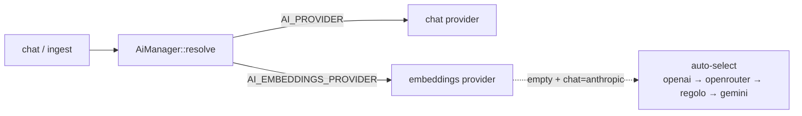

## Motivation

A self-hostable AI hub must not lock you to one model vendor. AskMyDocs treats the
provider as a swappable transport, configured independently for chat and
embeddings, with safe defaults that prevent the most dangerous misconfiguration:
a mismatched embedding dimension.

## The five providers

| Provider | Chat | Embeddings | Transport |
|---|:---:|:---:|---|
| OpenAI | ✅ | ✅ | raw `Http::` |
| Anthropic | ✅ | ❌ | raw `Http::` |
| Gemini | ✅ | ✅ | raw `Http::` |
| OpenRouter | ✅ | ✅ | raw `Http::` |
| Regolo (EU) | ✅ | ✅ | `padosoft/laravel-ai-regolo` SDK adapter on `laravel/ai` |

OpenAI / Anthropic / Gemini / OpenRouter are reached via the **raw HTTP client**
— a deliberate decision (full control over auth, retries, timeouts, response
parsing, and trivial `Http::fake()` testability). **Regolo is the documented
exception**, wired through the in-house SDK adapter, which ships its own test
surface and the Padosoft observability / cost-rate hooks.

## Configuring it

Chat and embeddings are **separate** knobs (Anthropic has no embeddings endpoint):

```env
AI_PROVIDER=openai            # chat
AI_EMBEDDINGS_PROVIDER=openai # embeddings
OPENAI_API_KEY=sk-...
```



## Dimension-safety auto-select

When `AI_PROVIDER=anthropic` and `AI_EMBEDDINGS_PROVIDER` is empty, `AiManager`
auto-selects the first embeddings-capable provider with a configured API key in
the order **openai → openrouter → regolo → gemini**. The order is
**dimension-safety first**: openai + openrouter both default to a 1536-dim model
that matches the stock pgvector schema, so a deployment that merely has a
`REGOLO_API_KEY` / `GEMINI_API_KEY` set but never resized the column cannot
silently corrupt ingest writes.

<Warning>
  The embedding **dimension is part of the schema contract**. OpenRouter's
  `openai/text-embedding-3-small` (default, 1536 dims) needs no migration;
  `qwen/qwen3-embedding-4b` (2560 dims) requires resizing the `vector(N)`
  columns, flushing the cache, and re-indexing. See
  [Installation](/installation#embedding-dimensions).
</Warning>

## Adding a new provider

Implement `AiProviderInterface`, add a `match` case in `AiManager::resolve()`, add
a `providers.<name>` block in `config/ai.php`, mirror the OpenAI test for
coverage, and update `.env.example` + the README compatibility matrix.

## Gotchas & operations

- Never reintroduce an SDK for OpenAI / Anthropic / Gemini / OpenRouter — the raw
  `Http::` transport is intentional (ADR-level decision).
- Switching the embeddings provider/model is a schema-contract change, not a
  config tweak — migrate, flush, re-index.
- Logging never breaks the user path — provider failures surface as proper
  responses, never silent empties.

<CardGroup cols={2}>
  <Card title="Chat & retrieval" icon="comments" href="/chat-and-retrieval">
    Where the chat provider plugs into the pipeline.
  </Card>
  <Card title="Installation" icon="download" href="/installation">
    The embedding-dimension contract in full.
  </Card>
</CardGroup>
