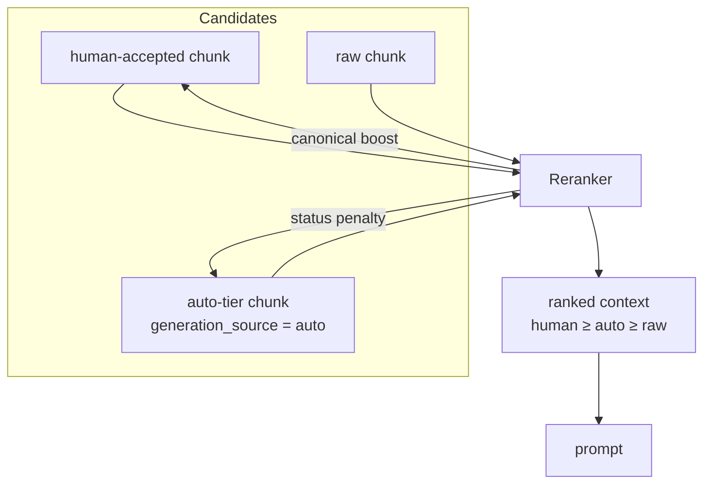

## Motivation / problem

AskMyDocs deliberately lets an LLM *write* knowledge — the Auto-Wiki
tier enriches frontmatter, synthesizes concept pages, and materialises graph
edges. That is powerful and dangerous: the moment machine-generated content is
indistinguishable from human-authored truth, every guarantee about grounding
collapses.

The firewall is the mechanism that makes self-compilation **safe**: machine
knowledge is real and searchable, but it can never silently outrank what a human
vouched for.

## Theory & background

The principle is a **provenance-ordered trust gradient**. Every piece of
retrievable knowledge belongs to one of three trust classes:

1. **human-`accepted`** — promoted through the human-gated pipeline; authoritative.
2. **`auto`** — compiled by the Auto-Wiki engine; useful, second-class.
3. **raw** — ingested but not canonical; lowest standing.

The invariant: **human-`accepted` > `auto` > raw**, enforced at ranking time, not
left to prompt politeness.

## Design

A discriminator column plus a reranker rule implement the firewall:



- `knowledge_documents.generation_source ∈ {human, auto}` is the discriminator.
- The `Reranker` applies a **canonical boost** and a **status penalty** so that,
  all else equal, a human-`accepted` chunk outranks an `auto` chunk, which
  outranks raw.
- Auto pages additionally pass through an **independent cross-model review** (a
  different review-LLM checks grounding / novelty / contradictions) before they
  are trusted, and an admin can **promote** `auto → human` (which moves it across
  the firewall) or **discard** it.

## Data model / contract

- `knowledge_documents.generation_source` — `human` (default) | `auto`.
- Reranker knobs: the canonical boost + status penalty weights (see
  [Architecture overview](/architecture/overview)).
- Auto-review verdict persisted to `frontmatter_json._autowiki.review` + audited
  (`system:autowiki-review`).
- Promote/discard: `kb:wiki-promote`, `POST …/documents/{id}/wiki-{promote,discard}`,
  `KbWikiPromoteTool` (MCP) — all audited to `kb_canonical_audit`.

## Decision rationale (ADR-style)

- **Why rank, not filter?** Filtering auto content out would waste genuinely
  useful machine knowledge; the firewall keeps it available but subordinate, so
  it can enrich an answer without ever overriding a human decision.
- **Why a separate review-LLM?** A model reviewing its own output is a weak check.
  Pointing `KB_AUTOWIKI_REVIEW_AI_PROVIDER`/`_MODEL` at a *different* model gives
  true cross-model diversity for the grounding/contradiction audit.
- **Why default-ON but degradable (R43)?** The tier improves coverage out of the
  box, but every layer is config-gated so an operator can fall back to
  today's human-only behaviour with a flag — and both states are tested.

## Worked example

```bash
# An auto-synthesized concept page is reviewed, then promoted across the firewall
# (use the numeric knowledge_documents.id — e.g. 57)
php artisan kb:wiki-review 57 --tenant=eng           # cross-model audit
php artisan kb:wiki-promote 57 --tenant=eng          # auto → human
# or discard it:
php artisan kb:wiki-promote 57 --discard --tenant=eng
```

Before promotion, the caching concept page is retrievable but always ranked below
any human-`accepted` decision on the same topic. After promotion it joins the
human tier and the firewall treats it as authoritative.

## Gotchas & operations

- Never write retrieval code that ignores `generation_source` — bypassing the
  boost/penalty defeats the firewall.
- Promotion is an audited, reversible editorial act — it is the *only* sanctioned
  way machine content crosses into the human tier.
- The firewall is the reason the Auto-Wiki can be aggressive about coverage
  without risking authority — keep them coupled.

<CardGroup cols={2}>
  <Card title="Core concepts" icon="wand-magic-sparkles" href="/core-concepts">
    The self-compiling tier the firewall contains.
  </Card>
  <Card title="Grounding & evidence tiers" icon="scale-balanced" href="/grounding-and-evidence-tiers">
    The complementary per-source evidence axis.
  </Card>
</CardGroup>
