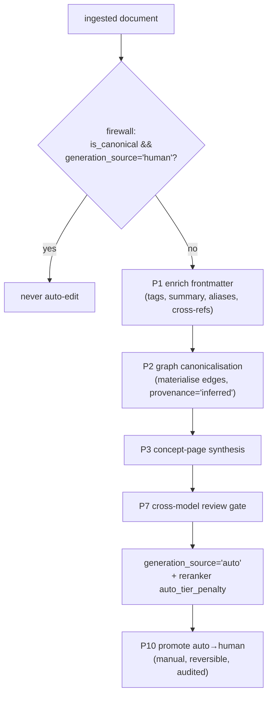

## Motivation

A knowledge base is only as good as the effort poured into curating it — and
that effort never keeps pace with ingestion. Most docs arrive with no tags, no
summary, no links to related material. The Auto-Wiki engine closes that gap: an
LLM **compiles** raw documents into enriched, cross-linked, navigable knowledge
— tags, summaries, inferred graph edges, synthesised concept pages — without a
human in the loop. The hard part is doing this *safely*: machine-generated
content must never masquerade as human-ratified truth. That is what the
**firewall** guarantees.

## Theory & background

The engine extends the canonical model with a second axis. Where
`canonical_status` answers *"how ratified is this?"*, a new column
`generation_source` answers *"who wrote it?"* — `human` or `auto`. Auto content
is real, searchable, and graph-navigable, but it is **second-class**: a reranker
penalty keeps it strictly below human-curated content, and the human-gated
promotion pipeline ([ADR 0003](/architecture/decisions)) is never bypassed. This is
the [ADR 0014](/architecture/decisions) extension of the canonical layer.

## Design

The engine is a set of config-gated phases, each a tri-surface capability
(CLI + HTTP API + MCP tool — see [R44](/sister-packages)). `AutoWikiCompiler`
runs on ingest/change; the rest run on schedule or on demand.



### Phases

| Phase | Capability | Surface |
|---|---|---|
| P1 | Frontmatter enrichment — tags, summary, aliases, cross-references | `kb:wiki-link` (compile on ingest) |
| P1b | Evidence-tier surface | `kb:evidence-tier`, `KbSetEvidenceTierTool` |
| P2 | Graph canonicalisation — materialise cross-refs as `kb_edges` (`provenance='inferred'`) | `kb:wiki-link` |
| P3 | Concept-page synthesis — generate `domain-concept` pages for recurring tags | `kb:synthesize-concepts` |
| P4 | Index rebuild — per-project roll-ups + per-tenant hub | `kb:wiki-index` |
| P5 | Lint — dangling / orphan / stale / missing-index, with `--fix` | `kb:wiki-lint` |
| P6 | Multi-hop navigation (BFS) from seeds/anchors | `kb:wiki-navigate` |
| P7 | Cross-model review gate — grounding / novelty / contradictions | `kb:wiki-review` |
| P8 | Apply change/delete suggestions (add cross-ref, deprecate impacted) | `kb:apply-suggestion` |
| P9 | Scheduled maintenance — rebuild + lint + backfill | `kb:wiki-maintain` |
| P10 | Promote auto→human (or `--discard`) | `kb:wiki-promote` |

### The firewall

The firewall has two halves:

1. **Write protection.** `AutoWikiCompiler::compile()` never edits a document
   that is `is_canonical` *and* `generation_source='human'`. Human-curated
   content is untouchable by the engine.
2. **Rank protection.** Auto content is stamped `generation_source='auto'` and
   the reranker applies `kb.canonical.auto_tier_penalty` (default `0.02`) so a
   human-`accepted` doc always outranks an auto peer on equal signals. See the
   [retrieval pipeline](/architecture/retrieval-pipeline).

Every auto mutation is audited in `kb_canonical_audit` with
`actor='system:autowiki'`.

## Data model / contract

Two columns on `knowledge_documents` carry the tier:

- `generation_source` — `'human'` (default) | `'auto'`.
- `evidence_tier` — one of `guideline` · `peer_reviewed` · `official` ·
  `preprint` · `news` · `blog` · `search_hint` · `unverified` (ranked
  high→low). The low-confidence tiers (`blog`, `search_hint`, `unverified`) flag
  a page for human review.

Enrichment output is stored in `frontmatter_json` under an `_autowiki` block
(tags, summary, derived evidence tier). Inferred edges land in `kb_edges` with
`provenance='inferred'`.

Key env knobs (`config/kb.php`): `KB_AUTOWIKI_ENABLED` (true),
`KB_AUTOWIKI_CANONICAL` / `KB_AUTOWIKI_NON_CANONICAL` (which docs to enrich),
`KB_AUTOWIKI_DEBOUNCE_MINUTES` (60), `KB_AUTOWIKI_GRAPH_ENABLED`,
`KB_AUTOWIKI_CONCEPTS_ENABLED` (+ `_MIN_FREQUENCY` 3, `_MAX_PER_RUN` 5),
`KB_AUTOWIKI_REVIEW_ENABLED`, and optional `KB_AUTOWIKI_AI_PROVIDER` /
`KB_AUTOWIKI_AI_MODEL` overrides.

## Decision rationale (ADR-style)

- **Why a second tier instead of just auto-promoting?** Auto-promotion would
  collapse the trust gradient — the LLM's guesses would rank beside ratified
  decisions. The `auto` tier keeps the output useful (searchable, navigable)
  while the penalty + the human promotion gate preserve the boundary
  ([ADR 0003](/architecture/decisions) + [ADR 0014](/architecture/decisions)).
- **Why infer edges with a distinct provenance?** `provenance='inferred'` lets
  operators audit and lint machine-created links separately from human wikilinks
  — and `kb:wiki-lint --fix` can prune them safely.
- **Why a cross-model review gate (P7)?** A second model checks grounding and
  contradictions before an auto page is trusted — diversity catches the
  generating model's blind spots.

## Worked example

```bash
# enrich + infer edges for one document
php artisan kb:wiki-link 4213 --tenant=acme

# synthesise concept pages for tags appearing in ≥3 docs
php artisan kb:synthesize-concepts platform --tenant=acme --limit=5

# cross-model review, then promote the auto page to human
php artisan kb:wiki-review 4213 --tenant=acme
php artisan kb:wiki-promote 4213 --tenant=acme
```

After promotion the doc flips to `generation_source='human'`, the auto penalty
no longer applies, and the firewall now protects it from further auto-edits.

## Gotchas & operations

- **Human-curated docs are never auto-edited** — if enrichment "did nothing" on a
  canonical doc, that is the firewall working as designed.
- **Auto content always ranks below human** by `auto_tier_penalty`; do not zero
  it without an ADR.
- **Scheduled maintenance backfills uncompiled docs** (`kb:wiki-maintain`, daily)
  — bound it with `--backfill=N`.

<CardGroup cols={2}>
  <Card title="Canonical graph" icon="share-nodes" href="/architecture/canonical-graph">
    Where inferred edges land.
  </Card>
  <Card title="Auto-Wiki guide" icon="book" href="/auto-wiki">
    The user-facing walkthrough.
  </Card>
</CardGroup>
