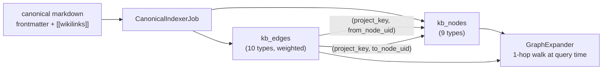

## Motivation

Plain RAG has no memory of *structure*. It cannot answer "what depends on this
module?", "which decision superseded that one?", or "what does this runbook
document?" — because the relationships between documents are nowhere modelled.
AskMyDocs adds a **lightweight typed graph** over the canonical layer:
`kb_nodes` (the artifacts) and `kb_edges` (the typed, weighted relationships).
It is deliberately small — one hop of expansion at retrieval time — but it turns
a flat corpus into navigable institutional memory.

## Theory & background

The graph is **derived, not authored separately**. Canonical markdown carries
the structure in two forms: frontmatter fields (`related`, `supersedes`,
`superseded_by`) and inline `[[wikilinks]]`. The graph is a *projection* of that
markdown — fully rebuildable from Git at any moment. This keeps a single source
of truth (the markdown) and makes the DB rows disposable.

Nodes are typed against a fixed taxonomy of canonical artifact kinds; edges are
typed against a fixed relationship vocabulary, each with a default weight that
drives expansion ordering.

## Design



After a canonical document commits, `CanonicalIndexerJob` is dispatched
(`$tries=3`, `$timeout=120`). It reads the frontmatter's `_derived` slug lists
and the chunks' extracted wikilinks, then upserts the owning node and its edges.
The job is idempotent (keyed on tenant + document + version hash) and runs as a
saga with a compensator that rolls back partial node inserts on failure.

### Node types (9)

`kb_nodes.node_type` is one of: `project`, `module`, `decision`, `runbook`,
`standard`, `incident`, `integration`, `domain-concept`, `rejected-approach`.
Each maps to a `CanonicalType` enum case and a canonical path prefix. A node
wikilinked but not yet canonicalised is stored with `payload_json.dangling=true`.

### Edge types (10) and weights

`kb_edges.edge_type` is one of the following, each with a default weight that
orders graph expansion (higher = walked first):

| Edge type | Default weight | Meaning |
|---|---|---|
| `implements` | `1.0` | A implements standard/decision B |
| `supersedes` | `1.0` | A replaces B |
| `decision_for` | `1.0` | A is the decision governing B |
| `depends_on` | `0.8` | A depends on B |
| `uses` | `0.8` | A uses B |
| `affects` | `0.8` | A affects B |
| `invalidated_by` | `0.7` | A is invalidated by B |
| `documented_by` | `0.7` | A is documented by B |
| `owned_by` | `0.7` | A is owned by B |
| `related_to` | `0.5` | loose association |

Each edge records its `provenance`: `wikilink`, `frontmatter_related`,
`frontmatter_supersedes`, `frontmatter_superseded_by`, or `inferred` (the last
used by the Auto-Wiki engine).

## Data model / contract

**`kb_nodes`** — `id`, `tenant_id`, `node_uid` (slug), `node_type`, `label`,
`project_key`, `source_doc_id` (the owning `knowledge_documents.doc_id`),
`payload_json`. **Uniqueness:** `(project_key, node_uid)` =
`uq_kb_nodes_project_uid` — *per project*, not global.

**`kb_edges`** — `id`, `tenant_id`, `edge_uid`, `from_node_uid`, `to_node_uid`,
`edge_type`, `project_key`, `source_doc_id`, `weight` (decimal 8,4),
`provenance`, `payload_json`. **Uniqueness:** `(project_key, edge_uid)` =
`uq_kb_edges_project_uid`. **Composite FKs:** `(project_key, from_node_uid)` and
`(project_key, to_node_uid)` both reference `kb_nodes (project_key, node_uid)`
with `ON DELETE CASCADE`.

<Warning>
The composite FK is **project-scoped**, not tenant-scoped — it guarantees an
edge resolves to nodes *in the same project* (intra-project referential
integrity). Cross-*tenant* isolation is enforced at the application layer by the
R30 `forTenant()` scope, not by this FK. See
[security & threat model](/architecture/security-and-threat-model).
</Warning>

## Decision rationale (ADR-style)

- **Why a derived projection, not a first-class graph store?** Canonical
  markdown is the source of truth ([ADR 0001](/architecture/decisions)); the graph
  rows are rebuildable via `kb:rebuild-graph` + re-ingest. A separate graph
  database would introduce DB-only state that cannot be reconstructed from Git —
  explicitly forbidden by the architecture.
- **Why project-scoped uniqueness + FK, not global?** Two tenants (or two
  projects) can legitimately share a slug like `dec-cache-v2`. Global uniqueness
  would block that. The composite key keys on `(project_key, …)`; tenant
  isolation is layered on top. See [ADR 0002](/architecture/decisions).
- **Why weights on edges?** Expansion is budget-bounded
  (`KB_GRAPH_EXPANSION_MAX_NODES`); weights let strong relationships
  (`implements`, `supersedes`) be walked before loose ones (`related_to`).

## Worked example

```text
dec-cache-v2 (decision)
  --supersedes--> dec-cache-v1 (decision)        weight 1.0  provenance frontmatter_supersedes
  --decision_for--> mod-session-store (module)   weight 1.0  provenance wikilink
mod-session-store
  --depends_on--> mod-redis-pool (module)        weight 0.8  provenance frontmatter_related
```

```bash
# rebuild the graph for one project, synchronously
php artisan kb:rebuild-graph --project=platform --sync

# hard-deleting dec-cache-v2 cascades its node + all incident/outgoing edges
php artisan kb:delete decisions/dec-cache-v2.md --project=platform --force
```

Hard delete cascades the owning node and (via the composite FK) every incoming
and outgoing edge automatically; soft delete leaves the graph intact so
retention stays reversible.

## Gotchas & operations

- **`kb:rebuild-graph` is a no-op without canonical docs.** Expected on a
  non-canonical tenant.
- **Re-ingest must vacate prior canonical identifiers first** or the composite
  uniques reject the insert — `DocumentIngestor` handles it; any new ingestion
  path must too.
- **A dangling node** (`payload_json.dangling=true`) means a slug was wikilinked
  before it was canonicalised — surface it via `kb:wiki-lint`.

<CardGroup cols={2}>
  <Card title="Retrieval pipeline" icon="layer-group" href="/architecture/retrieval-pipeline">
    How 1-hop expansion uses these edges.
  </Card>
  <Card title="Auto-Wiki engine" icon="wand-magic-sparkles" href="/architecture/auto-wiki-engine">
    The engine that infers edges (provenance `inferred`).
  </Card>
</CardGroup>
