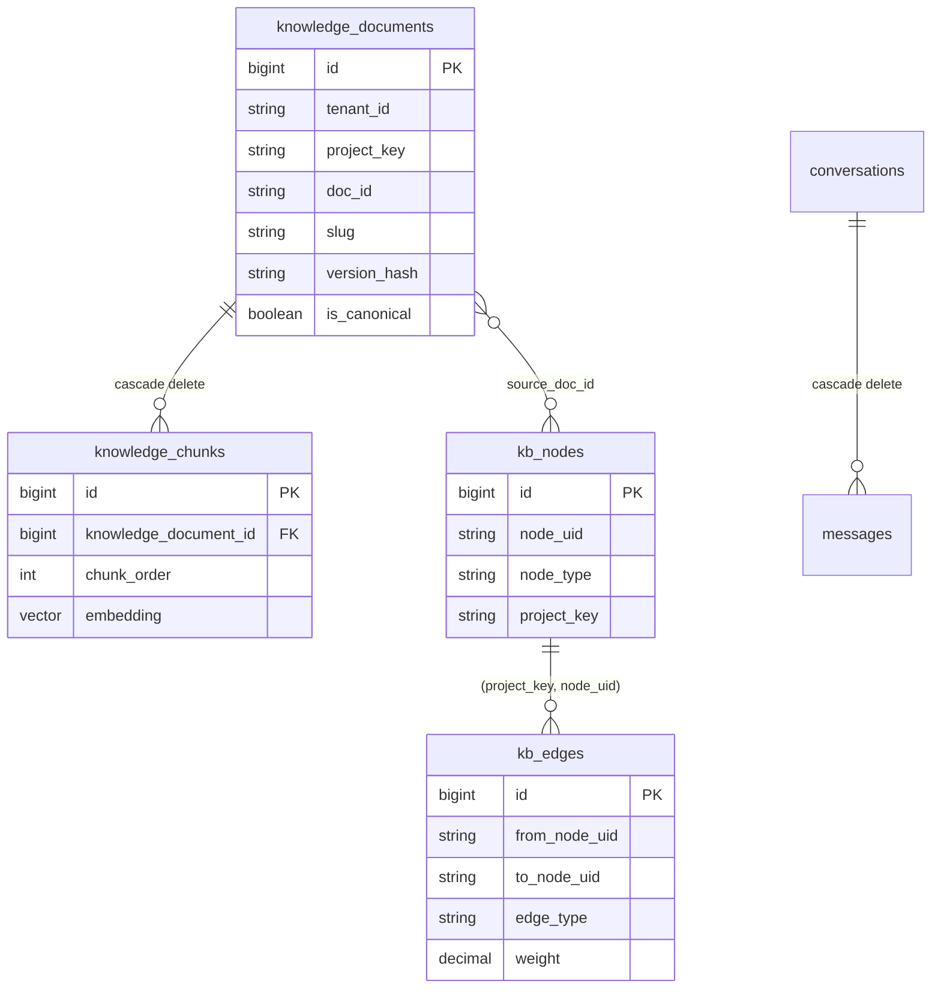

## Motivation

The schema *is* the architecture, made durable. Every invariant the system
relies on — idempotency, canonical uniqueness, referential integrity of the
graph, the immutable audit trail, cross-tenant isolation — is anchored in a
column, an index, or a constraint. This page is the reference-grade map of those
tables. Where a constraint encodes a decision, the decision is named.

## Theory & background

Three design rules govern the schema:

1. **Source-of-truth vs projection.** Canonical markdown is authoritative; the
   tables are a rebuildable projection. The one exception is `kb_canonical_audit`
   — an immutable forensic trail that must survive hard deletes, so it carries no
   FK to `knowledge_documents`.
2. **Tenant-scoped uniqueness.** Canonical identifiers (`slug`, `doc_id`) and
   graph UIDs are unique *per project*, never globally — two tenants/projects may
   legitimately share `dec-cache-v2`.
3. **Contract columns.** The `vector(N)` width is part of the embeddings
   contract; `version_hash` is the idempotency anchor; `tenant_id` is the
   isolation key.

## Design



## Data model / contract

### `knowledge_documents`

Core columns: `id`, `tenant_id` (default `default`, indexed), `project_key`,
`source_type`, `title`, `source_path`, `mime_type`, `language` (default `it`),
`access_scope` (default `internal`), `status` (default `active`),
`document_hash` (SHA-256 of bytes), `version_hash` (SHA-256 of source content),
`metadata` JSON, `source_updated_at`, `indexed_at`, timestamps, `deleted_at`
(soft delete).

Canonical columns (nullable): `doc_id`, `slug`, `canonical_type`,
`canonical_status`, `is_canonical` (default false), `retrieval_priority`
(smallint 0–100, default 50), `source_of_truth` (default true),
`frontmatter_json`. Auto-Wiki columns: `generation_source` (default `human`),
`evidence_tier` (nullable).

**Uniqueness:** `(project_key, source_path, version_hash)` (the idempotency
anchor), `(project_key, doc_id)` = `uq_kb_doc_doc_id`, `(project_key, slug)` =
`uq_kb_doc_slug`.

### `knowledge_chunks`

`id`, `knowledge_document_id` FK (`ON DELETE CASCADE`), `project_key`,
`chunk_order` (0 = summary), `chunk_hash`, `heading_path`, `chunk_text`,
`metadata` JSON, `embedding vector(N)` (text on non-pgsql). **Unique:**
`(knowledge_document_id, chunk_hash)` = `uq_kb_chunk_doc_hash`. **Index:** GIN on
`to_tsvector(<lang>, chunk_text)` (pgsql only).

### `embedding_cache`

`id`, `text_hash` (SHA-256), `provider`, `model`, `embedding vector(N)`,
`created_at`, `last_used_at` (LRU). **Unique:** `(text_hash, provider, model)`.

<Warning>
`embedding_cache` is **intentionally NOT tenant-scoped** — it is a cross-tenant
reuse layer (the same text+provider+model embeds once across all tenants). This
exclusion is documented in `TenantIdMandatoryTest`. See
[security & threat model](/architecture/security-and-threat-model).
</Warning>

### `chat_logs`

`id`, `tenant_id`, `session_id`, `user_id?`, `question`, `answer`,
`project_key?`, `ai_provider`, `ai_model`, `chunks_count`, `sources` JSON,
`prompt_tokens` / `completion_tokens` / `total_tokens`, `latency_ms`,
`grounding_signal?`, `grounding_details?` JSON, `client_ip?`, `user_agent?`,
`extra` JSON, `created_at`.

### `conversations` / `messages`

User-scoped chat history. `conversations`: `tenant_id`, `user_id` FK
(cascade), `title?`, `project_key`, with index `(user_id, updated_at)`.
`messages`: `tenant_id`, `conversation_id` FK (cascade), `role`, `content`,
`metadata` JSON (citations + provider/model telemetry + grounding), `created_at`.

### `kb_nodes` / `kb_edges`

The typed graph — see the [canonical graph](/architecture/canonical-graph) page
for the 9 node types, 10 edge types, weights, provenance, and the
project-scoped composite FKs. Uniqueness: `(project_key, node_uid)` and
`(project_key, edge_uid)`.

### `kb_canonical_audit`

`id`, `tenant_id`, `project_key`, `doc_id?`, `slug?`, `event_type` (promoted |
updated | deprecated | superseded | rejected_injection_used | graph_rebuild),
`actor` (user id / command / `system`), `before_json`, `after_json`,
`metadata_json`, `created_at`. **No `updated_at`** (rows are never mutated) and
**no FK to `knowledge_documents`** (survives hard deletes for forensics).

## Decision rationale (ADR-style)

- **Why no FK on the audit table?** It must outlive the documents it records.
  An FK with cascade would erase the very forensic trail compliance depends on.
- **Why composite uniques instead of a global slug?** Tenant/project sharing of
  intuitive slugs is a feature, not a collision ([ADR 0001](/architecture/decisions),
  [ADR 0002](/architecture/decisions)).
- **Why `tenant_id` on every domain table (except the cache)?** Cross-tenant
  isolation is a GDPR-grade invariant; the cache is the one deliberate exclusion
  for reuse economics, gated by an architecture test.
- **Why a separate `version_hash` and `document_hash`?** `document_hash` tracks
  the original bytes; `version_hash` (source content) is the idempotency anchor.
  Separating them lets binary sources (PDF/DOCX) re-convert without false
  version churn.

## Worked example

```sql
-- the idempotency anchor in action
SELECT id, version_hash, deleted_at
FROM knowledge_documents
WHERE project_key = 'handbook' AND source_path = 'onboarding.md'
ORDER BY id;            -- old (archived) + new versions both present

-- a chunk's vector + FTS coexist
SELECT chunk_order, heading_path, (embedding IS NOT NULL) AS has_vec
FROM knowledge_chunks
WHERE knowledge_document_id = 4213
ORDER BY chunk_order;
```

## Gotchas & operations

- **`vector(N)` is fixed at migrate time.** Changing the embeddings model width
  needs a resize migration + cache flush + re-index
  ([gotcha](/troubleshooting#embedding-dimension-gotcha)).
- **Soft delete is the default read scope.** Any write/admin query that must see
  trashed rows uses `withTrashed()` / `onlyTrashed()`.
- **Tests run on SQLite**, where `vector(N)` becomes JSON text — driver-specific
  behaviour (the GIN index, pgvector operators) is pgsql-only.

<CardGroup cols={2}>
  <Card title="Ingestion pipeline" icon="inbox-in" href="/architecture/ingestion-pipeline">
    What writes these tables.
  </Card>
  <Card title="Security & threat model" icon="shield-halved" href="/architecture/security-and-threat-model">
    The tenant_id isolation invariant.
  </Card>
</CardGroup>
