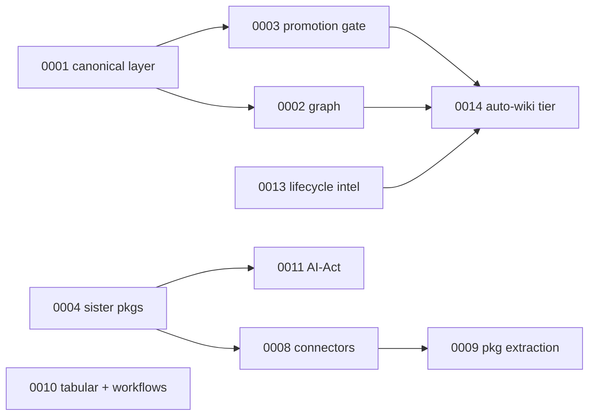

## Motivation

Code shows *what* the system does; it rarely shows *why*. The Architecture
Decision Records (ADRs) are the editorial trail of the choices that shaped
AskMyDocs — each one a problem, the options weighed, the decision, and its
consequences. This page is the **narrative** over those records: it groups them
into the arcs they belong to and explains how each built on the last. The full
records live in `docs/adr/` in the repository.

## The foundational arc: knowledge as a typed, governed asset

The first three ADRs define what makes AskMyDocs more than RAG-over-files.

- **[ADR 0001](/architecture/decisions) — Canonical knowledge layer.** Decisions
  and rejections cannot be represented in a flat corpus. ADR 0001 adds typed
  canonical columns inside `knowledge_documents` (9 artifact types, status
  lifecycle, retrieval priority) so the system can carry "we chose X over Y" as
  first-class, ranked knowledge. See the
  [retrieval pipeline](/architecture/retrieval-pipeline).
- **[ADR 0002](/architecture/decisions) — Lightweight knowledge graph.** Typed
  artifacts need typed relationships. ADR 0002 adds `kb_nodes`/`kb_edges` as a
  *derived projection* of markdown — rebuildable from Git — with project-scoped
  composite FKs. See the [canonical graph](/architecture/canonical-graph).
- **[ADR 0003](/architecture/decisions) — Human-gated promotion.** Machine-generated
  content must never silently become truth. ADR 0003 makes promotion a human
  editorial gate: skills and the suggest/candidates endpoints produce drafts;
  only humans (git → GitHub Action) and operators (`kb:promote`) commit canonical
  storage. This boundary is referenced by every later automation decision.

## The integration arc: standalone packages, host wiring

As capabilities grew, they were extracted into reusable, MIT-licensed packages —
the host *uses* them, never the reverse.

- **[ADR 0004](/architecture/decisions) — Sister-package integration.** The IoC
  contract pattern: a package depends only on a host-bound interface; the host
  implements it with real retrieval / RBAC / audit.
- **[ADR 0008](/architecture/decisions) — Universal connectors + source-aware
  ingestion.** Per-source converters and chunkers (Notion, Confluence, Drive,
  Jira, …) plus the modern chat surface. See [connectors](/connectors).
- **[ADR 0009](/architecture/decisions) — Connector package extraction.** Each
  connector becomes its own composer package, discovered via composer-extra; the
  host binds them through the ingestion bridge. See
  [sister packages](/sister-packages).
- **[ADR 0011](/architecture/decisions) — AI-Act compliance integration.** Disclosure,
  consent, and audit-evidence surfaces wired from extracted compliance packages.
  See [PII & compliance](/pii-and-compliance).

## The platform arc: review, workflows, notifications, lifecycle

- **[ADR 0005](/architecture/decisions) / [ADR 0006](/architecture/decisions) /
  [ADR 0007](/architecture/decisions)** — the React 19 host bump, the nightly
  eval-harness regression cron, and the opt-in adversarial nightly: the
  quality-gate machinery that keeps retrieval honest over time.
- **[ADR 0010](/architecture/decisions) — Tabular Review + Workflows + AI-suggest.**
  Structured multi-document extraction and reusable workflow templates over the
  Flow saga architecture. See the [admin panel](/admin-panel).
- **[ADR 0012](/architecture/decisions) — Notification system.** A DB-backed
  multi-channel notification layer (mail / webhook / Slack / Teams / Discord).
- **[ADR 0013](/architecture/decisions) — KB lifecycle intelligence.** Content-gap
  analytics, obsolescence-impact analysis, and search-failure rollups.

## The autonomy arc: self-compiling knowledge, safely

- **[ADR 0014](/architecture/decisions) — Auto-Wiki `auto` tier.** The culmination:
  an LLM compiles raw docs into enriched, cross-linked, navigable knowledge — but
  as a *second-class* `generation_source='auto'` tier, quarantined behind the
  reranker firewall and still subject to the ADR 0003 human promotion gate. It is
  the proof that automation and the trust gradient can coexist. See the
  [auto-wiki engine](/architecture/auto-wiki-engine).

## Decision rationale (meta)

- **Why keep ADRs at all?** A wrong fact in a quick-reference propagates into
  queries and tests. ADRs are the durable *why* that survives staff turnover and
  keeps later PRs from unwinding deliberate constraints.
- **Why a narrative page on top of the index?** The index is lookup; the arcs
  explain dependency — you cannot understand the auto-wiki tier (0014) without
  the promotion gate (0003) and the graph (0002).

## Gotchas & operations

- **Do not unwind a non-obvious decision without a superseding ADR.** The "no AI
  SDKs / raw `Http::`" choice, the human-gated promotion boundary, and the
  source-of-truth-is-markdown rule are load-bearing.
- **A new architectural decision ships its own ADR** in `docs/adr/` and a row in
  the [ADR reference](/architecture/decisions).

<CardGroup cols={2}>
  <Card title="Architecture overview" icon="sitemap" href="/architecture/overview">
    The system spine that connects the subsystems.
  </Card>
  <Card title="Auto-Wiki engine" icon="wand-magic-sparkles" href="/architecture/auto-wiki-engine">
    The autonomy arc's culmination (ADR 0014).
  </Card>
</CardGroup>
