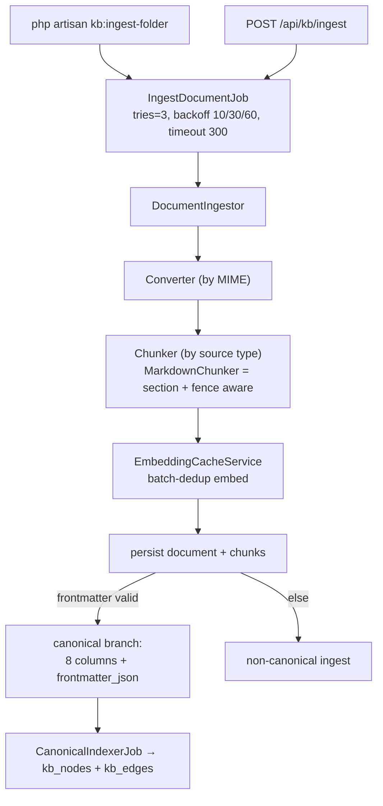

## Motivation

Ingestion is where correctness is won or lost. Re-pushing the same document must
be a no-op; a changed document must archive its predecessor so stale chunks
never surface; a malformed canonical frontmatter must degrade gracefully rather
than crash the batch. AskMyDocs enforces these as **invariants**, not best-effort
behaviour, by funnelling every entry point through one execution path.

## Theory & background

The design rests on three principles:

1. **Idempotency by content hash.** A document's identity is the tuple
   `(project_key, source_path, version_hash)` where `version_hash` is the
   SHA-256 of the source content. Identical bytes under the same path produce the
   same row — re-ingest is free.
2. **One execution path.** CLI and HTTP both fan into `IngestDocumentJob →
   DocumentIngestor`. No third path may bypass it, so idempotency, canonical
   handling, and graph indexing happen identically regardless of how a document
   arrives.
3. **Graceful canonical degradation.** Valid frontmatter takes the canonical
   branch; invalid frontmatter ingests as a plain non-canonical document — a bad
   header never breaks ingestion.

## Design



### The job

`IngestDocumentJob` runs with `$tries=3`, backoff `[10, 30, 60]`, and
`$timeout=300`. It captures the tenant at dispatch time
(`TenantContext::current()`), forwards it as a job property, and re-binds it on
the worker before any tenant-aware query. A transient provider error self-heals
via backoff; a persistent one lands in `failed_jobs`.

### Idempotent upsert

`DocumentIngestor::ingestMarkdown()` hashes the source, then:

- If a row with the same `(project_key, source_path, version_hash)` exists → no-op.
- If the content changed (new `version_hash`) → the prior version is archived so
  its chunks stop surfacing, and the new version is inserted.

For the canonical branch, prior versions' canonical identifiers are *vacated*
(`vacateCanonicalIdentifiersOnPreviousVersions`) before insert, so the composite
uniques `(project_key, doc_id)` / `(project_key, slug)` accept the new version.

### Chunking — `MarkdownChunker`

A line-based, fence-aware finite-state machine (no external markdown library):

- **Section-aware** when the doc has ATX headings outside fenced blocks: it
  splits on heading boundaries (H1–H3) and emits a `heading_path` breadcrumb
  (`" > "`-joined). Oversized sections split on blank-line paragraph boundaries.
- **Paragraph-split fallback** for heading-less docs (split on 2+ newlines).
- **Fence-aware:** a `#` inside a ```` ``` ```` or `~~~` fence is **not** treated
  as a heading. Token sizing is approximated as `strlen / 4`; the hard cap
  (`KB_CHUNK_HARD_CAP_TOKENS`) gates oversize splits (target
  `KB_CHUNK_TARGET_TOKENS=512`, overlap `KB_CHUNK_OVERLAP_TOKENS=64`).

Frontmatter is stripped first (the `CanonicalParser` consumes it); `[[wikilinks]]`
are extracted and attached to chunk `metadata`.

### Embedding cache

`EmbeddingCacheService` keys on `(text_hash, provider, model)` — a composite
UNIQUE so different provider/model pairs for the same text coexist. Within a
batch it embeds each **distinct** text once and fans the result to every index
that needs it (avoiding a duplicate-key crash and redundant API calls). Hits
touch `last_used_at` for LRU pruning. When PII redaction + caching are both on,
PII is masked (stable substitution) before hashing so cache hits survive.

## Data model / contract

`knowledge_documents` idempotency anchor: `(project_key, source_path,
version_hash)`. `knowledge_chunks`: `(knowledge_document_id, chunk_hash)` unique,
`chunk_order` (0 = summary), `heading_path`, `embedding vector(N)`, plus a GIN
index on `to_tsvector(<lang>, chunk_text)` (pgsql only). `embedding_cache`:
`(text_hash, provider, model)` unique, `last_used_at` for LRU. Full DDL:
[database schema](/architecture/database-schema).

## Decision rationale (ADR-style)

- **Why hash-based idempotency, not `firstOrCreate`?** A hash captures *content*
  identity; `firstOrCreate` on a natural key would either miss content changes or
  re-create duplicates. The unique tuple is the contract — no code path may
  bypass it.
- **Why an in-house chunker, not a markdown library?** The fence-aware FSM gives
  exact control over heading detection inside code blocks and over the
  section/paragraph split policy, with zero dependency surface and trivial
  testability.
- **Why archive prior versions instead of deleting?** Reversibility and audit —
  superseded chunks stop surfacing but the version history is preserved (pruned
  later by `kb:prune-archived-versions`).
- **Why two entry points, one path?** A second execution path would inevitably
  drift on idempotency or canonical handling. See
  [ADR 0008](/architecture/decisions) (source-aware ingestion).

## Worked example

```bash
# first ingest — creates the row + chunks + (if canonical) graph
php artisan kb:ingest-folder docs/ --project=handbook

# re-run with identical bytes — no-op (same version_hash)
php artisan kb:ingest-folder docs/ --project=handbook

# edit one file, re-run — old version archived, new chunks indexed
```

```json
// POST /api/kb/ingest (batch ≤ 100)
{
  "documents": [
    { "project_key": "handbook", "source_path": "onboarding.md",
      "title": "Onboarding", "content": "# Onboarding\n..." }
  ]
}
// → 202; one IngestDocumentJob dispatched per document
```

## Gotchas & operations

- **Normalise every path through `KbPath`.** Ingest and delete must produce the
  identical `source_path` or deletes silently miss.
- **Honour `KB_PATH_PREFIX`.** `kb:ingest-folder` resolves its argument relative
  to the prefix because the queued job re-applies it.
- **A worker must be running** for async ingestion to complete — see
  [troubleshooting](/troubleshooting#ingestion-never-completes).
- **Invalid frontmatter degrades, not crashes** — the doc ingests non-canonical;
  fix the header and re-ingest to canonicalise.

<CardGroup cols={2}>
  <Card title="Canonical graph" icon="share-nodes" href="/architecture/canonical-graph">
    What the canonical branch projects.
  </Card>
  <Card title="Database schema" icon="database" href="/architecture/database-schema">
    The tables and constraints ingestion writes.
  </Card>
</CardGroup>
