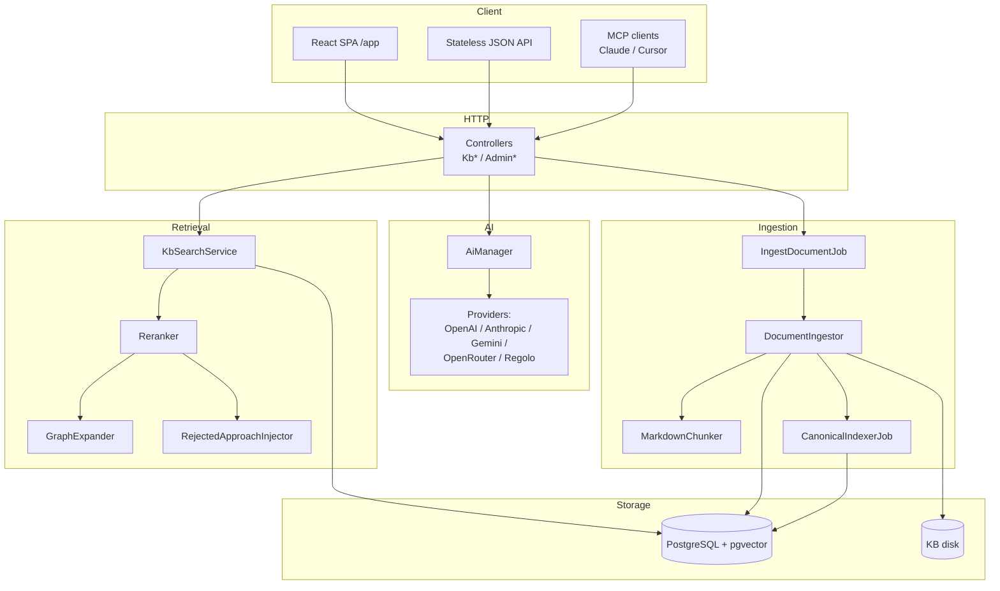
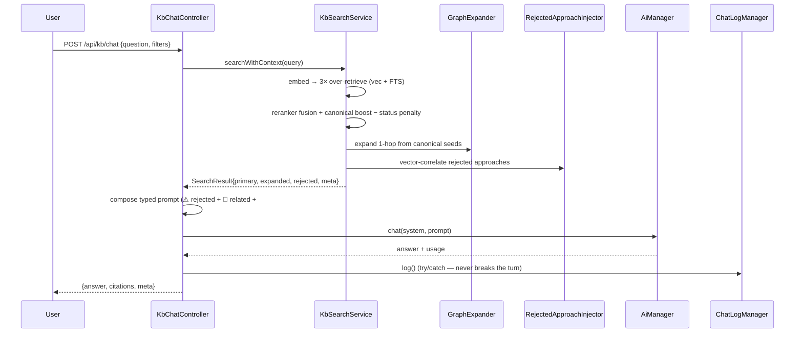
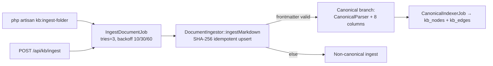

This is the map of the territory. It explains how a request flows through
AskMyDocs, how documents enter the system, which components own which
responsibility, and — most importantly — *why* the system is shaped this way.
Each subsystem has its own deep page; this page is the spine that connects them.

## Motivation

A naive "RAG over docs" service is a thin shell around a vector store: embed the
query, top-k similarity, stuff the chunks into a prompt. That design has three
structural failures at enterprise scale:

1. **No memory of decisions.** It cannot represent "we chose X over Y" — every
   query re-derives the world from raw text.
2. **No trust gradient.** A blog post and a ratified standard are weighted
   identically.
3. **No safe automation.** Any machine-generated content immediately becomes
   indistinguishable from human-authored truth.

AskMyDocs is architected to fix all three: a **typed canonical layer** carries
decisions and rejections, a **reranker firewall** enforces a trust gradient, and a
**self-compiling tier** is quarantined behind that firewall.

## The component map

## The chat request lifecycle

A grounded answer is the product of a fixed pipeline. The contract: **never
answer from parametric knowledge alone** — every claim is grounded in retrieved,
cited context, or the system refuses.

Three properties are load-bearing here:

- **3× over-retrieval then fusion.** The reranker sees a wider candidate set than
  the final k, so keyword-strong-but-vector-weak matches survive.
- **Graph expansion and rejected injection degrade to no-ops.** A tenant with zero
  canonical docs gets identical behaviour to plain hybrid RAG.
- **Logging never breaks the user path.** `ChatLogManager::log()` is wrapped in
  try/catch by design.

## The ingestion fan-in

Two entry points converge on **one** execution path — a deliberate invariant:

Deletion mirrors the same fan-in through a single `DocumentDeleter` (soft/hard,
chunks, file on disk, graph cascade on hard delete).

## Load-bearing decisions (and why)

<AccordionGroup>
  <Accordion title="No AI SDKs for OpenAI / Anthropic / Gemini / OpenRouter — raw Http::">
    Provider transport is the raw HTTP client, not vendor SDKs. This is
    intentional: full control over auth, retries, timeouts, and response parsing,
    plus trivial testability via `Http::fake()`. Regolo is the documented
    exception — it is wired through the in-house `padosoft/laravel-ai-regolo` SDK
    adapter on `laravel/ai`, which ships its own test surface and observability
    hooks.
  </Accordion>
  <Accordion title="Two ingestion entry points, one execution path">
    CLI and HTTP both fan into `IngestDocumentJob → DocumentIngestor`. No third
    path may bypass this. It guarantees idempotency, canonical handling, and
    graph indexing happen identically regardless of how a document arrives.
  </Accordion>
  <Accordion title="Canonical markdown is the source of truth; the DB is a projection">
    The canonical `kb/` folders in consumer repos are authoritative; the
    `knowledge_documents` + `kb_nodes` + `kb_edges` rows are rebuildable from Git
    at any moment via `kb:rebuild-graph` + re-ingest. No feature may require
    DB-only state that cannot be reconstructed from the markdown. The one
    exception is `kb_canonical_audit` — an immutable forensic trail that survives
    hard deletes.
  </Accordion>
  <Accordion title="Promotion is always human-gated (ADR 0003)">
    Claude skills and the `suggest` / `candidates` endpoints produce drafts; only
    humans (git push → GitHub Action) and operators (`kb:promote`) commit
    canonical storage. There is no "automatic promotion" shortcut.
  </Accordion>
</AccordionGroup>

For the full editorial record, see the curated [decisions narrative](/architecture/decisions)
and the ADR index.

## Where to go deeper

<CardGroup cols={2}>
  <Card title="Retrieval pipeline" icon="layer-group" href="/architecture/retrieval-pipeline">
    Hybrid search, reranker fusion weights, and the boost/penalty knobs.
  </Card>
  <Card title="Canonical graph" icon="share-nodes" href="/architecture/canonical-graph">
    kb_nodes / kb_edges, tenant-scoped composite FKs, and graph rebuild.
  </Card>
  <Card title="Auto-Wiki engine" icon="wand-magic-sparkles" href="/architecture/auto-wiki-engine">
    The self-compiling phases and the firewall that contains them.
  </Card>
  <Card title="Database schema" icon="database" href="/architecture/database-schema">
    Every table, column, index, and uniqueness constraint.
  </Card>
</CardGroup>
