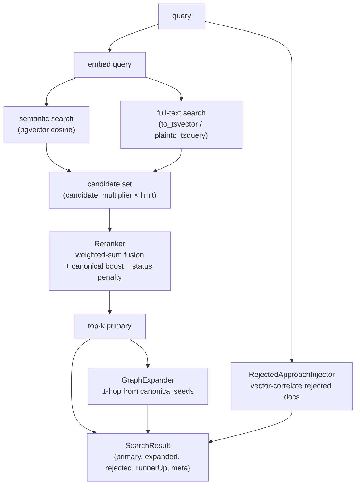

## Motivation

The quality of a grounded answer is bounded by the quality of retrieval. A
single-signal vector search is brittle: it misses lexical-exact matches
(acronyms, error codes, identifiers), weights a stale blog post like a ratified
standard, and has no notion of *related* decisions. AskMyDocs' retrieval is a
**multi-signal pipeline with a trust gradient**: it over-retrieves, fuses
several signals, applies a canonical boost and a status penalty, then optionally
expands along the graph and injects dismissed approaches.

## Theory & background

The pipeline composes four ideas:

1. **Over-retrieval + rerank.** Embedding similarity alone is a coarse filter.
   Retrieving a wider candidate set (`candidate_multiplier × limit`) and then
   reranking lets weaker-vector-but-strong-keyword matches survive.
2. **Weighted-sum fusion.** Multiple normalised signals (vector, keyword,
   heading, tag, recency, …) combine linearly into one comparable score.
3. **Trust gradient.** The canonical layer adds a *priority boost* and a *status
   penalty*, so a ratified `accepted` decision outranks a `superseded` one and an
   auto-compiled page sits below human-curated content.
4. **Graph + counter-evidence.** Beyond the top-k, a 1-hop graph walk pulls in
   structurally related docs, and a separate channel injects *rejected*
   approaches so the model stops re-proposing dismissed options.

## Design



`KbSearchService::searchWithContext()` is the entry point. Its core,
`search()`, runs semantic search (and optionally FTS when
`KB_HYBRID_SEARCH_ENABLED=true`), assembles the candidate set, and hands it to
the `Reranker`. `searchWithContext()` then layers graph expansion and
rejected-approach injection on top and returns a typed `SearchResult`.

### The reranker fusion

The `Reranker::rerank()` score for a chunk is a linear combination of normalised
signals plus the canonical adjustment:

```
base      = vector_weight·vec + keyword_weight·kw + heading_weight·head
additive  = tag_overlap_weight·tags + preamble_match_weight·preamble
          + recency_weight·recency + status_active_weight·active
          + mention_boost (if the doc is @mentioned)
canonical = priority_weight·retrieval_priority − status_penalty − auto_tier_penalty
score     = base + additive + canonical
```

Shipped defaults (`config/kb.php`):

| Signal | Weight (default) | Env |
|---|---|---|
| vector | `0.55` | `KB_RERANK_VECTOR_WEIGHT` |
| keyword | `0.25` | `KB_RERANK_KEYWORD_WEIGHT` |
| heading | `0.05` | `KB_RERANK_HEADING_WEIGHT` |
| tag overlap | `0.05` | `KB_RERANK_TAG_OVERLAP_WEIGHT` |
| preamble | `0.05` | `KB_RERANK_PREAMBLE_WEIGHT` |
| recency | `0.02` | `KB_RERANK_RECENCY_WEIGHT` |
| status active | `0.02` | `KB_RERANK_STATUS_WEIGHT` |
| mention boost | `0.50` | `KB_RERANK_MENTION_BOOST_WEIGHT` |

Canonical adjustment (`kb.canonical.*`): `priority_weight` `0.001` (multiplies
`retrieval_priority` 0–100), `superseded_penalty` `0.40`, `deprecated_penalty`
`0.40`, `archived_penalty` `0.60`, `auto_tier_penalty` `0.02`. Vector scores are
min-max normalised before fusion when `KB_RERANK_NORMALIZE_SCORES=true`. After
fusion, `kb.diversification.max_chunks_per_doc` (default 3) caps how many chunks
of a single document can occupy the top-k.

### Hybrid fusion mode

When hybrid search is enabled, semantic and FTS result lists are merged via
**Reciprocal Rank Fusion** (`score = weight / (rrf_k + rank)`, `KB_RRF_K=60`,
`KB_HYBRID_SEMANTIC_WEIGHT=0.70`, `KB_HYBRID_FTS_WEIGHT=0.30`) before reranking.
The `meta.fusion_method` field records which path ran
(`rerank_weighted_sum` | `rrf` | `semantic_only`).

### Graph expansion & rejected injection

`GraphExpander::expand()` walks 1 hop (`KB_GRAPH_EXPANSION_HOPS=1`) of `kb_edges`
from the canonical seed docs in the primary set, restricted to the edge-type
allow-list (`KB_GRAPH_EXPANSION_EDGE_TYPES`) and capped at
`KB_GRAPH_EXPANSION_MAX_NODES=20`. Expanded chunks carry
`metadata.origin='graph_expansion'`. `RejectedApproachInjector::pick()`
vector-correlates the query against `rejected-approach` canonical docs (summary
chunks only) and returns up to `KB_REJECTED_INJECTION_MAX_DOCS=3` above
`KB_REJECTED_MIN_SIMILARITY=0.40`. Both **degrade to empty** for a tenant with no
canonical docs.

## Data model / contract

`SearchResult` (`app/Services/Kb/Retrieval/SearchResult.php`):

```php
final class SearchResult {
    public readonly Collection $primary;   // reranked top-k
    public readonly Collection $expanded;  // 1-hop graph neighbours
    public readonly Collection $rejected;  // rejected-approach docs (⚠ block)
    public readonly ?Collection $runnerUp; // candidates below top-k
    public readonly array $meta;           // counts, timing, strategy, stats
}
```

`meta` carries `primary_count` / `expanded_count` / `rejected_count` /
`runner_up_count`, `retrieval_ms`, the strategy flags
(`semantic_enabled`, `fts_enabled`, `fusion_method`, `graph_expansion_enabled`,
`rejected_injection_enabled`, `filters_applied`), and retrieval stats
(`candidates_pre_threshold`, `candidates_post_threshold`, `min_score_used`,
`max_score_used`). The prompt is composed from these typed blocks — a
`⚠ REJECTED APPROACHES` section, a `📎 RELATED CONTEXT` section, and the primary
`## Context`.

## Decision rationale (ADR-style)

- **Why over-retrieve then rerank, not just top-k by cosine?** Pure cosine
  drops lexical-exact matches whose embeddings sit slightly further out. A 3×
  candidate window costs one wider SQL read and lets keyword and heading signals
  rescue them. Rejected as alternative: raising `default_min_similarity` (loses
  recall uniformly).
- **Why a linear weighted sum, not a learned reranker?** Transparency and
  tunability. Every weight is a config knob an operator can reason about and the
  `kb:benchmark` harness validates; a learned cross-encoder is a future option
  but would forfeit the auditable trust gradient.
- **Why bake canonical status into the score, not filter on it?** Filtering
  would hide superseded decisions entirely; penalising keeps them retrievable
  (for "why did we move off X?") while ensuring the current decision ranks first.
  See [ADR 0001](/architecture/decisions) (canonical layer) and
  [grounding & evidence tiers](/grounding-and-evidence-tiers).

## Worked example

```text
query: "what cache layer did we standardise on?"

candidates (multiplier 3 → 24 for limit 8):
  dec-cache-v2      vec 0.81  kw 0.40  status accepted     → score 0.71
  dec-cache-v1      vec 0.78  kw 0.38  status superseded   → 0.71 − 0.40 = 0.31
  blog-redis-notes  vec 0.74  kw 0.20  (non-canonical)     → 0.49

primary top-k:        dec-cache-v2, blog-redis-notes, …
graph expansion:      dec-cache-v2 --depends_on--> mod-session-store
rejected injection:   rej-memcached-2023 (cosine 0.52 ≥ 0.40)  → ⚠ block
```

The superseded v1 is still retrievable but demoted below v2; the rejected
Memcached approach is surfaced under the ⚠ marker so the model does not
re-propose it.

## Gotchas & operations

- **Weights are tuned together.** Raising `vector_weight` without lowering the
  rest skews the whole gradient — re-run `kb:benchmark` after changes.
- **Penalties dominate boosts by design.** A `0.40` status penalty outweighs the
  `≤0.10` canonical priority boost, so a superseded doc never outranks an active
  peer on priority alone.
- **No canonical docs → identical to plain hybrid RAG.** The boost, graph
  expansion, and rejected injection all no-op.

<CardGroup cols={2}>
  <Card title="Canonical graph" icon="share-nodes" href="/architecture/canonical-graph">
    The nodes/edges graph expansion walks.
  </Card>
  <Card title="Grounding & evidence tiers" icon="scale-balanced" href="/grounding-and-evidence-tiers">
    How the trust gradient maps to evidence tiers.
  </Card>
</CardGroup>
