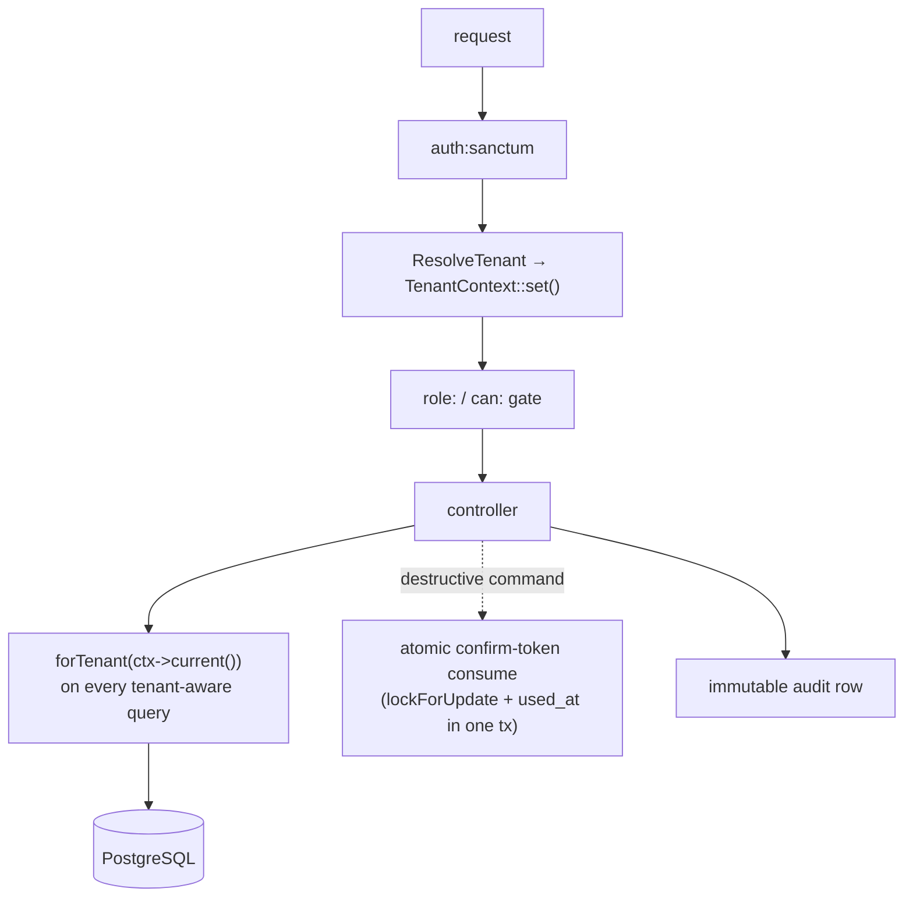

## Motivation

AskMyDocs holds an organisation's institutional memory — decisions, incidents,
runbooks, sometimes PII. A cross-tenant leak is a GDPR catastrophe; an
unauthenticated admin route is a public data breach; a re-usable confirm token on
a destructive command is RCE-class. The security model is therefore built on
**invariants enforced at multiple layers** — application scope, RBAC gates,
atomic database operations, and architecture tests that fail the build when an
invariant is dropped.

## Theory & background

The model assumes a hostile multi-tenant environment and defends in depth:

1. **Tenant isolation is explicit, not magic.** There is no global query scope to
   forget to bypass; every tenant-aware read must *opt in* to scoping, and an
   architecture test proves it did.
2. **Authorization is a matrix, not per-route hope.** Every protected endpoint is
   pinned to an exact allow-set of roles in a regression-gating test.
3. **Single-use means atomic.** A confirm token's read-and-consume holds the lock
   until `used_at` is written, in one transaction — or the invariant does not
   exist.
4. **Feature flags are safe in both states.** A default-off flag must degrade
   cleanly when off and not 500 when on-but-unwired.

## Design



### Multi-tenant isolation (R30 / R31)

The `BelongsToTenant` trait does **two** things and deliberately **not** a third:

- On `creating`, it auto-fills `tenant_id` from `TenantContext` if unset.
- It provides `scopeForTenant(string $tenantId)` for explicit query scoping.
- It does **not** register a global read scope.

The absence of a global scope is intentional: it forces every tenant-aware read
to call `forTenant($ctx->current())` (or an explicit `where('tenant_id', …)`),
and the architecture test `TenantIdMandatoryTest` (plus the read-scope test)
fails the build for any model or query that forgets. The tenant-aware table list
is the authoritative `TENANT_AWARE_MODELS` constant — every domain table carries
`tenant_id` (default `default` for v3 back-compat).

<Warning>
`embedding_cache` is the **one deliberate exclusion** — a cross-tenant reuse
layer keyed `(text_hash, provider, model)`. The same text embeds once across all
tenants. This is documented in `TenantIdMandatoryTest`, not an oversight. `User`
is likewise excluded as cross-tenant identity.
</Warning>

The graph's composite FK `(project_key, node_uid)` enforces **project-scoped**
referential integrity (an edge resolves to nodes in the same project) — it is
*not* a tenant boundary. Cross-tenant isolation for the graph, as for every other
table, is the application-layer `forTenant()` scope.

### RBAC (R32)

Authorization uses Spatie roles with five roles:

| Role | Scope |
|---|---|
| `super-admin` | everything, including `commands.destructive` |
| `admin` | system admin + `commands.run`, **not** destructive |
| `dpo` | privacy / PII tooling + AI Act, no system admin |
| `editor` | KB content (edit / promote / eval), no admin shell |
| `viewer` | read-only KB + chat |

Every protected route, API, admin screen, and `Gate::define` is pinned in
`AdminAuthorizationMatrixTest` (API) and `role-access.spec.ts` (UI): role not in
the allow-set → exactly `403`; role in set → anything-but-403; guest → `401`.
Package-registered admin routes are gated by overriding the host config's
`routes.middleware` with the authenticated admin stack — the matrix's first run
caught an AI-Act compliance route group mounted unauthenticated.

When `KB_PROJECT_ISOLATION_ENABLED=true`, blanket `kb.read.any` narrows to
`kb.read.all_projects` (admin + super-admin only); other users are constrained to
their `project_memberships` rows, enforced uniformly across chat, search, and the
admin KB surface. It is **default-off** so existing deployments keep their
behaviour. See [multi-tenant isolation](/multi-tenant-isolation).

### Atomic single-use confirm tokens (R21)

Destructive maintenance commands (`kb:delete`, `kb:prune-deleted`, …) require a
DB-backed single-use confirm token. `CommandRunnerService::consumeConfirmToken()`
holds the invariant atomically: inside one `DB::transaction`, it
`lockForUpdate()`s the nonce row, validates `args_hash` (the request's args must
match the previewed args), and writes `used_at` **before the transaction
closes**. Two concurrent requests cannot both see `used_at = null` — the second
blocks on the lock and then sees it set. The token also carries a TTL
(`token_ttl_seconds`, default 300) and an args binding so a token cannot be
replayed against different arguments.

### Audit trails

- `kb_canonical_audit` — immutable canonical-layer events (no `updated_at`, no FK
  to documents, survives hard deletes).
- `admin_command_audit` — every maintenance command execution (actor, args,
  result), retained `audit_retention_days` (default 365).
- `activity_log` — Spatie polymorphic audit for users/roles/permissions.

### Secrets & logging

API keys are sent via dedicated headers (`Authorization: Bearer`,
`x-goog-api-key` for Gemini), never in query strings (which leak into access
logs, proxies, and `Referer`). Logs never carry tokens, passwords, or
unnecessary PII; the optional PII redactor masks/tokenises content before it
reaches embeddings, insights, answers, and logs. See
[PII & compliance](/pii-and-compliance).

## Decision rationale (ADR-style)

- **Why no global tenant scope?** A global scope is a single point of silent
  failure — one `withoutGlobalScope()` and the boundary is gone, invisibly.
  Explicit `forTenant()` + a failing architecture test makes leaks loud at CI
  time, not in production.
- **Why a matrix test, not per-controller tests?** Per-controller tests each
  cover one endpoint; a new route that forgets its gate ships green. The matrix
  enumerates the full allow-set, so a missing gate fails the build. Graded on
  blast radius — one missing gate is a public breach.
- **Why atomic consume, not "rare race"?** For a destructive-command token the
  TOCTOU window is RCE-class. The lock must hold until the write — frequency is
  irrelevant, blast radius is everything.
- **Why default-off isolation?** Backward compatibility: v8.9 shipped per-project
  isolation opt-in so existing tenants keep their cross-project reads until they
  choose to tighten.

## Worked example

```php
// every tenant-aware read opts in — a bare query fails the architecture test
$docs = KnowledgeDocument::query()
    ->forTenant($ctx->current())     // R30 — required
    ->canonical()->accepted()        // canonical scopes
    ->get();
```

```text
# concurrent destructive-command requests with the same token
req A: BEGIN; SELECT … FOR UPDATE; used_at NULL → write used_at; COMMIT  ✓ runs
req B: BEGIN; SELECT … FOR UPDATE (blocks) → used_at SET → reject       ✗ 409
```

## Gotchas & operations

- **Forgetting `forTenant()` fails CI**, not silently in prod — fix the query,
  do not suppress the test.
- **New protected route → add its matrix row in the same PR**, or it ships
  ungated-and-green.
- **`lockForUpdate()` read and the state write live in the same transaction** —
  never consume a single-use resource across a transaction boundary.
- **Test feature flags in both states** — a default-off flag that 500s when
  enabled (or crashes a consumer when disabled) is a public incident the first
  time an operator flips it.

<CardGroup cols={2}>
  <Card title="Multi-tenant isolation" icon="users-between-lines" href="/multi-tenant-isolation">
    The tenant boundary in depth.
  </Card>
  <Card title="PII & compliance" icon="user-shield" href="/pii-and-compliance">
    Redaction, detokenisation, and AI-Act surfaces.
  </Card>
</CardGroup>
