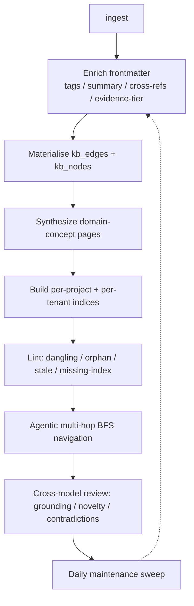

## Motivation

A knowledge base decays unless someone tends it: links rot, concepts go
undocumented, related decisions stay disconnected. AskMyDocs **compiles its own
wiki** on top of every ingested corpus and keeps it healthy over time — without
ever weakening the human-vouched authoritative tier.

## The `auto` tier and the firewall

The cornerstone is a second-class **`auto` tier**
(`knowledge_documents.generation_source ∈ {human, auto}`). AI-compiled knowledge
is real, searchable and navigable, but the reranker **always ranks
human-`accepted` > `auto` > raw**, and an admin can promote `auto → human`. Every
layer is reversible, audited to `kb_canonical_audit`, tenant-scoped (R30), and
config-gated (default-ON but cleanly degradable, R43). See the
[anti-hallucination firewall](/anti-hallucination-firewall).

## The phases



| Phase | What it does |
|---|---|
| **Compiler** | After ingest, an LLM enriches frontmatter (tags / summary / aliases / cross-references, allow-listed to real neighbours — anti-hallucination). |
| **Evidence-tier** | Derives a per-doc evidence tier in the same call; the RAG prompt flags low-confidence claims. See [grounding](/grounding-and-evidence-tiers). |
| **Graph canonicalization** | Cross-references become real `kb_edges` + `kb_nodes`; every auto doc gets a stable `auto-`-namespaced slug → the tier becomes *navigable*. |
| **Concept synthesis** | Recurring concepts across a project become new `domain-concept` pages, grounded only in the docs that mention them. |
| **Indices + log** | Per-project roll-ups + a per-tenant index hub (the agentic map) + the operation log (a read over `kb_canonical_audit`). |
| **Lint / health** | Deterministic checks — dangling / orphan / stale-cross-ref / missing-index — with safe auto-fix. |
| **Agentic navigation** | Multi-hop, cycle-safe BFS over the graph, anchor-driven from the index — the "navigate the wiki" primitive beyond 1-hop expansion. |
| **Cross-model review** | An *independent* review-LLM audits each auto page for grounding / novelty / contradictions before it is trusted. |
| **Apply engine** | Change/delete suggestions become audited, reversible mutations (add cross-ref / deprecate impacted). |
| **Scheduled maintenance** | A daily sweep rebuilds indices, lints, and backfills enrichment — "knowledge improves over time". |

## Tri-surface (R44)

Every capability is exposed across **PHP / HTTP API / MCP** over one shared core
service. Representative Artisan commands (all tenant-scoped via `--tenant`):

```bash
php artisan kb:wiki-link 57                          # materialise a doc's cross-refs into edges
php artisan kb:synthesize-concepts eng --limit=10    # synthesize domain-concept pages for a project
php artisan kb:wiki-index --project=eng              # rebuild the index hub + roll-ups
php artisan kb:wiki-lint --project=eng --fix         # health check + safe auto-fixes
php artisan kb:wiki-review 57                        # cross-model grounding/novelty/contradiction audit
php artisan kb:wiki-promote 57                       # promote auto → human (or --discard)
php artisan kb:wiki-maintain --project=eng --fix     # the daily orchestration (also a scheduled slot)
```

The same operations are HTTP endpoints under `/api/admin/kb/*` (RBAC-gated) and
MCP tools on the `enterprise-kb` server (`KbWikiNavigateTool` is the primary
agentic surface).

## Config gates (R43)

Each phase is independently toggleable and **degrades cleanly when off**:
`KB_AUTOWIKI_GRAPH_ENABLED`, `KB_AUTOWIKI_CONCEPTS_ENABLED`,
`KB_AUTOWIKI_REVIEW_ENABLED` (+ a dedicated review model via
`KB_AUTOWIKI_REVIEW_AI_PROVIDER`/`_MODEL` for true cross-model diversity),
`KB_CHANGE_AUTOAPPLY_ENABLED` (default-OFF). With every flag off, AskMyDocs
behaves exactly like its pre-Auto-Wiki self.

## Gotchas & operations

- The firewall is non-negotiable: never write retrieval code that ignores
  `generation_source`.
- Auto pages are machine-reviewed by a **different** model than the compiler —
  point the review override at a distinct provider for real diversity.
- Concept synthesis + maintenance are **explicit-trigger / scheduled**, never
  per-ingest, and bounded per run.

<CardGroup cols={2}>
  <Card title="Anti-hallucination firewall" icon="shield-halved" href="/anti-hallucination-firewall">
    Why machine knowledge never outranks human-vouched truth.
  </Card>
  <Card title="Chat & retrieval" icon="comments" href="/chat-and-retrieval">
    How the auto tier feeds grounded, cited answers.
  </Card>
</CardGroup>
