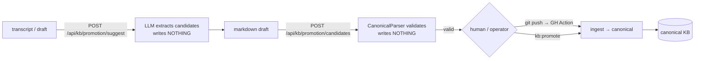

## Motivation

Not all knowledge is equal. A ratified architectural decision is authoritative; a
scratch note is not. AskMyDocs makes that distinction **structural** with a typed
**canonical layer**, and it guarantees that **only humans commit canonical
storage** — the LLM proposes, humans dispose (ADR 0003).

## The nine canonical types

A canonical document declares its **`type`** in YAML frontmatter (persisted to
the `canonical_type` column). The nine `CanonicalType` values:

`project-index` · `module-kb` · `decision` · `runbook` · `standard` ·
`incident` · `integration` · `domain-concept` · `rejected-approach`

…and a **`status`** (persisted to `canonical_status`) drawn from the six
`CanonicalStatus` values: `draft` · `review` · `accepted` · `superseded` ·
`deprecated` · `archived`. Canonical identifiers (`slug`, `doc_id`) are
**tenant-scoped, not global** — two projects can both own `dec-cache-v2`. The
composite uniques are `(project_key, slug)` and `(project_key, doc_id)`.

## The promotion pipeline (human-gated)



Three Sanctum-protected stages — **only the last writes**:

1. **`POST /api/kb/promotion/suggest`** — an LLM extracts candidate artifacts from
   a transcript via `PromotionSuggestService`. **Writes nothing.**
2. **`POST /api/kb/promotion/candidates`** — validates a markdown draft against
   `CanonicalParser`. Returns `{valid, errors}`. **Writes nothing.**
3. **`POST /api/kb/promotion/promote`** — `CanonicalWriter` writes the markdown to
   the KB disk and dispatches `IngestDocumentJob`. Returns **HTTP 202**.

Claude skills and the `suggest` / `candidates` endpoints produce **drafts only**.
The two ways to actually commit canonical storage are:

- **Humans** — `git push` → the GitHub Action ingests the canonical folder.
- **Operators** — the `kb:promote` CLI:

  ```bash
  php artisan kb:promote decisions/dec-cache-v2.md --project=eng
  # --dry-run to validate + print the target path without writing
  # --auto-approve to skip the interactive approval (non-interactive scripts)
  ```

<Note>
  There is **no "automatic promotion" shortcut** (ADR 0003). Adding one requires
  a new ADR that overrides this boundary. This is the line between "AI proposes"
  and "human writes" that no public competitor draws.
</Note>

## The immutable editorial trail

Every canonical mutation (promote / update / deprecate / supersede / hard-delete)
writes a row to **`kb_canonical_audit`** — an append-only forensic record with no
`updated_at` and **no FK** to `knowledge_documents`, so rows survive hard deletes.
Bypassing this audit path is a defect even when the change itself works.

## Source-of-truth philosophy

**Canonical markdown is the source of truth; the database is a projection.** The
`kb/` folders in consumer repos are authoritative; `knowledge_documents` +
`kb_nodes` + `kb_edges` are rebuildable from Git at any moment via
`kb:rebuild-graph` + re-ingest. Never design a feature that needs DB-only state
that can't be reconstructed from the markdown (`kb_canonical_audit` is the one
exception).

## Gotchas & operations

- Re-ingesting a canonical doc must **vacate prior identifiers first** or the
  composite uniques reject the insert (`DocumentIngestor` handles it; any new
  ingestion path must too).
- Use the dedicated Eloquent scopes (`canonical()`, `accepted()`, `byType()`,
  `bySlug()`) — a bare `where('project_key', $x)` returns a mix of canonical and
  non-canonical rows, wrong for retrieval grounding.
- Hard delete cascades the graph; soft delete leaves it intact (retention
  reversibility).

<CardGroup cols={2}>
  <Card title="Institutional memory" icon="brain" href="/institutional-memory">
    How canonical artifacts feed graph-expanded, anti-repetition retrieval.
  </Card>
  <Card title="Auto-Wiki" icon="wand-magic-sparkles" href="/auto-wiki">
    The machine-built tier that sits behind the human-vouched firewall.
  </Card>
</CardGroup>
