## What this subsystem is

The case-study email harness builds deterministic synthetic corpora for three
demo companies and optionally delivers them to real IMAP mailboxes. It is an
operator-only fixture workflow, not a customer email-import API.

Four profiles are available: `gold` (751 curated records), `demo` (3,000),
`large` (6,000), and `stress` (30,000). Generation and validation are offline
and require neither IMAP credentials nor an AI provider.

```mermaid
flowchart LR
    A["Versioned catalogs + profile + seed"] --> B["Deterministic generator"]
    B --> C["Bounded JSONL + fixture index"]
    C --> D["Manifest and SHA-256 validation"]
    D --> E["Offline estimate / dry-run"]
    E --> F["Destructive preview"]
    F --> G["Single-use DB token"]
    G --> H["Local/testing environment gate"]
    H --> I["Per-mailbox tenant audit"]
    I --> J["IMAP purge / APPEND"]
    J --> K["Checkpoint + resume"]
    K --> L["Connector ingest"]
```



## Determinism and file-descriptor budget

Data shards and fixture-index shards share one 64-handle LRU pool. The first
open uses exclusive create; an evicted shard is reopened only in append mode.
Eviction flushes and closes the handle before another is admitted. Finish and
abort attempt every close and report all failures.

The limit is fixed for normal dependency injection and constructor-injectable
only for tests. A regression test compares full hash trees generated with a
two-handle pool and the normal pool, so eviction cannot silently change bytes.

## Offline preparation

```bash
php artisan demo:generate-case-study-emails --profile=large --force --stats
php artisan demo:generate-case-study-emails --profile=large --check --stats
php artisan demo:validate-case-study-emails --profile=large
php artisan mail:seed-imap --all --profile=large --summary-only --estimate-cost
```

`--force` never replaces an existing version with different bytes. Use a new
snapshot fingerprint, and a new generator revision when the algorithm changes.

## Environment boundary

<Warning>
Real APPEND and purge operations are accepted only in `APP_ENV=local` or
`APP_ENV=testing`. There is no boolean override. Dry-run, validation, estimate,
generation, and destructive preview stay network-free in every environment.
</Warning>

This mutation surface is intentionally CLI-only. Exposing a fixture purge over
HTTP or MCP would widen the production attack surface without a valid product
use case. The exception and rationale are recorded in ADR 0023.

## Preview and confirm a destructive delivery

Use the same actor, mailbox selection, dataset, and mutation options in both
commands. Copy the token printed by preview:

```bash
php artisan mail:seed-imap \
  --all \
  --profile=large \
  --purge-dataset \
  --summary-only \
  --actor=operator:demo-rollout \
  --preview-purge

php artisan mail:seed-imap \
  --all \
  --profile=large \
  --purge-dataset \
  --summary-only \
  --actor=operator:demo-rollout \
  --confirm-token=<token-from-preview>
```

Only a SHA-256 token hash is stored. The nonce is bound to the exact operation,
dataset version, manifest checksum, sorted mailbox and tenant selection, actor,
and canonical arguments. Validation and credential preflight finish before the
transactionally locked nonce is consumed; consumption still precedes remote
mutation. Tokens expire after five minutes and cannot be replayed.

The same contract applies to:

- `--purge-dataset --purge-only`;
- `--purge-all-seeded`;
- the wider legacy alias `--purge`.

## Audit contract

Every real selected mailbox gets its own tenant-scoped
`admin_command_audit` lifecycle before remote I/O. The row includes only
operation identifiers, actor, mailbox key, dataset version, checksum, and
normalized selection. Passwords, email addresses, subjects, MIME content, and
the confirmation token are excluded.

Successful mailboxes close as `completed`; a failed mailbox closes as `failed`;
environment and confirmation rejections use `rejected`.

## Resume and purge recovery

APPEND runs one message at a time under the physical-mailbox lease. Atomic
checkpoints record the last contiguous acknowledgement. `--resume` verifies the
ambiguous window by stable Message-ID before continuing.

A purge intent is persisted before the first remote delete. If the process
stops after deletion but before checkpoint cleanup, the next mutating run
recovers that intent under the same lease before trusting a checkpoint.

## Version-scoped rollback

Preview and confirm a removal-only operation:

```bash
php artisan mail:seed-imap \
  --all \
  --dataset-version=<version> \
  --purge-dataset \
  --purge-only \
  --summary-only \
  --actor=operator:rollback \
  --preview-purge

php artisan mail:seed-imap \
  --all \
  --dataset-version=<version> \
  --purge-dataset \
  --purge-only \
  --summary-only \
  --actor=operator:rollback \
  --confirm-token=<token-from-preview>
```

Then soft-delete KB projections for the exact
`tenant_id + project_key + dataset_version`. Never use `default`, wildcards,
hard delete, or `--purge-all-seeded` for a version rollback.

## Certification status

Offline behavior and fault injection are testable in the repository. Real
IMAP, PostgreSQL/pgvector, Gmail compatibility, embedding cost, and retrieval
performance require external infrastructure. The repository certification
report remains explicitly blocked until timestamped evidence and audit IDs are
attached; generated or fake results are not accepted as live evidence.
