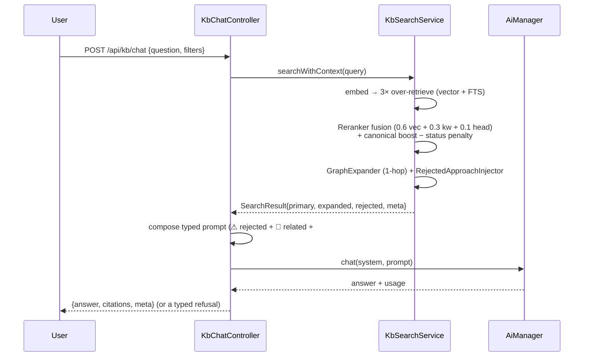

## Motivation

The whole point of AskMyDocs is a **grounded** answer: every claim traceable to
retrieved, cited context — or an honest refusal. A chat turn is therefore a fixed
pipeline, not a single vector lookup.

## The chat turn

## Hybrid retrieval

Retrieval never relies on vector similarity alone:

- **Vector** search over `pgvector` and **keyword** search over a Postgres FTS
  GIN index run in parallel, each over-retrieving ~3× the final `k`.
- The **`Reranker`** fuses them — `0.6·vector + 0.3·keyword + 0.1·heading` — then
  applies a **canonical boost** and a **status penalty**, so human-`accepted`
  canonical docs outrank `auto` outrank raw (the
  [anti-hallucination firewall](/anti-hallucination-firewall)).

## Graph expansion + anti-repetition

After reranking, two config-gated steps fold in institutional memory:

- **`GraphExpander`** walks 1 hop of `kb_edges` from the canonical seeds and adds
  the neighbours under a **📎 RELATED CONTEXT** block.
- **`RejectedApproachInjector`** surfaces dismissed options under a **⚠ REJECTED
  APPROACHES** block so the model stops re-proposing them.

Both degrade to a no-op when a tenant has no canonical docs — see
[Institutional memory](/institutional-memory).

## The typed prompt + citations

The prompt is composed from `resources/views/prompts/kb_rag.blade.php` with typed
blocks (⚠ rejected, 📎 related, primary `## Context`). The response carries:

- `answer` — the grounded text;
- `citations` — the exact chunks that grounded it;
- `meta` — provider, model, latency, retrieved-chunk count, filters echoed back.

## Filters

The chat request accepts a `filters` object (project keys, tags, source types,
date windows, evidence tiers, explicit `doc_ids`). Legacy callers using the bare
`{question, project_key}` payload keep working — `project_key` is wrapped into
`filters.project_keys` internally.

## The refusal contract

When retrieval surfaces nothing relevant above threshold, the controller returns
a **deterministic refusal** — a typed `refusal_reason` (e.g. `no_relevant_context`),
not a fabricated answer and not an HTTP error. The machine-readable reason never
localizes; only the human-visible body does. Every refusal also increments a
**content-gap** rollup so editors know what to write next. The refusal path also
**short-circuits the expensive LLM call** — proven by tests that assert the
provider `shouldNotReceive('chat')`.

## Streaming UI

The React chat at **`/app/chat`** streams over SSE on the Vercel AI SDK v6
`UIMessageChunk` wire format, with stop / regenerate / branch / inline-edit /
token-cost meter / suggested-follow-ups, and inline citations. The stateless JSON
API (`POST /api/kb/chat`) is the headless equivalent.

## Gotchas & operations

- Logging never breaks the user path — `ChatLogManager::log()` is wrapped in
  try/catch; never hoist logging into the hot path.
- A refusal is **not** an error — map it to a 200 with the typed reason, never a
  4xx/5xx, and never an empty answer.
- New retrieval services must honour the reranker's canonical boost + status
  penalty (or add an ADR explaining the deviation).

<CardGroup cols={2}>
  <Card title="Retrieval pipeline (architecture)" icon="layer-group" href="/architecture/overview">
    The reranker fusion weights and request lifecycle in depth.
  </Card>
  <Card title="Grounding & evidence tiers" icon="scale-balanced" href="/grounding-and-evidence-tiers">
    Grounded-or-refuse + the evidence-strength axis.
  </Card>
</CardGroup>
