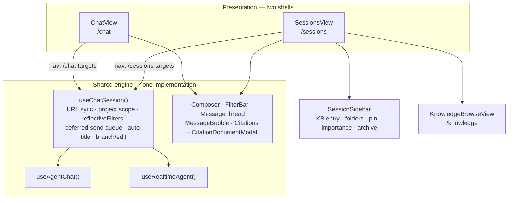
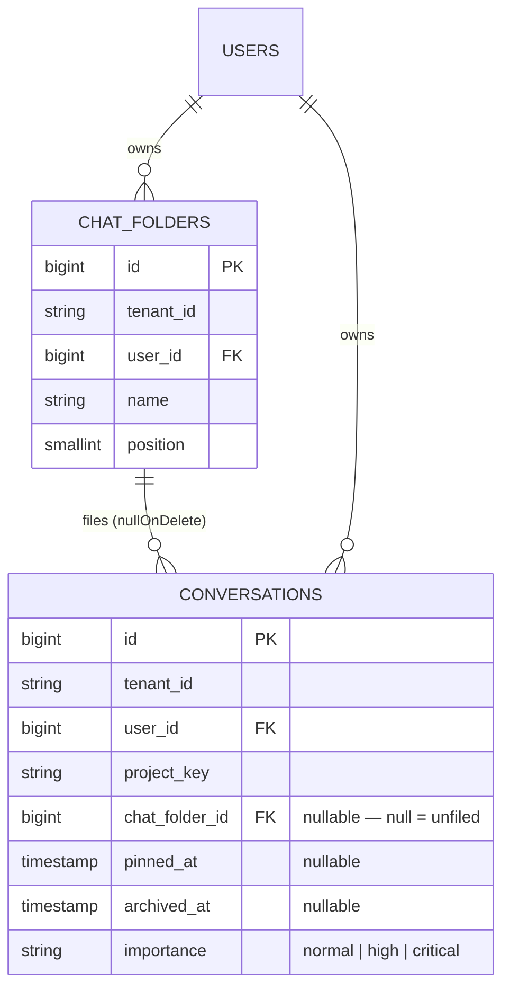

## Motivation

The original chat panel answers one question well: *what did I ask recently?* Its
sidebar is a flat, reverse-chronological list with a client-side title filter and
three time buckets. That is adequate while a user has a handful of threads and
falls apart at fifty: there is no way to say *this one matters*, *these three
belong to the same issue*, or *I am done with this, put it away*.

The knowledge base had a matching gap. Every KB screen sat behind
`role:admin|super-admin`, so a `viewer` or `editor` could read a document only
one at a time, through a chat citation — never browse the corpus.

The **Sessions workspace** closes both. It is a new *shell*, not a new chat: the
rail carries the knowledge base above an organised session list, and everything
below the layout is the existing engine.

## The constraint that shaped the design

The requirement was explicit: **do not duplicate anything the current chat
uses.** That single constraint decided the architecture.

A chat turn in AskMyDocs is not a request/response — it is a durable agent run
with a deferred-send queue, optimistic cache merges, auto-titling, retrieval
filter constraints, graph-aware citations, a realtime voice session and a
branch/edit/regenerate protocol. Roughly 350 lines of async orchestration lived
inside `ChatView`. Copying them into a second page would have meant every future
fix applied twice, and drift the first time someone touched one surface only.

So the orchestration moved **out** of the view into a headless hook, and both
pages became presentation.



`ChatView` went from 794 lines to about 220. The only thing the hook cannot own
is **navigation**: TanStack Router's `to` is a typed literal, so each surface
injects its own targets through a `ChatSessionNavigator`. The admin-only *Open in
Knowledge Base* deep link is per-surface for the same reason — `/chat` sends
admins to the admin explorer, `/sessions` sends readers to the new Browse KB
page.

## Data model



`chat_folders` is a new tenant-aware table; `conversations` gains four additive
columns. Grouping by **project** already existed through
`conversations.project_key` and is unchanged — folders are the free-form axis on
top of it.

Two indexes, chosen from the access pattern rather than the column list:

| Index | Why |
|---|---|
| `(tenant_id, user_id, archived_at)` | the only selective predicate the sidebar issues |
| `chat_folder_id` | `nullOnDelete` sweeps conversations by it on every folder delete — unindexed, a full scan |

`pinned_at` and `importance` are deliberately **not** indexed: neither is
selective, the ordering `CASE` cannot use an index anyway, and a user's session
count is in the tens.

## Decision rationale

### Timestamps, not booleans, for pin and archive

`pinned_at` / `archived_at` are nullable timestamps. That buys *most recently
pinned first* ordering and an archived-on date for free, indexes cleanly as
NULL-is-false, and needs no companion audit column.

The HTTP contract is therefore **asymmetric on purpose**: the request carries a
boolean (`{"pinned": true}`), the response carries the timestamp. A client asks
for a state and reads back when it happened — it never invents a date the server
would disagree with.

### Organisation writes must not touch `updated_at`

`updated_at` is both the recency ordering key and the *last activity* the sidebar
shows. If pinning or archiving bumped it, archiving a thread and restoring it
would teleport an untouched conversation to the top of the list, and "last
activity" would stop meaning activity.

So `ConversationOrganizerService` writes with `timestamps = false` and restores
the flag in a `finally` — leaving it off would make a rename later in the same
request go unrecorded. A **rename still bumps it**, because that *is* activity on
the thread.

### Importance is an enum with explicit weights

The column is a `string`, so ordering on it directly would be alphabetical.
`critical < high < normal` happens to be almost correct today, which is precisely
the trap: it breaks silently the day a fourth level lands.
`ConversationImportance::orderByCaseSql()` builds the `ORDER BY CASE` **from the
enum**, and a unit test asserts every case appears in it. The stored value is the
machine-readable identifier and never localizes — only `label()` does
(see [per-reason i18n](/best-practices/refusal-ux)).

The ordering also avoids `ORDER BY pinned_at DESC`, which is not portable:
PostgreSQL sorts NULLs first on `DESC`, SQLite last, MySQL has no `NULLS LAST` at
all. An explicit null-rank `CASE` behaves identically everywhere.

### One server-side list parameter

Only `?archived=` is a server parameter. Folder grouping, search and sorting all
happen client-side: the server already returns the user's sessions in display
order, and a list in the tens does not need a round-trip per keystroke — while a
server-side `q` would pull in full LIKE escaping for no user-visible gain.

Archived exclusion is nonetheless **server-side by default**, so "archived" means
archived on every surface, and the older `/chat` sidebar inherits the behaviour
without a line of change.

### Folder delete unfiles; it never cascades

`chat_folder_id` is `nullOnDelete`. Cascading would silently destroy a user's
chat history, so deleting a folder leaves its sessions unfiled — and the
confirmation says so. A feature test asserts the sessions survive and the count
is unchanged.

### R44 — a documented MCP exception

This capability ships with a **PHP surface**
(`ConversationOrganizerService`, `ChatFolderService`) and an **HTTP surface**
(`PATCH /conversations/{id}`, `/api/chat-folders`), and deliberately **no MCP
tool**.

Folders, pins, archive state and importance are *per-user UI organisation
state*: they change nothing an agent can retrieve, ground on, or reason about,
and exposing them would widen the write surface over someone's private thread
list for zero agent benefit. The in-repo precedents are exact —
`ChatFilterPresetController` (per-user chat UI state, HTTP-only),
`KbDocumentPreviewController` (a documented single-surface chat-UI read), and
`Admin\ProjectController` (HTTP-only registry CRUD).

`GET /api/kb/tree` needs no MCP tool either: the KB-tree *capability* already has
a PHP core (`KbTreeService`), an HTTP surface (the admin route) and MCP retrieval
tools. This is a second HTTP surface over the same core.

## Access and visibility

Everything is gated by authentication and tenant membership; **no role gate**.
The real boundaries are narrower than a role:

- **Folders and sessions** — per-user ownership, enforced inside the services
  with `forTenant()` plus `where('user_id', …)`. Another user's folder answers
  **404, never 403**: a 403 would confirm the id exists.
- **`chat_folder_id` on the PATCH** — validated against folders the *acting user*
  owns in the *active tenant*, then re-verified in the service. The id is
  attacker-chosen; without the ownership predicate user A could file a thread
  into user B's folder.
- **Browse KB** — the SQL access scope, not a policy. `GET /api/kb/tree` runs
  through the same `KbTreeService` as the admin tree, with `KnowledgeDocument`'s
  global `AccessScopeScope` active and `with_trashed` neither accepted nor
  forwarded (a reader never sees a soft-deleted document).

<Warning>
**The visibility posture surprises people, so state it plainly.** With
`kb.project_isolation.enabled = false` — the default every fresh deploy ships —
the `viewer` role holds `kb.read.any`, `AccessScopeScope::apply()`
short-circuits on `canReadAllProjects()`, and a reader sees **every live
document in the tenant**.

That is the *pre-existing* retrieval posture: identical to what chat citations
and `/api/kb/documents/{id}/preview` already expose. The Browse KB page widens
nothing — it makes an existing posture visible. Enabling the flag narrows both.
Both states are pinned by `tests/Feature/Api/KbTreeReaderTest.php`, so a future
flip can never be silent.
</Warning>

## Worked example

Filing a thread under an issue and flagging it:

```bash
# 1. Create the folder (per-(tenant, user) unique name; a duplicate is 422).
curl -X POST https://askmydocs.example/api/chat-folders \
  -H 'X-Tenant-Id: acme' -H 'Content-Type: application/json' \
  --cookie-jar /tmp/c --cookie /tmp/c \
  -d '{"name":"Issue 42 — onboarding"}'
# → 201 {"data":{"id":7,"name":"Issue 42 — onboarding","position":0,…}}

# 2. File a session into it and mark it critical. One partial PATCH, and
#    `chat_folder_id: null` would UNFILE it — omitting the key leaves it alone.
curl -X PATCH https://askmydocs.example/conversations/123 \
  -H 'X-Tenant-Id: acme' -H 'Content-Type: application/json' \
  --cookie /tmp/c \
  -d '{"chat_folder_id":7,"importance":"critical","pinned":true}'
# → 200 {"id":123,…,"chat_folder_id":7,"pinned_at":"2026-09-16T11:00:00Z",
#        "importance":"critical","updated_at":"<unchanged>"}

# 3. The default listing still excludes archived threads.
curl https://askmydocs.example/conversations -H 'X-Tenant-Id: acme' --cookie /tmp/c
curl 'https://askmydocs.example/conversations?archived=1' -H 'X-Tenant-Id: acme' --cookie /tmp/c
```

Note `updated_at` in step 2: organising a session never moves it.

## Gotchas

- **`GET /conversations` returns a BARE array**, not a `{data: …}` envelope. It
  always has, so wrapping it would break every existing client in one step —
  `ConversationResource` sets `$wrap = null` for exactly that reason. New keys
  are additive, and `created_at` / `updated_at` pass through untouched, because
  changing an existing key's *format* breaks callers as surely as removing it.
- **The archived cache key is nested**, `['conversations', 'archived']`, not a
  sibling like `['conversations-archived']`. The chat engine already invalidates
  `['conversations']` after every settled turn, and TanStack's prefix matching
  then covers both lists. Flattening it leaves the archived drawer silently
  stale.
- **`conversations.chat_folder_id` is not a pivot.** A session belongs to at most
  one folder; there is no multi-folder membership and no nesting.
- **An empty PATCH body is a 422**, not a 200 no-op, so a caller can distinguish
  "nothing applied" from "applied nothing".
- **A freshly created model needs the attribute default.** `importance` has a DB
  default, but a `create()`d instance that never sent the column has the
  attribute absent and the enum cast yields `null` — which is how
  `POST /conversations` briefly answered 500 while every read path stayed green.
  The default is mirrored on the model.
- **`/app/{team}/kb` is not this page.** That path is a legacy alias redirecting
  into the admin explorer; the reader page is `/app/{team}/knowledge`.

## See also

- [Chat & retrieval](/chat-and-retrieval) — what actually happens inside a turn.
- [Admin panel](/admin-panel) — the admin KB explorer, editing and upload.
- [Multi-tenancy](/architecture/multi-tenancy) — how `tenant_id` scoping works.
