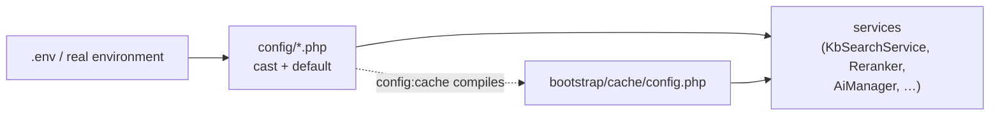

## Motivation

AskMyDocs ships with safe defaults: a fresh install behaves like a competent
hybrid-RAG service out of the box. But every enterprise deployment eventually
needs to tune *something* — the embedding provider, the reranker's trust
gradient, the refusal threshold, the retention windows. This page is the map of
**what is configurable, where the knob lives, and what it does**. It is not an
exhaustive env dump (see `.env.example` for that) — it argues the knobs that
change behaviour you can observe.

## Theory: configuration is layered, not flat

A knob is never read directly from the environment by a service. The flow is
always **env var → `config/*.php` cast + default → service constructor /
`config()` call**. This indirection matters:

- `config/*.php` is the **single source of truth for the default** and the cast
  (`(float)`, `(bool)`, `(int)`). An unset env var is not "null" — it is the
  documented default.
- Tests and `config:cache` read the compiled config, not `$_ENV`. Reading
  `env()` outside `config/*.php` is a bug (it returns `null` once config is
  cached).



<Warning>
After changing `.env` in production, run `php artisan config:clear` (or
re-run `config:cache`). A cached config ignores live `.env` edits — this is
the single most common "my setting did nothing" report.
</Warning>

## The config files

Configuration is split by concern. The files you will touch most:

| File | Owns |
|---|---|
| `config/ai.php` | Chat + embeddings providers, models, cost rates, agentic/MCP tool-calling |
| `config/kb.php` | Retrieval, chunking, reranking, canonical, graph, refusal gate, soft-delete, embedding cache |
| `config/askmydocs.php` | Scheduler slots (cron + enable toggles), composite gates |
| `config/admin.php` | Maintenance command allow-list, confirm-token TTL, audit retention |
| `config/chat-log.php` | Chat logging driver + retention |
| `config/permission.php` / `config/rbac.php` | Spatie roles, RBAC enforcement |
| `config/filesystems.php` | KB disk (`kb`) + raw disk (`kb-raw`) |

Sister-package surfaces (`connectors`, `mcp-pack`, `mcp`, `widget`,
`laravel-flow`, `pii-redactor-admin`, `eval-harness`, `ai-act-compliance`,
`evidence-risk-review`, …) each ship their own `config/*.php`. See
[Sister packages](/sister-packages).

## Providers (`config/ai.php`)

Chat and embeddings are configured **independently** — Anthropic has no
embeddings endpoint, so you mix providers freely.

```bash
AI_PROVIDER=openrouter          # chat: openai | anthropic | gemini | openrouter | regolo
AI_EMBEDDINGS_PROVIDER=openai   # embeddings: openai | gemini | openrouter | regolo
KB_EMBEDDINGS_DIMENSIONS=1536   # MUST match the embeddings model's output width
```

Each provider has a `<NAME>_API_KEY`, `<NAME>_BASE_URL`, `<NAME>_CHAT_MODEL`,
`<NAME>_EMBEDDINGS_MODEL`, `<NAME>_TEMPERATURE`, `<NAME>_MAX_TOKENS`, and
`<NAME>_TIMEOUT`. The full matrix — including the dimension-safety auto-select
order when `AI_PROVIDER=anthropic` — is documented in
[AI providers](/ai-providers).

<Warning>
`KB_EMBEDDINGS_DIMENSIONS` is part of the database contract. Changing the
embeddings model to a different width (OpenAI 1536 → Gemini 768 → Regolo 4096)
requires resizing the `vector(N)` columns **and** flushing the embedding cache
**and** re-indexing. See [Troubleshooting](/troubleshooting#embedding-dimension-gotcha).
</Warning>

## Retrieval & reranking (`config/kb.php`)

The reranker is the **trust gradient** — it fuses several signals into one
score, then applies a canonical boost and a status penalty. Defaults
(`kb.reranking.*` and `kb.canonical.*`):

| Knob | Env | Default | Effect |
|---|---|---|---|
| Candidate multiplier | `KB_RERANK_CANDIDATE_MULTIPLIER` | `3` | Over-retrieve 3× the limit, then rerank down |
| Vector weight | `KB_RERANK_VECTOR_WEIGHT` | `0.55` | Cosine similarity signal |
| Keyword weight | `KB_RERANK_KEYWORD_WEIGHT` | `0.25` | Lexical overlap signal |
| Heading weight | `KB_RERANK_HEADING_WEIGHT` | `0.05` | Heading-path match signal |
| Tag overlap | `KB_RERANK_TAG_OVERLAP_WEIGHT` | `0.05` | Source-aware tag overlap |
| Preamble match | `KB_RERANK_PREAMBLE_WEIGHT` | `0.05` | Frontmatter/preamble signal |
| Recency | `KB_RERANK_RECENCY_WEIGHT` | `0.02` | Newer docs slightly favoured |
| Status active | `KB_RERANK_STATUS_WEIGHT` | `0.02` | Active-status nudge |
| Mention boost | `KB_RERANK_MENTION_BOOST_WEIGHT` | `0.50` | `@slug` explicit mention boost |
| Canonical priority | `KB_CANONICAL_PRIORITY_WEIGHT` | `0.001` | Multiplies `retrieval_priority` (0–100) |
| Superseded penalty | `KB_CANONICAL_SUPERSEDED_PENALTY` | `0.40` | Demote superseded canonical docs |
| Deprecated penalty | `KB_CANONICAL_DEPRECATED_PENALTY` | `0.40` | Demote deprecated canonical docs |
| Archived penalty | `KB_CANONICAL_ARCHIVED_PENALTY` | `0.60` | Demote archived canonical docs |
| Auto-tier penalty | `KB_CANONICAL_AUTO_TIER_PENALTY` | `0.02` | Keep auto-compiled docs below human-curated |

The deep treatment of the formula lives in the
[chat & retrieval](/chat-and-retrieval) and
[grounding & evidence tiers](/grounding-and-evidence-tiers) pages.

## The refusal gate

The anti-hallucination firewall refuses to answer when retrieval is too weak —
**better a refusal than a fabrication**. Three thresholds, all in `config/kb.php`:

```bash
KB_REFUSAL_MIN_SIMILARITY=0.45    # min raw cosine of the best chunk
KB_REFUSAL_MIN_RERANK_SCORE=0.25  # min post-rerank score of the best chunk
KB_REFUSAL_MIN_CHUNKS=1           # min number of qualifying chunks
```

See the [anti-hallucination firewall](/anti-hallucination-firewall) page for
why the refusal is modelled as a *status*, not an error.

## Graph expansion & rejected-approach injection

Both features **degrade to no-ops** when a tenant has zero canonical docs — an
existing consumer sees identical retrieval until it canonicalises.

```bash
# Graph expansion (1-hop walk from canonical seeds)
KB_GRAPH_EXPANSION_ENABLED=true
KB_GRAPH_EXPANSION_HOPS=1
KB_GRAPH_EXPANSION_DEPTH=2
KB_GRAPH_EXPANSION_MAX_NODES=20
KB_GRAPH_EXPANSION_EDGE_TYPES=depends_on,implements,decision_for,related_to,supersedes

# Rejected-approach injection (surface dismissed options under a ⚠ marker)
KB_REJECTED_INJECTION_ENABLED=true
KB_REJECTED_INJECTION_MAX_DOCS=3
KB_REJECTED_MIN_SIMILARITY=0.40
```

## Deletion, retention & multi-tenancy

```bash
KB_SOFT_DELETE_ENABLED=true         # soft-delete hides rows from every read path
KB_SOFT_DELETE_RETENTION_DAYS=30    # kb:prune-deleted hard-deletes after this
KB_EMBEDDING_CACHE_RETENTION_DAYS=30
CHAT_LOG_RETENTION_DAYS=90
KB_PROJECT_ISOLATION_ENABLED=false  # opt-in per-project read scoping
RBAC_ENFORCED=true
```

`KB_PROJECT_ISOLATION_ENABLED` is **default-off** by design: the v8.9 isolation
audit shipped it opt-in so existing deployments keep their behaviour. Cross-*tenant*
isolation is always enforced (see [multi-tenant isolation](/multi-tenant-isolation)
and [security & threat model](/multi-tenant-isolation)).

## Worked example: switch chat to a local-EU Regolo model, keep OpenAI embeddings

```bash
# .env
AI_PROVIDER=regolo
REGOLO_API_KEY=rg_live_xxx
REGOLO_CHAT_MODEL=Llama-3.3-70B-Instruct

AI_EMBEDDINGS_PROVIDER=openai
OPENAI_API_KEY=sk-xxx
OPENAI_EMBEDDINGS_MODEL=text-embedding-3-small
KB_EMBEDDINGS_DIMENSIONS=1536        # unchanged — no column resize needed
```

```bash
php artisan config:clear              # drop any cached config
php artisan kb:rebuild-graph --sync   # optional: warm the graph
```

Because the embeddings provider and dimension are unchanged, **no migration and
no re-index are needed** — only the chat path moves to Regolo.

## Gotchas & operations

- **`config:cache` in production, `config:clear` after edits.** Cached config
  ignores live `.env`.
- **Never call `env()` outside `config/*.php`.** It returns `null` under
  `config:cache`.
- **CSV env vars** (`SANCTUM_STATEFUL_DOMAINS`, `CORS_ALLOWED_ORIGINS`,
  `KB_GRAPH_EXPANSION_EDGE_TYPES`) are trimmed + filtered on parse — leading
  whitespace is tolerated, but keep them comma-separated with no stray quotes.
- **Default-off flags ship off.** When you enable a flag (project isolation,
  PII redaction, agentic tool-calling, the MCP HTTP server), verify the
  enabled *and* disabled paths — both must be healthy
  (see [feature-flag discipline](/multi-tenant-isolation)).

<CardGroup cols={2}>
  <Card title="Self-hosting" icon="server" href="/self-hosting">
    Install, migrate, build the SPA, run the worker + scheduler.
  </Card>
  <Card title="Scheduler & maintenance" icon="clock" href="/scheduler-and-maintenance">
    Every scheduled job, its cron, and its enable toggle.
  </Card>
  <Card title="AI providers" icon="robot" href="/ai-providers">
    The full provider matrix and the dimension-safety auto-select.
  </Card>
  <Card title="Troubleshooting" icon="wrench" href="/troubleshooting">
    Embedding-dimension gotcha, health checks, common failures.
  </Card>
</CardGroup>
