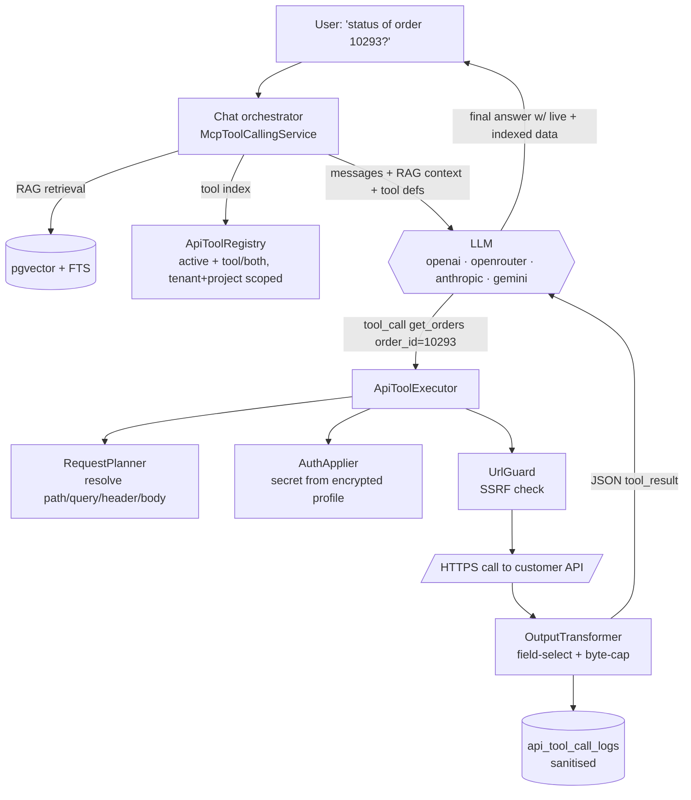

## Motivation / problem

Every other connector in AskMyDocs ([Google Drive](/connectors),
[IMAP](/connectors-credential), …) does the same thing: *download → chunk →
embed*. That is exactly right for **knowledge** — policies, runbooks, wikis,
mail threads — content that is meaningful to vectorise and ages slowly.

It is exactly **wrong** for **transactional, fast-moving data**. The status of
order `#10293`, today's stock for SKU `A-1`, the live tracking of a shipment —
embedding any of that is pointless: it is stale the moment it is indexed, and the
authoritative copy already lives behind the customer's API.

The **API connector** ("Connettore API") closes that gap. It inverts the
paradigm: instead of pulling data *in*, it lets the model reach *out*. Each
configured HTTP **endpoint (Rotta)** becomes a **tool** the LLM can call **during
the chat turn**. So a single question — *"is order 10293 shipped, and what does
our returns policy say?"* — is answered from **two sources at once**: RAG over the
indexed returns policy **and** a live `get_orders` call to the customer's ERP.

<Info>
**Scope — Fase 1.** This page covers the live-tool path. Fase 2 (bulk *ingest*
from the same routes, reusing the existing ingestion pipeline) is designed into
the data model via the `mode` column but is not implemented yet.
</Info>

## Theory & background

A "tool" (a.k.a. function call) is a contract the LLM understands: a `name`, a
`description` telling it *when* to use the tool, and an `input_schema` (JSON
Schema) describing the arguments. When the model decides a tool is relevant it
emits a **tool call** with concrete argument values; the host executes it and
feeds the **result** back; the model then writes the natural-language answer.

The API connector's job is to turn a plain HTTP endpoint into that contract
**without the operator hand-writing JSON Schema**. It does so from a single
**test call**: it performs the request, reads the response, and *infers* both the
input schema (from the parameters the operator declared) and the output shape
(from the JSON body). The operator reviews and edits; on confirm the route goes
`active` and its tool is live.

The crucial safety property is **the LLM never sees the wiring**. It is handed
only `{name, description, input_schema}` and only ever supplies the *values* of
the parameters marked `llm`. The URL, the headers, the fixed params, the secrets
and the auth are all resolved **server-side** at call time. The model cannot
exfiltrate a key it never receives.

### The two parameter axes

Every route parameter has two independent axes — this is the heart of the model:

| Axis | Values | Meaning |
|---|---|---|
| **location** | `path` · `query` · `header` · `body` | *Where* it goes in the HTTP request |
| **source** | `llm` · `fixed` · `secret` | *Who* decides the value |

Only `source = llm` parameters enter the tool schema the model sees. `fixed`
carry an operator-set constant (e.g. `version=v1`); `secret` are pulled from the
encrypted auth profile and are **never** exposed or logged.

## Design



The orchestrator gives the model **both** capabilities in parallel: retrieval
(unchanged) and the API tools (new). The model decides, per question, whether to
ground on indexed knowledge, call one or more tools for fresh data, or both. The
tool-call → tool-result loop runs up to a bounded number of iterations.

### Services (all server-side, in `padosoft/askmydocs-connector-api`)

| Service | Responsibility |
|---|---|
| `ApiRouteTester` | The "Test connessione" call → structured outcome (ok / non-JSON / error) |
| `SchemaInferrer` | Input schema from declared `llm` params; output schema from the JSON body |
| `ToolDefinitionGenerator` | `{name, description, input_schema}` — LLM-assisted, operator-editable |
| `ApiToolRegistry` | The live tools for a conversation (tenant + project scoped) |
| `ApiToolExecutor` | Runtime: resolve binding → auth → SSRF → HTTP (timeout/retry/rate-limit/cache) → transform → log |
| `UrlGuard` | SSRF policy, shared by test and runtime |
| `AuthApplier` (×6) | none / api_key / bearer / basic / custom / oauth2_cc |

### Host integration

The package cannot inject chat tools by itself — the chat loop
(`McpToolCallingService`) is host code. The host merges
`ApiToolRegistry::activeToolsForTenant()` into `buildToolIndex()` alongside the
external MCP tools (the index entry carries an `api_route_id` instead of a
`server`) and routes those calls to `ApiToolExecutor`. This mirrors how
`HostIngestionBridge` wires the ingest connectors in — the package supplies the
capability, the host wires it. The merge is gated by
`connector-api.chat_tools.enabled` (safe in both states) and decoupled from
`mcp.enabled`, so API tools work even with no MCP server configured.

## Data model

Five tenant-aware tables (every row carries `tenant_id`; uniques are
tenant-scoped):

| Table | Holds |
|---|---|
| `api_connectors` | Container: name, optional `base_url`, shared headers, default auth profile, KB `project_key` |
| `api_auth_profiles` | `type` + `credentials` (**`encrypted:array`**, `$hidden`) + non-secret `config` |
| `api_routes` | One endpoint = one tool: method, url, `input_schema` / `output_schema` / `param_mapping` / `tool_definition`, `output_transform`, `mode` (tool/ingest/both), `status` (draft/tested/active/disabled), operational overrides, `last_test_*` |
| `api_route_parameters` | The `location × source × type` rows + `required` / `value` (fixed) / `secret_ref` (secret) |
| `api_tool_call_logs` | One row per runtime call: sanitised params, status, truncated/redacted excerpt, latency, error |

`api_routes.project_key` is **denormalised** from its connector (NOT NULL, `''`
when unset) so the rule *"a tool slug is unique per KB"* is enforceable as a DB
unique `(tenant_id, project_key, slug)` without the NULL-distinct gap.

## Decision rationale

See [ADR 0023](https://github.com/lopadova/AskMyDocs/blob/main/docs/adr/0023-v827-api-connector-live-tools.md).
The load-bearing choices:

- **A standalone package, not a `ConnectorInterface` implementation.** That
  contract is ingest-shaped (`syncFull`/`syncIncremental`/OAuth/`health`) and does
  not model "endpoint → tool"; forcing it through would distort both. The package
  reuses `connector-base` only for the tenant primitives.
- **One chat loop, two tool sources.** Rather than a parallel chat path, the
  existing `McpToolCallingService` gained a second source. Less surface, uniform
  audit and metering.
- **Anthropic + Gemini joined the tool loop.** [ADR 0015](https://github.com/lopadova/AskMyDocs/blob/main/docs/adr/0015-v816-provider-sdk-migration.md)
  had left them SDK-only with no tool path; v8.27 adds a raw-`Http::` with-tools
  branch to each (translating the OpenAI-shaped tools+history to the native
  Messages / `generateContent` protocol and back), so all four hybrid providers
  can drive API tools — single-metered via the finops bridge.

## Worked example — an "orders" tool

1. **Connector** "Gestionale Cliente X" with `base_url https://api.clientex.com`
   and an `api_key` auth profile (the key encrypted in the vault).
2. **Route** "Ordini": `GET https://api.clientex.com/v1/orders`, parameters
   `order_id` (query, **llm**, string, optional), `status` (query, llm, enum),
   `version` (query, **fixed**, `v1`), `api_key` (header, **secret**,
   `secret_ref: api_key`).
3. **Test connessione** with `order_id=10293`. The response
   `{ "orders": [ { "id": "10293", "status": "shipped", "total": 42 } ] }` yields
   an inferred output schema and a generated tool:

   ```json
   {
     "name": "get_orders",
     "description": "Fetch live order status from the customer's ERP. Use when the user asks about an order's status, total or recent orders.",
     "input_schema": {
       "type": "object",
       "properties": {
         "order_id": { "type": "string", "description": "Order identifier." },
         "status": { "type": "string", "description": "Filter by status." }
       },
       "required": []
     }
   }
   ```
4. **Activate.** In chat, *"is order 10293 shipped?"* → the model calls
   `get_orders({order_id:"10293"})`; the executor adds `version=v1`, injects the
   `api_key` header from the vault, checks the URL through `UrlGuard`, calls the
   API, caps the output, logs a sanitised row (no key, no `version` secret), and
   returns the JSON — the model answers *"Order 10293 has shipped."*

## Gotchas

- **JSON only in Fase 1.** A non-JSON / empty response is surfaced as a structured
  error to the model (and shown as a diagnostic in the test panel), not silently
  swallowed.
- **SSRF guard is on by default and load-bearing.** It blocks private / loopback /
  link-local targets and the cloud-metadata endpoint, enforces https, and supports
  an optional per-tenant domain allowlist (`API_CONNECTOR_DOMAIN_ALLOWLIST`). Do
  not weaken it to reach an internal host — add that host to the allowlist on a
  network you trust instead.
- **Provider matters.** The tool loop runs on OpenAI, OpenRouter, Anthropic and
  Gemini. If your chat provider is none of these, API tools won't fire.
- **Tenant + project scope.** A route is invocable only within its own tenant, and
  only in conversations of its bound `project_key` (or globally when unset). A
  route is never reachable from another tenant's chat.
- **Output cap.** Large responses are truncated with a note. Use the route's field
  selection (`output_transform`) to return only what the model needs.
