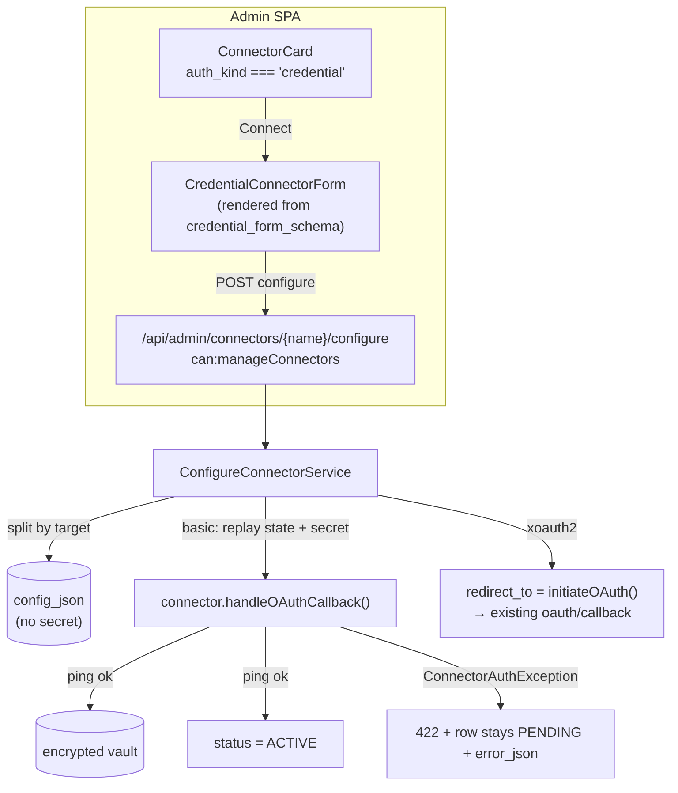
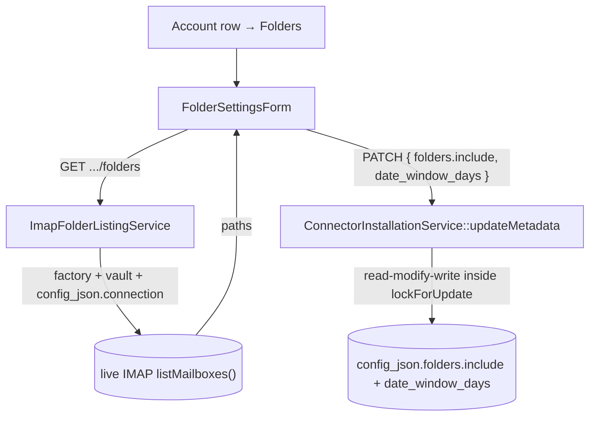

## Motivation / problem

The [universal connector framework](/connectors) was born OAuth-shaped: click
**Connect** → redirect to the provider → callback → ACTIVE. That covers Google
Drive, Notion, OneDrive, Confluence and Jira, but it leaves out a huge class of
sources that have **no OAuth at all** — an IMAP mailbox behind a host + port +
username + password, an internal API behind a static key, an appliance behind
basic auth.

Before v8.17 the only way to wire such a source was a hand-written DB insert into
`connector_installations.config_json` (the Fabric connector worked exactly this
way) — invisible in the panel, undocumented, and impossible for a non-engineer to
operate. v8.17 closes that gap with the **first credential-based connector
(IMAP)** and, more importantly, a **generic mechanism** any future
credential connector reuses unchanged.

The design rule (skills `derive-from-db-not-literal`, `pluggable-pipeline-registry`):
**no `if ($name === 'imap')` anywhere in the host.** The connector describes its
own form; the host renders it, validates it, splits it, and routes the secret to
the vault — all driven by that description.

## Theory & background

OAuth and credential auth differ in *where the secret comes from*, not in what the
installation lifecycle looks like. Both end at the same `connector_installations`
row flipping to ACTIVE; both reuse the connector's existing
`initiateOAuth()` / `handleOAuthCallback()` contract. v8.17 therefore invents **no
new connector method** — it adds one optional capability interface that lets a
connector advertise a form, and one host endpoint that fills in the gap the OAuth
redirect used to fill.

The capability interface (shipped in `padosoft/askmydocs-connector-base` v1.2):

```php
interface SupportsCredentialForm
{
    /** @return list<array<string,mixed>>  CredentialField::toArray() shapes. */
    public function credentialFormSchema(): array;
}
```

Each field carries a **`target`** that tells the host where its value belongs —
the load-bearing concept of the whole design:

| `target` | Host routes the value to |
|---|---|
| `secret` | the encrypted credential vault (via `handleOAuthCallback`) — **never** `config_json` |
| `connection` | `config_json['connection'][<name>]` |
| `auth_mode` / `provider` / `config` | `config_json[<name>]` |

A field also carries `type` (text/number/password/select/checkbox), `required`,
`options`, a `default`, and a **`showIf`** conditional ("show only when another
field equals X") so one schema describes both a basic-auth form and an
XOAUTH2 form.

## Design



The host descriptor (`ConnectorAdminController::index`) adds two additive keys per
connector: `auth_kind` (`oauth` | `credential`) and, for credential connectors,
`credential_form_schema`. OAuth connectors keep `auth_kind: 'oauth'` and a `null`
schema — fully backward compatible.

`ConfigureConnectorService` is the generic core:

1. **Split the payload by `target`.** The secret is pulled out (never written to
   `config_json`); `connection` fields nest under `config_json['connection']`;
   everything else is a top-level `config_json` key. Fields hidden by an unmet
   `showIf` are skipped so they never pollute the row.
2. **Upsert** the single `(tenant_id, connector_name)` row PENDING (R30 — every
   query is tenant-scoped).
3. **basic-auth** → mint the connector's single-use OAuth state via
   `initiateOAuth()`, then immediately replay it through `handleOAuthCallback()`
   with the secret (posted under its schema field name). The connector pings the
   server and, on success, vaults the secret → row flips ACTIVE. A
   `ConnectorAuthException` (bad login) leaves the row PENDING with `error_json`
   and surfaces as **HTTP 422** — never a 200-with-empty-body (skill
   `surface-failures-loudly`).
4. **xoauth2** → persist PENDING and return the provider authorize URL; the browser
   redirects and the **unchanged** `oauth/callback` route finishes the flow.

## Data model / contract

No schema change — credential connectors reuse `connector_installations`
(`config_json` JSON + the `connector_credentials` vault row). The HTTP contract:

```text
GET  /api/admin/connectors
  → data[].auth_kind: 'oauth' | 'credential'
  → data[].credential_form_schema: CredentialField[] | null

POST /api/admin/connectors/{name}/configure          (can:manageConnectors)
  body: { <field name>: value, …, project_key? }     # secret included, never logged
  → 200 { data: { id, status, last_sync_at, error, redirect_to } }
       redirect_to: string|null   # non-null only for xoauth2
  → 422 { error }                  # basic-auth credential ping failed
  → 422 { message, errors }        # validation (dynamic, from the schema)

# v8.24 — connection settings (the folder picker)
GET   /api/admin/connectors/{id}/folders             (can:manageConnectors)
  → 200 { data: { folders: string[] } }   # live mailbox paths
  → 404                                     # cross-tenant / unknown / non-IMAP id
  → 503 { error }                           # mailbox unreachable (never an empty 200)

PATCH /api/admin/connectors/{id}                      (can:manageConnectors)
  body: { folders?: { include: string[] }, date_window_days?: int, … }
  → 200 { data: { …, folders: { include }, date_window_days } }
```

The read shape (`GET /api/admin/connectors` + the PATCH response +
`ConnectorInstallationResource`) is additively extended with
`folders.include` + `date_window_days` (R27) — and **only** those two keys of
`config_json`; host/username/encryption stay private and the secret never leaves
the vault.

The IMAP connector's schema ships 8 fields across three groups
(Authentication: `auth_mode`, `xoauth2_provider`; Server: `host`, `port` (993),
`encryption` (ssl/tls/starttls/none), `validate_cert`; Credentials: `username`,
`password` (the lone `secret`)).

Provider env (XOAUTH2 only — basic-auth needs none):
`CONNECTOR_IMAP_GOOGLE_CLIENT_ID/_SECRET/_REDIRECT_URI`,
`CONNECTOR_IMAP_MS_CLIENT_ID/_SECRET/_REDIRECT_URI`.

## Decision rationale (ADR-style)

- **Reuse `initiateOAuth`/`handleOAuthCallback`, invent no new connector method.**
  The installation lifecycle is identical; only the secret source differs. A
  bespoke `handleCredentials()` method would fork every connector's contract and
  the host's flow for no behavioural gain. The basic-auth path simply *replays*
  the connector's own single-use state synthetically.
- **Schema lives in the connector, not the host (Option A).** With
  `connector-base` v1.2 + `connector-imap` v1.2 on Packagist, the field schema is
  the connector's responsibility — one source of truth, no host/package drift
  (skill `docs-match-code`). The earlier "host-side schema map" fallback (Option B)
  was dropped.
- **`target`-driven routing, not field-name magic.** Routing by an explicit
  per-field `target` (rather than guessing from names) is what keeps the host
  generic: a future connector with an `api_token` secret and a `base_url`
  connection field works with zero host changes.
- **The secret never touches `config_json`.** It is routed through
  `handleOAuthCallback` straight to the encrypted vault. `config_json` (which can
  surface host/username metadata) carries no credential, and the
  `ConnectorInstallationResource` omits it from the API entirely.

## Worked example — activate an IMAP mailbox

1. `composer require padosoft/askmydocs-connector-imap` (auto-discovered).
2. As a **super-admin**, open **`/app/admin/connectors`** → the **Email (IMAP)**
   card shows **Connect**.
3. Click **Connect** → a modal renders from the schema. For app-password auth:
   `host = imap.example.com`, `port = 993`, `encryption = SSL/TLS`,
   `username = you@example.com`, `password = <app password>`.
4. **Connect** → the BE logs in (a real IMAP ping), vaults the password, and the
   card flips to **Active**. Bad credentials → an inline error, the card stays
   inactive, nothing is vaulted.
5. For Gmail / Microsoft 365 choose **OAuth2** in the form → the browser redirects
   to the provider and returns ACTIVE through the standard callback.

The scheduler then syncs the mailbox (body + headers + attachments) into the
canonical KB like any other connector.

## Connection settings — the folder picker (v8.24)

Once a mailbox is ACTIVE you rarely want *every* folder ingested. Which folders
the sync walks is `config_json.folders.include` — historically only settable by a
hand DB edit (or the test harness's CLI re-merge). v8.24 promotes it to a
first-class **"Folders"** action on each credential account: a post-install
"connection settings" modal that lists the mailbox's **real** folders and lets the
operator pick the sync whitelist plus the look-back window (`date_window_days`).

The picker is **post-install by necessity** — the live folder list only exists
after credentials verify, so it is *not* a credential-form field but a separate
read against the live account:



`ImapFolderListingService` is **host-side by design**: rather than bump the
connector package for a public lister, it reuses the connector's existing public
seams — the bound `ImapClientFactoryInterface`, the `OAuthCredentialVault` secret
and the stored `config_json.connection` — to open a client and `listMailboxes()`.
The paths it returns are exactly what `folders.include` whitelists, so a picked
value round-trips 1:1 (skill `route-contracts-match-fe-shape`).

Semantics surfaced in the UI:

- **Empty selection = sync ALL non-excluded folders** (the connector default —
  Trash/Spam/Junk/`[Gmail]/Spam`/`[Gmail]/Trash`). This is the both-states (R43)
  default every fresh account ships with.
- **A non-empty selection is a whitelist that BYPASSES those exclusions** — the
  modal warns about this so an operator doesn't silently start ingesting spam.
- A previously-saved folder that has since **vanished from the server** stays
  visible (checked, flagged *"not found"*) so a save never silently drops it.

The write is a read-modify-write of `config_json` **inside the existing
tenant-scoped `lockForUpdate` transaction** (R21/R30): only `folders.include` and
`date_window_days` are overwritten, so `connection` / `auth_mode` / the default
`folders.exclude` all survive. Unreachable mailbox → **503**, never an empty 200
(skill `surface-failures-loudly`).

**Tri-surface (R44):** the same `config_json.folders.include` is also writable
programmatically — the `connector:imap:install` CLI seeds it directly — and is
read back through the MCP `ConnectorInstallationsTool`; the HTTP picker is just the
human surface over the one core.

## Gotchas & operations

- **`can:manageConnectors` (admin + super-admin)** gates `configure` — and the
  folder picker — like every other connector route; it touches credential vaults.
  Widened from super-admin-only in v8.24 so an admin can run the picker.
  Regression-locked in the R32 authorization matrix.
- **One installation = one mailbox.** Multi-mailbox per installation is out of
  scope (a second installation row covers a second mailbox).
- **Testing seam.** The IMAP server is a *backend* TCP dependency, so Playwright
  can't stub it; E2E runs with `CONNECTOR_IMAP_FAKE_PING=true`, an input-driven
  offline fake (host containing `invalid`/`fail` → login failure). **Default-OFF**
  — production always talks to the real server (skill on both-state flags, R43).
- **The mechanism is generic.** Any future credential connector implements
  `SupportsCredentialForm`; the same form, endpoint, validation and vaulting work
  unchanged — no host edit.

<CardGroup cols={2}>
  <Card title="Universal connectors" icon="plug" href="/connectors">
    The OAuth-based connector framework this builds on.
  </Card>
  <Card title="Multi-tenant isolation" icon="building-lock" href="/multi-tenant-isolation">
    The tenant scope every installation + credential is bound to.
  </Card>
</CardGroup>
