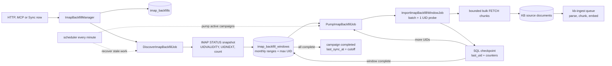

## What this solves

An incremental IMAP sync is deliberately small; a first import of 128,000 messages
is not. Running that history in one HTTP request, one queue job or one in-memory UID
list would make progress fragile and couple completion to a process timeout.

AskMyDocs instead treats the full mailbox import as a durable campaign:

- discovery captures a fixed mailbox boundary and creates monthly date windows;
- one short job imports one bounded UID batch and commits its checkpoint to SQL;
- completed windows are never selected again;
- the scheduler recovers stale discovery and import work after a worker or queue
  outage;
- regular incremental sync resumes from the campaign cutoff after completion.

This path is used when an active IMAP installation has `date_window_days: 0` and no
completed campaign, or when an administrator explicitly starts a full import.
Turning the backfill feature flag off disables only this path; **Sync now** continues
to dispatch the normal incremental IMAP sync.

## Architecture



### Snapshot and window discovery

For each selected folder, discovery reads bounded metadata from IMAP `STATUS`:
`UIDVALIDITY`, `UIDNEXT - 1` as the maximum UID, and the message count. It does not
enumerate every UID. A bounded date/UID search locates the first relevant message,
then discovery creates monthly half-open ranges (`window_start <= date <
window_end`). Every window stores the same snapshot `UIDVALIDITY` and maximum UID,
so messages arriving after the campaign starts belong to the later incremental
sync rather than moving the backfill target.

The displayed `total_messages` is the folder `STATUS` count captured during
discovery and is therefore an estimate. Window completion, not that estimate, is
the authoritative completion condition; a completed campaign always reports 100%.

### Bounded import and checkpointing

The pump claims at most one pending window for a campaign. An import job searches
for `batch_size + 1` matching UIDs: at most `batch_size` are imported and the extra
UID is only the `has_more` probe. Bodies and attachments are fetched in smaller
`fetch_size` chunks. The checkpoint advances only through the contiguous UID prefix
whose documents were persisted and dispatched successfully.

The source path is deterministic:

```text
{project}/connectors/imap/installation-{id}/{readable-mailbox}-{mailbox-hash}/{uid}.md
{project}/connectors/imap/installation-{id}/{readable-mailbox}-{mailbox-hash}/{uid}/{ordinal}-{attachment}
```

The mailbox hash prevents slug collisions; the attachment ordinal prevents two
attachments with the same filename from overwriting each other. A crash after
dispatch but before checkpoint commit may replay the same batch, so delivery is
at-least-once and deterministic paths provide the idempotency key.

## Lifecycle and recovery

| Campaign status | Meaning | Next transition |
|---|---|---|
| `discovering` | Snapshot/window creation is queued or running. | `running` after window rows commit; `failed` after terminal errors. |
| `running` | The pump is claiming and importing bounded windows. | `completed` after every window completes; `failed` after an exhausted real failure. |
| `completed` | All snapshot windows finished. | Terminal; a later incremental sync starts from `cutoff_at`. |
| `failed` | Discovery or a window exhausted its real-error budget. | The UI starts a new campaign and fresh snapshot. |
| `paused` | Reserved durable state; the scheduler does not pump it. | Operator-controlled. |

`WithoutOverlapping` uses the same physical-mailbox key as folder listing and
incremental sync. Lock contention releases discovery/import jobs back to the queue
without consuming a fixed attempts budget; `retryUntil()` bounds those releases by
the configured wall-clock requeue window, while `maxExceptions` still fails
repeated real exceptions.

Every minute `ImapBackfillScheduler`:

1. re-dispatches `discovering` campaigns whose heartbeat is stale, covering the
   commit-before-queue-publish crash window;
2. dispatches a pump for each `running` campaign;
3. lets the pump reclaim stale `queued`/`running` windows as `pending`.

All queue entry points bind both host and connector-package tenant contexts only
for their execution and restore the worker's previous contexts in `finally`.
Middleware performs explicit tenant-scoped reads without mutating worker state.

## Interfaces and contracts

### HTTP API

Both endpoints are inside the authenticated, tenant-authorized connector admin
group and require `can:manageConnectors`.

```text
GET  /api/admin/connectors/{installationId}/imap-backfill
  200 { data: { enabled: boolean, backfill: BackfillStatus|null } }
  404 unknown, cross-tenant or non-IMAP installation

POST /api/admin/connectors/{installationId}/imap-backfill
  202 { data: { enabled: true, backfill: BackfillStatus } }
  404 unknown, cross-tenant or non-IMAP installation
  409 feature disabled
  422 installation is not active
```

Starting is idempotent while a campaign is active: concurrent requests lock the
installation row and return the existing `discovering` or `running` campaign.

`BackfillStatus` contains:

```json
{
  "id": 42,
  "installation_id": 17,
  "status": "running",
  "total_messages": 128000,
  "processed_messages": 26400,
  "dispatched_documents": 27155,
  "total_windows": 84,
  "completed_windows": 17,
  "progress_percent": 20.63,
  "batch_size": 100,
  "started_at": "2026-08-14T10:00:00+02:00",
  "completed_at": null,
  "heartbeat_at": "2026-08-14T10:14:05+02:00",
  "current_window": {
    "mailbox": "INBOX",
    "start": "2024-06-01",
    "end": "2024-07-01",
    "processed_messages": 700,
    "expected_messages": 801,
    "last_uid": 48291
  },
  "last_error": null
}
```

### MCP tool

`KbImapBackfillTool` delegates to the same manager as HTTP.

```json
{ "installation_id": 17, "action": "status" }
{ "installation_id": 17, "action": "start" }
```

Success returns `{ tenant_id, enabled, backfill }`. Invalid actions and manager
HTTP errors return `{ error }`; cross-tenant data is never returned. `start` is a
write operation and is exposed only to the authorized super-admin MCP surface.

### PHP and queue contracts

```php
$campaign = app(ImapBackfillManager::class)->start($installationId);
$status = app(ImapBackfillManager::class)->status($installationId);
```

Application code should start or inspect campaigns through `ImapBackfillManager`.
The jobs (`DiscoverImapBackfillJob`, `PumpImapBackfillJob`, and
`ImportImapBackfillWindowJob`) are internal orchestration messages carrying only a
tenant ID and durable row ID; mailbox history never travels in a queue payload.

## Worked production example

Assume installation `17` is active, its selected folders are `INBOX` and `Sent`,
and its project is `autry`.

1. Apply migrations and keep Laravel's scheduler running every minute.
2. Run workers for the configured `connectors` queue and separate workers for
   `kb-ingest`. The connector workers download and checkpoint mail; the ingest
   workers parse, chunk and embed the persisted documents.
3. Open **Admin → Ingestion & Sync → Full mailbox import**, or call the POST
   endpoint. The request returns `202` immediately with status `discovering`.
4. Discovery captures the folder snapshots and creates monthly window rows. The
   first pump queues one window.
5. With `batch_size=100` and `fetch_size=20`, each import job searches at most 101
   UIDs, fetches at most five 20-message chunks, persists them and commits the next
   UID checkpoint.
6. Poll the GET endpoint. Worker restarts do not reset completed windows; stale
   work is recovered by the next scheduler sweep.
7. When every window is complete, the campaign becomes `completed` and the
   installation watermark is set to the original cutoff. The normal incremental
   job then catches messages delivered after the snapshot.

The backfill deliberately disables message filters such as unseen-only, sender,
recipient, subject and auto-generated filters: “full history” means all messages in
the selected folders up to the snapshot. Body rendering, PII redaction and the
configured attachment size/type policy still apply.

## Configuration

| Environment variable | Default | Effect |
|---|---:|---|
| `CONNECTOR_IMAP_BACKFILL_ENABLED` | `true` | Enables campaign start and scheduler recovery. Does not disable incremental sync. |
| `CONNECTOR_IMAP_BACKFILL_QUEUE` | `connectors` | Queue for discovery, pump and import jobs. |
| `CONNECTOR_IMAP_BACKFILL_BATCH_SIZE` | `100` | Messages checkpointed per import job. |
| `CONNECTOR_IMAP_BACKFILL_FETCH_SIZE` | `20` | Bodies fetched per IMAP bulk exchange. |
| `CONNECTOR_IMAP_BACKFILL_STALE_MINUTES` | `20` | Heartbeat age before discovery/windows may be recovered. |
| `CONNECTOR_IMAP_BACKFILL_ABSOLUTE_START` | `1970-01-01` | Oldest internal message date considered. |
| `CONNECTOR_IMAP_MAILBOX_REQUEUE_WINDOW_MIN` | `30` | Wall-clock deadline for busy-mailbox lock requeues. |

After changing environment values in a cached deployment, rebuild the Laravel
configuration cache and restart long-lived workers so they load the new settings.

## Operational gotchas

- **The scheduler is part of durability.** Workers alone process already-published
  jobs, but only the every-minute scheduler recovers a lost discovery dispatch or
  a stale window.
- **Run both queue families.** A completed connector batch can still leave the KB
  ingest queue deep. `dispatched_documents` counts submissions, not completed
  embeddings.
- **Use an atomic shared cache in production.** Redis-backed locks serialize every
  surface touching the same mailbox. Process-local/file stores do not provide the
  cross-host guarantee expected by a multi-worker deployment.
- **Keep stale recovery above the job timeout.** Import and discovery jobs allow up
  to 600 seconds. A stale interval that is too short can reclaim live work.
- **Do not infer completion from message counts.** IMAP counts and dates can shift,
  and messages may be outside the configured absolute start. Campaign/window
  statuses and heartbeats are authoritative.
- **UIDVALIDITY changes invalidate the snapshot.** The current window fails rather
  than applying an old UID checkpoint to a rebuilt mailbox; retry from the UI to
  create a fresh campaign.
- **Folder selection is captured at start.** Changing include/exclude settings does
  not rewrite an active campaign. Finish it or start a fresh campaign after failure.
- **Attachments remain policy-bound.** Full history imports every message, but an
  excluded, inline, oversized or disallowed attachment is intentionally not emitted.

<CardGroup cols={2}>
  <Card title="Configure an IMAP account" icon="key" href="/connectors-credential">
    Credential, folder and sync settings used by the campaign snapshot.
  </Card>
  <Card title="Mailbox serialization" icon="lock" href="/connectors-imap-serialization">
    Shared mailbox lock, retry and reconnect behavior across IMAP surfaces.
  </Card>
</CardGroup>
