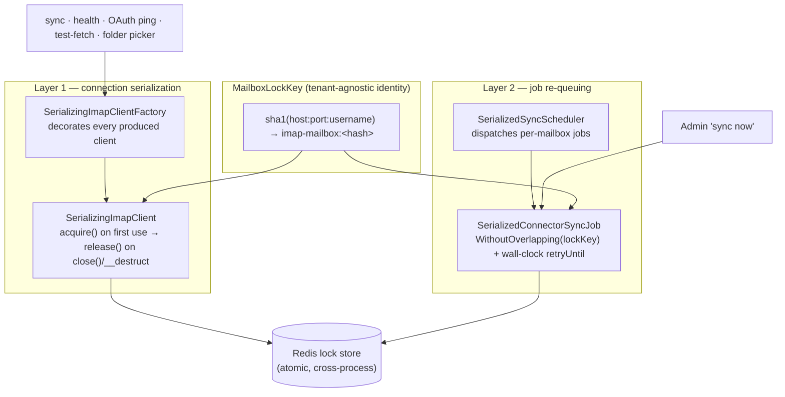

## Motivation

IMAP servers enforce a hard cap on **simultaneous connections per account**.
Gmail allows ~15, Microsoft 365 ~20, most self-hosted Dovecot installs far
fewer. AskMyDocs opens a connection from many places: the scheduled sync, the
admin "sync now" button, the health probe, the OAuth/basic-auth ping during
install, the test-fetch diagnostic, the folder picker. With
[multi-account connectors](/connectors-multi-account) a single physical mailbox
can also back **several installations** — different labels, and even different
**tenants** that happen to point at the same shared mailbox.

Nothing in the vendor connector coordinated those callers. Two syncs, or a sync
plus a manual probe, or two tenants on one shared account, could open
overlapping connections and trip the server's per-account limit. The symptom is
a spurious `Too many simultaneous connections` error that surfaces as a failed
sync or a 5xx on an admin surface — even though the credentials and the mailbox
are perfectly healthy.

The fix is to treat the mailbox as what it physically is: a **shared resource
with a connection budget of one**, and serialize every access to it.

## Theory — the mailbox is a cross-tenant physical resource

Almost every table and query in AskMyDocs is scoped by `tenant_id`
([R30](/multi-tenant-isolation)) — tenant data must never leak across the
boundary. Mailbox serialization is the **one deliberate exception**, and the
reasoning is precisely *why* it is safe:

- The lock protects a **physical resource** (the server's per-account
  connection slot), it does **not** read or expose tenant data.
- That resource is genuinely shared: two tenants pointing at the same
  `host+port+username` contend for the *same* server-side limit. Scoping the
  lock per tenant would defeat its only purpose.

So the mailbox identity is the **(host, port, username)** triple, and the lock
key **deliberately omits `tenant_id`** and the folder set. This is documented as
an explicit carve-out in `CLAUDE.md` so a future reader does not "fix" it back
into a tenant-scoped lock.

The identity is normalised before hashing so trivially-different configs collide
on one key:

- host + username are **lowercased and trimmed** (case-insensitive in practice);
- the port is **materialised to the IMAPS default 993** when omitted, empty, or
  non-numeric — so an omitted port and an explicit `993` are the same mailbox;
- the triple is **SHA-1 hashed** into a fixed, driver-safe Redis token that never
  leaks the mailbox address into a lock name.

A non-scalar `host`/`username` (a malformed `config_json` carrying an array)
yields **no key** — the caller skips locking rather than minting a meaningless
`"Array"` token.

## Design — two layers over one lock key

**Layer 1 — every connection acquires the lock.**
`SerializingImapClientFactory` decorates the IMAP client the vendor factory
produces, so *every* connection path is wrapped uniformly — there is no
caller that can bypass it. The decorator, `SerializingImapClient`, acquires the
per-mailbox lock **lazily** on the first connection-triggering call (the inner
client connects lazily too) and releases it on `close()`. A `__destruct()`
backstop covers callers that don't bracket the client in a `finally` — notably
the vendor basic-auth check whose `ping()` throws on a wrong password and never
reaches `close()`. The lock lifetime therefore brackets the live connection
exactly. On a wait-timeout the call throws `MailboxBusyException` →
[503 on the HTTP surfaces](/troubleshooting) (R14).

**Layer 2 — sync jobs re-queue instead of piling up.**
Serializing the *connection* is not enough for the queue: a worker that blocks
on a busy mailbox wastes a slot. `SerializedSyncScheduler` mirrors the vendor
cadence sweep but dispatches `SerializedConnectorSyncJob`, a host subclass that
adds Laravel's `WithoutOverlapping` middleware keyed by the **mailbox lock key**
(so two installations on the same account never run concurrently) plus a
**wall-clock `retryUntil`** window. A job that finds the mailbox busy re-queues
itself after a short delay rather than failing with a spurious error or burning
its retry budget. Admin "sync now" dispatches the same serialized job.

## Configuration

All knobs live under `connectors.imap` in `config/connectors.php`, env-overridable:

| Env var | Config key | Default | Meaning |
|---|---|---|---|
| `CONNECTOR_IMAP_SERIALIZE_CONNECTIONS` | `serialize_connections` | `true` | Master switch. When off, no wrapping at all (clean pass-through). |
| `CONNECTOR_IMAP_MAILBOX_LOCK_WAIT` | `mailbox_lock.wait_seconds` | `15` | How long a new connection blocks for the mailbox before `MailboxBusyException`. |
| `CONNECTOR_IMAP_MAILBOX_LOCK_TTL` | `mailbox_lock.ttl_seconds` | `700` | Lock auto-expiry — set **&gt; the sync job timeout (600s)** so a dead process can never deadlock a mailbox. |
| `CONNECTOR_IMAP_MAILBOX_REQUEUE_AFTER` | `mailbox_lock.requeue_after_seconds` | `60` | Delay before a busy-mailbox sync job re-queues. |
| `CONNECTOR_IMAP_MAILBOX_REQUEUE_WINDOW_MIN` | `mailbox_lock.requeue_window_minutes` | `30` | Wall-clock window a job keeps re-queuing before giving up (decoupled from the failure-retry count). |

The `wait_seconds` and `ttl_seconds` values are **clamped defensively** at use
time (TTL floored at 1s, wait at 0s) so a misconfigured `0`/negative env never
disables mutual exclusion or breaks `block()`.

## The lock store requirement (graceful degrade)

The cross-process guarantee needs an **atomic lock store** — Redis in
production. `AppServiceProvider` wires the decorator only when
`serialize_connections` is on **and** the active cache store implements
`LockProvider`.
With Redis this is fully cross-process; with local stores like `array` (and, depending on deployment, `file`) it only serializes within a single process/host.
If the store cannot provide locks at all, the app skips serialization without breaking functionality.
without breaking functionality. This is the [R43](/isolation-testing)
"flag healthy in BOTH states" posture: the feature is safe on or off, and the
test suite disables it by default (`phpunit.xml`) with dedicated tests that
enable it explicitly.

## Worked example — two tenants, one shared mailbox

1. Tenant **A** and tenant **B** each install an IMAP connector pointing at
   `imap.gmail.com:993 / ops@shared.test`. Both resolve to the **same** lock key
   `imap-mailbox:&lt;sha1&gt;`.
2. The scheduler dispatches A's `SerializedConnectorSyncJob`. Its
   `WithoutOverlapping(lockKey)` middleware admits it; it starts connecting.
3. B's job is dispatched seconds later. `WithoutOverlapping` sees the same key
   held → B **re-queues** after `requeue_after_seconds`, freeing the worker.
4. A's `SerializingImapClient` holds the Redis lock for the connection's life.
   If an admin clicks "sync now" for B meanwhile, B's connection attempt blocks
   up to `wait_seconds`; if A is still busy it raises `MailboxBusyException` →
   the admin surface answers **503 Busy**, not a confusing IMAP error.
5. A finishes, `close()` releases the lock, B's next re-queue acquires it
   cleanly. The Gmail per-account limit is never exceeded.

## Gotchas

- **Do not re-scope the lock per tenant.** It would split one physical mailbox
  into N keys and reintroduce the over-connection bug. The cross-tenant identity
  is intentional and documented (the R30 carve-out).
- **TTL must exceed the job timeout.** If `ttl_seconds` ≤ the sync job timeout, a
  long-but-healthy sync could lose its lock mid-flight. Keep the default 700 &gt;
  600.
- **No Redis, no cross-process guarantee.** A multi-worker deployment on a
  file/array cache only serializes *within* a process. Use Redis in production.
- **The `__destruct` release is a backstop, not the contract.** Callers should
  still bracket the client in `finally { close() }`; the destructor only saves
  the throw-before-close paths from leaking the lock until the TTL.

## See also

- [Credential-based connectors (IMAP)](/connectors-credential) — how the IMAP
  connector is configured.
- [Multi-account & project-scoped connectors](/connectors-multi-account) — why
  one mailbox can back several installations.
- [Multi-tenant isolation](/multi-tenant-isolation) — the R30 rule this feature
  deliberately carves out.
