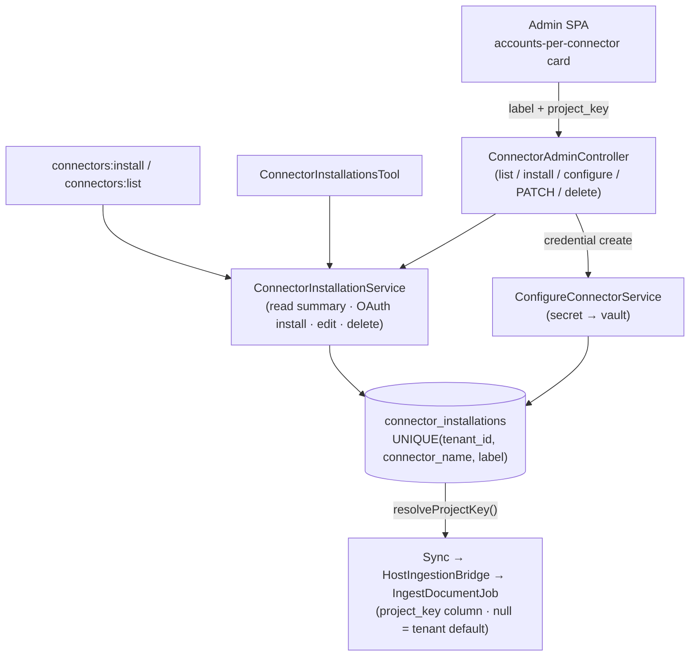

## Motivation

Through v8.19 a tenant could connect **exactly one account per connector**: one
IMAP mailbox, one Google Drive, one Notion workspace. The data model enforced it
with a `UNIQUE(tenant_id, connector_name)` on `connector_installations`, and the
ingested documents landed in a synthetic `connector-<key>` project rather than a
project the operator actually uses.

That breaks the moment a real team shows up. A helpdesk has a `support@` **and** a
`sales@` mailbox. A consultancy has one Drive per client. A platform team wants
the engineering Notion in the `engineering` KB project and the HR Notion in
`acme-hr` — not both dumped into `connector-notion`.

v8.20 lifts that ceiling: **N labelled accounts per connector**, each optionally
**bound to a real KB project** (empty = the tenant default). It is delivered
tri-surface (PHP + HTTP + MCP) over one core service (R44), tenant-scoped on
every query (R30).

## Theory — what actually had to change

The connectors were *already_ multi-account-capable where it counts: every
connector's sync logic is keyed on `installationId`, the credential vault stores
one secret per `installationId`, the on-disk path includes `installation-%d`, and
the scheduler already iterates **all** active installations. The blockers were
three narrow assumptions:

1. the `UNIQUE(tenant_id, connector_name)` constraint;
2. the per-connector `project_key ?? 'connector-<key>'` fallback scattered across
   all eight connectors;
3. the host UI/service treating "one installation per connector" as an invariant.

So multi-account is **primarily a data-model change in the
`askmydocs-connector-base` package** plus host adoption — not a rewrite.

## Design



Two collaborating core services, one per capability (R44):

- **`ConnectorInstallationService`** — the read summary (shared verbatim by the
  HTTP `index`, the `connectors:list` command and the MCP tool), OAuth-account
  creation (find-or-rearm by label), metadata edits, and deletion. Concurrency is
  handled with `lockForUpdate` inside a transaction on the re-arm/edit paths
  (R21).
- **`ConfigureConnectorService`** — credential-account creation, owning the
  secret → encrypted-vault round-trip. `label` and `project_key` are written as
  first-class **columns**, never into `config_json`.

The OAuth `state` token issued at install time is cached against its
installation id, so a callback resolves the **exact** account it belongs to even
when several accounts on one connector are PENDING at once.

## Data model

The `askmydocs-connector-base` v1.3 migration extends `connector_installations`:

| Column | Type | Notes |
|---|---|---|
| `label` | `string(64)` default `'default'` | account discriminator; back-fills existing rows to `'default'` |
| `project_key` | `string(120)` nullable | optional KB project binding; `null` = tenant default |

- Unique relaxes `UNIQUE(tenant_id, connector_name)` →
  `UNIQUE(tenant_id, connector_name, label)` — still tenant-first (R30/R31), now
  label-disambiguated (R28-style).
- A second migration moves any legacy `config_json['project_key']` into the new
  column so the column becomes the single source of truth.
- `BaseConnector::resolveProjectKey($installation)` resolves
  `project_key column → config_json legacy → kb.ingest.default_project → 'default'`
  — one place, replacing the scattered `connector-<key>` fallback.

## Decision rationale

See **[ADR 0017](/architecture/decisions)** for the full record. The load-bearing
choices:

- **Relax the unique, don't drop it.** `(tenant_id, connector_name, label)` keeps
  the tenant boundary and makes the account identity explicit. The DB unique is
  the authority for duplicate-label rejection (the request-level rule is
  best-effort UX); the create-race surfaces a friendly 422, never a 500 (R21/R14).
- **`project_key` is a real column, validated against the real registry.** The
  admin dropdown and the `exists` rule both derive from `GET /api/admin/projects`
  (R18) — never a hard-coded list. Empty binds to the tenant default.
- **OAuth install is find-or-rearm by label; credential configure is
  create-only.** Re-granting an OAuth scope re-arms the same labelled account;
  adding a credential account with an existing label is rejected. Editing an
  account (rename / rebind) is a separate `PATCH`.

## Worked example — two IMAP mailboxes

```bash
# Account 1: support mailbox bound to the acme-hr project
php artisan connectors:install imap --tenant=acme --label=Support \
  --project=acme-hr --set=host=imap.acme.com --set=username=support@acme.com
# (prompts for the password via a masked, non-echoing input)

# Account 2: sales mailbox, no binding → ingested into the tenant default project
php artisan connectors:install imap --tenant=acme --label=Sales \
  --set=host=imap.acme.com --set=username=sales@acme.com

php artisan connectors:list --tenant=acme
# Connector | Label   | Project              | Status | Last sync
# imap      | Sales   | (tenant default)     | active | never
# imap      | Support | acme-hr              | active | never
```

Both mailboxes sync in parallel (the scheduler already iterates every active
installation); Support's documents land in `acme-hr`, Sales's in the tenant
default. Adding a third account labelled `Support` is rejected by the
`(tenant, imap, label)` unique.

## Gotchas

- **`label` is required in the UI but defaults to `'default'` at the API.** A
  single-account install that omits the label gets `'default'`, preserving the
  pre-v8.20 behaviour; a second omitted-label install collides on `'default'`.
- **Clearing a binding vs leaving it.** On a `PATCH` edit, an empty `project_key`
  **clears** the binding (inherit the tenant default); on an OAuth re-grant, a
  blank `project_key` leaves the existing binding untouched (the controller keys
  on `filled()`, not `has()`).
- **Deleting an account cascades its vault row.** The `connector_credentials` FK
  is `cascadeOnDelete` (R28) — removing the account removes its secret.
- **Re-enabling a disabled account.** There is no "enable" endpoint yet; re-add
  the account with the same label to re-arm it.
