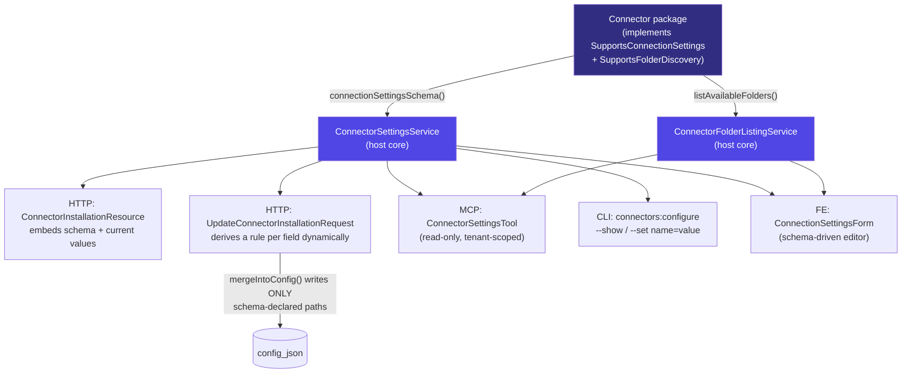

## Motivation

Connecting a mailbox or a workspace is only half the job. The other half is
telling the connector **what to actually ingest**: which IMAP folders to walk and
which to skip, how far back to reach, whether to drop auto-generated mail, how to
treat attachments. Through v8.23 every one of those knobs lived in `config_json`
and was reachable only by a hand DB edit. v8.24 (see [ADR 0021](/architecture/decisions))
surfaced exactly two — `folders.include` and `date_window_days` — with a bespoke
request rule, a bespoke resource key, a bespoke form and bespoke tests. Adding the
*next* knob meant repeating all four edits in the host.

That does not scale, and it does not generalise to the next connector. v8.25
replaces the bespoke pair with a **schema the connector advertises** and a host
that renders, validates, persists, reads and CLI-edits *any* field in that schema
without knowing what the field is. The IMAP connector now exposes its **entire**
safe surface — `folders.include` **and** `folders.exclude` as lists, the date
window, `body_format`, sender/recipient/subject filters, `only_unseen`,
`only_flagged`, `reconcile_deletions`, attachment policy, `max_messages_per_sync` —
and a new connector gets the same UI/HTTP/MCP/CLI editing for free the moment it
implements one interface.

## Theory — two capability interfaces, one host core

The design rests on a strict separation: **the connector owns the knowledge of
what is configurable; the host owns the mechanics of editing it.** The host never
names a connector or enumerates its fields (that would be [R23](/architecture/decisions)).

Two opt-in interfaces ship in `padosoft/askmydocs-connector-base` v1.4:

| Interface | Method | What the connector promises |
|---|---|---|
| `SupportsConnectionSettings` | `connectionSettingsSchema(): array` | Returns its editable surface as a list of `CredentialField` shapes — each field's `name` is a **dotted `config_json` path**, its `type` drives rendering + validation, `target='config'`, never secret. |
| `SupportsFolderDiscovery` | `listAvailableFolders(int $installationId): array` | Lists its own live folders/labels using its own client builder — so discovery works for every auth mode, `xoauth2` included. Throws `ConnectorApiException` (unreachable) or `ConnectorAuthException` (rejected creds). |

`CredentialField` grows two list types — `multiselect` and `tags` — and an
optional `discovery` hint (`'folders'`) that tells the UI a multiselect's options
come from a live discovery call rather than a fixed option map. Everything is
additive: the serialized shape gains keys, nothing is renamed
([R27](/architecture/decisions)).



The host core is one service, `ConnectorSettingsService`:

- `schemaFor($installation)` — resolve the connector via the registry, return its
  schema (or `[]` when it advertises none — a connector with no settings degrades
  cleanly, [R43](/architecture/decisions)).
- `currentSettings($installation, $schema)` — read each schema field's current
  value out of `config_json`. **Never** a connection host/username or a vault
  secret — only schema-declared fields.
- `mergeIntoConfig($installation, $payload)` — write **only** the schema-declared
  paths via `data_set` on a whitelist; a present-but-**null** value CLEARS the
  override (the key is removed, not set to null) so the connector default applies
  again. A `settings` payload can never inject a `config_json` key the schema does
  not declare. This is the security boundary.

## The four surfaces (R44)

Every capability at AskMyDocs is consumable from PHP, HTTP and MCP over one core
([R44](/architecture/decisions)); this one adds the admin UI as a fourth view of
the same service.

<Tabs>
<Tab title="HTTP">
`GET /api/admin/connectors` (and the single-row resource) embed two additive
keys:

```json
{
  "id": 42,
  "label": "support@acme",
  "connection_settings_schema": [
    { "name": "folders.include", "type": "multiselect", "discovery": "folders", "label": "Folders to import", ... },
    { "name": "folders.exclude", "type": "multiselect", "discovery": "folders", ... },
    { "name": "date_window_days", "type": "number", ... },
    { "name": "only_unseen", "type": "checkbox", ... }
  ],
  "settings": { "folders": { "include": ["INBOX", "Projects/Acme"] }, "date_window_days": 90 }
}
```

`PATCH /api/admin/connectors/{id}` accepts a `settings` object validated
**dynamically** from the schema — `multiselect`/`tags` → nullable array of distinct
non-empty strings, `number` → nullable bounded integer, `checkbox` → boolean,
`select` → nullable `Rule::in`. There is no connector-specific rule list, an
unknown / typo'd / mis-shaped key is rejected with **422** (never a silent no-op,
[R14](/architecture/decisions)), and a present `null` clears that override back to
the connector default. The persist runs inside `lockForUpdate`
([R21](/architecture/decisions)). The v8.24 `folders`/`date_window_days` top-level
keys still work for back-compat.

`GET /api/admin/connectors/{id}/folders` returns the live folder list for a
folder-discovering connector — `404` for a connector without discovery, `503`
([R14](/architecture/decisions)) when the source is unreachable or the credentials
were rejected, `200 []` for a genuinely empty mailbox.
</Tab>
<Tab title="MCP">
`ConnectorSettingsTool` (read-only, idempotent, tenant-scoped) returns the schema +
current values and, opt-in via `include_folders`, the live folder list. A discovery
failure is reported as a distinct `folders_error`, never a misleading empty list.
It is tool #45 on `KnowledgeBaseServer` (count locked by
`KnowledgeBaseServerRegistrationTest`).

```text
connector_settings { installation_id: 42, include_folders: true }
→ { connection_settings_schema: [...], settings: {...}, folders: ["INBOX", ...], folders_error: null }
```
</Tab>
<Tab title="CLI">
```bash
# Show the schema + current values
php artisan connectors:configure 42 --tenant=acme --show

# Edit fields (dotted names; list values comma-separated)
php artisan connectors:configure 42 --tenant=acme \
  --set="folders.exclude=[Gmail]/Spam,[Gmail]/Trash" \
  --set="date_window_days=90" \
  --set="only_unseen=true"
```

Each value is cast by its field type with the SAME constraints the HTTP surface
enforces (integer bounds, list distinct/length, nullable clear), and an unparseable
value fails fast with a clear message — no silent coercion of `date_window_days=oops`
to `0`, and `--set` against a connector with no settings is an error, not a no-op.
</Tab>
<Tab title="Admin UI">
The connector account row opens a schema-driven `ConnectionSettingsForm`: a live
folder multiselect (with a Retry on a discovery error), tag inputs for free-text
filter lists, number/checkbox/select rows — all generated from
`connection_settings_schema`, all pre-filled from `settings`. Adding a field to
the connector's schema makes it appear here with no FE change.
</Tab>
</Tabs>

## Resilience — a vanished folder never stops the sync

Operators add and remove folders over a mailbox's life. If you whitelist
`{INBOX, Projects/Acme, Archive}` and later delete `Archive` from webmail, the
sync must keep ingesting `INBOX` and `Projects/Acme` — not halt because one entry
no longer resolves.

The IMAP connector (v1.4.2) diffs the whitelist against the live mailbox list via
`MailboxWalker::missingIncludedMailboxes()`: it walks every folder that **does**
exist and records each missing one onto `SyncResult.errors[]` plus a
`Log::warning`. The run surfaces the missing folder in AskMyDocs's sync errors
(visible in the connector observability surface) **without** a hard failure. Skip
+ report is the default, never stop.

## Worked example — narrowing a Gmail mailbox

1. Connect the mailbox (`xoauth2` or password) and let it reach `ACTIVE`.
2. Open the account's settings. The form fetches the live folder list — including
   `[Gmail]/Spam`, `[Gmail]/Trash`, years of labels.
3. Tick the folders you want under **Folders to import** (`folders.include`); tick
   the noise under **Folders to exclude** (`folders.exclude`). Leaving include
   empty means "import all non-excluded folders".
4. Set **Import messages from the last N days** to `365`, turn on **Only unseen**,
   leave attachment handling at the connector default.
5. Save. The PATCH validates each field against the schema, writes only those keys
   into `config_json` inside a row lock, and the next scheduled sync honours them.

## Gotchas

- **Discovery is post-install.** The live folder list only exists once the account
  has working credentials, so the picker is an edit-time action, not part of the
  activation form.
- **Folder paths are verbatim and case-sensitive.** A picked value round-trips 1:1
  into `folders.include`; there is no normalisation that could drift from the
  server's own naming.
- **Only schema-declared keys are writable.** The `settings` payload cannot poke an
  arbitrary `config_json` key — `mergeIntoConfig` writes the whitelist only, and an
  unknown key is rejected at validation.
- **A connector with no settings is fine.** `schemaFor()` returns `[]`, the form
  shows nothing to edit, and every surface degrades cleanly.

See [ADR 0022](/architecture/decisions) for the full decision record, and
[Multi-account connectors](/connectors-multi-account) for how settings attach to
each of the N accounts a tenant connects per connector.
