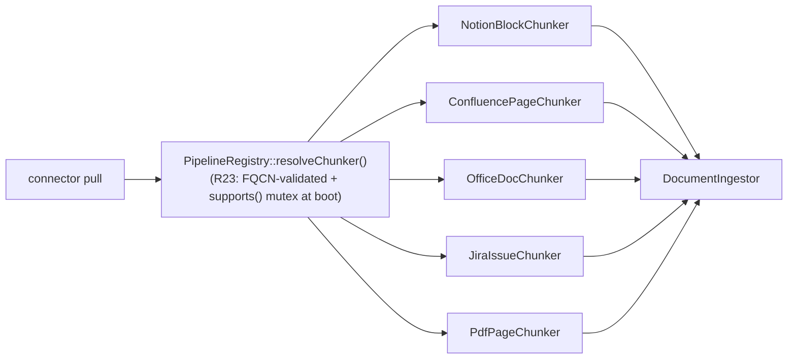

## Motivation

Most "RAG over docs" tools expect a pile of pre-flattened markdown or ship a
single brittle "Drive sync". AskMyDocs ships a real **connector framework** plus
seven native connectors, so every external corpus lands in the canonical KB with
its provenance, native IDs, ACL hints, and status preserved — and gets chunked
the way that source actually wants to be chunked.

## The seven native connectors

| Connector | Auth | Notes |
|---|---|---|
| `google-drive` | OAuth2 | delta-query incremental sync |
| `notion` | OAuth2 | block paginator |
| `onedrive` | Microsoft Graph | delta-query; markdown/text/PDF |
| `evernote` | OAuth | `.enex` bulk import |
| `fabric` | API key | OAuth pending upstream |
| `confluence` | Atlassian OAuth 2.0 3LO | `cloud_id` persisted, reusable by Jira |
| `jira` | Atlassian OAuth 2.0 3LO | ADF→markdown + injection-safe JQL |

Each is a **standalone `padosoft/askmydocs-connector-*` Composer package**,
`composer require`-able and auto-discovered via
`composer.json::extra.askmydocs.connectors`. They talk to AskMyDocs only through
the `ConnectorIngestionContract` IoC bridge — no hard dependency on the host.

## Source-aware chunking



A per-source chunker is **mandatory** for every connector — never reuse the
generic `MarkdownChunker`. Each populates rich frontmatter (document-level
`connector` / `external_id` / `external_url` / native timestamps; chunk-level
`source_type` / `search_tags` / `recency_bucket` / ACL hint / status) that drives
`KbSearchService` facets and the reranker's Layer-4 signals.

## Installing a connector

```bash
composer require padosoft/askmydocs-connector-notion
```

Then log in as a **super-admin** and open **`/app/admin/connectors`** — the React
SPA handles the OAuth handshake (signed callback), persists a
`connector_installations` + `connector_credentials` row, and the scheduler-driven
`ConnectorSyncJob` runs incremental sync.

## Decision rationale (ADR-style)

Two decisions are load-bearing; changing either needs a new ADR:

- **Why ship connectors inline first, extract later? (ADR 0008)** The connector
  framework had breaking shape changes through v4.5 W1–W6. Pushing every iteration
  to seven separate `padosoft/*` packages during stabilisation would have doubled
  the cycle length with zero consumer benefit. The framework was frozen in W7 and
  extraction happened in v4.6 (ADR 0009).

- **Why auto-discovery via `composer.json::extra.askmydocs.connectors`? (ADR 0009)**
  A static FQCN list in `config/connectors.php` would require the operator to edit
  host config on every `composer require`. Composer-extra discovery mirrors
  Laravel's own `extra.laravel.providers` convention — data-driven, version-stable,
  and inspectable without booting the app. A per-package service-provider approach
  was rejected because it ties runtime registration to a specific framework method
  signature.

- **Why mandatory per-connector chunkers?** Forcing every source through the generic
  `MarkdownChunker` destroys citation precision — a Jira issue's acceptance criteria
  are not a section heading; a Notion block is not a paragraph. The mandatory chunker
  requirement is a deliberate cost to preserve retrieval quality.

## Gotchas & operations

- Every new connector/document type MUST ship an ad-hoc chunker + rich frontmatter
  + a retrieval-boost policy — this is a hard rule, not a nicety.
- Connectors are gated by `manageConnectors` (super-admin only) — they expose
  cross-tenant credential vaults + OAuth callbacks; the blast radius is too large
  to widen without an ADR.
- Live-fixture recording is opt-in (`tests/Live/Connectors/`, per-provider env
  guard); CI runs only Unit + Feature.

<CardGroup cols={2}>
  <Card title="Ingestion" icon="file-import" href="/ingestion">
    The one execution path every connector pull converges on.
  </Card>
  <Card title="Admin panel" icon="gauge" href="/admin-panel">
    The connector OAuth + sync surface in the admin cockpit.
  </Card>
</CardGroup>
