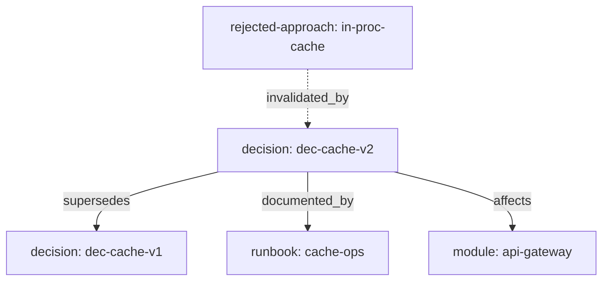
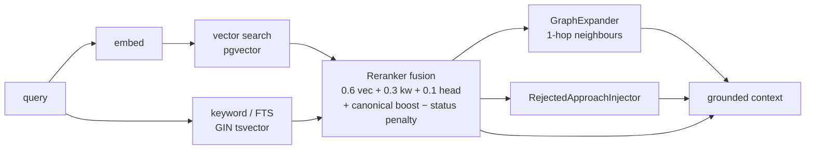

AskMyDocs is more than a vector index. Six concepts define how it behaves; the
rest of the documentation builds on them.

## 1. Documents and chunks

Every ingested source (markdown, text, PDF, DOCX, or a connector pull) becomes a
**document** row in `knowledge_documents` and a set of section-aware **chunks** in
`knowledge_chunks`, each with an `embedding vector(N)`. Ingestion is **idempotent**:
documents upsert on the tuple `(project_key, source_path, version_hash)`, so
re-pushing identical bytes is a no-op and a new version archives the previous one
so stale chunks never surface.

## 2. The canonical layer

A document can be promoted into a **typed canonical artifact**. The canonical
layer adds nine node types — `project`, `module`, `decision`, `runbook`,
`standard`, `incident`, `integration`, `domain-concept`, and `rejected-approach` —
and a status lifecycle (`draft → accepted → deprecated → superseded`, etc.).

Canonical identifiers (`slug`, `doc_id`) are **project-scoped, not global**: two
projects can legitimately both own `dec-cache-v2`. Promotion is **always
human-gated** (see [Anti-hallucination firewall](/anti-hallucination-firewall)).

## 3. The knowledge graph

Canonical artifacts are connected by a lightweight graph: `kb_nodes` (9 node
types) and `kb_edges` (10 edge types — `depends_on`, `supersedes`,
`invalidated_by`, `decision_for`, …). Edges are weighted and carry provenance
(wikilink / frontmatter / inferred). At retrieval time the graph is *walked*, not
just stored — see [Institutional memory](/institutional-memory).

## 4. Evidence tiers and the trust ranking

Every chunk can carry an **evidence tier** — an ordered axis recording *what kind*
of source a claim rests on:

`guideline > peer_reviewed > official > preprint > news > blog > search_hint > unverified`

The RAG prompt surfaces the tier so the model flags low-confidence claims. And the
reranker enforces a **trust ranking** that is the heart of the anti-hallucination
posture:

<Note>
  **Human-`accepted` &gt; `auto` &gt; raw.** Machine-written knowledge (the
  Auto-Wiki tier) can enrich an answer but can **never** silently outrank a
  human-vouched decision. This firewall is non-negotiable — see
  [Anti-hallucination firewall](/anti-hallucination-firewall).
</Note>

## 5. Hybrid retrieval

A chat turn never relies on vector similarity alone:

Vector and keyword candidates are fused by the reranker,
boosted/penalised by canonical status, then expanded through the graph.

## 6. Multi-tenancy

Every tenant-aware table carries a `tenant_id`, and a `TenantContext` singleton
(set by the `ResolveTenant` middleware) scopes every query. Two different
customers can share the same `project_key` — the **tenant boundary is the only
safe scope**. Composite tenant-scoped foreign keys on `kb_edges` make
cross-tenant edges *structurally impossible*. See
[Multi-tenant isolation](/multi-tenant-isolation).

## Putting it together

When you ask a question, AskMyDocs embeds it, runs hybrid retrieval, fuses and
trust-ranks the candidates, walks the graph for neighbours, injects any rejected
approaches under a ⚠ marker, composes a typed prompt, and answers **with
citations** — all scoped to your tenant. The next sections explain each stage in
depth.

<CardGroup cols={2}>
  <Card title="Architecture overview" icon="sitemap" href="/architecture/overview">
    The full system design and request lifecycle.
  </Card>
  <Card title="Canonical & promotion" icon="user-check" href="/anti-hallucination-firewall">
    How a draft becomes a human-vouched canonical artifact.
  </Card>
</CardGroup>
