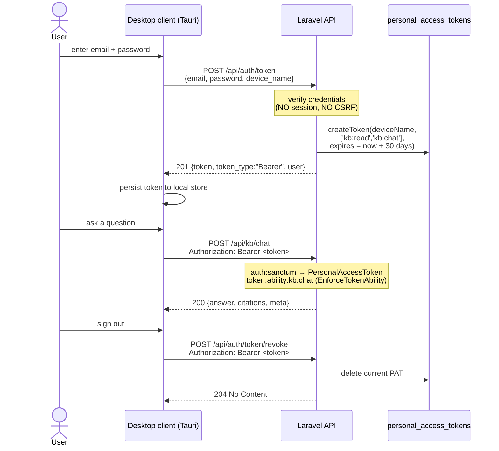

## Motivation / problem

AskMyDocs ships a React **SPA** that authenticates with Sanctum's *stateful*
cookie flow: the browser first hits `GET /sanctum/csrf-cookie`, receives an
`XSRF-TOKEN`, and replays it on every mutating request. That handshake is exactly
right for a same-site browser app — and exactly wrong for a **non-browser
client**. A native desktop app, a CLI, a CI runner, or a mobile shell has no
cookie jar, no CSRF round-trip, and no same-origin guarantee; forcing the
cookie/CSRF dance on them either fails (a token client without an `XSRF-TOKEN`
cookie is rejected with `419`) or invites insecure work-arounds (a wildcard
immortal token, CORS relaxed for everyone).

Two things were therefore needed:

1. A **stateless authentication transport** for non-browser clients — Bearer
   tokens, issued without opening a session, scoped to exactly the abilities the
   client uses, and self-expiring so a token from a lost device cannot live
   forever.
2. A **reference consumer** that proves the transport end to end: a real
   desktop (and iOS) client that logs in, chats with citations, searches, and
   views source documents — using nothing but the public API.

This page documents both: the **token-auth flow** (the durable platform
capability) and the **Tauri desktop client** (the reference consumer that lives
under `desktop/`).

## Theory & background

Sanctum has two authentication shapes behind one `auth:sanctum` guard:

- **Stateful (SPA) sessions** — the request carries a session cookie; Sanctum
  hydrates the user from the session. The "current access token" on such a
  request is a `Laravel\Sanctum\TransientToken` — a sentinel that means "this
  request is session-authenticated, not token-authenticated". A `TransientToken`
  answers `can()` as `true` for everything (the session user's real
  authorization is the route's RBAC stack, not token abilities).
- **Personal access tokens (PATs)** — the request carries
  `Authorization: Bearer <token>`; Sanctum hydrates the user from the hashed
  token row in `personal_access_tokens`. The current access token is a real
  `Laravel\Sanctum\PersonalAccessToken`, which carries an `abilities` list and an
  optional `expires_at`.

The desktop flow uses the **PAT** shape. The design constraint that makes it safe
to coexist with the SPA is that several KB routes are reached by **both**
transports — so the per-route ability gate must constrain PATs *without* breaking
the cookie SPA. Sanctum's stock `ability` / `abilities` middleware cannot do this:
it throws the moment the current token is `null` or transient, so it would `401`
every cookie-authenticated request. The host therefore ships a PAT-scoped gate,
`EnforceTokenAbility`, that only constrains real `PersonalAccessToken`s and passes
session / transient / unauthenticated requests straight through to the route's own
`auth:sanctum` + `tenant.authorize` + RBAC stack.

## Design



### Token issuance — `AuthController::token()`

`POST /api/auth/token` (handled by
`App\Http\Controllers\Api\Auth\AuthController::token()`, validated by
`App\Http\Requests\Auth\TokenRequest`) does **not** open a session. It:

1. Applies a **failure-only throttle** on a bucket namespaced away from the login
   bucket (`token|<lowercased-email>|<ip>`): `429` after 5 failed attempts, the
   counter cleared on success — so the two flows never interfere.
2. Looks up the user by email and verifies the password with `Hash::check()`. A
   wrong password or unknown email returns **`422`** with a validation error on
   `email` (and mints no token) — credential enumeration is not leaked.
3. On success, mints a Sanctum PAT via `createToken()` with **exactly two
   abilities** — `kb:read` and `kb:chat` — and a **finite 30-day expiry**, then
   returns **`201`** with the plaintext token.

The route lives in an `auth`-prefixed group that sits **outside** the `web`
middleware group, so a token client without an `XSRF-TOKEN` cookie is never
rejected with `419`.

### Per-route enforcement — `EnforceTokenAbility`

`App\Http\Middleware\EnforceTokenAbility` is registered as the `token.ability`
alias in `bootstrap/app.php`. Applied as `->middleware('token.ability:kb:read')`,
it:

- reads `$request->user()?->currentAccessToken()`;
- if that is **not** a `PersonalAccessToken` (i.e. a session `TransientToken`,
  or an unauthenticated request), it calls `$next($request)` unchanged — a no-op
  for the cookie SPA;
- if it **is** a PAT, it passes when the token `can()` any **one** of the listed
  abilities (mirroring Sanctum's `CheckForAnyAbility`; a wildcard `*` token passes
  every check), and otherwise returns **`403`** with
  `{ "error": "token_ability_forbidden", "message": "…" }`.

The gate is mounted on the three routes the desktop client reaches:

| Route | Gate |
|---|---|
| `POST /api/kb/chat` | `token.ability:kb:chat` |
| `GET /api/kb/documents/search` | `token.ability:kb:read` |
| `GET /api/kb/documents/{documentId}/preview` | `token.ability:kb:read` |

A PAT minted for `kb:read` + `kb:chat` reaches all three; a PAT scoped
differently is rejected with `403` before it can burn provider quota or read a
document.

### Revocation — `AuthController::revokeToken()`

`POST /api/auth/token/revoke` (behind `auth:sanctum`) is the Bearer-flow
counterpart of `logout()`. It deletes the PAT the caller authenticated with and
returns **`204`**. It is stateless — no web session, no CSRF — so a desktop
client can sign out without an `XSRF-TOKEN` cookie. A session-based caller carries
a `TransientToken` (not a `PersonalAccessToken`), so the delete is skipped and the
call no-ops safely. Unauthenticated callers get `401`.

### The Tauri desktop client (`desktop/`)

The reference consumer is a self-contained **Tauri v2 + React (Vite)** project
under `desktop/`, with its own `package.json` and Rust crate. It is **not** wired
into the Laravel CI — it is a demonstration of the public token-auth surface.

- **Login** → `POST /api/auth/token`; the Bearer token is persisted locally via
  the Tauri **store** plugin and survives restarts.
- **Chat** → `POST /api/kb/chat`; grounded answers with citations and a
  confidence badge render as **markdown**; each citation opens its source in a
  full-page document viewer. **Conversation threads are kept locally on disk** —
  the server's `/conversations` endpoints use the web-session guard, so a Bearer
  client cannot reach them; every turn hits the stateless `/api/kb/chat`.
- **Search** → `GET /api/kb/documents/search` (title/path autocomplete).
- **Document viewer** → `GET /api/kb/documents/{id}/preview` returns a document's
  full source text (tenant + AccessScope scoped), rendered as a full-page modal.

All backend calls go through the **Tauri HTTP plugin** (the Rust side), so the
webview never performs a cross-origin request and the backend needs **no CORS
change**. The same codebase targets **iOS** via Tauri v2 mobile (responsive UI,
safe-area insets, an off-canvas thread drawer) with no native code changes.

## Data model / contract

### `POST /api/auth/token` (public)

Request (`TokenRequest`):

| Field | Rules |
|---|---|
| `email` | `required`, `email` |
| `password` | `required`, `string` |
| `device_name` | `nullable`, `string`, `max:120` (defaults to `desktop-demo` server-side when omitted) |

Response **`201`**:

```json
{
  "token": "<plaintext Sanctum PAT>",
  "token_type": "Bearer",
  "user": { "id": 1, "name": "Ada", "email": "ada@example.com" }
}
```

The minted token carries `abilities = ["kb:read", "kb:chat"]` and
`expires_at = now + 30 days`. Failure modes: `422` (wrong password, unknown
email, or missing fields — validation error on `email`), `429` (after 5 failed
attempts on the `token|email|ip` bucket).

### `POST /api/auth/token/revoke` (`auth:sanctum`)

No body. Deletes the caller's PAT and returns **`204`**. Session callers no-op
(also `204`). Unauthenticated → `401`.

### `EnforceTokenAbility` (`token.ability:<ability>[,<ability>…]`)

On a PAT request: passes if the token `can()` any listed ability, else `403`
`{ "error": "token_ability_forbidden" }`. On a session / transient /
unauthenticated request: pass-through (no-op).

### `personal_access_tokens` table

The standard Sanctum migration is vendored into the host
(`database/migrations/2019_12_14_000001_create_personal_access_tokens_table.php`,
with a SQLite test mirror under `tests/database/migrations/`): a morph owner
(`tokenable_type` + `tokenable_id`), a unique `token` hash, an `abilities` text
column, and nullable `last_used_at` / `expires_at`. Run `php artisan migrate`
before issuing tokens.

## Decision rationale (ADR-style)

There is no dedicated ADR for this surface; the security rationale is recorded
here and is consistent with the platform-wide
[security & threat model](/architecture/security-and-threat-model).

- **Why personal access tokens (not a JWT / OAuth server)?** Sanctum PATs are
  already the platform's second transport behind the single `auth:sanctum` guard
  (the SPA is the first). Reusing them means the desktop client authorizes against
  the *same* user, the *same* RBAC, and the *same* tenant resolution as every
  other surface — no parallel identity system, no second guard to keep in sync.
- **Why finite expiry?** The global `sanctum.expiration` is `null` (SPA sessions
  expire by cookie lifetime, not token TTL). A desktop token is set per-token to
  **30 days** so a token leaked from a lost or stolen device **self-revokes
  server-side** instead of living forever. Expiry is enforced by Sanctum on every
  authenticated request, independent of whether the client ever calls revoke.
- **Why least-privilege abilities (not `['*']`)?** The desktop client only ever
  calls KB read + chat. Minting the token with exactly `kb:read` + `kb:chat`
  means a **stolen** desktop token cannot reach a route scoped to a different
  ability (e.g. ingest or delete), even though those routes share the same
  `auth:sanctum` guard. The wildcard would have made the token as powerful as the
  user — a needless blast radius.
- **Why a custom `EnforceTokenAbility` (not Sanctum's `ability` middleware)?**
  The gated routes are **dual-auth**: the cookie SPA reaches them too. Sanctum's
  stock middleware throws on a `null` / transient token, so it would `401` every
  session request. `EnforceTokenAbility` is deliberately PAT-scoped — it
  constrains only real PATs and is a no-op for sessions — so one route can serve
  both transports without weakening either. This mirrors the platform principle
  that a feature flag / gate must be safe in **both** states (R43): the SPA path
  is unchanged whether or not a PAT is present.
- **Why stateless issuance / revocation (no session, no CSRF)?** A non-browser
  client has no cookie jar. Issuing and revoking outside the `web` group avoids
  the `419` CSRF rejection and keeps the Bearer flow self-contained, while the
  cookie SPA keeps its CSRF protection untouched.

## Worked example

Issue a token, call an authed endpoint, then revoke — all with `curl`:

```bash
# 1. Mint a desktop token (no cookie, no CSRF).
TOKEN=$(curl -s -X POST https://askmydocs.example.com/api/auth/token \
  -H 'Accept: application/json' \
  -H 'Content-Type: application/json' \
  -d '{"email":"ada@example.com","password":"secret","device_name":"My Laptop"}' \
  | jq -r .token)

# 2. Ask a grounded question (passes token.ability:kb:chat).
curl -s -X POST https://askmydocs.example.com/api/kb/chat \
  -H "Authorization: Bearer $TOKEN" \
  -H 'Accept: application/json' \
  -H 'Content-Type: application/json' \
  -d '{"question":"What is our cache eviction policy?"}'

# 3. Sign out — revoke the token server-side.
curl -s -X POST https://askmydocs.example.com/api/auth/token/revoke \
  -H "Authorization: Bearer $TOKEN" -H 'Accept: application/json' -i
# → HTTP/1.1 204 No Content; the token no longer authenticates.
```

Run the desktop app itself (from the repo):

```bash
cd desktop
npm install
npm run tauri dev    # launches the desktop window with hot-reload
```

By default the client targets the production deployment; override
`VITE_API_BASE` at build time to point at a local backend (and keep the HTTP
scope in `src-tauri/capabilities/default.json` in step). The full runbook —
including the iOS build flow — lives in `desktop/README.md`.

## Gotchas

- **Run the migration first.** `php artisan migrate` must create
  `personal_access_tokens` before any token is issued, or `POST /api/auth/token`
  fails at `createToken()`.
- **`device_name` from the real app is not the server default.** The Tauri client
  always sends its own label; the server-side `desktop-demo` fallback only applies
  to clients (curl, tests) that omit the field.
- **Conversation history is local to the desktop client.** The `/conversations`
  endpoints are session-guarded and unreachable by a Bearer client by design;
  threads persist in the Tauri store, and every turn is a fresh stateless
  `/api/kb/chat` call.
- **Token TTL is per-token, not global.** The desktop TTL is 30 days regardless
  of `sanctum.expiration` (which stays `null` for SPA sessions). A token outlives
  neither its expiry nor an explicit revoke.
- **The `token.ability` gate is a no-op for the SPA.** Do not assume it enforces
  anything for cookie-authenticated requests — those are governed by the route's
  RBAC stack. The gate only ever constrains real PATs.
- **The desktop project is outside Laravel CI.** It is a self-contained demo with
  its own toolchain (Rust + Node); changes there are not exercised by the host
  PHP/Vitest/Playwright suites.
