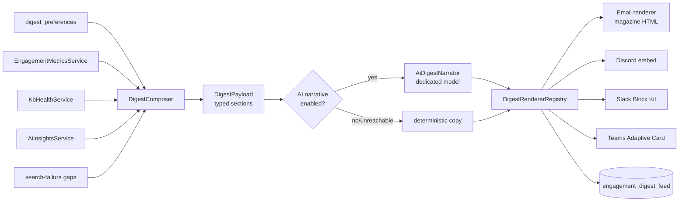

## Motivation / problem

The thin "low activity this week" email is easy to ignore. A digest earns its
place in the inbox only when it tells you something you'd otherwise miss and
*why it matters*: which decisions were promoted, which runbooks are decaying,
which questions keep failing to find an answer, and what specifically needs *your*
attention. And it has to arrive where the team already is — not only email, but
Discord, Slack, Teams and inside the app.

## Theory & background

A digest is a **composition**, not a query. `DigestComposer` pulls from the
already-computed signal services and assembles a typed `DigestPayload` of
sections; it never recomputes a metric. Each section is independently toggleable
per user (`digest_preferences.sections`), and the whole digest has a `frequency`
(`weekly | monthly | off`). The monthly variant is an executive roll-up (KB ROI,
coverage/decision-debt trends, contributor activity).

The optional narrative is produced by `AiDigestNarrator` using a **dedicated**
model so it never competes with the primary chat model — and it always degrades
to deterministic copy when disabled or unreachable (R14/R43), so a digest never
fails because an LLM did.

## Design



`DigestRendererRegistry` is an R23 strategy registry: every renderer FQCN is
validated at boot and each renderer's `supports()` predicate is mutually
exclusive, so a channel resolves to exactly one renderer. Transport reuses the
existing notification channel adapters (`DiscordChannel` / `SlackChannel` /
`TeamsChannel` / `EmailChannel`).

## Data model / contract

| Knob (`config/kb.php` → `digest`) | Env | Default | Purpose |
|---|---|---|---|
| `ai_narrative_enabled` | `KB_DIGEST_AI_NARRATIVE_ENABLED` | `true` | Toggle the LLM narrative (both states tested, R43). |
| `ai_provider` | `KB_DIGEST_AI_PROVIDER` | `openrouter` | Dedicated provider for the narrative task. |
| `ai_model` | `KB_DIGEST_AI_MODEL` | `meta-llama/llama-3.3-70b-instruct:free` | Free model — digests are summary prose. |
| `narrative_max_tokens` | `KB_DIGEST_NARRATIVE_MAX_TOKENS` | `400` | Token cap for the narrative. |
| `feed_retention_days` | `KB_DIGEST_FEED_RETENTION_DAYS` | `120` | In-app feed retention (`0` disables the prune). |

**Surfaces (tri-surface, R44):**

- **Command:** `digest:send {--frequency=weekly|monthly} {--tenant=} {--channel=email|discord|slack|teams} {--dry-run} {--preview}` and `digest:prune-feed`.
- **HTTP:** `GET /api/admin/digest/preview` (admin, RBAC-gated); `GET /api/me/digest/latest` and `GET /api/me/digest-preferences` / `PUT /api/me/digest-preferences` (per-user).
- **MCP:** `KbDigestPreviewTool` (read).

## Decision rationale (ADR-style)

- **Compose, don't recompute.** The composer reads the snapshot + health +
  insights + gaps services. This keeps a single source for each metric and makes
  the digest cheap to render on demand.
- **A dedicated free model for the narrative.** Locking the digest to its own
  provider/model means a team can run an expensive primary chat model and still
  pay ≈$0 for digest prose, and the digest can never starve the chat model of
  rate budget.
- **Narrative is additive and fail-safe.** `ai_narrative_enabled=false` (or an
  unreachable provider) yields a fully-formed digest with deterministic copy —
  the narrative is never load-bearing (R14).
- **Renderers behind an R23 mutex registry.** Adding a channel is adding a
  renderer with a non-overlapping `supports()`; first-match-wins ambiguity is a
  boot-time error, not a silent mis-route.

## Worked example

Preview the composed payload + every rendered card as JSON, without sending:

```bash
php artisan digest:send --frequency=weekly --tenant=acme --preview
```

Send only the Slack card for the monthly executive roll-up:

```bash
php artisan digest:send --frequency=monthly --tenant=acme --channel=slack
```

A user opts out of everything but the stale-review queue (valid section keys:
`metrics`, `new_docs`, `stale_docs`, `top_gaps`, `leaderboard`):

```bash
curl -s -X PUT -H "Authorization: Bearer $TOKEN" -H 'Content-Type: application/json' \
  -d '{"frequency":"weekly","sections":["stale_docs"]}' \
  https://kb.example.com/api/me/digest-preferences
```

## Gotchas & operations

<Note>
`--preview` implies `--dry-run`: it composes and renders but never sends. Use it
to inspect exactly what each channel will receive before scheduling.
</Note>

- Weekly and monthly sends are scheduled after the daily engagement snapshot so
  they read fresh metrics — see [Scheduler & Maintenance](/scheduler-and-maintenance).
- A never-configured preference (omitted or `null` sections) resolves to **all**
  sections (default-in); an **empty array `[]`** means **none** (explicit
  opt-out). Don't conflate the two — an unchecked "all" box that sends `[]` honestly
  means no sections, not silently all.
- The in-app feed grows unbounded without `digest:prune-feed`; the daily prune
  honours `feed_retention_days`.

See the [Engagement Suite overview](/engagement-suite) for how digests fit the
whole pipeline, and [AI providers](/ai-providers) for configuring the dedicated
narrative model.
