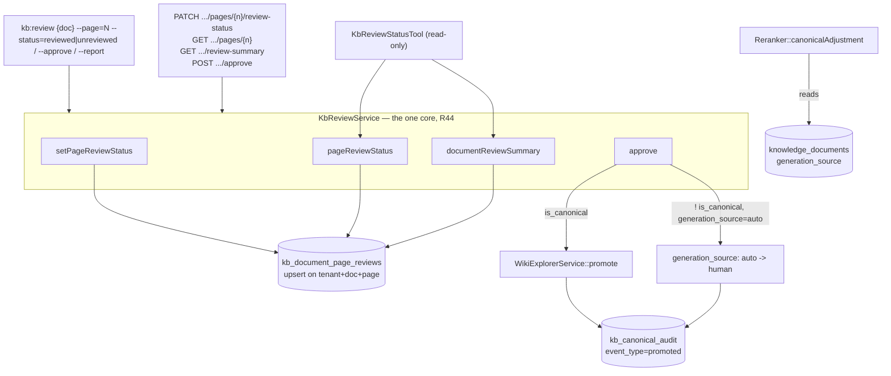

## Motivation

[Documents & OCR](/documents-and-ocr) closed the *file → Markdown* seam: a
scanned contract or a photographed whiteboard now becomes a searchable,
chunked, embedded document instead of a `422`. It did not close the seam
right after it. OCR output is a **guess with a confidence** — a driver's best
read of pixels, not a fact anyone vouched for — and until v8.37 that guess
retrieved and ranked **exactly like** content a human had actually reviewed.
`generation_source` (`human` / `auto`, [ADR 0014](https://github.com/lopadova/AskMyDocs/blob/main/docs/adr/0014-source-retention-and-conversion-artifacts.md))
already modelled the distinction for canonical documents; nothing wired it up
for the non-canonical case, which is where nearly all OCR content lives — an
inbound scan rarely arrives with YAML frontmatter attached.

Two defects followed from that gap, both closed in this cycle:

1. **The reranker's own firewall didn't apply.** `human > auto > raw`
   (ADR 0014's anti-hallucination promise) was implemented as a penalty that
   short-circuited to **zero** for every non-canonical chunk, before it ever
   read `generation_source`. An unreviewed scan and a human-reviewed sibling
   scan ranked identically. See the [Reranker firewall fix](#the-reranker-firewall-fix)
   section below — this is fixed at the retrieval layer, independent of
   whether anyone has reviewed anything yet.
2. **There was no way to review anything.** No table recorded which pages of
   a converted document a human had looked at; no action flipped
   `generation_source` from `auto` to `human` for a non-canonical document.
   `WikiExplorerService::promote()` did the equivalent transition, but only
   for **canonical** rows, and unconditionally set `canonical_status =
   'accepted'` — correct for its own callers, and a false canonical fact if
   reused for an ordinary scan.

<Note>
Everything on this page is **off by default**
(`KB_DIGITIZATION_REVIEW_ENABLED=false`, R43). With the flag off,
`KbReviewService`'s mutating methods throw a clean, typed exception
(`KbReviewDisabledException`, HTTP 404) rather than a silent no-op; the one
read `documentReviewSummary()`/`pageReviewStatus()` exposes is deliberately
**not** gated at the service layer (see [Gotchas](#gotchas)), but every
external surface — HTTP, the CLI's report display (`--report`, and the
`--page=N --report` combo), and `KbReviewStatusTool` — still refuses to
serve it while the feature is off. The design rationale is
[ADR 0031](https://github.com/lopadova/AskMyDocs/blob/main/docs/adr/0031-v837-digitization-review-and-auto-tier-mapping.md).
</Note>

### Configuration

| Variable | Default | Controls |
|---|---|---|
| `KB_DIGITIZATION_REVIEW_ENABLED` | `false` | The feature flag above — every mutating entry point and every read surface (R43). |
| `KB_REVIEW_LOW_CONFIDENCE_THRESHOLD` | `0.70` | The OCR confidence (chunk metadata, W1) below which a span is highlighted in the review UI's heat-map, once it ships (see [Gotchas](#gotchas)). A visual aid only — it never gates approval. |
| `KB_REVIEW_CANDIDATES_PER_HOUR` | `60` | The per-user rate cap on `KbProposeTextCorrectionTool` (ADR 0031 §6). Reserved: the tool itself has not shipped yet, so this knob currently has no effect. |

## Theory & background

Two ideas from earlier ADRs meet here, and neither is new — this cycle wires
them together for the first time.

**ADR 0014's tier is a trust label, not a workflow state.** `human` means "a
person is answerable for this text"; `auto` means "a machine produced it and
no person has looked yet." OCR gives every converted document a starting
value of `auto` — set once, at ingest, by `DocumentIngestor` — and this
cycle's only new idea is that **something can move it to `human`**: a person
looking at the page and saying "yes, this is right."

**ADR 0003's boundary — an agent proposes, a person commits — restated for
OCR.** The promotion pipeline already refuses to let an agent write canonical
storage on its own authority; the same boundary applies here, sharper. A
`provenance_tier: untrusted-external` inbound letter (ADR 0028) is,
definitionally, text the platform did not author. An agent that can *read*
such a letter must never be the one that marks it "reviewed" — that action is
a human vouching for content whose authorship is not the platform's, and
letting an agent perform it would mean the model could clear its own citation
for grounding purposes. Concretely: **there is no MCP write of review status
or approval, on purpose** ([§8 below](#no-mcp-write-a-documented-exception)).

## Design



### Per-page review state

`kb_document_page_reviews` holds exactly one row per `(tenant_id,
knowledge_document_id, page_number)` — the tenant-scoped unique key that
makes `setPageReviewStatus()` an **upsert**, never an accumulation:
re-touching an already-touched page updates that same row (`reviewed_by` /
`reviewed_at` refreshed, or cleared when reverting to `unreviewed`) instead of
producing a second one. The upsert is a single `INSERT ... ON CONFLICT DO
UPDATE` (Postgres) / `ON DUPLICATE KEY UPDATE` (MySQL) statement — deliberately
**not** a `SELECT` followed by an `INSERT`/`UPDATE` decided in PHP, because
that shape is a real race: two reviewers marking the same page concurrently
can both miss the `SELECT` and both attempt an `INSERT`, and one of them
would hit the unique constraint as an uncaught exception instead of the
promised idempotent upsert (R21). The database resolves the race, not two
round trips from the application.

A page number is meaningless without knowing how many pages the document
actually has, so `setPageReviewStatus()` and `pageReviewStatus()` both
validate against the document's own recorded
`metadata.converter.page_count` — the same field `OcrConverter` /
`PdfConverter` already write on every conversion. Two failure modes this
closes, both real (found in review, not hypothetical): a page number beyond
the document's real page count no longer silently inserts a "phantom"
reviewed page that `documentReviewSummary()` would then count as legitimate
progress; a document that was never converted (no recorded page count at
all) is refused outright rather than accepting a page review for content
that has no page-level structure to review.

### Document-wide summary is derived, never cached

`documentReviewSummary()` returns `{total, reviewed, unreviewed}` computed
fresh on every call — there is deliberately no cached boolean or counter
column to keep in sync when a correction later re-chunks the document into a
different page count. Once a document's `metadata.converter.page_count` is
known, `total` is anchored on **that** — the document's real page count — not
on how many `kb_document_page_reviews` rows happen to exist. This matters
from the very first page: reviewing page 1 of a fresh 10-page conversion
reports `{total: 10, reviewed: 1, unreviewed: 9}` immediately, not `{total:
1, ...}` climbing toward the truth one touched page at a time. A document with
no recorded page count at all (never converted through OCR/PDF processing)
falls back to counting whatever rows exist — the best available answer for a
row shape that predates page-count tracking, not a guess.

### Approval — `auto → human`, branched on canonicity

`approve()` is the one action that actually changes what the reranker sees
([below](#the-reranker-firewall-fix)). It is intentionally **not** "review
every page first" — a reviewer can approve a document at any point in its
per-page review progress; per-page tracking and document approval are two
separate signals, not a gate on each other. What differs is the destination:

- **Canonical document** (has YAML frontmatter, participates in the
  knowledge graph) → delegates to the existing
  `WikiExplorerService::promote()`, which already performs the exact same
  `auto → human` transition, audited and transactional, for its own callers
  ([Canonical & Promotion](/canonical-and-promotion)). Reusing it here means
  one transition, one audit shape, one place that understands "what does
  approval mean for a canonical row" — not two implementations drifting.
- **Non-canonical document** (the ordinary OCR'd-scan case — no frontmatter,
  not part of the graph) → `KbReviewService` performs the flip **directly**:
  `generation_source: auto → human`, one `kb_canonical_audit` row
  (`event_type = 'promoted'`). This is implemented here rather than by
  relaxing `promote()`'s own guard, because `promote()` unconditionally sets
  `canonical_status = 'accepted'` — correct for a canonical row, and a
  **false canonical fact** stamped on a document that was never canonical to
  begin with.

Both branches run inside **one transaction** that `lockForUpdate()`s the
tenant-scoped document row first and re-reads `is_canonical` /
`generation_source` from that **locked** row — never from the `$document`
instance the caller passed in, which may be stale by the time the lock is
acquired. This serializes concurrent `approve()` calls on the same document:
a second concurrent call blocks on the row lock until the first commits, then
sees the now-`human` row and returns the safe `{approved: false, reason:
'not_auto'}` no-op instead of racing to write a duplicate audit row (R21).
The same transaction also checks the write's own return value — `save()`
returns `false` when a model event vetoes the write, and ignoring that would
let the audit row get written while `generation_source` silently stayed
`auto` on disk: an approval that is audited but never actually happened. A
vetoed save now throws and rolls back the whole transaction, audit row
included.

Calling `approve()` on a document already `human` is a safe, silent no-op —
same posture as `promote()` — so a double-click or a retried request never
produces a second audit row.

### The Reranker firewall fix

`Reranker::canonicalAdjustment()` used to compute the auto-tier penalty
**after** an early return for non-canonical chunks — meaning it never ran for
them at all. The fix moves that computation ahead of the `is_canonical`
branch, but it does **not** apply to every non-canonical `auto` row
uniformly — it is scoped to rows that are actually OCR output:

```php
private function canonicalAdjustment(array $chunk, float $priorityWeight): array
{
    $doc = $chunk['document'] ?? [];
    $isCanonical = (bool) ($doc['is_canonical'] ?? false);
    $isOcrOrigin = (bool) ($doc['ocr_origin'] ?? false);

    $applyAutoPenalty = $isCanonical || $isOcrOrigin;
    $penalty = $applyAutoPenalty
        ? $this->autoTierPenalty((string) ($doc['generation_source'] ?? 'human'))
        : 0.0;

    if (! $isCanonical) {
        return ['delta' => -$penalty, 'boost' => 0.0, 'penalty' => $penalty];
    }

    $priority = (int) ($doc['retrieval_priority'] ?? 50);
    $boost = $priorityWeight * $priority;
    $penalty += $this->statusPenalty((string) ($doc['canonical_status'] ?? ''));

    return ['delta' => $boost - $penalty, 'boost' => $boost, 'penalty' => $penalty];
}
```

`retrieval_priority` and the accepted/pending status penalty stay
**canonical-only** — those are properties of the promotion pipeline, and a
non-canonical row has no `canonical_status` to penalize. The auto-tier
penalty is **not** "is this generation_source `auto`?" for every
non-canonical row: `generation_source = 'auto'` on a non-canonical row is
also written by `AutoWikiCompiler::apply()` when it enriches raw content,
a ranking behaviour that predates this ADR (ADR 0014) and that this fix
must not silently re-order. So the penalty applies only when the row is
canonical (unchanged) **or** `ocr_origin` is true — a flag
`KbSearchService`'s chunk-mapping derives from
`metadata.converter.provenance === 'ocr'`, not from `generation_source`
alone. Content that never went through OCR (`generation_source` defaults
to `human` everywhere else, unaffected by this fix at all) sees zero
change: the fix only changes ranking for rows where `generation_source =
'auto'` **and** `ocr_origin` is true, which since
[v8.36/W1](/documents-and-ocr) means specifically non-reviewed OCR output —
never AutoWiki-enriched raw content.

## Data model & contract

```
kb_document_page_reviews
  id                     bigint PK
  tenant_id              string(50), default 'default', indexed        (R31)
  knowledge_document_id  bigint FK -> knowledge_documents, cascade delete
  page_number            int, >= 1 (CHECK on Postgres; app-layer guard everywhere,
                          incl. SQLite which cannot ALTER TABLE ADD a CHECK post-create)
  status                 string: unreviewed | reviewed
  reviewed_by            nullable FK -> users
  reviewed_at            nullable timestamp
  created_at / updated_at

UNIQUE (tenant_id, knowledge_document_id, page_number)   -- the upsert key
INDEX  (knowledge_document_id)                            -- cascade-delete scan path
```

The R44 tri-surface, all three adapting the same `KbReviewService`:

| Capability | PHP / CLI | HTTP | MCP |
|---|---|---|---|
| Set a page's status | `kb:review {document} --page={n} --status=reviewed\|unreviewed` | `PATCH /api/admin/kb/documents/{id}/pages/{n}/review-status` | — ([documented exception](#no-mcp-write-a-documented-exception)) |
| Approve a document | `KbReviewService::approve()` | `POST /api/admin/kb/documents/{id}/approve` | — (same exception) |
| Read a page's status | `kb:review {document} --page={n} --report` | `GET /api/admin/kb/documents/{id}/pages/{n}` | `KbReviewStatusTool` (`page` argument) |
| Read the document summary | `kb:review {document} --report` | `GET /api/admin/kb/documents/{id}/review-summary` | `KbReviewStatusTool` (no `page`) |

`KbReviewStatusTool` answers `{disabled: true, flag:
'KB_DIGITIZATION_REVIEW_ENABLED'}` rather than a 500 or vanishing from the
MCP manifest when the feature is off — tool **registration** stays
flag-independent (the registration test derives the roster from the files in
`app/Mcp/Tools/`, not from config), only the *behaviour* is gated.

## Decision rationale (ADR 0031)

### No MCP write — a documented exception

[R44](https://github.com/lopadova/AskMyDocs) normally requires PHP + HTTP +
MCP for every capability. Review status and approval are the deliberate
exception, restated from [ADR 0003](https://github.com/lopadova/AskMyDocs/blob/main/docs/adr/0003-human-gated-promotion.md)'s
boundary: an agent may point at a probable transcription error (the
not-yet-shipped `KbProposeTextCorrectionTool`, ADR 0031 §6-7) but can never
be the one that marks anything "reviewed" or "approved" — that is a human
vouching for content the platform did not author. `KbReviewStatusTool` is
read-only by construction: it has no path to `setPageReviewStatus()` or
`approve()` at all, not a gate that could be misconfigured open.

### Why canonicity branches the approval, not a config flag

The two branches of `approve()` are not two variations on a theme picked by a
setting — they are genuinely different transitions with different meanings.
A canonical document's approval is *editorial acceptance into the knowledge
graph* (`canonical_status = 'accepted'`, `WikiExplorerService`'s existing
contract). A non-canonical document's approval is *"a human has read this OCR
output and it's correct"* — no graph participation implied, no
`canonical_status` touched. Collapsing them into one code path would force a
choice: either stamp a false canonical fact on ordinary scans, or strip the
canonical branch of its existing contract. Branching on `is_canonical` — a
fact already on the row — costs nothing on paths that don't need it and never
conflates the two meanings.

## Worked example

```bash
# A 3-page scanned contract has already been OCR'd (v8.36/W1) — its
# metadata.converter.page_count is 3.

# Report before any review:
php artisan kb:review 42 --report
# +-------+----------+------------+
# | total | reviewed | unreviewed |
# +-------+----------+------------+
# | 3     | 0        | 3          |
# +-------+----------+------------+

# A reviewer confirms page 1 reads correctly:
php artisan kb:review 42 --page=1
# Page 1 set to 'reviewed'.

# ...realizes it was actually page 2 they meant to check, reverts page 1:
php artisan kb:review 42 --page=1 --status=unreviewed
# Page 1 set to 'unreviewed'.

php artisan kb:review 42 --page=2
# Page 2 set to 'reviewed'.

# Read page 2's status without mutating it — the --page + --report combo:
php artisan kb:review 42 --page=2 --report
# +-------------+----------+-------------+---------------+
# | page_number | status   | reviewed_by | reviewed_at   |
# +-------------+----------+-------------+---------------+
# | 2           | reviewed | 7           | 2026-...      |
# +-------------+----------+-------------+---------------+

# Approve the document once satisfied — this is the action that changes
# retrieval ranking, independent of how many pages were individually marked:
php artisan kb:review 42 --approve
# Document approved (auto -> human).

# A page number beyond the document's real page count is refused, not
# silently accepted:
php artisan kb:review 42 --page=999
# page_number 999 exceeds document 42's recorded page_count (3).
```

The equivalent HTTP calls (admin-gated, `X-Tenant-Id` scoped):

```bash
curl -X PATCH /api/admin/kb/documents/42/pages/2/review-status \
  -H 'Content-Type: application/json' -d '{"status": "reviewed"}'

curl /api/admin/kb/documents/42/pages/2
# {"data": {"page_number": 2, "status": "reviewed", "reviewed_by": 7, "reviewed_at": "..."}}

curl -X POST /api/admin/kb/documents/42/approve
# {"data": {"approved": true}}
```

## Gotchas

- **The summary/page-status reads are ungated at the service layer, on
  purpose — but every EXTERNAL surface gates them, also on purpose.**
  `documentReviewSummary()` and `pageReviewStatus()` don't check
  `kb.review.enabled` themselves (a future internal caller might legitimately
  want the numbers regardless); `KbReviewController` explicitly checks the
  flag before calling either one and returns a clean 404 when off, and
  `kb:review`'s own report display (both `--report` and the
  `--page=N --report` combo) checks the same flag and refuses with a
  friendly message rather than printing a summary the HTTP contract says
  does not exist. Don't assume "the service doesn't gate it" means "no
  surface does" — verify each surface independently, the way
  `test_api_summary_returns_404_when_the_feature_is_disabled` and
  `test_report_mode_is_gated_behind_the_disabled_flag` do.
- **A page can be reverted.** `--status=unreviewed` is a real, supported
  operation, not a theoretical inverse of "mark reviewed" — a reviewer who
  clicks the wrong page needs a way back, and reverting clears
  `reviewed_by`/`reviewed_at` rather than leaving a stale attribution behind.
- **Approving does not require reviewing every page first.** The two are
  independent signals by design — a reviewer can approve a short, obviously
  correct document without individually touching each page, and per-page
  tracking exists to show *progress*, not to gate the one action that
  actually changes retrieval.
- **A document with no recorded `page_count` cannot be reviewed OR
  page-read at all**, not even page 1 — if a document predates page-count
  tracking or was never converted through OCR/PDF processing,
  `setPageReviewStatus()` AND `pageReviewStatus()` both refuse it outright
  rather than accepting (or reporting on) an unbounded page number. The two
  methods used to disagree here — `pageReviewStatus()` would happily answer
  `unreviewed` for `pages/999` on such a document — until Copilot PR #494
  round 5 closed the gap; they now share the same "no page count, no page
  number is valid" posture.
- **Not yet shipped**: the review UI (original ↔ Markdown side-by-side,
  confidence heat-map), the agent-proposed text-correction-candidate flow
  (`KbProposeTextCorrectionTool`, backed by its own `kb_text_correction_candidates`
  table — the schema exists, the tool and its `SEC-AI-ACT-001` controls do
  not, yet), and the CER/WER quality metrics. These land in later W3
  sub-branches before the v8.37 GA tag; this page will be extended, not
  replaced, when they do.
