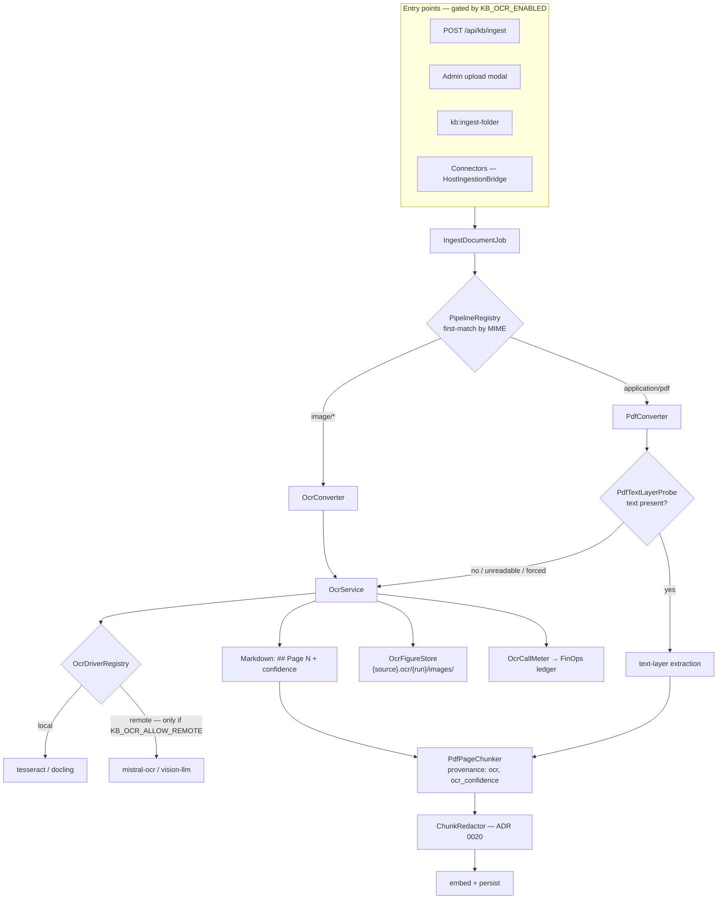

## Motivation

Until v8.36, AskMyDocs read what a file *said it contained*. `PdfConverter`
extracted the PDF text layer; `SourceType` knew Markdown, text, PDF and DOCX
and nothing else. That is the right posture for a knowledge base fed by wikis
and repositories — and the wrong one the first time a scanned contract arrives
as an IMAP attachment. The text layer is empty, the document ingests as
nothing, and an image is a `422 Unsupported file type`.

A competitor audit ([Annota AI](https://github.com/lopadova/AskMyDocs/blob/main/docs/v4-platform/AUDIT-2026-09-11-annota-ai-gap.md))
named this the one seam where a data-preparation product was ahead of us:
*file → reviewed Markdown*. The v8.36 cycle closes it in two steps. This page
is the first: **OCR as a converter**, with the same idempotency, provenance,
PII and cost discipline every other entry point already has.

<Note>
Everything on this page is **off by default** (`KB_OCR_ENABLED=false`, R43).
With the flag off the system behaves exactly as v8.35: images are refused at
every entry point and a scanned PDF ingests as an empty document. The design
rationale is [ADR 0029](https://github.com/lopadova/AskMyDocs/blob/main/docs/adr/0029-v836-ocr-converter-drivers-and-ocr-provenance.md).
</Note>

## Theory & background

OCR is not one problem. A text-less PDF, a phone photo of a whiteboard and a
300-dpi scan of a table each want a different engine, and the quality gap
between engines is wider than the gap between text-layer parsers:

| Engine class | Strength | Cost model | Where the bytes go |
|---|---|---|---|
| Classic (Tesseract) | Free, local, deterministic | CPU | Stay on the host |
| Layout-aware (Docling) | Tables, reading order, figures | CPU/GPU, local | Stay on the host |
| Hosted OCR API (Mistral OCR) | Best tables/layout, no infra | Per page | **Leave the tenant** |
| Vision LLM (Claude / Gemini / Regolo via `laravel/ai`) | Zero new infra, handles handwriting | Per token | **Leave the tenant** |

Two facts follow from that table and shape the whole design:

1. **The engine is a deployment decision, not a code decision** — so it is a
   driver behind a registry, selected by configuration, validated at boot.
2. **Two of the four engines send the document out of the tenant before any
   text exists** — so the PII seam that protects embeddings cannot protect
   the scan itself. That is a *final-egress* decision and needs its own switch.

A third fact is about trust. OCR output is a **guess with a confidence**.
Retrieval must know a chunk was machine-read (so a reviewer can find it, and
so a future review UI can heat-map it) without confusing that with *who
authored the document* — the [ingest provenance](/ingest-provenance) tier
that ADR 0028 uses to firewall untrusted text away from tools.

## Design



### One converter, one fallback, no overlap

`PipelineRegistry` resolves converters **first-match by MIME** and refuses
overlapping `supports()` predicates at boot (R23). A converter cannot look at
the bytes to decide, so "OCR when the PDF is scanned" cannot be a second PDF
converter. The split is therefore:

- Every entry point dispatches an image with its **exact** raster MIME
  (`image/jpeg`, `image/tiff`, `image/webp`, `image/png`) read from its
  **bytes**, never from the filename — the folder walker and the upload
  staging sniff the magic bytes (`FileTypeSniffer::imageMimeOf()`; a JPEG
  named `scan.png` is staged as `.jpg` and dispatched as `image/jpeg`),
  connectors with the MIME they carry — so the converter registry and
  `knowledge_documents.mime_type` name what the bytes are; the OCR drivers
  still read the magic bytes themselves before they build a data URL or pick
  an input format, so a declared label is never trusted for that.
- `OcrConverter` claims **only** the four image MIMEs (`image/png`,
  `image/jpeg`, `image/tiff`, `image/webp`) and only while the flag is on.
- `PdfConverter` stays the **sole** `application/pdf` match. When OCR is on it
  runs `PdfTextLayerProbe`, which decides **per page** over every page up to
  `KB_OCR_MAX_PAGES` (`KB_OCR_PROBE_PAGES=0`, the default; a positive value
  bounds the window and is a documented trade-off — a scanned page beyond it
  is not seen): a page with fewer than `KB_OCR_PROBE_MIN_CHARS` extractable
  characters that carries an image is a scanned page; one that only paints
  (drawn content with no text object behind it — text outlined into paths
  by a design export, a decorative rule) counts as scanned **only when no
  page has a text layer**, and beside typed pages is a divider; one that
  paints nothing is blank, a separator, never a reason to OCR by itself. No
  text page but at least one scanned or painted page is `empty`; text pages
  **and** image pages is `mixed` — a typed cover over scanned body pages —
  and the whole document is routed to OCR so no page is silently lost
  (reason `mixed_pdf`, the scanned page numbers recorded; a painted divider
  never promotes a text PDF to `mixed`, which would bill the whole document);
  otherwise `present` — including a window of blank pages alone, which is
  nothing to OCR and never a billed run over empty pages. `empty`, `mixed`
  and an ingest carrying
  `metadata.ocr.force = true` route the document to the same `OcrService`
  the image path uses. A file the parser cannot read at all (`unreadable`) is
  **not** treated as a scan: the converter first runs the `pdftotext` fallback
  it always had (`KB_PDFTOTEXT_BIN`, bounded by `KB_PDFTOTEXT_TIMEOUT` — a
  run past it is the deterministic `run_too_long` refusal of the document,
  never a silent hand-off to a billed OCR run, and the upload estimate says
  so before commit), keeps the text path when that yields text, and goes to
  OCR only when neither parser can read text from the file.
  "Yields text" is the probe's own per-page rule (`PdfTextFallback::hasText()`):
  at least one page with `KB_OCR_PROBE_MIN_CHARS` non-whitespace
  characters — several short pages that merely add up to the threshold are
  scanned pages and still go to OCR.
  The probe verdict — `present`, `empty`, `unreadable:pdftotext`,
  `unreadable:pdftotext_empty` or `unreadable:pdftotext_failed` — is recorded
  in `extractionMeta.text_layer_probe`.

Both paths end in `PdfPageChunker`, which now claims the `image` source type
too: one chunk per `## Page N`, so a citation like *"page 3 of contract.pdf"*
maps to exactly one row.

### Drivers and the egress switch

`OcrDriverRegistry` is built from `config('kb.ocr.drivers')` and validates at
boot that every FQCN implements `OcrDriver`. Two rules are enforced in
`resolve()`, not in prose:

- `fake` — the deterministic driver the test suite and the E2E harness use —
  is **refused in production**.
- A driver whose `isRemote()` is true (`mistral-ocr`, `vision-llm`) is refused
  unless `config('kb.ocr.allow_remote') === true`. The env value is cast with
  `FILTER_VALIDATE_BOOLEAN` and then compared strictly: the boolean-true
  spellings that filter accepts — `true`, `1`, `yes`, `on` (case-insensitive)
  — open the gate; everything else (`false`, `0`, `no`, `off`, an empty
  value, a typo) keeps the door **closed**.

The status surfaces report `remote: true|false` on every OCR'd document, so an
auditor can answer "did this scan leave our infrastructure?" per document.

The switch is necessary, not sufficient. Where the bytes go and how much of
them is bounded in code before any egress (SEC-LLM-001 gates 2 and 7):

- `vision-llm` resolves provider and model through `AiManager` — the same
  choke point every chat call passes — so the platform's provider policy
  applies unchanged and an unknown provider is a refusal, not a fallback.
- `tesseract` and `vision-llm` rasterise a PDF themselves with Poppler
  (`pdftoppm` + `pdfinfo`): the preflight (`OcrDriver::unavailableReason(forPdf)`)
  names a missing binary for a PDF — the estimate per staged PDF item, the
  status and re-run for a PDF document — while an image is never refused for
  a dependency it does not use. The page geometry `pdfinfo` reports is the
  only bound applied before the render, so it must be complete: a failed
  report, or fewer page sizes than the pages to render, is a refusal
  (`rendered_page_too_large`), never a render checked only afterwards.
- `mistral-ocr` posts a source image as is and `docling` decodes it as is,
  so both measure it against the same bounds the rasterising drivers apply
  to a rendered page — the pixel box `KB_OCR_RASTER_MAX_PAGE_PX` **and** the
  page byte cap `KB_OCR_RASTER_MAX_PAGE_BYTES` — before the request is built
  or the engine starts: a small file declaring bomb-sized dimensions, or one
  heavier than a page may weigh, never leaves and is never decoded
  (`rendered_page_too_large`). The upload estimate takes the same decision on
  the staged bytes, after the page-count and frame gates, so the modal states
  the refusal before commit instead of pricing a run that cannot start.
- `mistral-ocr` posts only to an `https` URL whose host is in the exact
  allow-list `KB_OCR_MISTRAL_ALLOWED_HOSTS` (default `api.mistral.eu,
  api.mistral.ai`), validates the response's content type and size, caps
  each returned figure at `KB_OCR_MAX_FIGURE_BYTES`, stores a figure under
  the format its **bytes** are (a blob that is no raster is dropped),
  validates every page entry (each one an object; every `index` a whole
  number inside the returned list, no number claimed twice — a duplicate
  would collide two figures on one path, an out-of-range one would persist
  a bogus page, a malformed entry is an invalid response, never one silently
  dropped from a result recorded as complete) and
  treats an empty page list as an invalid answer, never a recorded run of
  zero pages.
- A remote driver's **response** is validated against the same page number
  the input cap admitted: more pages than the document has is an invalid
  answer — discarded before anything is stored, recorded or metered — so
  the cap bounds response-side storage and spend, not only egress.
- The persisted Markdown may cite only the figures the driver extracted and
  the store wrote (`images/fig-{page}-{n}.{ext}`). Every other image link in
  an engine's, a provider's or a model's output — an unmatched placeholder,
  an external URL, a path that is not there — becomes an italic text
  description (`OcrMarkdown::stripForeignImageLinks()`, one rule for every
  driver), so a document never loads an arbitrary URL through the Markdown
  renderer and never cites a missing file.
- Every run — local or remote — is refused **before** the driver starts when
  the document exceeds `KB_OCR_MAX_PAGES` (counted by the probe's parser) or
  `KB_OCR_MAX_BYTES`; the refusal carries a machine-readable reason
  (`too_many_pages` / `too_many_bytes`) that the estimate shows in advance.
  A multi-page TIFF counts every frame as a page, and a driver that hands
  an image to its engine as **one** picture (`tesseract`, `vision-llm`,
  `mistral-ocr`) would be billed for all of them and transcribe the first:
  such a driver refuses a multi-frame TIFF outright (`multi_frame_image`,
  shown by the estimate too — split it into one image per page); `docling`
  decodes every frame itself and accepts it.
- A PDF the parser cannot read has no verified page count — the probe reports
  a `/Type /Page` object count as a **floor** (`pages_exact: false`), and a
  lower bound cannot enforce a maximum. Such a document runs only where the
  work is **bounded by construction**: never on a **remote** driver (refused
  before any byte leaves, reason `pages_uncountable`, shown by the estimate
  too), nor on a local driver that hands the whole file to its engine
  (`docling` — same reason), and among local drivers only on those that render page by page —
  `tesseract` rasterises with `pdftoppm -l KB_OCR_MAX_PAGES`, so the file
  renders at most the cap whatever its object table claims, each page under
  the driver's timeout; `docling` hands the whole file to its engine and is
  refused the same way, and `vision-llm`, which also rasterises page by page,
  is a remote driver and is refused before egress like `mistral-ocr`. Where it runs, the estimate marks the
  price as inexact.

### Same bytes, same driver, no second bill

A run directory is immutable, so its first write is **reserved atomically**: a
cache lock on the directory is held from the recorded-run check through
`result.json`, with a lease sized per run from the driver's declared worst
case for the verified page count (`OcrDriver::maxDurationSeconds()` — per-page
timeouts multiply, per-document timeouts count once) plus a write margin,
never below 1 200 s — so the lease is provably longer than the work it
protects, and a worker that dies mid-run blocks the directory for at most the
time its run could legitimately have taken. A second worker ingesting the same bytes at the same time waits
for it, looks again, and reuses the run the first worker recorded — one bill,
one directory, never two nondeterministic remote results interleaved in it. A
forced re-run has its own attempt identity and never touches a recorded run.
A recorded run is looked up by the driver's **identity** (name, fingerprint,
capabilities), not by its availability: identical bytes re-ingested after a
deployment that switched remote egress off, or lost a binary, still reuse the
run that driver recorded — a reuse is a read, no egress, no bill — and the
egress gate / availability check applies only when a driver call is actually
needed. The run key also carries `KB_OCR_MAX_PAGES` (a page-by-page driver on
an unverified PDF records at most the cap), so a changed cap is a new run.
The **write phase** of a run (figures + `result.json`, never the driver call)
and a purge of the `{source}.ocr/` directory exclude each other on a second,
per-directory lock: a purge holds it for the whole removal and re-checks the
directory before deleting it, so a run that starts writing after the purge
enumerated an empty directory is never deleted with its parent; a purge that
finds the lock held defers to the next sweep. The **queue timeout** of the
ingest job follows the same worst case: an image or a PDF while OCR is on is
dispatched with `IngestDocumentJob::$timeout` sized from the configured
driver's `maxDurationSeconds(KB_OCR_MAX_PAGES)` capped by the run budget
`KB_OCR_JOB_TIMEOUT` (the driver enforces it), plus the lease margin
(`OcrService::jobTimeoutFor()`), never the 300 s default that would kill a
Docling call or a page-by-page run its lease still reserves; text, Markdown
and every ingest with OCR off keep 300 s. The run key also carries the
figure caps (`KB_OCR_MAX_FIGURE_BYTES`, `KB_OCR_MAX_FIGURES`,
`KB_OCR_MAX_FIGURES_TOTAL_BYTES`): a changed cap is a new run, never a
reused result that exceeds today's limit or lacks the figures it would admit.

A recorded run lives at `{source}.ocr/{run}/result.json` next to its figures.
When the same bytes arrive again through the same driver — an identical
re-ingest, an IMAP backfill, a GitHub-Action full sync — `OcrService` reuses
the recorded pages instead of calling the driver: no spend, no FinOps row, the
document metadata says `reused: true`. The run key embeds the engine — driver
name, its fingerprint (model, language, DPI, the executables a local driver
runs — `tesseract`, `pdftoppm`, `pdfinfo`, the full `docling` path) and the
caps that shape the output (the page cap, the raster bounds, the figure
switch and budget) — so the same bytes through another engine are a
different, immutable run, switching the model never serves stale text, and a
lowered cap never reuses a run recorded under a wider one. `kb:ocr` (`metadata.ocr.force`)
bypasses the reuse on purpose; a run whose figures went missing is re-done.

Two consequences are stated, not hidden. First, `result.json` is the **raw**
OCR text on the KB disk: it follows the source file's posture (ADR 0020 keeps
the vector store, not the disk, as the protected surface), sits under the
same ACL, and is purged with the source — the redacted text lives only in
the chunks. A deployment that must not hold raw OCR text beside its scans
sets `KB_OCR_REUSE_ENABLED=false`: every ingest then runs the driver, records
no `result.json` and is a **new run with its own attempt identity** (its own
`{run}` directory, like a forced re-run), so a re-ingest never rewrites the
figures a previous document version still references; and, exactly like a
forced re-run, that fresh run **replaces in place** the byte-identical
version it re-produced (`OcrService::isFreshOcrRun()` drives
`replaceExisting` on both ingestion paths), so the row always names the run
that was billed and the superseded run is left for the sweep — that knob governs the
recorded run (the raw OCR text and its reuse) only; figures follow
`KB_OCR_FIGURES_ENABLED` and the retention mode, so a deployment that must
hold no OCR asset at all beside its scans turns figures off too — and the
same happens by policy when the effective `KB_SOURCE_RETENTION` is
`reference_only` — once `KB_CONVERSION_ARTIFACTS_ENABLED` wires the
retention mode; with that flag off the knob stays the inert foundation it
was, and figures and reuse are unchanged (R43) — the mode that promises no
local copy at all: no run is recorded, no figure is stored, the Markdown
carries no `images/` reference (ADR 0029 §5, ADR 0030 §3). Second, on a shared disk two tenants with the same source
key and bytes share the run: the second tenant's ingest is `reused: true`
and carries no FinOps row — no data crosses (both already hold the bytes),
but the first tenant carries the cost; a deployment that isolates tenants by
disk or prefix isolates the runs with them.

### Provenance — two orthogonal facts

| Fact | Where | Values | Who sets it |
|---|---|---|---|
| **Authorship** — `provenance_tier` | `knowledge_documents` column | `trusted-internal` · `untrusted-external` · `machine-generated` | The connector (ADR 0028). OCR never writes it. |
| **Extraction origin** | `metadata.converter.provenance` on the document; `metadata.provenance` + `metadata.ocr_confidence` on every chunk | `ocr` (absent for text-layer extraction) | `OcrService` / `PdfPageChunker` |

The tool firewall keeps filtering on the first. The second is what a review
UI (W3) and the wiki export (W4, frontmatter key `extraction`) read. Keeping
them apart is the difference between "this text was typed by an outsider" and
"this text was read by a machine from an insider's scan".

### Figures

Figures the engine extracts are written **at conversion time** through
`OcrFigureStore` — the Flow persists step outputs to the database, so binary
blobs cannot ride in `ConvertedDocument::mediaItems`; the store writes them
and `mediaItems` lists the paths. The layout is:

```
{prefix}/{dir}/{basename}.ocr/{run}/images/fig-{page}-{n}.png
```

`{run}` is the full 64-hex `sha256(bytes · driver name · variant)`, where the
variant is the driver's `fingerprint()` plus the page cap (`;pages=N`), the
raster bounds (`;raster=<px>:<bytes>`), the figure switch and budget
(`;figures=0` or `;figures=1:<bytes>:<count>:<total>`) and, for a forced
re-run or a run with reuse off, a fresh per-attempt salt (`;attempt=…`) — so
such a run is a new immutable directory, never the recorded one rewritten. A
truncated digest would be an identifier two different inputs could share, and
one run directory would then serve the wrong text.
Two versions of the same source path therefore never overwrite each
other's pixels, a re-run on identical bytes lands on the same directory (the
same idempotency the ingest itself has), and a stored artifact (W2) can point
at the run that produced it. The Markdown references `images/fig-3-1.png`
relative to the run directory — the shape the wiki export copies verbatim.

The assets share the source file's lifecycle: a soft delete keeps them, the
hard delete of the last row referencing the source removes the whole `.ocr/`
directory through the same reference gate `DocumentDeleter` already applies to
the file.

### PII

`ChunkRedactor` ([ADR 0020](https://github.com/lopadova/AskMyDocs/blob/main/docs/adr/0020-pii-redaction-before-embedding.md))
runs unchanged on the OCR output before embedding — scans are where the
*codici fiscali* live. Note what it does **not** cover: the pixels of a figure,
and the bytes a remote driver received. The first is why figures stay on the
KB disk behind the same ACL as the source; the second is why the egress switch
exists.

### Cost — metered, and estimated before commit

Every OCR run is a FinOps line item with `purpose_tag = ocr`:

- locally-priced drivers (`tesseract`, `docling`, `mistral-ocr`) are metered by
  `OcrCallMeter` as `pages × KB_OCR_RATE_PER_PAGE` in the FinOps base currency;
- `vision-llm` is metered **per token by the `laravel/ai` lifecycle hook**, like
  any chat call, and is deliberately not double-counted by the page meter.

The upload modal asks `GET /api/admin/kb/uploads/{batch}/estimate` in the
review step — before commit — and shows how many files and pages would be
OCR'd, with which driver, at what estimated cost — for a `per_page` driver;
for an Sdk-metered driver (`vision-llm`) the response says `metering: sdk`,
carries no page price (`rate_per_page` and every `cost` are `0`) and the modal
says the provider meters tokens, so no page price is ever invented. The estimate reads the
staged bytes and runs the probe; it never runs a driver, so it is free. It
With the flag off the estimate still probes each staged PDF: one with a text
layer answers `text_layer_present` (it is ingested as text either way), only
an image or a scan is `ocr_disabled` — the OFF answer is honest, never
"every PDF would need OCR" (R43). The flag is read again at **commit**, not
only at staging: an image staged while OCR was on and committed after a
deployment turned it off is refused before the move (item failed with
`ocr_disabled`), never moved and dispatched only for the converter to refuse
it. It
also says when the run would be refused (`driver_available: false` — a remote
driver with the knob off, a missing binary — or a file over the page/byte
caps, or a staged object whose bytes are no raster — or no PDF — any more,
`unrecognised_bytes`), so the modal never promises a run the server will not
perform (R14). The driver verdict is per **kind** of input: every item carries
its own `driver_available` (a PDF needs the rasteriser's Poppler binaries, an
image does not), the batch flag is false as soon as one staged item that
**needs** the driver (it would OCR, or OCR itself refused it) is blocked —
a text PDF or a text file never blocks a batch — and the modal names only
the files that would fail while still quoting the ones the driver can take. The modal's file picker filters on the extensions
`GET /api/auth/me` delivers under `kb_upload.accepted_extensions` — the
backend's `SourceType::knownExtensions()`, images only while OCR is on —
so the SPA keeps no second list of formats (R18).

## Conversion artifacts on the Time Machine (W2, ADR 0030)

The v8.7 Time Machine browsed, diffed and restored *versions* — but a version
was a `knowledge_documents` row plus its chunks, so "diff" meant a diff of two
chunk **reconstructions** (the indexed body, redacted, re-joined with blank
lines), never of the document itself. W2 stores the exact Markdown the chunker
received, per version, and makes every read of the Time Machine prefer it.

```mermaid
flowchart LR
    C[Converter output<br/>markdown] --> T[temp file<br/>final.uuid.tmp]
    T --> X{DB transaction<br/>row + chunks<br/>markdown_path = final}
    X -- commit --> M[move temp → final<br/>.artifacts/{tenant}/{project}/{path}.versions/{hash}.md]
    X -- rollback --> D[discard own temp only]
    M --> R[contentFor: artifact]
    R --> DF[diff · content · restore]
    N[row without artifact] --> RC[contentFor: reconstruction]
    RC --> DF
```

- **One core, both paths.** The write lives in `DocumentIngestor`'s shared
  persistence (`persistDrafts()` for the Flow saga, `persistFromDrafts()` for
  the direct path): the temp file is written **before** the transaction, the
  row commits with `markdown_path` pointing at the final path, and the move
  happens **after** commit. A rollback discards this attempt's temp and nothing
  else; a concurrent identical ingest that already published the same bytes
  wins — the final is re-hashed against the temp (the path *is* the content
  hash; a truncated or replaced final is overwritten by the verified temp,
  never kept) and the loser drops its own temp. A publish that **fails**
  after commit keeps the pointer (state `missing`, never rolled back) and
  **throws** `ArtifactPublishFailedException`: the ingest job retries, and the
  retry — an identical re-ingest — repairs the pointer through the same-hash
  path; a connector sync reports a failed document, never a silently degraded
  one. The retry is a **new** flow run (the job salts its idempotency key per
  attempt, so a persisted failed run is never handed back to the attempt meant
  to repair). On the direct path the canonical indexer is dispatched before the
  publish; on the Flow saga the failed `persist-chunks` step skips the indexer
  step of that attempt and the repairing retry runs it. A writer holds a cache
  **lease** on its temp (`KB_CONVERSION_ARTIFACTS_TMP_LEASE`, the primary
  guard — at least the age threshold) from the write to the publish or
  discard, so the temp sweep never removes a file a live writer is about to
  move into place.
- **The key is tenant- and project-namespaced, as safe segments.** A segment
  is used verbatim only when it matches `^[A-Za-z0-9][A-Za-z0-9._-]{0,119}$`,
  and does not start with the reserved `h-` prefix; otherwise it becomes `h-` +
  the full 64-hex SHA-256 of the value (injective: a verbatim segment can never
  spell an encoded one); the composed
  path is normalised and must stay inside `.artifacts/`, which the folder
  walker and the orphan sweeps never read back as a source.
- **Three nullable columns** record the version's provenance:
  `version_actor` (`user:{id}`, `system:ingest`, `system:ocr`, …),
  `version_reason` (free text, 1024 chars) and `content_hash` (SHA-256 of the
  stored artifact, recorded when it is written: equal to `document_hash` by
  construction on every ingested version — a correction is an ordinary new
  version with its own hashes — and null where no artifact is stored; it is
  the integrity check on the stored bytes, not a second identity). The actor is **derived
  server-side**: the HTTP ingest and connector boundaries strip any
  client-supplied `version_actor`, and the trusted caller sets it (the
  authenticated principal for `POST /api/kb/ingest` and `restore`, the CLI /
  connector default `system:ingest`, `system:ocr` for a `kb:ocr` re-run).
- **Reads prefer the artifact and say so.** `contentFor()` returns the stored
  Markdown when the row has one and the file is there, otherwise the chunk
  reconstruction; `diff` reports `from_source` / `to_source` (`artifact` |
  `reconstruction`, additive keys) and `from_integrity` / `to_integrity`
  (`verified` · `mismatch` · null) so the UI labels a diff *faithful* only
  when both sides are stored documents **verified** against their recorded
  hashes, *stored but not verified* when both are stored documents but a side
  has no `content_hash` to check against (a legacy pointer), and an *index
  diff* whenever a side is reconstructed. A
  missing file behind a non-null `markdown_path` is logged and degrades, never
  a 500.
- **Restore keeps the creation provenance and records itself apart.**
  `version_actor` / `version_reason` say who *created* the version and never
  change; a restore appends `{actor, at, previous_live_id}` to
  `metadata.restores` and the versions surfaces expose the last one as
  `restored_by` / `restored_at` (additive). The artifact is left untouched.
- **A tampered artifact is never served as faithful.** `content_hash` is the
  integrity check of the stored bytes: `contentFor()` re-hashes what it reads
  and, on a mismatch, logs, falls back to the reconstruction and says so
  (`integrity: mismatch` on the content endpoint, `from_integrity` /
  `to_integrity` on the diff; `verified` when the hash matched, `null` when
  there was nothing to check against). A stored pointer must already be
  canonical (no `.`/`..`, no `//`, no `\\`) or it is refused on every disk —
  on an object store that lexical check is the whole check; on a local disk
  every read, delete and publish also resolves the real path and refuses one
  that a symlink under `.artifacts/` makes resolve outside the root, and
  containment is asserted before any existence probe.
- **`markdown_only` honours every row's contract.** Each row records the mode
  it was ingested under (`metadata.source_retention`); a shared original is
  dropped only when every row referencing that storage key — any tenant,
  trashed included — was ingested under a mode that does not require it and
  has its artifact present on disk. A `full_copy` row (or a pre-v8.36 row
  without the stamp, which counts as `full_copy`) blocks the drop; a
  `reference_only` row never needed the local source. The stamp is host-owned
  — `source_retention` / `source_dropped` sent by a client or a connector are
  stripped like `version_actor`, an unknown value resolves to the configured
  mode — and the drop is gated on the row's **own** stamp, never on the
  configured mode of the day: a `full_copy` version re-embedded after
  `KB_SOURCE_RETENTION` moved to `markdown_only` keeps its original, and a
  version being replaced (a forced re-embed, a fresh OCR run) keeps the
  contract it was born under — `full_copy` for a pre-v8.36 row without a
  stamp; only a new version gets the configured mode, and with the artifacts
  flag off it is stamped `full_copy` (nothing was stored, dropped or
  withheld).
- **Retention follows `KB_SOURCE_RETENTION`.** `full_copy` (default) stores
  the artifact next to the original; `markdown_only` stores it and drops the
  original binary after the artifact commit (a Markdown source is its own
  artifact and is never dropped); `reference_only` stores nothing.
- **Erasure covers it.** A hard delete removes the row's artifact; the prune
  removes it with each pruned version, purges the OCR run directories no
  remaining version references, and sweeps temp leftovers older than
  `KB_CONVERSION_ARTIFACTS_TMP_MAX_AGE` that no live writer leases (a leased
  temp is reported `artifact_temps_in_flight`, whatever its age) plus artifacts no row (trashed rows
  included) references any more. Both sweeps are deliberately **cross-tenant**
  (the root is one shared tree; a file is deleted only at zero references
  across every tenant) and cover the configured `KB_FILESYSTEM_DISK` / `KB_PATH_PREFIX`
  namespace plus every `(metadata.disk, metadata.prefix)` a row with an
  artifact pointer recorded (a disk this deployment cannot resolve is counted
  as `artifact_namespaces_skipped`, see below). A soft delete leaves the
  artifact in place.
- **`markdown_only` keeps the sweeps honest.** The original is dropped only
  when every row referencing that storage key — any tenant, trashed rows
  included — already has an artifact (a shared disk can hold the same key for
  two tenants); the rows are then stamped `metadata.source_dropped`, so
  `kb:ingest-folder --prune-orphans` never reads the missing file as an orphan,
  and a PII-policy re-embed (`kb:reembed-project`) reads the artifact instead.
  The backfill applies the same contract: once a row's artifact is verified
  (written by this run, or already there) a `markdown_only` row's original goes
  through the same gate and the rows are stamped — `full_copy` rows keep
  theirs, `--dry-run` never drops, and the summary line counts what went
  (`originals_dropped`).
- **Backfill is operator-only and judges each row on its own contract.**
  `kb:artifacts-backfill` walks every live row: a row stamped
  `reference_only` is `intentionally_missing` whatever `KB_SOURCE_RETENTION`
  says today (a row without the stamp predates v8.36 and counts as
  `full_copy`, so a `full_copy` history is still backfilled after the knob
  moved); a pointer whose file is readable and hashes to `document_hash` is
  `already_stored`; any other row — no pointer, or a pointer whose file is
  missing or corrupt — is re-converted and gets its artifact only when the
  reconversion hashes to the row's `document_hash` (`hash_mismatch` is
  reported and nothing is written — an artifact must agree with the version's
  chunks); a missing source is reported, not invented. An identical re-ingest
  with the flag on repairs or publishes a version's artifact the same way.

The artifact is the converter's output **before** the PII seam. That is why
it is readable only through the role-gated admin Time Machine surfaces and
why `KbDocumentVersionsTool` returns metadata only: an MCP read of the content
(or a diff of two) would hand the model un-redacted text. The agent-facing,
redacted rendering of artifacts is the W4 export.

## Data model / contract

Three nullable columns on `knowledge_documents` (`version_actor`,
`version_reason`, `content_hash`, mirrored in the SQLite test migrations) plus
the `markdown_path` column ADR 0014 already declared; everything else lands in
JSON columns that already exist:

**`knowledge_documents.metadata.converter`** (excerpt)

```json
{
  "converter": "pdf-converter",
  "extraction_strategy": "ocr",
  "provenance": "ocr",
  "page_count": 3,
  "text_layer_probe": "empty",
  "ocr": {
    "driver": "docling",
    "remote": false,
    "reason": "scanned_pdf",
    "run": "9f2c1a7b0d4e6f81",
    "reused": false,
    "pages": [{ "number": 1, "confidence": 0.93, "figures": 1, "chars": 1840 }],
    "mean_confidence": 0.91,
    "min_confidence": 0.86,
    "figures": 2,
    "figures_dir": "contracts/acme.pdf.ocr/9f2c1a7b0d4e6f81",
    "engine": "docling 2.x",
    "ran_at": "2026-09-12T10:00:00+00:00"
  }
}
```

**`knowledge_chunks.metadata`** gains `provenance: "ocr"` and
`ocr_confidence` (the page's confidence) next to the existing `page`.

**Configuration** (`config/kb.php` → `ocr`, env in `.env.example`)

| Env | Default | Meaning |
|---|---|---|
| `KB_OCR_ENABLED` | `false` | The switch. Gates every entry point and the PDF fallback. |
| `KB_OCR_DRIVER` | `tesseract` | `tesseract` · `docling` · `mistral-ocr` · `vision-llm` · `fake` (non-production only) |
| `KB_OCR_ALLOW_REMOTE` | `false` | Final-egress policy for `mistral-ocr` / `vision-llm`. Parsed with `FILTER_VALIDATE_BOOLEAN`: `true`, `1`, `yes` or `on` (case-insensitive) open the gate; any other value — including a typo — is closed. |
| `KB_OCR_PROBE_PAGES` / `KB_OCR_PROBE_MIN_CHARS` | `0` / `20` | Text-layer probe: `0` probes every page up to `KB_OCR_MAX_PAGES` (per-page verdict, `mixed` routes to OCR); a positive value bounds the window. A page under the threshold that carries an image is a scanned page. |
| `KB_PDFTOTEXT_BIN` | `pdftotext` | Poppler binary the PDF converter falls back to before OCR when smalot cannot parse a file. |
| `KB_PDFTOTEXT_TIMEOUT` | `60` | Seconds one `pdftotext` run may take. The fallback runs before OCR (and in the upload estimate), outside any OCR run budget, so a malformed PDF could otherwise hold a worker or the estimate indefinitely; a run past it is refused as `run_too_long` — deterministic, never retried, never handed to OCR. |
| `KB_OCR_RATE_PER_PAGE` | `0.004` | Per-page rate for locally-priced drivers and the estimate. |
| `KB_OCR_FIGURES_ENABLED` | `true` | Write figures to `{source}.ocr/{run}/images/`. |
| `KB_OCR_JOB_TIMEOUT` | `3600` | Wall-clock budget of one OCR run, enforced by every driver (`OcrRunBudget`: a page-by-page engine bounds each process — `pdfinfo`, `pdftoppm`, every page, every provider call — by what is left when it starts and stops with `run_too_long` once it is spent; a whole-file engine's timeout is capped by it, and a spent budget grants no "one more second": `bound()` itself refuses, so a whole-file or remote call sized from it can never start after the budget expired). Any process or provider call that hits its timeout is the same terminal `run_too_long` (the same page would time out again), never a generic error the job retries. The run lease, the ingest job timeout (`OcrService::jobTimeoutFor()`) and the re-run lock are all derived from it, so the queue's `retry_after` (`REDIS_QUEUE_RETRY_AFTER` / `DB_QUEUE_RETRY_AFTER`) only has to exceed this budget plus its margins (~520 s) — a shorter value is logged at every dispatch it endangers, because Laravel would re-reserve a still-running job on another worker. |
| `KB_OCR_MAX_PAGES` / `KB_OCR_MAX_BYTES` | `200` / `26214400` | Refuse before any driver runs; reasons `too_many_pages` / `too_many_bytes`. Pages are counted format-independently (PDF parser, TIFF frames, 1 for other images); an unparseable PDF has only a floor and is refused for a remote driver with `pages_uncountable`. The same gate verifies the bytes against the declared type (a `%PDF-` header, or a PNG / JPEG / TIFF / WebP signature) for **every** ingress — upload, JSON ingest, folder walk, connector — and refuses anything else with `unrecognised_bytes`, so no driver, remote or local, is ever handed a mislabelled file. A multi-frame TIFF is refused with `multi_frame_image` by every driver that transcribes one frame per image (`tesseract`, `vision-llm`, `mistral-ocr`; `docling` accepts it). `KB_OCR_MAX_BYTES` bounds the **source file**; what a page renders to is bounded separately (next row). |
| `KB_OCR_RASTER_MAX_PAGE_PX` / `KB_OCR_RASTER_MAX_PAGE_BYTES` | `6000` / `10485760` | Bounds a page must fit — a rendered page for the page-by-page drivers (`tesseract`, `vision-llm`), a source image decoded or posted as is for `docling` / `mistral-ocr` (and the same refusal in the upload estimate); both are part of the run identity, so lowering either never reuses a run recorded under a wider bound. For the rasterising drivers: the render DPI is lowered from the page geometry `pdfinfo` reports so that no page's long side exceeds `PX` pixels (a small file can declare a 200-inch page; one that cannot fit at 50 DPI is refused before rendering), the produced PNG is re-measured, and a rendered page over either bound is refused with `rendered_page_too_large` **before** it is decoded locally or posted to the vision provider. `KB_OCR_PDFINFO_BIN` names the `pdfinfo` binary (poppler-utils, beside `pdftoppm`). |
| `KB_OCR_MAX_FIGURE_BYTES` | `10485760` | Largest figure a driver may hand back. |
| `KB_OCR_MAX_FIGURES` / `KB_OCR_MAX_FIGURES_TOTAL_BYTES` | `200` / `104857600` | Aggregate figure budget of one run (count / total bytes): every accepted figure is held in memory until the run is recorded, so a document inside the page and byte caps must not carry an unbounded number of sub-cap figures. A figure past the budget is omitted before it is read (the Markdown says so). The caps (this budget and `KB_OCR_MAX_FIGURE_BYTES`) are re-checked by `OcrService` on what every driver returns, before anything is stored, recorded or metered: a result over them is an invalid driver result and is discarded (`figure_budget_exceeded`, terminal — never a retry that would pay for the same answer), so the limits hold for a driver that did not apply them itself. |
| `KB_OCR_RUN_LOCK_WAIT` | `300` | Seconds a worker waits for the reservation of a run directory another worker is writing before letting the job retry; the recorded run is then reused. Needs an atomic lock store (Redis) in production. |
| `KB_OCR_REUSE_ENABLED` | `true` | Record each run at `{source}.ocr/{run}/result.json` and reuse it for identical bytes through the same engine. Off: nothing is recorded and every ingest is a new run with its own attempt identity (own `{run}` directory), never a rewrite of a previous run's figures. |
| `KB_OCR_PURGE_GRACE_SECONDS` | `1800` | Seconds a recorded run counts as in flight: it is recorded before the row that references it commits, so a hard delete or the orphan sweep that finds no referencing row inside this window keeps the run instead of removing the figures a row is about to point at; `kb:prune-orphan-files` removes an unreferenced run once it has aged past it — under the run's own reservation, so a run a worker is reusing at that moment is never taken — and, while OCR is on, sweeps orphan **image** sources (a failed first ingest) together with the tree beside them, as it does orphan Markdown files. A source file is an orphan of the swept namespace when no row's **recorded** disk and prefix (`metadata.disk` / `metadata.prefix`) resolve to it there — the same test the dangling-tree check applies — so a row carrying the same logical path on another disk or under another prefix never protects a file (or the tree beside it) in this one. A row that never recorded its disk (`metadata.disk`, ingested before the namespace was persisted) protects the file on its path wherever any deleting consumer looks — the orphan sweep, the dangling-tree sweep, the connector bridge, the hard delete: deletion fails closed and never guesses a disk. The decision is taken over the whole table, whatever the caller may read (the admin command runner executes the sweep under the caller's project scope). The sweep recognises a tree by the store's layout (`{source}.ocr/{64-hex run key}/result.json` or `…/images/…`): a directory that merely ends in `.ocr` holding ordinary sources is never mistaken for one. |
| `KB_OCR_MISTRAL_ALLOWED_HOSTS` | `api.mistral.eu,api.mistral.ai` | Exact host allow-list for the Mistral endpoint (https, port 443 only). |
| `KB_OCR_MISTRAL_TIMEOUT` / `KB_OCR_MISTRAL_MAX_RESPONSE_BYTES` | `120` / `67108864` | Request timeout and response size cap. |
| `KB_OCR_VISION_TIMEOUT` | `300` | Per-document timeout of the vision driver (rasterisation + calls). |
| `KB_CONVERSION_ARTIFACTS_ENABLED` | `false` | W2 / ADR 0030 — store the converted Markdown of every version at `.artifacts/{tenant}/{project}/{source_path}.versions/{version_hash}.md`. OFF writes nothing new; artifacts already stored keep being read. |
| `KB_CONVERSION_ARTIFACTS_TMP_MAX_AGE` | `3600` | Seconds after which `kb:prune-archived-versions` sweeps a `.tmp` a dead writer left beside an artifact — one no live writer holds the lease of. |
| `KB_CONVERSION_ARTIFACTS_TMP_LEASE` | `7200` | Seconds a writer's cache lease on its temp file lives (taken before the temp is written, released at publish or discard): a leased temp is never swept, whatever its age, so a slow transaction is not mistaken for a dead writer. The primary guard — must be at least `KB_CONVERSION_ARTIFACTS_TMP_MAX_AGE` (warned once when shorter); a non-positive value is the default, with a warning. Needs a lock-capable cache store (Redis in production); a store that cannot lock leaves the age threshold alone in charge, reported once, never an ingest outage. |
| `KB_CONVERSION_ARTIFACTS_SOURCE_LOCK_WAIT` | `10` | Seconds a row commit or a `markdown_only` drop waits for the storage key's lock (needs an atomic lock store — Redis — in production). |
| `KB_CONVERSION_ARTIFACTS_SOURCE_LOCK_TTL` | `60` | Seconds that lock lives when its holder dies. A value that is not a positive number of seconds (`0`, a negative, a non-number) is not a shorter lock: the default applies and a warning says so once per ingest. |
| `KB_VERSIONS_TIMELINE_LIMIT` | `100` | The most versions a Time Machine listing (HTTP `?limit=`, MCP `limit`, CLI `--limit`) hydrates and verifies per call (R3); every surface pages with an offset (`?offset=`, `offset`, `--offset`) and returns the family `total` and `truncated` when it holds more than the page reaches — the UI offers "Load older versions". A non-positive value is the default, with a warning. |
| `KB_SOURCE_RETENTION` | `full_copy` | `full_copy` · `markdown_only` (drop the original binary after the artifact commit) · `reference_only` (no artifact, no `.ocr/` run — the mode governs the derived data; the source a copy-based entry point wrote stays, it is what a re-run reads from, `kb:prune-orphan-files` keeps it as referenced, and a `reference_only` row blocks a `markdown_only` sibling's drop of the shared original). Wired for the first time in v8.36. |

## Tri-surface (R44)

| Surface | Entry | Notes |
|---|---|---|
| PHP | `php artisan kb:ocr {document} [--status] --tenant=…` | `--status` prints driver, reason, pages, confidence; without it, queues a forced re-run through the standard `IngestDocumentJob` (`metadata.ocr.force = true`, a fresh Flow salt — reported as `flow_run_key`, distinct from the content-addressed OCR run key the row records once the job has run — so the Flow's idempotency does not collapse it; the host-only `ocr.force` / `ocr.rerun_lock` / `dry_run` keys drive that job and are stripped before the row is persisted, so a later ingest built from the document's metadata is never forced again). Refuses a blank `--tenant`; one re-run per document at a time — a second call while one is queued is refused (the HTTP surface answers 409), and the lock is released when the job finishes; its lease is derived from the job budget (`OcrService::rerunLockTtlFor()`: the driver's worst case plus the retry window), so a long page-by-page run never outlives its own lock and lets a second re-run start a duplicate paid run. |
| HTTP | `GET /api/admin/kb/documents/{id}/ocr` · `POST …/ocr` (202) · `GET /api/admin/kb/uploads/{batch}/estimate` | `role:admin\|super-admin`, R32 matrix row; tenant-scoped 404 for a foreign id. |
| MCP | `KbOcrStatusTool` | **Read-only by design.** Re-running a conversion spends money and rewrites grounding; by the cycle's invariant that is a human decision — a documented R44 exception. |

All three sit on `OcrService` (`status()`, `rerun()`); none re-implements the
lookup or the gating.

The Time Machine (W2) is tri-surface over `DocumentVersionService`:

| Surface | Entry | Notes |
|---|---|---|
| PHP | `php artisan kb:doc-versions {document} --tenant=… [--diff=FROM:TO]` · `php artisan kb:artifacts-backfill --tenant=… [--project=] [--dry-run]` | The list prints actor, reason, artifact and content hash per version; `--diff` prints an artifact-aware diff with the source of each side. The backfill is operator-only maintenance (a storage repair that re-converts): a documented R44 exception. Both refuse a blank `--tenant`. |
| HTTP | `GET /api/admin/kb/documents/{id}/versions` (bounded and paged: `?limit=&offset=`, `meta.total` / `meta.limit` / `meta.offset` / `meta.truncated`; now with `version_actor`, `version_reason`, `content_hash`, `has_artifact` — true only for a readable artifact whose bytes hash to `content_hash`, never the pointer alone — and `artifact_state`: `none` · `verified` · `unverified` · `missing` · `mismatch`) · `GET …/versions/diff?from&to` (now with `from_source`, `to_source`) · `GET …/versions/{versionId}/content` (new) · `POST …/restore-version` (now records the restore in `metadata.restores`, creation provenance untouched) | `role:admin\|super-admin`, R32 matrix row; the content endpoint is family-scoped (404 for a version outside the document's family). |
| MCP | `KbDocumentVersionsTool` | **Read-only, metadata only.** Diff and content have no MCP twin by design: the artifact is un-redacted converter output (documented R44 exception). |

## Decision rationale (ADR-style)

- **Why a fallback inside `PdfConverter` and not a content-aware resolver?**
  The registry's contract is MIME-only and mutex-checked; teaching it to open
  files would move a per-document decision into boot-time infrastructure and
  break the overlap guard that has caught real re-routing bugs (R23). The
  probe lives where the bytes already are.
- **Why is remote OCR a second switch and not part of `KB_OCR_DRIVER`?**
  Because selecting a driver is an operator convenience and sending documents
  to a third party is a data-subprocessor decision (SEC-LLM-001 gate 3). A
  setting is not a security boundary; the registry enforces the policy in code
  and fails closed on anything but `true`.
- **Why is the extraction origin not a `provenance_tier` value?** ADR 0028's
  tier answers "who wrote this" and drives the tool firewall; adding `ocr`
  there would either bypass the firewall for external scans or firewall
  internal ones. Two questions, two fields.
- **Why content-addressed figure runs?** Two tenants or two versions can share
  a source path; a fixed `images/` directory would let one conversion overwrite
  another's pixels and a purge remove the wrong asset. Hashing the input bytes
  makes the directory a function of the version, with re-run idempotency for
  free.
- **Why no MCP write?** "The agent proposes, a person confirms." OCR re-runs
  cost money and change what the model is grounded on; an agent may *see* the
  status and *ask*, not spend.
- **Why gate the connector bridge separately?** `HostIngestionBridge` hands
  connector files straight to the job, bypassing controller and staging
  validation. Without its own gate an image would be queued and die in
  converter resolution; with it the refusal is a recorded
  `connector_ingest_refused` audit event with `reason: ocr_disabled`.

Full text: [ADR 0029](https://github.com/lopadova/AskMyDocs/blob/main/docs/adr/0029-v836-ocr-converter-drivers-and-ocr-provenance.md).

## Worked example

A three-page scanned lease arrives twice — once dropped on the admin upload
modal, once as an IMAP attachment — on a deployment with `KB_OCR_ENABLED=true`,
`KB_OCR_DRIVER=docling`, `KB_OCR_ALLOW_REMOTE=false`.

1. **Upload modal.** The staged batch's review step calls the estimate:
   *"OCR will run on 1 file (3 pages) with the `docling` driver — estimated
   $0.012 at $0.004/page."* The operator commits.
2. **Job.** `PdfConverter` probes 3 pages, finds 0 characters, records
   `text_layer_probe = "empty"` and hands the bytes to `OcrService`.
   Docling returns three pages and one figure (a signature block).
3. **Disk.** `contracts/lease.pdf.ocr/1c9e…/images/fig-3-1.png` is written;
   page 3's Markdown references `images/fig-3-1.png`.
4. **Chunks.** Three chunks, `heading_path = "Page N"`, each with
   `provenance: ocr` and its page confidence. The tenant's PII policy replaces
   the tenant's codice fiscale with a surrogate before embedding.
5. **FinOps.** One ledger row, `purpose_tag = ocr`, `cost = 0.012`.
6. **IMAP.** The same attachment arrives through the connector. Same bytes →
   same `version_hash` → the ingest is the usual no-op. Had OCR been *off*, the
   bridge would have written `connector_ingest_refused` and confirmed the UID
   so the mailbox is not re-presented every sync.
7. **Audit.** `kb:ocr 4711 --status --tenant=acme` prints the driver, the
   reason `scanned_pdf`, three pages with their confidence and `remote: no`.

## Gotchas & operations

- **Turning artifacts on populates nothing by itself.** Rows ingested before
  `KB_CONVERSION_ARTIFACTS_ENABLED=true` keep diffing by reconstruction until
  their next identical re-ingest (which publishes the artifact for a
  pointerless row under its own retention contract) or a
  `kb:artifacts-backfill --tenant=…` run.
- **A "stored" badge is a verified claim.** `has_artifact` is derived from the
  same read + hash check the content endpoint uses and is true only for
  `verified`; `artifact_state` says `missing` or `mismatch` when the pointer no
  longer resolves to the recorded bytes (the UI shows a warning badge), and
  `unverified` for a legacy pointer without a `content_hash` — the next
  identical re-ingest or `kb:artifacts-backfill` records the hash and makes it
  `verified`; the backfill repairs the missing and mismatching rows.
- **`kb:artifacts-backfill --dry-run` never spends.** The dry-run marker rides
  the conversion, so a row that would need a fresh OCR run to verify is reported
  as `ocr_unverified` instead of run (a recorded run is still read back).
- **The `markdown_only` drop is serialized with writers.** The reference scan and
  the delete run under the storage key's lock the persist paths hold around
  their row commit (every non-Markdown commit while the flag is on, a
  `reference_only` version included since it still requires the shared
  original — nothing waits on it with the flag off, in a dry run or for a
  Markdown source), and a sibling
  artifact counts only when its bytes verify. Like the OCR run lock it needs an
  atomic lock store (Redis) in production; `KB_CONVERSION_ARTIFACTS_SOURCE_LOCK_WAIT`
  / `KB_CONVERSION_ARTIFACTS_SOURCE_LOCK_TTL` tune it (10 s / 60 s). The gate
  runs on every path that leaves a verified artifact behind — the fresh
  ingest, an identical re-ingest whose artifact was just verified, repaired or
  published for the first time, a `kb:artifacts-backfill` write — so an original re-uploaded after a drop, or
  kept because the key was locked, is dropped the next time round.
- **The sweeps cover every artifact namespace the corpus records.**
  `kb:prune-archived-versions` sweeps temps and orphans on the configured
  `(disk, prefix)` and on every `(metadata.disk, metadata.prefix)` a row with
  an artifact pointer recorded (one line per namespace when there is more than
  one; a disk this deployment cannot resolve is reported per namespace and
  counted as `artifact_namespaces_skipped` in the summary line, not swept). The
  stale-OCR-run gate of `kb:prune-orphan-files` judges all candidates of a
  namespace with one bounded query per 500 candidate `(source, run)` pairs,
  never one query per run.
- **A refused delete is a failed prune.** `kb:prune-archived-versions` reports
  `artifacts_failed` / `artifact_temps_failed` / `artifact_orphans_failed` /
  `ocr_failed` and exits non-zero when the disk refused a removal (or a
  planted symlink under `.artifacts/` stopped a sweep): the rows are gone,
  the bytes are not.
- **A version restored during the prune is never pruned.** Every candidate is
  re-read and locked in the deleting transaction and pruned only if it is
  still archived; a version a Time Machine restore activated between the
  selection and the delete is skipped and counted (`restored_meanwhile`,
  additive, printed when non-zero).
- **Turning it off is a stop, not a rollback.** Nothing already stored is
  discarded or hidden; `contentFor()` keeps reading it and the UI keeps saying
  *faithful* for those pairs.
- **`markdown_only` is a one-way choice per ingest.** The original binary is
  deleted once the artifact is committed; a later `kb:ocr` re-run of that
  document reports `source_missing`-class refusals because the scan is gone.

- **Enabling the flag does not re-process history.** Documents that ingested
  empty before v8.36 keep their empty text until re-ingested; `kb:ocr {id}`
  queues that per document.
- **Only a boolean-true spelling opens the egress gate.** `KB_OCR_ALLOW_REMOTE`
  accepts `true`, `1`, `yes` or `on` (case-insensitive, `FILTER_VALIDATE_BOOLEAN`);
  a typo or any other value keeps remote OCR closed, and the registry error
  says how to open it.
- **The estimate is a probe, not a promise.** It counts pages the driver will
  see; a driver may still skip an empty page, which is why the ledger row is
  written from the actual result.
- **A dry run costs nothing and writes nothing.** `Flow::dryRun()` of the
  ingest flow reaches the converter, but the OCR core sees the dry-run mark and
  returns a page-shaped preview instead of calling the driver: no remote
  egress, no `.ocr/` write, no ledger row. A run already recorded for those
  bytes is shown read-only. The preview shows what the run would do: for a
  PDF the parser could not count, a bounded local driver renders up to
  `KB_OCR_MAX_PAGES`, so the preview carries the cap's worth of `## Page`
  sections and that `page_count`, never the parser's floor.
- **Figures are not redacted.** They inherit the source's ACL and stay on the
  KB disk; the wiki export (W4) omits them under the tenant PII policy by
  default.
- **Docling and Tesseract are host binaries.** `KB_OCR_DOCLING_BIN`,
  `KB_OCR_TESSERACT_BIN` and `KB_OCR_PDFTOPPM_BIN` must resolve on the queue
  worker, not only on the web pod; `OcrDriver::isAvailable()` is reported by
  every status surface as `driver_available`, and `OcrDriver::unavailableReason()`
  names the cause (binary off PATH, missing API key, an endpoint outside
  `KB_OCR_MISTRAL_ALLOWED_HOSTS`) in the estimate error and the re-run 422 —
  a misconfiguration is refused at preflight, never queued to fail in the
  worker.
- **`fake` is refused outside `local` / `testing` / `development`.** The
  gate is an allow-list, so `APP_ENV=prod` or a misspelt name counts as
  production.
- **Tests and the E2E harness use `fake`**, which is refused in production —
  a `KB_OCR_DRIVER=fake` left in a production `.env` fails loudly at the first
  OCR, not silently with synthetic text.
