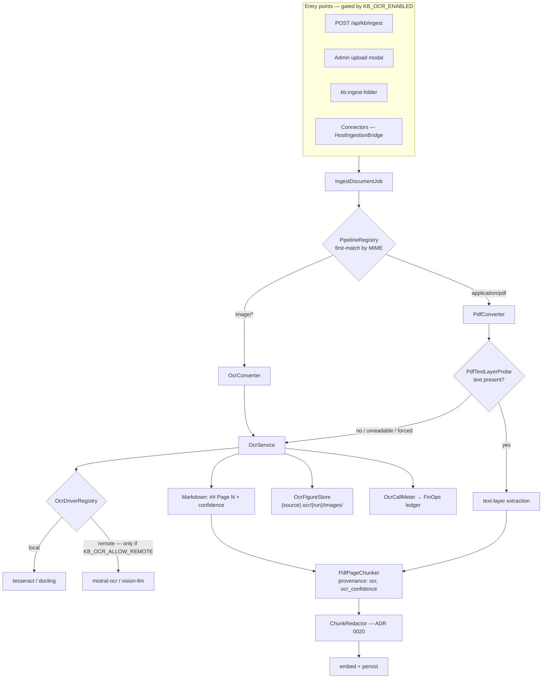

## Motivation

Until v8.36, AskMyDocs read what a file *said it contained*. `PdfConverter`
extracted the PDF text layer; `SourceType` knew Markdown, text, PDF and DOCX
and nothing else. That is the right posture for a knowledge base fed by wikis
and repositories — and the wrong one the first time a scanned contract arrives
as an IMAP attachment. The text layer is empty, the document ingests as
nothing, and an image is a `422 Unsupported file type`.

A competitor audit ([Annota AI](https://github.com/lopadova/AskMyDocs/blob/main/docs/v4-platform/AUDIT-2026-09-11-annota-ai-gap.md))
named this the one seam where a data-preparation product was ahead of us:
*file → reviewed Markdown*. The v8.36 cycle closes it in two steps. This page
is the first: **OCR as a converter**, with the same idempotency, provenance,
PII and cost discipline every other entry point already has.

<Note>
Everything on this page is **off by default** (`KB_OCR_ENABLED=false`, R43).
With the flag off the system behaves exactly as v8.35: images are refused at
every entry point and a scanned PDF ingests as an empty document. The design
rationale is [ADR 0029](https://github.com/lopadova/AskMyDocs/blob/main/docs/adr/0029-v836-ocr-converter-drivers-and-ocr-provenance.md).
</Note>

## Theory & background

OCR is not one problem. A text-less PDF, a phone photo of a whiteboard and a
300-dpi scan of a table each want a different engine, and the quality gap
between engines is wider than the gap between text-layer parsers:

| Engine class | Strength | Cost model | Where the bytes go |
|---|---|---|---|
| Classic (Tesseract) | Free, local, deterministic | CPU | Stay on the host |
| Layout-aware (Docling) | Tables, reading order, figures | CPU/GPU, local | Stay on the host |
| Hosted OCR API (Mistral OCR) | Best tables/layout, no infra | Per page | **Leave the tenant** |
| Vision LLM (Claude / Gemini / Regolo via `laravel/ai`) | Zero new infra, handles handwriting | Per token | **Leave the tenant** |

Two facts follow from that table and shape the whole design:

1. **The engine is a deployment decision, not a code decision** — so it is a
   driver behind a registry, selected by configuration, validated at boot.
2. **Two of the four engines send the document out of the tenant before any
   text exists** — so the PII seam that protects embeddings cannot protect
   the scan itself. That is a *final-egress* decision and needs its own switch.

A third fact is about trust. OCR output is a **guess with a confidence**.
Retrieval must know a chunk was machine-read (so a reviewer can find it, and
so a future review UI can heat-map it) without confusing that with *who
authored the document* — the [ingest provenance](/ingest-provenance) tier
that ADR 0028 uses to firewall untrusted text away from tools.

## Design



### One converter, one fallback, no overlap

`PipelineRegistry` resolves converters **first-match by MIME** and refuses
overlapping `supports()` predicates at boot (R23). A converter cannot look at
the bytes to decide, so "OCR when the PDF is scanned" cannot be a second PDF
converter. The split is therefore:

- Every entry point dispatches an image with its **exact** raster MIME
  (`image/jpeg`, `image/tiff`, `image/webp`, `image/png`) read from its
  **bytes**, never from the filename — the folder walker and the upload
  staging sniff the magic bytes (`FileTypeSniffer::imageMimeOf()`; a JPEG
  named `scan.png` is staged as `.jpg` and dispatched as `image/jpeg`),
  connectors with the MIME they carry — so the converter registry and
  `knowledge_documents.mime_type` name what the bytes are; the OCR drivers
  still read the magic bytes themselves before they build a data URL or pick
  an input format, so a declared label is never trusted for that.
- `OcrConverter` claims **only** the four image MIMEs (`image/png`,
  `image/jpeg`, `image/tiff`, `image/webp`) and only while the flag is on.
- `PdfConverter` stays the **sole** `application/pdf` match. When OCR is on it
  runs `PdfTextLayerProbe`, which decides **per page** over every page up to
  `KB_OCR_MAX_PAGES` (`KB_OCR_PROBE_PAGES=0`, the default; a positive value
  bounds the window and is a documented trade-off — a scanned page beyond it
  is not seen): a page with fewer than `KB_OCR_PROBE_MIN_CHARS` extractable
  characters that carries an image is a scanned page. No text page at all is
  `empty`; text pages **and** scanned pages is `mixed` — a typed cover over
  scanned body pages — and the whole document is routed to OCR so no page is
  silently lost (reason `mixed_pdf`, the scanned page numbers recorded);
  otherwise `present`. `empty`, `mixed` and an ingest carrying
  `metadata.ocr.force = true` route the document to the same `OcrService`
  the image path uses. A file the parser cannot read at all (`unreadable`) is
  **not** treated as a scan: the converter first runs the `pdftotext` fallback
  it always had (`KB_PDFTOTEXT_BIN`), keeps the text path when that yields
  text, and goes to OCR only when neither parser can read text from the file.
  "Yields text" is the probe's own per-page rule (`PdfTextFallback::hasText()`):
  at least one page with `KB_OCR_PROBE_MIN_CHARS` non-whitespace
  characters — several short pages that merely add up to the threshold are
  scanned pages and still go to OCR.
  The probe verdict — `present`, `empty`, `unreadable:pdftotext`,
  `unreadable:pdftotext_empty` or `unreadable:pdftotext_failed` — is recorded
  in `extractionMeta.text_layer_probe`.

Both paths end in `PdfPageChunker`, which now claims the `image` source type
too: one chunk per `## Page N`, so a citation like *"page 3 of contract.pdf"*
maps to exactly one row.

### Drivers and the egress switch

`OcrDriverRegistry` is built from `config('kb.ocr.drivers')` and validates at
boot that every FQCN implements `OcrDriver`. Two rules are enforced in
`resolve()`, not in prose:

- `fake` — the deterministic driver the test suite and the E2E harness use —
  is **refused in production**.
- A driver whose `isRemote()` is true (`mistral-ocr`, `vision-llm`) is refused
  unless `config('kb.ocr.allow_remote') === true`. The env value is cast with
  `FILTER_VALIDATE_BOOLEAN` and compared strictly, so `KB_OCR_ALLOW_REMOTE=1`,
  `yes` or a typo all keep the door **closed**.

The status surfaces report `remote: true|false` on every OCR'd document, so an
auditor can answer "did this scan leave our infrastructure?" per document.

The switch is necessary, not sufficient. Where the bytes go and how much of
them is bounded in code before any egress (SEC-LLM-001 gates 2 and 7):

- `vision-llm` resolves provider and model through `AiManager` — the same
  choke point every chat call passes — so the platform's provider policy
  applies unchanged and an unknown provider is a refusal, not a fallback.
- `tesseract` and `vision-llm` rasterise a PDF themselves with Poppler
  (`pdftoppm` + `pdfinfo`): the preflight (`OcrDriver::unavailableReason(forPdf)`)
  names a missing binary for a PDF — the estimate per staged PDF item, the
  status and re-run for a PDF document — while an image is never refused for
  a dependency it does not use. The page geometry `pdfinfo` reports is the
  only bound applied before the render, so it must be complete: a failed
  report, or fewer page sizes than the pages to render, is a refusal
  (`rendered_page_too_large`), never a render checked only afterwards.
- `mistral-ocr` sends a source image as is, so it measures it against the
  same pixel box the rasterising drivers apply to a rendered page
  (`KB_OCR_RASTER_MAX_PAGE_PX`) before the request is built — a small file
  declaring bomb-sized dimensions never leaves (`rendered_page_too_large`).
- `mistral-ocr` posts only to an `https` URL whose host is in the exact
  allow-list `KB_OCR_MISTRAL_ALLOWED_HOSTS` (default `api.mistral.eu,
  api.mistral.ai`), validates the response's content type and size, caps
  each returned figure at `KB_OCR_MAX_FIGURE_BYTES`, stores a figure under
  the format its **bytes** are (a blob that is no raster is dropped),
  validates the page numbering (every `index` a whole number inside the
  returned list, no number claimed twice — a duplicate would collide two
  figures on one path, an out-of-range one would persist a bogus page) and
  treats an empty page list as an invalid answer, never a recorded run of
  zero pages.
- A remote driver's **response** is validated against the same page number
  the input cap admitted: more pages than the document has is an invalid
  answer — discarded before anything is stored, recorded or metered — so
  the cap bounds response-side storage and spend, not only egress.
- The persisted Markdown may cite only the figures the driver extracted and
  the store wrote (`images/fig-{page}-{n}.{ext}`). Every other image link in
  an engine's, a provider's or a model's output — an unmatched placeholder,
  an external URL, a path that is not there — becomes an italic text
  description (`OcrMarkdown::stripForeignImageLinks()`, one rule for every
  driver), so a document never loads an arbitrary URL through the Markdown
  renderer and never cites a missing file.
- Every run — local or remote — is refused **before** the driver starts when
  the document exceeds `KB_OCR_MAX_PAGES` (counted by the probe's parser) or
  `KB_OCR_MAX_BYTES`; the refusal carries a machine-readable reason
  (`too_many_pages` / `too_many_bytes`) that the estimate shows in advance.
  A multi-page TIFF counts every frame as a page, and a driver that hands
  an image to its engine as **one** picture (`tesseract`, `vision-llm`,
  `mistral-ocr`) would be billed for all of them and transcribe the first:
  such a driver refuses a multi-frame TIFF outright (`multi_frame_image`,
  shown by the estimate too — split it into one image per page); `docling`
  decodes every frame itself and accepts it.
- A PDF the parser cannot read has no verified page count — the probe reports
  a `/Type /Page` object count as a **floor** (`pages_exact: false`), and a
  lower bound cannot enforce a maximum. Such a document runs only where the
  work is **bounded by construction**: never on a **remote** driver (refused
  before any byte leaves, reason `pages_uncountable`, shown by the estimate
  too), nor on a local driver that hands the whole file to its engine
  (`docling` — same reason), and among local drivers only on those that render page by page —
  `tesseract` rasterises with `pdftoppm -l KB_OCR_MAX_PAGES`, so the file
  renders at most the cap whatever its object table claims, each page under
  the driver's timeout; `docling` hands the whole file to its engine and is
  refused the same way, and `vision-llm`, which also rasterises page by page,
  is a remote driver and is refused before egress like `mistral-ocr`. Where it runs, the estimate marks the
  price as inexact.

### Same bytes, same driver, no second bill

A run directory is immutable, so its first write is **reserved atomically**: a
cache lock on the directory is held from the recorded-run check through
`result.json`, with a lease sized per run from the driver's declared worst
case for the verified page count (`OcrDriver::maxDurationSeconds()` — per-page
timeouts multiply, per-document timeouts count once) plus a write margin,
never below 1 200 s — so the lease is provably longer than the work it
protects, and a worker that dies mid-run blocks the directory for at most the
time its run could legitimately have taken. A second worker ingesting the same bytes at the same time waits
for it, looks again, and reuses the run the first worker recorded — one bill,
one directory, never two nondeterministic remote results interleaved in it. A
forced re-run has its own attempt identity and never touches a recorded run.
The **write phase** of a run (figures + `result.json`, never the driver call)
and a purge of the `{source}.ocr/` directory exclude each other on a second,
per-directory lock: a purge holds it for the whole removal and re-checks the
directory before deleting it, so a run that starts writing after the purge
enumerated an empty directory is never deleted with its parent; a purge that
finds the lock held defers to the next sweep. The **queue timeout** of the
ingest job follows the same worst case: an image or a PDF while OCR is on is
dispatched with `IngestDocumentJob::$timeout` sized from the configured
driver's `maxDurationSeconds(KB_OCR_MAX_PAGES)` capped by the run budget
`KB_OCR_JOB_TIMEOUT` (the driver enforces it), plus the lease margin
(`OcrService::jobTimeoutFor()`), never the 300 s default that would kill a
Docling call or a page-by-page run its lease still reserves; text, Markdown
and every ingest with OCR off keep 300 s. The run key also carries the
figure caps (`KB_OCR_MAX_FIGURE_BYTES`, `KB_OCR_MAX_FIGURES`,
`KB_OCR_MAX_FIGURES_TOTAL_BYTES`): a changed cap is a new run, never a
reused result that exceeds today's limit or lacks the figures it would admit.

A recorded run lives at `{source}.ocr/{run}/result.json` next to its figures.
When the same bytes arrive again through the same driver — an identical
re-ingest, an IMAP backfill, a GitHub-Action full sync — `OcrService` reuses
the recorded pages instead of calling the driver: no spend, no FinOps row, the
document metadata says `reused: true`. The run key embeds the engine — driver
name, its fingerprint (model, language, DPI, binary) and the figure switch —
so the same bytes through another engine are a different, immutable run, and
switching the model never serves stale text. `kb:ocr` (`metadata.ocr.force`)
bypasses the reuse on purpose; a run whose figures went missing is re-done.

Two consequences are stated, not hidden. First, `result.json` is the **raw**
OCR text on the KB disk: it follows the source file's posture (ADR 0020 keeps
the vector store, not the disk, as the protected surface), sits under the
same ACL, and is purged with the source — the redacted text lives only in
the chunks. A deployment that must not hold raw OCR text beside its scans
sets `KB_OCR_REUSE_ENABLED=false`: every ingest then runs the driver, records
no `result.json` and is a **new run with its own attempt identity** (its own
`{run}` directory, like a forced re-run), so a re-ingest never rewrites the
figures a previous document version still references — that knob governs the
recorded run (the raw OCR text and its reuse) only; figures follow `KB_OCR_FIGURES_ENABLED` and the retention mode
(`reference_only` stores neither), so a deployment that must hold no OCR
asset at all beside its scans turns figures off too, or runs `reference_only`. Second, on a shared disk two tenants with the same source
key and bytes share the run: the second tenant's ingest is `reused: true`
and carries no FinOps row — no data crosses (both already hold the bytes),
but the first tenant carries the cost; a deployment that isolates tenants by
disk or prefix isolates the runs with them.

### Provenance — two orthogonal facts

| Fact | Where | Values | Who sets it |
|---|---|---|---|
| **Authorship** — `provenance_tier` | `knowledge_documents` column | `trusted-internal` · `untrusted-external` · `machine-generated` | The connector (ADR 0028). OCR never writes it. |
| **Extraction origin** | `metadata.converter.provenance` on the document; `metadata.provenance` + `metadata.ocr_confidence` on every chunk | `ocr` (absent for text-layer extraction) | `OcrService` / `PdfPageChunker` |

The tool firewall keeps filtering on the first. The second is what a review
UI (W3) and the wiki export (W4, frontmatter key `extraction`) read. Keeping
them apart is the difference between "this text was typed by an outsider" and
"this text was read by a machine from an insider's scan".

### Figures

Figures the engine extracts are written **at conversion time** through
`OcrFigureStore` — the Flow persists step outputs to the database, so binary
blobs cannot ride in `ConvertedDocument::mediaItems`; the store writes them
and `mediaItems` lists the paths. The layout is:

```
{prefix}/{dir}/{basename}.ocr/{run}/images/fig-{page}-{n}.png
```

`{run}` is the full 64-hex `sha256(bytes · driver name · variant)`, where the
variant is the driver's `fingerprint()` plus the figure switch (`;figures=0|1`)
and, for a forced re-run only, a fresh per-attempt salt (`;attempt=…`) — so a
forced run is a new immutable directory, never the recorded one rewritten. A
truncated digest would be an identifier two different inputs could share, and
one run directory would then serve the wrong text.
Two versions of the same source path therefore never overwrite each
other's pixels, a re-run on identical bytes lands on the same directory (the
same idempotency the ingest itself has), and a stored artifact (W2) can point
at the run that produced it. The Markdown references `images/fig-3-1.png`
relative to the run directory — the shape the wiki export copies verbatim.

The assets share the source file's lifecycle: a soft delete keeps them, the
hard delete of the last row referencing the source removes the whole `.ocr/`
directory through the same reference gate `DocumentDeleter` already applies to
the file.

### PII

`ChunkRedactor` ([ADR 0020](https://github.com/lopadova/AskMyDocs/blob/main/docs/adr/0020-pii-redaction-before-embedding.md))
runs unchanged on the OCR output before embedding — scans are where the
*codici fiscali* live. Note what it does **not** cover: the pixels of a figure,
and the bytes a remote driver received. The first is why figures stay on the
KB disk behind the same ACL as the source; the second is why the egress switch
exists.

### Cost — metered, and estimated before commit

Every OCR run is a FinOps line item with `purpose_tag = ocr`:

- locally-priced drivers (`tesseract`, `docling`, `mistral-ocr`) are metered by
  `OcrCallMeter` as `pages × KB_OCR_RATE_PER_PAGE` in the FinOps base currency;
- `vision-llm` is metered **per token by the `laravel/ai` lifecycle hook**, like
  any chat call, and is deliberately not double-counted by the page meter.

The upload modal asks `GET /api/admin/kb/uploads/{batch}/estimate` in the
review step — before commit — and shows how many files and pages would be
OCR'd, with which driver, at what estimated cost — for a `per_page` driver;
for an Sdk-metered driver (`vision-llm`) the response says `metering: sdk`,
carries no page price (`rate_per_page` and every `cost` are `0`) and the modal
says the provider meters tokens, so no page price is ever invented. The estimate reads the
staged bytes and runs the probe; it never runs a driver, so it is free. It
also says when the run would be refused (`driver_available: false` — a remote
driver with the knob off, a missing binary — or a file over the page/byte
caps, or a staged object whose bytes are no raster — or no PDF — any more,
`unrecognised_bytes`), so the modal never promises a run the server will not
perform (R14). The driver verdict is per **kind** of input: every item carries
its own `driver_available` (a PDF needs the rasteriser's Poppler binaries, an
image does not), the batch flag is false as soon as one staged item is
blocked, and the modal names only the files that would fail while still
quoting the ones the driver can take. The modal's file picker filters on the extensions
`GET /api/auth/me` delivers under `kb_upload.accepted_extensions` — the
backend's `SourceType::knownExtensions()`, images only while OCR is on —
so the SPA keeps no second list of formats (R18).

## Data model / contract

No schema change. Everything lands in JSON columns that already exist:

**`knowledge_documents.metadata.converter`** (excerpt)

```json
{
  "converter": "pdf-converter",
  "extraction_strategy": "ocr",
  "provenance": "ocr",
  "page_count": 3,
  "text_layer_probe": "empty",
  "ocr": {
    "driver": "docling",
    "remote": false,
    "reason": "scanned_pdf",
    "run": "9f2c1a7b0d4e6f81",
    "reused": false,
    "pages": [{ "number": 1, "confidence": 0.93, "figures": 1, "chars": 1840 }],
    "mean_confidence": 0.91,
    "min_confidence": 0.86,
    "figures": 2,
    "figures_dir": "contracts/acme.pdf.ocr/9f2c1a7b0d4e6f81",
    "engine": "docling 2.x",
    "ran_at": "2026-09-12T10:00:00+00:00"
  }
}
```

**`knowledge_chunks.metadata`** gains `provenance: "ocr"` and
`ocr_confidence` (the page's confidence) next to the existing `page`.

**Configuration** (`config/kb.php` → `ocr`, env in `.env.example`)

| Env | Default | Meaning |
|---|---|---|
| `KB_OCR_ENABLED` | `false` | The switch. Gates every entry point and the PDF fallback. |
| `KB_OCR_DRIVER` | `tesseract` | `tesseract` · `docling` · `mistral-ocr` · `vision-llm` · `fake` (non-production only) |
| `KB_OCR_ALLOW_REMOTE` | `false` | Final-egress policy for `mistral-ocr` / `vision-llm`. Strict `true` only. |
| `KB_OCR_PROBE_PAGES` / `KB_OCR_PROBE_MIN_CHARS` | `0` / `20` | Text-layer probe: `0` probes every page up to `KB_OCR_MAX_PAGES` (per-page verdict, `mixed` routes to OCR); a positive value bounds the window. A page under the threshold that carries an image is a scanned page. |
| `KB_PDFTOTEXT_BIN` | `pdftotext` | Poppler binary the PDF converter falls back to before OCR when smalot cannot parse a file. |
| `KB_OCR_RATE_PER_PAGE` | `0.004` | Per-page rate for locally-priced drivers and the estimate. |
| `KB_OCR_FIGURES_ENABLED` | `true` | Write figures to `{source}.ocr/{run}/images/`. |
| `KB_OCR_JOB_TIMEOUT` | `3600` | Wall-clock budget of one OCR run, enforced by every driver (`OcrRunBudget`: a page-by-page engine bounds each process by what is left and stops with `run_too_long` once it is spent — a deterministic refusal the job never retries; a whole-file engine's timeout is capped by it). The run lease, the ingest job timeout (`OcrService::jobTimeoutFor()`) and the re-run lock are all derived from it, so the queue's `retry_after` (`REDIS_QUEUE_RETRY_AFTER` / `DB_QUEUE_RETRY_AFTER`) only has to exceed this budget plus its margins (~520 s) — a shorter value is logged at every dispatch it endangers, because Laravel would re-reserve a still-running job on another worker. |
| `KB_OCR_MAX_PAGES` / `KB_OCR_MAX_BYTES` | `200` / `26214400` | Refuse before any driver runs; reasons `too_many_pages` / `too_many_bytes`. Pages are counted format-independently (PDF parser, TIFF frames, 1 for other images); an unparseable PDF has only a floor and is refused for a remote driver with `pages_uncountable`. The same gate verifies the bytes against the declared type (a `%PDF-` header, or a PNG / JPEG / TIFF / WebP signature) for **every** ingress — upload, JSON ingest, folder walk, connector — and refuses anything else with `unrecognised_bytes`, so no driver, remote or local, is ever handed a mislabelled file. A multi-frame TIFF is refused with `multi_frame_image` by every driver that transcribes one frame per image (`tesseract`, `vision-llm`, `mistral-ocr`; `docling` accepts it). `KB_OCR_MAX_BYTES` bounds the **source file**; what a page renders to is bounded separately (next row). |
| `KB_OCR_RASTER_MAX_PAGE_PX` / `KB_OCR_RASTER_MAX_PAGE_BYTES` | `6000` / `10485760` | Rendered-page bounds for the page-by-page drivers (`tesseract`, `vision-llm`): the render DPI is lowered from the page geometry `pdfinfo` reports so that no page's long side exceeds `PX` pixels (a small file can declare a 200-inch page; one that cannot fit at 50 DPI is refused before rendering), the produced PNG is re-measured, and a rendered page over either bound is refused with `rendered_page_too_large` **before** it is decoded locally or posted to the vision provider. `KB_OCR_PDFINFO_BIN` names the `pdfinfo` binary (poppler-utils, beside `pdftoppm`). |
| `KB_OCR_MAX_FIGURE_BYTES` | `10485760` | Largest figure a driver may hand back. |
| `KB_OCR_MAX_FIGURES` / `KB_OCR_MAX_FIGURES_TOTAL_BYTES` | `200` / `104857600` | Aggregate figure budget of one run (count / total bytes): every accepted figure is held in memory until the run is recorded, so a document inside the page and byte caps must not carry an unbounded number of sub-cap figures. A figure past the budget is omitted before it is read (the Markdown says so). |
| `KB_OCR_RUN_LOCK_WAIT` | `300` | Seconds a worker waits for the reservation of a run directory another worker is writing before letting the job retry; the recorded run is then reused. Needs an atomic lock store (Redis) in production. |
| `KB_OCR_REUSE_ENABLED` | `true` | Record each run at `{source}.ocr/{run}/result.json` and reuse it for identical bytes through the same engine. Off: nothing is recorded and every ingest is a new run with its own attempt identity (own `{run}` directory), never a rewrite of a previous run's figures. |
| `KB_OCR_PURGE_GRACE_SECONDS` | `1800` | Seconds a recorded run counts as in flight: it is recorded before the row that references it commits, so a hard delete or the orphan sweep that finds no referencing row inside this window keeps the run instead of removing the figures a row is about to point at; `kb:prune-orphan-files` removes an unreferenced run once it has aged past it — under the run's own reservation, so a run a worker is reusing at that moment is never taken — and, while OCR is on, sweeps orphan **image** sources (a failed first ingest) together with the tree beside them, as it does orphan Markdown files. The sweep recognises a tree by the store's layout (`{source}.ocr/{64-hex run key}/result.json` or `…/images/…`): a directory that merely ends in `.ocr` holding ordinary sources is never mistaken for one. |
| `KB_OCR_MISTRAL_ALLOWED_HOSTS` | `api.mistral.eu,api.mistral.ai` | Exact host allow-list for the Mistral endpoint (https, port 443 only). |
| `KB_OCR_MISTRAL_TIMEOUT` / `KB_OCR_MISTRAL_MAX_RESPONSE_BYTES` | `120` / `67108864` | Request timeout and response size cap. |
| `KB_OCR_VISION_TIMEOUT` | `300` | Per-document timeout of the vision driver (rasterisation + calls). |

## Tri-surface (R44)

| Surface | Entry | Notes |
|---|---|---|
| PHP | `php artisan kb:ocr {document} [--status] --tenant=…` | `--status` prints driver, reason, pages, confidence; without it, queues a forced re-run through the standard `IngestDocumentJob` (`metadata.ocr.force = true`, a fresh Flow salt — reported as `flow_run_key`, distinct from the content-addressed OCR run key the row records once the job has run — so the Flow's idempotency does not collapse it; the host-only `ocr.force` / `ocr.rerun_lock` / `dry_run` keys drive that job and are stripped before the row is persisted, so a later ingest built from the document's metadata is never forced again). Refuses a blank `--tenant`; one re-run per document at a time — a second call while one is queued is refused (the HTTP surface answers 409), and the lock is released when the job finishes; its lease is derived from the job budget (`OcrService::rerunLockTtlFor()`: the driver's worst case plus the retry window), so a long page-by-page run never outlives its own lock and lets a second re-run start a duplicate paid run. |
| HTTP | `GET /api/admin/kb/documents/{id}/ocr` · `POST …/ocr` (202) · `GET /api/admin/kb/uploads/{batch}/estimate` | `role:admin\|super-admin`, R32 matrix row; tenant-scoped 404 for a foreign id. |
| MCP | `KbOcrStatusTool` | **Read-only by design.** Re-running a conversion spends money and rewrites grounding; by the cycle's invariant that is a human decision — a documented R44 exception. |

All three sit on `OcrService` (`status()`, `rerun()`); none re-implements the
lookup or the gating.

## Decision rationale (ADR-style)

- **Why a fallback inside `PdfConverter` and not a content-aware resolver?**
  The registry's contract is MIME-only and mutex-checked; teaching it to open
  files would move a per-document decision into boot-time infrastructure and
  break the overlap guard that has caught real re-routing bugs (R23). The
  probe lives where the bytes already are.
- **Why is remote OCR a second switch and not part of `KB_OCR_DRIVER`?**
  Because selecting a driver is an operator convenience and sending documents
  to a third party is a data-subprocessor decision (SEC-LLM-001 gate 3). A
  setting is not a security boundary; the registry enforces the policy in code
  and fails closed on anything but `true`.
- **Why is the extraction origin not a `provenance_tier` value?** ADR 0028's
  tier answers "who wrote this" and drives the tool firewall; adding `ocr`
  there would either bypass the firewall for external scans or firewall
  internal ones. Two questions, two fields.
- **Why content-addressed figure runs?** Two tenants or two versions can share
  a source path; a fixed `images/` directory would let one conversion overwrite
  another's pixels and a purge remove the wrong asset. Hashing the input bytes
  makes the directory a function of the version, with re-run idempotency for
  free.
- **Why no MCP write?** "The agent proposes, a person confirms." OCR re-runs
  cost money and change what the model is grounded on; an agent may *see* the
  status and *ask*, not spend.
- **Why gate the connector bridge separately?** `HostIngestionBridge` hands
  connector files straight to the job, bypassing controller and staging
  validation. Without its own gate an image would be queued and die in
  converter resolution; with it the refusal is a recorded
  `connector_ingest_refused` audit event with `reason: ocr_disabled`.

Full text: [ADR 0029](https://github.com/lopadova/AskMyDocs/blob/main/docs/adr/0029-v836-ocr-converter-drivers-and-ocr-provenance.md).

## Worked example

A three-page scanned lease arrives twice — once dropped on the admin upload
modal, once as an IMAP attachment — on a deployment with `KB_OCR_ENABLED=true`,
`KB_OCR_DRIVER=docling`, `KB_OCR_ALLOW_REMOTE=false`.

1. **Upload modal.** The staged batch's review step calls the estimate:
   *"OCR will run on 1 file (3 pages) with the `docling` driver — estimated
   $0.012 at $0.004/page."* The operator commits.
2. **Job.** `PdfConverter` probes 3 pages, finds 0 characters, records
   `text_layer_probe = "empty"` and hands the bytes to `OcrService`.
   Docling returns three pages and one figure (a signature block).
3. **Disk.** `contracts/lease.pdf.ocr/1c9e…/images/fig-3-1.png` is written;
   page 3's Markdown references `images/fig-3-1.png`.
4. **Chunks.** Three chunks, `heading_path = "Page N"`, each with
   `provenance: ocr` and its page confidence. The tenant's PII policy replaces
   the tenant's codice fiscale with a surrogate before embedding.
5. **FinOps.** One ledger row, `purpose_tag = ocr`, `cost = 0.012`.
6. **IMAP.** The same attachment arrives through the connector. Same bytes →
   same `version_hash` → the ingest is the usual no-op. Had OCR been *off*, the
   bridge would have written `connector_ingest_refused` and confirmed the UID
   so the mailbox is not re-presented every sync.
7. **Audit.** `kb:ocr 4711 --status --tenant=acme` prints the driver, the
   reason `scanned_pdf`, three pages with their confidence and `remote: no`.

## Gotchas & operations

- **Enabling the flag does not re-process history.** Documents that ingested
  empty before v8.36 keep their empty text until re-ingested; `kb:ocr {id}`
  queues that per document.
- **`KB_OCR_ALLOW_REMOTE=1` is not `true`.** The gate is deliberately strict;
  the registry error names the exact value it expects.
- **The estimate is a probe, not a promise.** It counts pages the driver will
  see; a driver may still skip an empty page, which is why the ledger row is
  written from the actual result.
- **A dry run costs nothing and writes nothing.** `Flow::dryRun()` of the
  ingest flow reaches the converter, but the OCR core sees the dry-run mark and
  returns a page-shaped preview instead of calling the driver: no remote
  egress, no `.ocr/` write, no ledger row. A run already recorded for those
  bytes is shown read-only.
- **Figures are not redacted.** They inherit the source's ACL and stay on the
  KB disk; the wiki export (W4) omits them under the tenant PII policy by
  default.
- **Docling and Tesseract are host binaries.** `KB_OCR_DOCLING_BIN`,
  `KB_OCR_TESSERACT_BIN` and `KB_OCR_PDFTOPPM_BIN` must resolve on the queue
  worker, not only on the web pod; `OcrDriver::isAvailable()` is reported by
  every status surface as `driver_available`, and `OcrDriver::unavailableReason()`
  names the cause (binary off PATH, missing API key, an endpoint outside
  `KB_OCR_MISTRAL_ALLOWED_HOSTS`) in the estimate error and the re-run 422 —
  a misconfiguration is refused at preflight, never queued to fail in the
  worker.
- **`fake` is refused outside `local` / `testing` / `development`.** The
  gate is an allow-list, so `APP_ENV=prod` or a misspelt name counts as
  production.
- **Tests and the E2E harness use `fake`**, which is refused in production —
  a `KB_OCR_DRIVER=fake` left in a production `.env` fails loudly at the first
  OCR, not silently with synthetic text.
