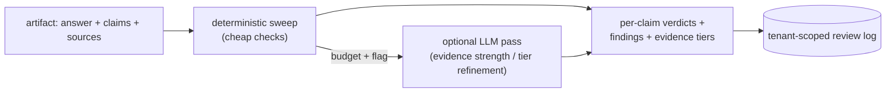

## Motivation

Grounding tells you *whether* an answer is supported; it does not tell you *how
strongly* each individual claim rests on its evidence, nor give you an auditable
record of that judgement. The **Evidence & Risk Review** firewall does: it sweeps
an answer's claims against their sources and emits a per-claim **risk verdict**
plus a persisted review log.

## What it does

Submit an artifact (answer text + claims + sources); the engine returns:

- **Evidence tiers** per source (the `guideline > … > unverified` axis).
- **Per-claim verdicts** — `keep` · `soften` · `flag_for_human_review` · `remove`.
- **Findings** — per-check reasons, suggested rewrites, confidence, cost class.
- **A review-log row** — appended, tenant-scoped, queryable.

A budget bounds the work (max LLM calls / tokens / heavy checks), and an optional
LLM semantic pass runs only when explicitly enabled.



## Tri-surface (R44)

This capability comes from the standalone `padosoft/laravel-evidence-risk-review`
package, wired into AskMyDocs over **one** shared core service:

- **PHP / MCP** — the package's Artisan command + MCP tools auto-register.
- **HTTP API** — `/api/admin/evidence-risk-review/*` (reviews list + detail,
  profiles, taxonomy, submit), host-secured with `auth:sanctum` +
  `tenant.authorize` + `can:viewEvidenceRiskReview` (R32 matrix-locked).
- **Native FE admin** — `/app/admin/evidence-risk-review` (Reviews / Profiles /
  Taxonomy / Try), cross-mounting the core API.

## Security & flags (R43, default-OFF)

- The whole admin surface is opt-in via **`EVIDENCE_RISK_REVIEW_ADMIN_ENABLED`**
  (default-OFF): off → the routes are unregistered (clean 404) and the FE shows a
  clean "unavailable" landing — never a 500.
- The optional LLM pass is a second default-OFF flag,
  **`EVIDENCE_RISK_REVIEW_LLM_ENABLED`**, running over the host `AiManager`.
- **R30** — a host `TenantResolver` binds the review log to the active tenant: a
  review is stamped on write and reads are forced to that tenant; a client
  `tenant` filter cannot widen the scope.

## Worked example

Submit an artifact and read the verdicts:

```bash
curl -X POST https://host/api/admin/evidence-risk-review/submit \
  -H "Authorization: ******" \
  -d '{
    "answer": "The cache TTL should be 60 minutes based on ADR 0002.",
    "claims": ["cache TTL = 60 min", "source: ADR 0002"],
    "sources": [{"doc_id": "dec-cache-v2", "project_key": "eng", "chunk_order": 1}]
  }'
```

Response (abbreviated):

```json
{
  "verdicts": [
    { "claim": "cache TTL = 60 min",  "verdict": "keep",   "confidence": 0.94 },
    { "claim": "source: ADR 0002",    "verdict": "soften", "confidence": 0.71,
      "suggested_rewrite": "source: the cache-decision document (see citation)" }
  ],
  "evidence_tiers": { "dec-cache-v2": "guideline" },
  "review_log_id": 4421,
  "cost_class": "cheap"
}
```

The `review_log_id` is the persisted, tenant-scoped row — queryable via
`GET /api/admin/evidence-risk-review/reviews/{id}` or the admin FE.

## Gotchas & operations

- Default-OFF means a fresh deploy ships the surface dormant — enable the flag to
  light up the dashboards.
- The review log can hold tenant-scoped artifact text — it is gated and
  tenant-scoped precisely for that reason.
- This is a firewall *over* grounding, not a replacement — see
  [grounding & evidence tiers](/grounding-and-evidence-tiers).

<CardGroup cols={2}>
  <Card title="Grounding & evidence tiers" icon="scale-balanced" href="/grounding-and-evidence-tiers">
    The evidence-strength axis this firewall scores against.
  </Card>
  <Card title="Anti-hallucination firewall" icon="shield-halved" href="/anti-hallucination-firewall">
    The complementary human &gt; auto &gt; raw trust ranking.
  </Card>
</CardGroup>
