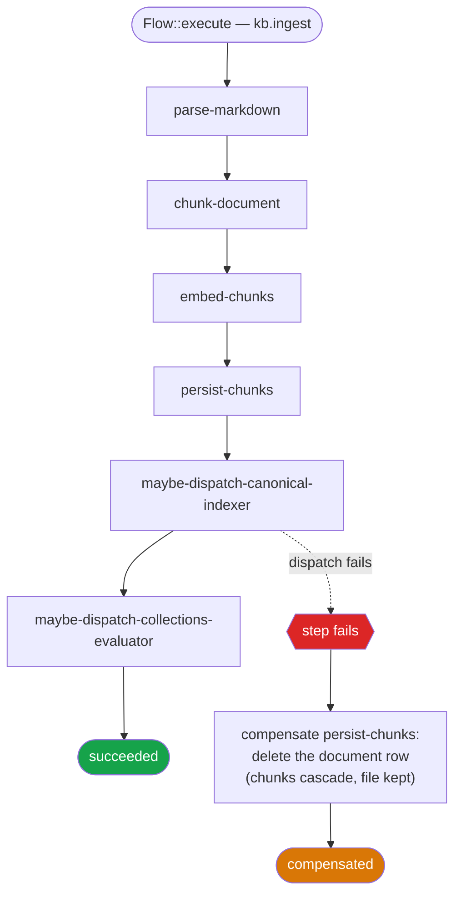
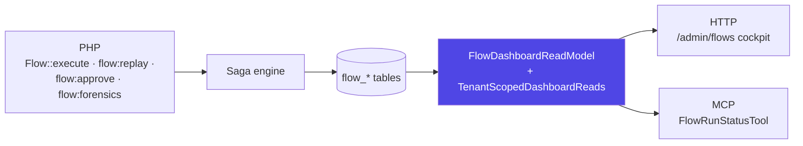

## The half of the write a transaction cannot reach

Ingesting one markdown document is not one write. It parses frontmatter, cuts
the text into chunks, calls an embeddings provider, persists rows, and — when
the document is canonical — dispatches a graph indexer. Deleting one is a
soft-delete, a chunk sweep, a graph cascade and a file removal. Promoting one
writes markdown to the KB disk *before* anything reaches the database at all.

Wrap that in `DB::transaction()` and you have covered exactly the part that was
never the problem. The rows roll back. The file on the KB disk does not. The
embeddings you already paid a provider for do not. The job you already pushed
onto the queue does not — it is going to run, against a document that no longer
exists.

So the failure modes are not hypothetical, and they are not symmetrical:

- Chunks persisted, embedding call failed → a document that is findable by
  keyword and invisible to vector search.
- Canonical markdown written to disk, ingest job never dispatched → a file that
  is the source of truth for a projection that does not exist.
- Graph nodes written, document insert rolled back → edges pointing at nothing.

Every one of those is *silent*. Nothing 500s. The corpus is simply wrong in a
way that surfaces weeks later as an answer that should have cited something and
did not.

## Compensation, not rollback

A saga replaces one atomic write with a sequence of committed steps, some of
them paired with a **compensator** that undoes what that step did. When step
four fails, the engine does not roll anything back — it cannot, the writes are
committed — it runs the compensators of the *already-completed* steps, newest
first.

The consequence worth internalising: **a step's compensator never fires for
that step's own failure.** It fires when something *after* it fails. If
`write-markdown` itself throws, nothing was written and there is nothing to
undo; the compensator exists because `dispatch-ingest`, one step later, can
fail and leave an orphan file behind.

Reverse order is the engine's contract rather than a convenience — a
compensator may depend on state an earlier step created, so unwinding
oldest-first can leave a later compensator with nothing to work from. It is the
default (`LARAVEL_FLOW_COMPENSATION=reverse-order`); a `parallel` strategy
exists for compensator sets that are genuinely independent and idempotent.
Today each AskMyDocs definition carries at most one compensator, so ordering is
insurance against the chains that get added, not a property of the current ones.



The run ends in `compensated`, not `failed`. Those are different facts and the
schema keeps them apart: `failed` means the work stopped; `compensated` means
the work stopped *and the world was put back*. The state worth paging someone
about is neither — it is a run that failed **while compensating**, which lands
in `flow_runs.compensation_status` rather than in `status`. The KPI strip
counts compensated runs; a failed compensation has to be read off that column,
so a dashboard that only watches `failed` will not show you the one case where
the world was left half-unwound.

## The nine definitions

All nine are registered from code in `FlowServiceProvider::registerDefinitions()`
— not from the database — so what runs is what is in the repository at deploy
time.

| Flow | Nodes | Human gate | Compensator, and what it undoes |
|---|---|---|---|
| `kb.ingest` | 6 steps | — | `RollbackChunks` on `persist-chunks` — deletes the document row; chunks and graph rows cascade |
| `kb.canonical-index` | 3 steps | — | `RollbackCanonicalNodes` — the `kb_nodes` / `kb_edges` it wrote |
| `kb.promote` | 3 steps + 1 approval gate | **always** | `DeleteCanonicalMarkdown` on `write-markdown` — removes the file from the KB disk |
| `kb.delete` | 4 steps | — | `RestoreSoftDeleted` — puts the document back |
| `kb.prune-deleted` | 2 steps | — | none — hard delete is terminal by design |
| `kb.prune-embedding-cache` | 3 steps | above a threshold, from a step | none |
| `kb.prune-chat-logs` | 2 steps | — | none |
| `kb.rebuild-graph` | 3 steps | — | none — the graph is rebuilt from markdown |
| `kb.ingest-folder` | 3 steps | — | none — fan-out; each child run compensates itself |

The three prune flows and `kb.rebuild-graph` carry no compensator on purpose. A
hard delete cannot be undone by an application-level compensator, and pretending
otherwise would be worse than not offering it: the graph is reconstructible from
the canonical markdown at any time via `kb:rebuild-graph`, which is the actual
recovery path.

<Note>
`RollbackChunks` deliberately **keeps the markdown file on disk** — it calls
`DocumentDeleter::deleteDbOnly()`, not the forcing delete. An earlier version
did wipe the file, which meant a transient failure dispatching the canonical
indexer permanently destroyed a source-of-truth file the operator never asked
to delete. On a `kb:ingest-folder` run over a Git mirror or a network share
that is the difference between "retry the ingest" and "restore from the
upstream repo".
</Note>

## Where a human stands in the chain

`kb.promote` is the enforcement point for [ADR 0003](https://github.com/lopadova/AskMyDocs/blob/main/docs/adr/0003-promotion-pipeline.md)
— promotion into canonical storage is human-gated, always. The gate sits
*after* frontmatter validation and *before* the disk write, which is the only
useful order: the engine fails a malformed draft before issuing an approval
token, so nobody is ever asked to approve something that was going to fail
anyway.

The token itself is a high-entropy one-time secret. `ApprovalTokenManager::issue()`
persists only its SHA-256 hash in `flow_approvals` and returns the plaintext on
the `IssuedApprovalToken` it hands back — so the plaintext exists exactly once,
at issue time, and a database dump cannot be replayed into an approval. It
expires after `LARAVEL_FLOW_APPROVAL_TOKEN_TTL_MINUTES` (24 hours by default).

`kb.prune-embedding-cache` gates *conditionally* — the approval is requested
only when the eviction count crosses `kb.embedding_cache.approval_threshold`
(`KB_EMBEDDING_CACHE_APPROVAL_THRESHOLD`, 5000 by default). A nightly sweep of
two hundred stale entries should not wake anybody; a sweep about to evict fifty
thousand should.

That one is **not** built on the `approvalGate()` primitive, and the reason is
worth stating: the primitive pauses unconditionally, and a gate that stops
every nightly sweep to ask about two hundred rows is a gate operators learn to
approve without reading. The decision therefore lives inside
`AssessEmbeddingEvictionRiskStep`, which pauses only above the threshold — so
the pause still means something when it happens.

## Persistence is opt-in, and the OFF path is the default

<Warning>
`LARAVEL_FLOW_PERSISTENCE_ENABLED` defaults to **false**. Flows still execute —
compensation, approval gates and audit events all work — but nothing is written
to the `flow_*` tables, so the cockpit and the MCP tool have no history to read.
</Warning>

This is a deliberate default, not an oversight: a host that adopts the engine
should not silently start persisting run payloads, which for AskMyDocs can
contain raw ingested document text. Flow payload redaction is a separate opt-in
knob (`KB_PII_REDACT_FLOW_PAYLOADS`, also default-off), so on a deployment that
turns persistence on and leaves redaction off, `flow_run_nodes.inputs` holds
tenant content in the clear.

Every reader honours the off state rather than assuming rows exist. The MCP
tool checks both the flag *and* `Schema::hasTable('flow_runs')`, because a
deployment can enable persistence without having migrated, and answers with
`persistence_enabled: false` plus a note — so a caller can tell *"nothing ran"*
from *"nothing is recorded"*, which a bare empty list cannot express.

## The tenant boundary the engine does not have

`padosoft/laravel-flow` is tenant-agnostic **by design** — it is a general saga
engine, published for hosts that have no tenants at all. AskMyDocs does, so the
host wraps the package's persistence contracts rather than replacing them:

| Host class | Wraps | What it adds |
|---|---|---|
| `App\Flow\Persistence\TenantAwareFlowStore` | the bound `FlowStore` | stamps `tenant_id` on write, hands out tenant-aware repositories |
| `App\Flow\Persistence\TenantAwareRunRepository` | the inner run repository | tenant-scoped run reads |
| `App\Flow\Persistence\TenantAwareRunNodeRepository` | the inner node repository (new in v2) | tenant-scoped node reads |
| `App\Flow\Admin\TenantScopedDashboardReads` | the read model, via `withScope()` | confines every cockpit query to the active tenant |

Both are wired with `$this->app->extend()`, not a re-bind, and that choice is
load-bearing rather than stylistic: `laravel-flow` **and** `laravel-flow-admin`
each bind `FlowDashboardReadModel` as a singleton, so a third `bind()` would
race their registration order — and flow-admin's own binding drops the
configured connection. Extending applies to whichever binding wins and
preserves what it built.

`TenantScopedDashboardReads` is the one that is easy to miss, because without
it the cockpit has **no row-level boundary at all**. Its authorizer gates the
destructive actions per row, but the *list* is a plain role check — and in v2
the three `canView*` methods are documented as reserved and are not invoked by
any controller. So the moment `FLOW_ADMIN_ENABLED` is true, an admin of one
tenant would browse every tenant's runs, nodes, audit and approvals. With
payload redaction off, that is a content boundary, not a metadata one.

<Note>
The scope reads the tenant **inside** `apply()`, never in the constructor. The
read model is a singleton wired once; a tenant captured at construction would
outlive the request that resolved it and be served to the next one under
Octane, Swoole or a long-lived worker — the exact leak the class exists to
close. Injecting the `TenantContext` *object* is fine; freezing the *string* is
not.
</Note>

An unresolvable tenant emits `where 1 = 0` rather than returning the builder
untouched. An untouched builder reads as *"no restriction"*, which would widen
an unresolvable subject into an unrestricted read instead of denying one — the
same fail-closed shape the retrieval scope is held to.

### Five tenanted tables, three not

| Table | `tenant_id` | Why |
|---|:---:|---|
| `flow_runs` | ✅ | the run belongs to a tenant |
| `flow_run_nodes` | ✅ | holds step inputs/outputs — tenant payload |
| `flow_audit` | ✅ | per-run trail |
| `flow_approvals` | ✅ | per-run gate |
| `flow_webhook_outbox` | ✅ | per-run delivery |
| `flow_definitions` | ❌ | never populated — the host registers from code |
| `flow_node_children` | ❌ | never populated — graph executor only |
| `flow_node_cache` | ❌ | content-addressed cross-tenant reuse, like `embedding_cache` |

The last three are safe **only because they stay empty**: the host registers
nine linear definitions and calls `Flow::execute()`, which takes the linear
path and never reaches the v2 graph executor. That is an assumption, and an
assumption nobody wrote down is one that expires quietly — so
`tests/Architecture/GraphExecutorNotAdoptedTest.php` fails the build on the
commit that introduces a graph entry point, rather than on the incident.
`flow_node_children` in particular would carry child inputs and outputs, which
for this host is tenant payload; its tenancy has to be decided before the first
row exists, not after.

## Who may open the cockpit

The cockpit ships **dark**. `FLOW_ADMIN_ENABLED` defaults to false and
`App\Http\Middleware\FlowAdminEnabled` answers **404** for every route under the
prefix — the correct semantic for a subsystem that is not there, and one that
keeps an unfamiliar admin surface from materialising silently on upgrade.

When it is on, the route stack is
`web,auth,flow-admin.enabled,can:viewFlowAdmin`. An empty or whitespace-only
`FLOW_ADMIN_MIDDLEWARE` falls back to `['web']` rather than to `[]`: an empty
array would silently drop session, CSRF and the session-driven authenticator,
which is what an operator setting `FLOW_ADMIN_MIDDLEWARE=""` to "disable auth
temporarily" would actually get.

Past the route gate, `App\Flow\Admin\AskMyDocsFlowAuthorizer` decides per
action — and every row-scoped action checks the row's `tenant_id` against the
active `TenantContext`, so a super-admin in tenant A still cannot resume a run
owned by tenant B:

| Action | super-admin | admin | dpo | editor / viewer | Row-scoped |
|---|:---:|:---:|:---:|:---:|:---:|
| View KPIs / runs | ✅ | ✅ | ✅ | — | — |
| View run detail | ✅ | ✅ | ✅ | — | ✅ |
| Replay (resume) a run | ✅ | ✅ | — | — | ✅ |
| Cancel a run | ✅ | — | — | — | ✅ |
| Approve / reject by token | ✅ | — | ✅ | — | ✅ |
| Retry a webhook delivery | ✅ | ✅ | — | — | ✅ |
| Edit a definition (Studio) | ✅ | — | — | — | — |

Cancel is super-admin only because it hard-fails an in-flight run and is not
reversible from the cockpit. Editing a *definition* is narrower still than
cancelling a run, and for the reason you would expect: cancelling ends one run,
editing changes what every future run of that flow does.

The definition gate refuses an **empty flow name** outright. That is a real
call, not a defensive branch — the advisor's all-flows scan reaches the
authorizer with no flow in context and passes `''`. Reading that as an unscoped
allow would leave the one action that writes drafts across *every* flow as the
only one with nothing to authorize against.

<Note>
Inside the AskMyDocs admin shell, `/app/admin/flows` is a **native host panel**
— a live KPI probe of `/admin/flows/api/live` plus section links — and the full
cockpit opens in a new tab. That supersedes the iframe-mount assumption in
[ADR 0005](https://github.com/lopadova/AskMyDocs/blob/main/docs/adr/0005-v43-react-19-host-bump.md):
the cockpit itself is unchanged, only how the host reaches it.
</Note>

## Three surfaces, one read model

Every capability in this platform is reachable from PHP, HTTP and MCP over one
shared core. Flow is no exception on the read side.



- **PHP** — `Flow::execute()` / `Flow::dispatch()`, plus the package's console
  surface: `flow:replay`, `flow:approve`, `flow:reject`, `flow:prune`,
  `flow:forensics`, `flow:deliver-webhooks`, `flow:nodes`, `flow:export`,
  `flow:import`, `flow:taint`.
- **HTTP** — the cockpit, gated as above.
- **MCP** — `FlowRunStatusTool`: aggregate counts plus the most recent runs
  with status, duration and failed step.

The MCP tool reads through the **same** `FlowDashboardReadModel` the cockpit
uses, deliberately rather than querying the tables. That single choice is what
makes the tenant boundary hold on the third surface: the host wires
`TenantScopedDashboardReads` onto that model, so every query the tool issues is
already constrained. A tool that reached for `DB::table('flow_runs')` would have
to re-derive the same scoping — and would be the place it eventually drifted.

<Warning>
`FlowRunStatusTool` is **read-only by construction**, not by convention: the
read model exposes no writes, so there is nothing for the tool to call. Starting,
cancelling, replaying and approving stay behind the cockpit's per-row
authorizer, where a human is present. Autonomous replay of a business workflow
is outside the agent trust boundary — the same exception recorded for system
administration and team governance.
</Warning>

## The v1 → v2 move

v2 replaced the per-step table with a run-node graph: `flow_steps` became
`flow_run_nodes`, `StepRunRepository` became `RunNodeRepository`, and
`FlowStepRecord` is gone. AskMyDocs implements the persistence contracts
itself, precisely to add the boundary above — which puts it in the minority of
consumers the rename actually touches.

The surface was smaller than it looked. `FlowStepHandler`, `FlowCompensator`,
`FlowContext` and `FlowStepResult` are byte-identical between the two lines, and
`Flow::execute()` still runs the linear executor, which still populates
`stepOutputs`. Twenty-nine step handlers, four compensators and nine definitions
were untouched.

Four things were fatal rather than merely broken, and all four fail at **boot
or first run**, not gradually:

1. `FlowStepRecord::creating()` in the host provider — class-not-found at boot.
2. `AskMyDocsFlowAuthorizer` implemented eight of nine `ActionAuthorizer`
   methods; the missing `canEditDefinition` is a fatal at class load.
3. `flow_runs.subject` is written unconditionally on every run insert with no
   column guard, so omitting its migration fails every `execute()`.
4. `flow_run_nodes` keeps `unique(run_id, node_id)` rather than a
   tenant-prefixed shape, because `createOrUpdate` upserts with `ON CONFLICT`
   on exactly those columns and errors without a matching index. `run_id` is a
   UUID owned by one tenant, so the pair is already transitively tenant-disjoint.

### The tenant on converted history

The real risk was not in the code. Neither the package blueprint nor the
package's own conversion migration provides `tenant_id`, and the conversion
**drops `flow_steps`** when it is done. The host adds the column afterwards and
backfills it from `flow_runs`.

Three decisions in that migration are load-bearing:

- **The column is added nullable with no default.** A `default('default')` is
  the exact mechanism by which every historical row of every tenant becomes
  readable by the `default` tenant — and it is undetectable afterwards, because
  a legitimately-default row and a mis-stamped one are byte-identical. `NULL`
  is distinguishable, invisible to `where tenant_id = ?`, and repairable.
- **The tenant comes from `flow_runs`, never from the dropped
  `flow_steps.tenant_id`.** The invariant that has to hold is *a node is visible
  exactly when its run is visible*. Deriving from the run makes both failure
  directions — an invisible node under a visible run, a visible node under an
  invisible one — impossible by construction, and survives the source table
  being gone.
- **It runs *after* the package conversion.** While that conversion is
  inserting, `tenant_id` does not exist, so its `insertOrIgnore` cannot silently
  swallow a NOT NULL violation — which it would do on SQLite and MySQL,
  discarding history and then dropping the source table, with green output.
  Adding a NOT NULL tenant column *before* the conversion is the shape to avoid.

A node still `NULL` after the backfill has no run to inherit from, which means
the conversion produced something the foreign key should have prevented. The
migration **throws and names the count** rather than stamping it `default`,
because hiding a real inconsistency inside a tenant that can read it is worse
than a failed deploy. On PostgreSQL, DDL is transactional and Laravel wraps the
migration, so add + backfill + verify + tighten commit or roll back as one.

<Warning>
The conversion is **forward-only**: `migrate:rollback` does not resurrect
`flow_steps`. Recovery from a bad conversion is restore-from-dump, which is why
the deploy procedure takes one before it starts. See the
[Flow v2 migration runbook](https://github.com/lopadova/AskMyDocs/blob/main/docs/runbooks/flow-v2-migration.md).
</Warning>

## Worked example: a promotion that stalls, then resumes

```php
use App\Flow\Definitions\PromotionFlow;
use Padosoft\LaravelFlow\Facades\Flow;

$run = Flow::execute(PromotionFlow::NAME, [
    // The declared input bag: tenant_id rides along for R30/R31, and
    // title + promotion_source are optional.
    'tenant_id' => $tenants->current(),
    'project_key' => 'engineering',
    'markdown' => $draft,
]);

// The run is paused: validate-frontmatter passed, the approval gate issued a
// token, and nothing has touched the KB disk yet.
```

The operator approves from the cockpit (or `php artisan flow:approve`). The run
resumes at `write-markdown`, writes the canonical file, then dispatches
`IngestDocumentJob`. If that last dispatch fails, `DeleteCanonicalMarkdown`
removes the file it just wrote and the run ends `compensated` — no orphan
markdown is left on the KB disk for a later folder scan to pick up
out-of-band, and the operator can retry the promotion from the same draft.

Read the state back from any surface:

```bash
php artisan flow:forensics <run-id>
```

```json
{
  "persistence_enabled": true,
  "totals": { "runs": 1284, "paused": 1, "failed": 0, "pending_approvals": 1 },
  "recent_runs": [
    { "flow": "kb.promote", "status": "paused", "failed_step": null }
  ]
}
```

## Gotchas

<CardGroup cols={2}>
<Card title="Persistence off means no history" icon="database">
Runs still execute and compensate. The cockpit and the MCP tool will correctly
report that nothing is *recorded*, which is not the same as nothing having run.
</Card>

<Card title="Queue locks need an atomic store" icon="lock">
`Flow::dispatch()` takes a per-dispatch cache lock so duplicate delivery cannot
run the same flow twice. The array store is accepted only when the queue driver
is `sync`; production needs Redis.
</Card>

<Card title="Lock TTL must exceed the longest run" icon="clock">
`LARAVEL_FLOW_QUEUE_LOCK_SECONDS` (3600 by default) cannot be renewed —
Laravel's portable lock contract has no renewal. A flow that outlives its lock
loses the duplicate-suppression guarantee.
</Card>

<Card title="Payloads are not redacted by default" icon="shield-halved">
`KB_PII_REDACT_FLOW_PAYLOADS` is off. With persistence on, step inputs and
outputs hold whatever the flow was handed — for `kb.ingest`, raw document text.
</Card>

<Card title="Definitions live in code, not the DB" icon="code">
`flow_definitions` stays empty. A graph edited in the Studio would be a stored
definition the linear executor never reads, which is why editing is
super-admin-only and effectively inert here.
</Card>

<Card title="Cancel is not compensation" icon="triangle-exclamation">
Cancelling hard-fails an in-flight run from the cockpit. It is super-admin only
and not reversible from that surface.
</Card>
</CardGroup>

## Decision rationale

**Why a saga engine rather than jobs with try/catch.** Manual rollback in a
`catch` block is a compensator with no engine behind it: nothing records which
steps completed, nothing enforces reverse order, nothing survives the worker
being killed between the failure and the cleanup. The engine makes the
compensation chain a property of the *definition* rather than of whoever wrote
the catch block. Adopted with the sister-package stack in
[ADR 0004](https://github.com/lopadova/AskMyDocs/blob/main/docs/adr/0004-v42-sister-package-integration.md).

**Why the host implements the persistence contracts.** The alternative was to
ask the package for a tenant column. That would make a general-purpose saga
engine carry a concept most of its consumers do not have, and would put the
boundary that protects AskMyDocs tenants under someone else's release cadence.
Implementing the contracts locally costs four small classes and keeps the
boundary in the repository that is accountable for it.

**Why there is no MCP write surface.** Every other capability in this platform
is tri-surface with a write path where one makes sense. Flow deliberately is
not: replay re-executes a business workflow with real side effects, cancel
hard-fails work in flight, and approve is the human gate that
[ADR 0003](https://github.com/lopadova/AskMyDocs/blob/main/docs/adr/0003-promotion-pipeline.md)
exists to guarantee. Handing any of the three to an autonomous agent would make
the agent the human in "human-gated". This is an explicit, documented exception
rather than an omission.
