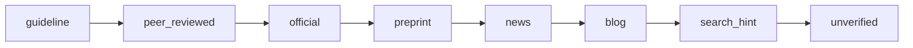

## Motivation / problem

An LLM will confidently answer from parametric memory if you let it. For an
enterprise KB that is unacceptable: an ungrounded answer is indistinguishable
from a hallucination, and a claim backed by a random blog post should not be
presented with the same authority as one backed by a ratified standard.

AskMyDocs enforces two disciplines: **every answer is grounded in retrieved,
cited context (or the system refuses)**, and **every source carries an evidence
tier** that the prompt makes the model account for.

## Theory & background

- **Grounding** = the answer's claims must be traceable to retrieved chunks,
  returned as citations. If retrieval surfaces nothing relevant above threshold,
  the correct behaviour is a **refusal**, not a fabricated answer.
- **Evidence strength is an axis, not a boolean.** Real knowledge spans a
  spectrum from authoritative guidelines down to unverified notes. Collapsing
  that to "in the KB / not in the KB" throws away the signal a careful analyst
  uses to weight a claim.

## Design

The evidence tier is an ordered enum recorded per document (nullable
`knowledge_documents.evidence_tier`) and carried onto retrieved chunks:



- The RAG prompt renders a per-chunk `Evidence:` line plus a weighting rule that
  tells the model to flag low-confidence (`blog` / `search_hint` / `unverified`)
  claims.
- The tier is derived automatically by the Auto-Wiki compiler in the same
  enrichment LLM call, or set explicitly by an operator (an audited override the
  firewall trusts over the LLM's guess).
- Grounding + refusal: when retrieval yields no context above threshold, the
  controller returns a deterministic **refusal** (a typed reason, not an error)
  and records a content-gap rollup so editors know what to write next.

## Data model / contract

- `knowledge_documents.evidence_tier` — nullable; one of the 8 tier keys.
- Exposed tri-surface (R44): the `kb:evidence-tier` Artisan command,
  `GET /api/admin/kb/evidence-tiers` + `PATCH …/documents/{id}/evidence-tier`
  (RBAC-gated), and the `KbSetEvidenceTierTool` MCP tool.
- Refusals are surfaced as a typed reason (e.g. `no_relevant_context`) — the
  machine-readable tag never localizes; only the human-visible body does.

## Decision rationale (ADR-style)

- **Why a refusal instead of a best-effort answer?** A wrong-but-confident answer
  erodes trust irrecoverably; a grounded refusal is honest and actionable (it
  feeds Content Gaps). The anti-hallucination posture treats refusal as a
  first-class, non-error outcome.
- **Why let a human override the LLM-derived tier?** The compiler's tier is a
  guess; a human-set tier is ground truth. The firewall therefore trusts the
  audited human override over the model's label.
- **Why piggyback tier derivation on the enrichment call?** One extra field on an
  LLM call already being made is nearly free, versus a dedicated pass per
  document.

## Worked example

```bash
# Promote a doc, then pin its evidence tier as an operator override
php artisan kb:evidence-tier set decisions/dec-cache-v2.md --tier=official --project=eng
```

Now a chat answer that leans on that doc renders an `Evidence: official` line for
the chunk; an answer that can only find a `blog`-tier source is flagged
low-confidence in the response.

## Gotchas & operations

- A `null` tier means "unknown", not "lowest" — the prompt treats it as
  unweighted rather than penalising it as `unverified`.
- Changing a tier is audited; it is an editorial act, not a silent mutation.

<CardGroup cols={2}>
  <Card title="Anti-hallucination firewall" icon="shield-halved" href="/anti-hallucination-firewall">
    The human &gt; auto &gt; raw trust ranking in the reranker.
  </Card>
  <Card title="Retrieval pipeline" icon="layer-group" href="/architecture/retrieval-pipeline">
    Where tiers and grounding plug into hybrid search.
  </Card>
</CardGroup>
