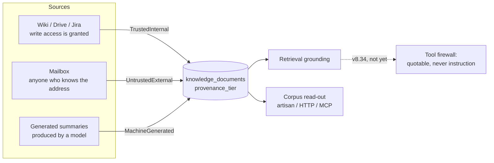

## The question nobody could answer

Ask a deployment how much of its knowledge base was written by people outside
the organisation, and until now there was no way to find out. Not because the
answer was hidden, but because nothing recorded it.

Ingestion captures what a document **is** — a title, a path, a mime type, a
project. It captured nothing about where the authority of its text comes from.
That gap is invisible right up until you line up what the connectors actually
do:

- Confluence, Jira, Notion, Drive, OneDrive, Evernote and Fabric read systems
  the organisation **administers**. Whoever authored a document there had to be
  granted the ability to author it.
- IMAP reads a mailbox. A mailbox accepts a message from **anyone who knows the
  address**.

Both paths produce documents. Both become chunks. Both are retrieved as
grounding — on a platform that also exposes tools an agent can call. Stored as
the same kind of fact, the second is attacker-reachable text arriving in a
tool-calling context with nothing marking it as different.

<Note>
This page describes **v8.32**, the first of three phases in
[ADR 0028](https://github.com/lopadova/AskMyDocs/blob/main/docs/adr/0028-source-acl-mirroring-and-ingest-provenance.md).
It ships **labels and no enforcement** — deliberately. Enforcement is only
testable against a corpus that is already labelled.
</Note>

## The three tiers



| Tier | Stored as | Means |
|---|---|---|
| `TrustedInternal` | `trusted-internal` | Written inside the organisation, through a system it controls |
| `UntrustedExternal` | `untrusted-external` | Written outside the organisation's control, or by an unverified author |
| `MachineGenerated` | `machine-generated` | Produced by a model or automated process rather than a person |

## The connector declares it, never the host

A connector opts in by implementing one interface from
`padosoft/askmydocs-connector-base` v1.5:

```php
use Padosoft\AskMyDocsConnectorBase\Contracts\DeclaresProvenance;
use Padosoft\AskMyDocsConnectorBase\ProvenanceTier;

final class ImapConnector extends BaseConnector implements DeclaresProvenance
{
    public function provenanceTier(int $installationId): ProvenanceTier
    {
        return ProvenanceTier::UntrustedExternal;
    }
}
```

Only the fetcher knows whether a mailbox is an internal distribution list or a
public contact address. Inferring it host-side would be a heuristic over a fact
the connector already had.

It resolves **per installation**, like `SupportsFolderDiscovery::listAvailableFolders()`:
two installations of one connector routinely differ, and `ConnectorRegistry`
keeps a single instance per connector key.

<Warning>
The IMAP connector's tier is **fixed**, not derived from configuration. A
folder allow-list narrows *which* mail is ingested, never *who was able to send
it*. Deriving "internal" from a sync filter would hand an operator a way to
silently mark external mail trusted — the exact mistake the label exists to
prevent.
</Warning>

## Reading the corpus

Three surfaces, one core (`ProvenanceInsightsService`):

```bash
php artisan kb:provenance --tenant=acme --per-project
```

```http
GET /api/admin/kb/provenance?per_project=1
```

The MCP tool `KbProvenanceTool` answers the same question for an agent.

```json
{
  "summary": {
    "total": 1284,
    "declared": 900,
    "undeclared": 384,
    "externally_authored": 212,
    "externally_authored_pct": 16.51
  }
}
```

### Why `declared` sits next to the headline

A corpus reading **100% trusted-internal with 0 declared** has not been
assessed — it has been *assumed*. The two numbers are reported together
precisely so a reassuring percentage cannot be mistaken for evidence. The CLI
says so out loud when nothing has been declared yet.

## Design decisions worth stating

### The default is not the most cautious value

An undeclared document reads as `TrustedInternal`. Defaulting to *untrusted*
would relabel every existing corpus overnight and make the label mean nothing.
External content is the exception a connector has to declare.

### Unknown values fail closed

`ProvenanceTier::fromStorage()` treats **absence** and **unrecognition** as
different facts:

- `null` — no declaration was ever recorded. Reads as the default.
- an unrecognised string — a tier written by a newer version during a mixed
  deployment or after a rollback. Fails **closed** to `UntrustedExternal`.

Collapsing the second into the trusted default would invert the protection: a
future tier meant to be *more* restrictive would read as safe on the older
node.

### A broken connector labels untrusted, not trusted

If a connector's `provenanceTier()` throws, the host logs it and labels the
document `UntrustedExternal`. Propagating would fail a document's ingestion
over a label nothing yet enforces; swallowing it and returning `null` would
silently promote the content. A wrong "untrusted" is recoverable and visible in
the read-out. A wrong "trusted" is noticed by nobody.

### Provenance is not the curation tier

This is the distinction most likely to be collapsed by mistake, so it is worth
being blunt about.

|  | Question it answers | Lives in |
|---|---|---|
| **Curation tier** (ADR 0014) | *Has a human vouched for this?* | Auto-Wiki reranker: human `accepted` > `auto` > raw |
| **Provenance tier** (ADR 0028) | *Who wrote it?* | `knowledge_documents.provenance_tier` |

A page a human reviewed and accepted, summarising an external email, is fully
curated **and** externally authored at the same time. Both facts matter, and
each is useless as a substitute for the other.

## What comes next

| Phase | Version | Content |
|---|---|---|
| 1 | **v8.32** *(this page)* | Labels — enum, column, connector declarations, read-out |
| 2 | v8.33 | Source ACL mirroring: `SourceAccess`, principal resolver, mirrored ACL rows, reconciliation, triage UI |
| 3 | v8.34 | Enforcement: an `UntrustedExternal` chunk may be **quoted** but must never influence a tool call |

They are separate releases on purpose. Provenance labelling is days; ACL
mirroring plus principal resolution plus reconciliation plus a triage screen is
a cycle. Coupling them would hold the cheap half behind the expensive one.
