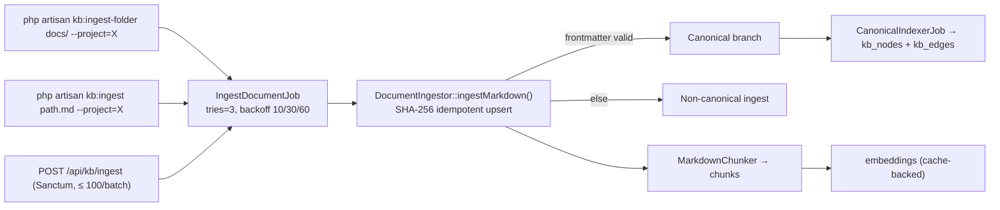

## Motivation

Ingestion is the front door of the knowledge base. It must be **idempotent**
(re-pushing the same bytes is a no-op), **versioned** (a new version archives the
old so stale chunks never surface), and **uniform** (every document — however it
arrives — gets the same chunking, embedding, and canonical handling).

## Two entry points, one execution path



Whatever the source, everything converges on `IngestDocumentJob → DocumentIngestor`.
**Never add a third path that skips this** — idempotency, canonical handling, and
graph indexing all live here.

## CLI ingestion

```bash
# Walk a folder on the KB disk (relative to KB_PATH_PREFIX) and ingest each file.
php artisan kb:ingest-folder docs/ --project=handbook --recursive

# Ingest a single file.
php artisan kb:ingest decisions/dec-cache.md --project=eng --title="Cache decision"
```

`kb:ingest-folder` flags: `--project=`, `--tenant=` (restrict to one tenant),
`--disk=` (override `KB_FILESYSTEM_DISK`), `--pattern=` (comma-separated
extensions), `--recursive`, `--sync` (run inline, skip the queue). The `{path}`
is resolved **relative to `KB_PATH_PREFIX`**, because the queued job re-applies
the prefix when reading — any new disk-walking command must honour the prefix or
reject absolute paths.

## HTTP ingestion

```bash
curl -X POST https://host/api/kb/ingest \
  -H "Authorization: Bearer <token>" -H "Content-Type: application/json" \
  -d '{"documents":[{"project_key":"handbook","source_path":"policies/remote.md","content":"# Remote work\n..."}]}'
```

Sanctum-protected, batch ≤ 100. The endpoint writes the markdown to the KB disk
and dispatches one `IngestDocumentJob` per document. Binary formats
(`application/pdf`, `.docx`) require `content` **base64-encoded** with a
`mime_type`; the controller decodes-or-422 before writing.

## UI upload (admin drag-and-drop)

The admin SPA ships a drag-and-drop upload modal (`/app/{team}/admin/kb`) so an
operator can add documents without the CLI or a hand-rolled API call. It is a
**third entry surface**, not a third execution path: at commit time it dispatches
the *same* `IngestDocumentJob` as everything else (the "never skip the one path"
rule above still holds). What it adds in front of that is a **human-reviewed
staging buffer**.

```mermaid
flowchart LR
    UP["POST /api/admin/kb/uploads<br/>multipart files[] + project_key + sub_path"] --> STG[("kb-staging disk<br/>{tenant}/{batch}/{uuid}.ext")]
    STG --> REV["Review in modal<br/>per-file status + canonical warnings<br/>remove / cancel"]
    REV --> COM["POST /uploads/&#123;batch&#125;/commit<br/>R21 atomic gate (lockForUpdate + committed_at)"]
    COM --> MV["move each staged file → kb disk"]
    MV --> JOB["IngestDocumentJob ×N<br/>(the one execution path)"]
    JOB --> PROG["KbUploadBatchItemProgress<br/>queue events → item status"]
    PROG --> POLL["GET /uploads/&#123;batch&#125;/status<br/>FE polls queued→processing→succeeded|failed"]
```



- **Stage** validates each file by extension (md / markdown / txt / pdf / docx),
  normalizes `sub_path` through `KbPath` (a `..` traversal 422s, R1), rejects a
  batch with **duplicate filenames** (they would collapse to one
  `destination_path` and silently lose bytes), and stores the bytes on a dedicated
  **`kb-staging`** disk under an opaque `{tenant}/{batch}/{uuid}.ext` name.
- **Commit** is an **atomic single-use gate** (R21): the status flip + `committed_at`
  stamp happen inside one `DB::transaction` with `lockForUpdate`, so a double
  click 409s instead of ingesting twice. It then moves each staged file to the KB
  disk and dispatches the ingest jobs (`202 Accepted`).
- **Progress** is driven by a queue-lifecycle listener (`KbUploadBatchItemProgress`)
  that advances each item `queued → processing → succeeded | failed` *without*
  touching the shared job — the FE polls `GET …/status` until terminal.

**Design rationale.** Why a separate `kb-staging` disk rather than writing
straight to the KB disk: staged bytes are *unreviewed* and may be abandoned, so
they must never be visible to retrieval or pollute the canonical tree before the
operator commits. A dedicated private disk keeps the review buffer isolated, and
the daily `kb:prune-staging-batches` sweep (past `KB_STAGING_RETENTION_HOURS`,
default 24) reclaims abandoned sessions — see
[scheduler & maintenance](/scheduler-and-maintenance). The whole surface is
`role:admin|super-admin`, tenant-scoped (R30), and every batch/item resolves
through a tenant-scoped route binding (no cross-tenant IDOR).

## Idempotency (the load-bearing invariant)

`DocumentIngestor` hashes the markdown and **upserts on
`(project_key, source_path, version_hash)`**. Consequences:

- Re-pushing identical bytes → no-op.
- New bytes at the same `source_path` → a new version; the previous version's
  chunks are archived so stale content never surfaces in retrieval.
- Do **not** add `firstOrCreate` logic that bypasses the hash.

## Chunking and embeddings

`MarkdownChunker` is an in-house, line-based, fence-aware FSM that splits on
section boundaries (no external markdown library). Each chunk is embedded; the
`embedding_cache` (keyed by the composite `UNIQUE(text_hash, provider, model)`)
means identical text embeds once and is reused — across tenants, by design.

<Warning>
  The embedding **dimension is part of the schema contract**. Choosing a
  different-dimension model means migrating the `vector(N)` columns, flushing the
  cache, and re-indexing. Pick the embeddings model before your first ingest —
  see [Installation](/installation#embedding-dimensions).
</Warning>

## The canonical branch

When the markdown carries valid YAML frontmatter, `CanonicalParser` validates it
against the 9 types / 6 statuses and populates the 8 canonical columns +
`frontmatter_json`. Prior versions' canonical identifiers are vacated first (so
the per-project composite uniques accept the new version), and after commit
`CanonicalIndexerJob` populates `kb_nodes` + `kb_edges`. Invalid frontmatter
degrades gracefully to non-canonical ingestion. See
[Canonical & promotion](/canonical-and-promotion).

## Deletion mirrors ingestion

`kb:delete` / `DELETE /api/kb/documents` / `--prune-orphans` / the scheduled
`kb:prune-deleted` all fan in to a single `DocumentDeleter` (soft by default;
hard delete cascades the graph). Soft delete is the default
(`KB_SOFT_DELETE_ENABLED=true`); rows hide from every read path until
`kb:prune-deleted` hard-deletes them after the retention window.

## Queue baseline & sync observability (v8.21)

Connector sync and per-document ingestion run on **dedicated queues** so they
don't compete with the chat hot path or `default` background work
(autowiki / change-analysis):

| Role | Queue | Env |
|---|---|---|
| Connector sync (`ConnectorSyncJob`) | `connectors` | `CONNECTOR_SYNC_JOB_QUEUE` |
| Per-document ingestion (`IngestDocumentJob`) | `kb-ingest` | `KB_INGEST_QUEUE` |
| Everything else | the connection's default queue | (e.g. `REDIS_QUEUE` / `DB_QUEUE` / `SQS_QUEUE`) |

Run a worker per queue — e.g.
`php artisan queue:work --queue=connectors`,
`--queue=kb-ingest`, and one for the connection's **default** queue — or, under
Horizon, one auto-scaling supervisor per queue. The "everything else" queue name
is whatever your default connection is configured to use (it is **not** always
the literal `default`: if you set e.g. `REDIS_QUEUE=high`, the default worker is
`--queue=high`). The `/api/admin/ingestion/queue` endpoint resolves and reports
the real name so you always know what to run. The previous default (`CONNECTOR_SYNC_JOB_QUEUE=default`)
let a slow remote sync starve the rest of `default`; the v8.21 default is
`connectors`.

**Observability.** Each `ConnectorSyncJob` execution is recorded host-side into
`connector_sync_runs` (started/finished, duration, documents discovered,
status: running / success / partial / failed). Read it three ways (R44):

- **CLI** — `php artisan ingestion:status --tenant=<id>` (queue depths + recent runs).
- **HTTP** — `GET /api/admin/ingestion/queue` (depths) and
  `GET /api/admin/connectors/{installationId}/sync-runs` (per-account history),
  super-admin only.
- **MCP** — the `KbIngestionStatusTool` read tool.

Per-document ingestion status (derived from the Flow engine's `flow_runs`) is a
tracked follow-up — `flow_runs` is not tenant-scoped, so exposing it safely
needs a tenant-isolation pass first.

## Gotchas & operations

- Use `App\Support\KbPath::normalize()` for every source path — ingest and delete
  must produce identical paths or deletes emit spurious "not found".
- Bulk sweeps must be memory-safe (`chunkById` / `cursor`, filters pushed into
  SQL) — never load the whole corpus into PHP.
- `--sync` is for debugging; production ingestion runs through the queue
  (`php artisan queue:work`).

<CardGroup cols={2}>
  <Card title="Canonical & promotion" icon="user-check" href="/canonical-and-promotion">
    Turn an ingested draft into a human-vouched canonical artifact.
  </Card>
  <Card title="Chat & retrieval" icon="comments" href="/chat-and-retrieval">
    How ingested chunks become grounded, cited answers.
  </Card>
</CardGroup>
