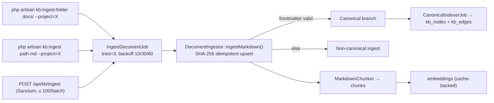

## Motivation

Ingestion is the front door of the knowledge base. It must be **idempotent**
(re-pushing the same bytes is a no-op), **versioned** (a new version archives the
old so stale chunks never surface), and **uniform** (every document — however it
arrives — gets the same chunking, embedding, and canonical handling).

## Two entry points, one execution path



Whatever the source, everything converges on `IngestDocumentJob → DocumentIngestor`.
**Never add a third path that skips this** — idempotency, canonical handling, and
graph indexing all live here.

## CLI ingestion

```bash
# Walk a folder on the KB disk (relative to KB_PATH_PREFIX) and ingest each file.
php artisan kb:ingest-folder docs/ --project=handbook --recursive

# Ingest a single file.
php artisan kb:ingest decisions/dec-cache.md --project=eng --title="Cache decision"
```

`kb:ingest-folder` flags: `--project=`, `--tenant=` (restrict to one tenant),
`--disk=` (override `KB_FILESYSTEM_DISK`), `--pattern=` (comma-separated
extensions), `--recursive`, `--sync` (run inline, skip the queue). The `{path}`
is resolved **relative to `KB_PATH_PREFIX`**, because the queued job re-applies
the prefix when reading — any new disk-walking command must honour the prefix or
reject absolute paths.

## HTTP ingestion

```bash
curl -X POST https://host/api/kb/ingest \
  -H "Authorization: Bearer <token>" -H "Content-Type: application/json" \
  -d '{"documents":[{"project_key":"handbook","source_path":"policies/remote.md","content":"# Remote work\n..."}]}'
```

Sanctum-protected, batch ≤ 100. The endpoint writes the markdown to the KB disk
and dispatches one `IngestDocumentJob` per document. Binary formats
(`application/pdf`, `.docx`) require `content` **base64-encoded** with a
`mime_type`; the controller decodes-or-422 before writing.

## Idempotency (the load-bearing invariant)

`DocumentIngestor` hashes the markdown and **upserts on
`(project_key, source_path, version_hash)`**. Consequences:

- Re-pushing identical bytes → no-op.
- New bytes at the same `source_path` → a new version; the previous version's
  chunks are archived so stale content never surfaces in retrieval.
- Do **not** add `firstOrCreate` logic that bypasses the hash.

## Chunking and embeddings

`MarkdownChunker` is an in-house, line-based, fence-aware FSM that splits on
section boundaries (no external markdown library). Each chunk is embedded; the
`embedding_cache` (keyed by the composite `UNIQUE(text_hash, provider, model)`)
means identical text embeds once and is reused — across tenants, by design.

<Warning>
  The embedding **dimension is part of the schema contract**. Choosing a
  different-dimension model means migrating the `vector(N)` columns, flushing the
  cache, and re-indexing. Pick the embeddings model before your first ingest —
  see [Installation](/installation#embedding-dimensions).
</Warning>

## The canonical branch

When the markdown carries valid YAML frontmatter, `CanonicalParser` validates it
against the 9 types / 6 statuses and populates the 8 canonical columns +
`frontmatter_json`. Prior versions' canonical identifiers are vacated first (so
the per-project composite uniques accept the new version), and after commit
`CanonicalIndexerJob` populates `kb_nodes` + `kb_edges`. Invalid frontmatter
degrades gracefully to non-canonical ingestion. See
[Canonical & promotion](/canonical-and-promotion).

## Deletion mirrors ingestion

`kb:delete` / `DELETE /api/kb/documents` / `--prune-orphans` / the scheduled
`kb:prune-deleted` all fan in to a single `DocumentDeleter` (soft by default;
hard delete cascades the graph). Soft delete is the default
(`KB_SOFT_DELETE_ENABLED=true`); rows hide from every read path until
`kb:prune-deleted` hard-deletes them after the retention window.

## Gotchas & operations

- Use `App\Support\KbPath::normalize()` for every source path — ingest and delete
  must produce identical paths or deletes emit spurious "not found".
- Bulk sweeps must be memory-safe (`chunkById` / `cursor`, filters pushed into
  SQL) — never load the whole corpus into PHP.
- `--sync` is for debugging; production ingestion runs through the queue
  (`php artisan queue:work`).

<CardGroup cols={2}>
  <Card title="Canonical & promotion" icon="user-check" href="/canonical-and-promotion">
    Turn an ingested draft into a human-vouched canonical artifact.
  </Card>
  <Card title="Chat & retrieval" icon="comments" href="/chat-and-retrieval">
    How ingested chunks become grounded, cited answers.
  </Card>
</CardGroup>
