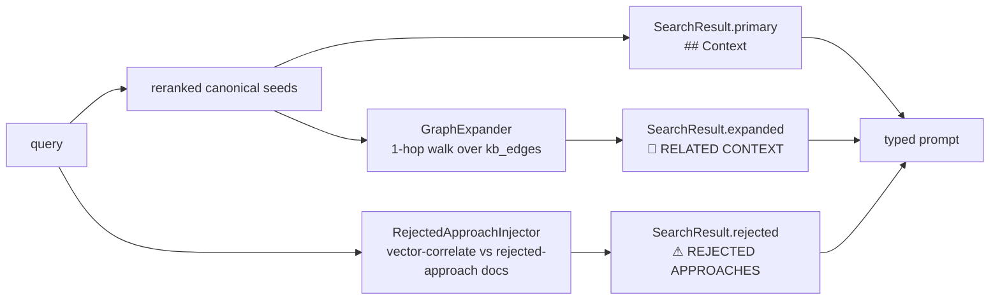

## Motivation / problem

Commodity RAG is **stateless about decisions**. It indexes chunks and re-derives
an answer from raw similarity on every query. Three consequences hurt at
enterprise scale:

- It cannot represent *"we evaluated X and rejected it"* — there is nowhere to
  store a rejection, so the LLM cheerfully re-proposes it next quarter.
- It cannot follow the *relationships* between knowledge (a decision supersedes
  another; a runbook documents a module) — every hit is an island.
- It forgets the moment the context window closes.

AskMyDocs treats the knowledge base as **institutional memory**: a typed
canonical layer that persists decisions *and* rejections, wired into a graph that
retrieval actively walks.

## Theory & background

Two ideas drive the design:

1. **Anti-repetition memory.** A team's most valuable knowledge is often what it
   *stopped* doing. Encoding `rejected-approach` as a first-class canonical type,
   and surfacing it at query time, turns "we already tried that" from tribal
   memory into a retrieval signal.
2. **Graph-augmented retrieval.** Pure vector search optimises for semantic
   similarity, not *relevance through relationship*. A decision's superseding
   decision, or the runbook that operationalises it, may not be textually similar
   to the query yet is essential context. Walking edges from the seed hits
   recovers that context.

## Design

At every chat turn, after hybrid retrieval and reranking, two components run:



- **`GraphExpander`** walks one hop of `kb_edges` from the canonical seed
  documents and folds the neighbours into `SearchResult.expanded`. Ordering is
  driven by edge `weight`.
- **`RejectedApproachInjector`** vector-correlates the query against
  `rejected-approach` canonical docs and returns up to
  `KB_REJECTED_INJECTION_MAX_DOCS` above `KB_REJECTED_MIN_SIMILARITY`.
- The prompt (`resources/views/prompts/kb_rag.blade.php`) renders typed blocks:
  a **⚠ REJECTED APPROACHES** block, a **📎 RELATED CONTEXT** block, and the
  primary **## Context** — so the model is explicitly told what was dismissed.

## Data model / contract

- `kb_nodes` — 9 node types; `rejected-approach` is one of them.
- `kb_edges` — 10 edge types (`supersedes`, `invalidated_by`, `decision_for`,
  `documented_by`, `affects`, …), each with a `weight` (decimal 8,4) driving
  expansion order and a `provenance`.
- Config knobs:
  - `KB_GRAPH_EXPANSION_ENABLED` (default `true`)
  - `KB_REJECTED_INJECTION_ENABLED` (default `true`)
  - `KB_REJECTED_INJECTION_MAX_DOCS`, `KB_REJECTED_MIN_SIMILARITY`

## Decision rationale (ADR-style)

- **Why surface rejected approaches in the prompt rather than just down-rank
  them?** Down-ranking hides them; the goal is the opposite — the model must
  *know* an option was dismissed to avoid re-proposing it. The ⚠ marker is a
  feature, not a hack. Typical token cost is &lt;300 tokens/turn; tune
  `KB_REJECTED_MIN_SIMILARITY` before disabling.
- **Why 1-hop graph expansion, not N-hop?** One hop captures the
  directly-related context (superseding decision, owning module) without
  exploding the prompt or pulling in weakly-related noise. Deeper multi-hop
  navigation is a deliberate, separate agentic primitive
  ([Auto-Wiki](/auto-wiki) `WikiNavigator`), not the default chat path.
- **Why degrade to a no-op?** A tenant with zero canonical docs gets identical
  behaviour to plain hybrid RAG — existing consumers see no change until they
  canonicalize. Both components return empty in that case.

## Worked example

1. Promote a decision and the approach it rejected:
   ```bash
   # dec-cache-v2 supersedes dec-cache-v1; rejected: in-process cache
   php artisan kb:promote decisions/dec-cache-v2.md --project=eng
   ```
2. Ask near the rejected option:
   ```bash
   curl -X POST https://host/api/kb/chat -H 'Content-Type: application/json' \
     -d '{"question":"should we use an in-process cache for sessions?","project_key":"eng"}'
   ```
3. The grounded answer carries a **⚠ REJECTED APPROACHES** block citing
   `in-process cache`, and the chat-side **Related** panel walks the graph to the
   superseding `dec-cache-v2`.

## Gotchas & operations

- Graph expansion + rejected injection are **config-gated** — never assume they
  are "always on" in new code.
- They operate only over **canonical** docs; non-canonical corpora behave like
  plain RAG.
- Edge `weight` is load-bearing for expansion ordering — set it deliberately in
  frontmatter, not arbitrarily.

<CardGroup cols={2}>
  <Card title="Canonical graph (architecture)" icon="share-nodes" href="/architecture/canonical-graph">
    The kb_nodes / kb_edges schema and tenant-scoped FKs.
  </Card>
  <Card title="Anti-hallucination firewall" icon="shield-halved" href="/anti-hallucination-firewall">
    Why human-vouched knowledge always outranks machine output.
  </Card>
</CardGroup>
