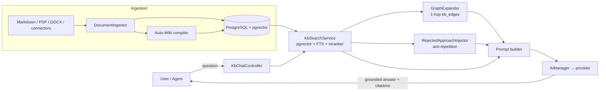

## What AskMyDocs is

**AskMyDocs is a self-hostable AI hub for enterprise knowledge.** It fuses
hybrid retrieval-augmented generation (pgvector + full-text search + a reranker),
a **typed canonical knowledge graph** with human-gated promotion, a streaming
chat surface built on the Vercel AI SDK, and a full admin operations cockpit into
a single Laravel platform.

It is the open-source, on-prem alternative to Glean / Notion AI / ChatGPT
Enterprise — **without** the per-seat lock-in or the six-figure on-prem contract.

<Note>
  Most "RAG over docs" tools treat your knowledge base as a pile of
  interchangeable chunks: they re-discover the answer from zero on every query,
  never persist what your team has *already decided*, and re-propose options that
  were explicitly dismissed three quarters ago. AskMyDocs is built around the
  opposite premise — that an enterprise KB is **institutional memory**, not a
  vector index.
</Note>

## How it fits together

## The six moats

These are the differentiators no other public RAG platform — open-source or SaaS —
currently ships. Each links to the page that explains the theory, the design, and
the decision rationale in depth.

<CardGroup cols={2}>
  <Card title="Human-gated canonical promotion" icon="user-check" href="/core-concepts">
    A three-stage pipeline holds the LLM at "draft"; only humans and operators
    commit canonical storage. Immutable editorial audit trail.
  </Card>
  <Card title="Institutional memory + anti-repetition" icon="brain" href="/institutional-memory">
    A retrieval-time knowledge graph folds in neighbours, and a ⚠ firewall stops
    the LLM re-proposing approaches your team already rejected.
  </Card>
  <Card title="Self-compiling Auto-Wiki" icon="wand-magic-sparkles" href="/anti-hallucination-firewall">
    A second-class <code>auto</code> tier the system builds and maintains itself —
    behind an anti-hallucination firewall that always ranks human &gt; auto &gt; raw.
  </Card>
  <Card title="Field-level PII redaction" icon="shield-halved" href="https://github.com/lopadova/AskMyDocs">
    GDPR-grade redaction wired at every persistence boundary, default-off and
    granular per touch-point — not just data residency.
  </Card>
  <Card title="MIT, self-hostable, on-prem" icon="lock-open" href="/installation">
    Runs on any Laravel + PostgreSQL + pgvector host. Zero vendor lock-in; the
    entire sister-package stack is MIT and independently reusable.
  </Card>
  <Card title="Eval-harness CI gate" icon="flask" href="https://github.com/lopadova/AskMyDocs">
    A RAG regression gate on every PR plus nightly LLM-as-judge and adversarial
    cohorts — an out-of-the-box eval surface nobody else publicly ships.
  </Card>
</CardGroup>

## Who it is for

- **Enterprise teams** ingesting architectural decisions, runbooks, standards,
  incidents and domain concepts into a *navigable* KB.
- **Regulated-industry operators** (GDPR, EU AI Act) needing field-level PII
  redaction and an immutable audit trail at every persistence boundary.
- **Engineering orgs** that want LLMs to stop re-proposing rejected approaches.
- **Anyone allergic to vendor lock-in** who wants Glean-class capability on
  infrastructure they own.

## Where to go next

<CardGroup cols={3}>
  <Card title="Quickstart" icon="bolt" href="/quickstart">
    Ask your first grounded question in five minutes.
  </Card>
  <Card title="Core concepts" icon="diagram-project" href="/core-concepts">
    The canonical layer, the graph, evidence tiers, and the firewall.
  </Card>
  <Card title="Architecture" icon="sitemap" href="/architecture/overview">
    The full system design, request lifecycle, and decision rationale.
  </Card>
</CardGroup>
