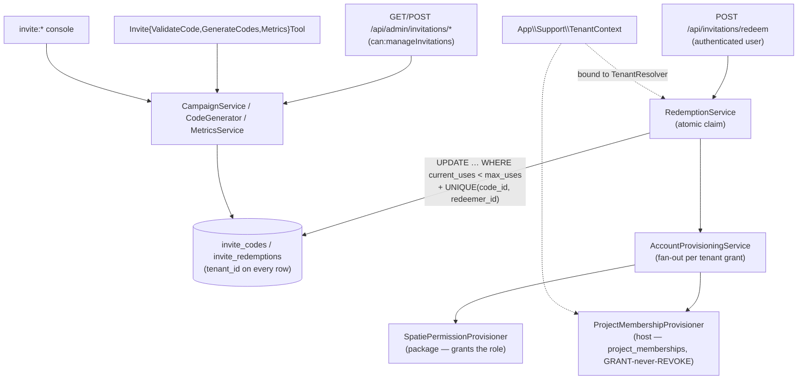

## Motivation

A closed-beta or seat-controlled product needs more than "send a magic link".
It needs **campaigns** (a launch wave, an investor list, a conference QR), codes
that are **multi-use or single-use or vanity**, **referrals** that reward the
referrer when the invitee converts, a **waitlist** with queue-jumping, and an
**anti-abuse** layer so a leaked code can't be farmed into thousands of free
seats — all of it **multi-tenant**, because two customers may legitimately mint
the same human-readable code.

AskMyDocs gets this from the standalone
[`padosoft/laravel-invitations`](https://github.com/padosoft/laravel-invitations)
engine rather than re-implementing it inline. The package is **vendor-neutral**:
it types against interfaces (`TenantResolver`, `Provisioner`, `InvitedAccount`),
not against `App\Models\User` or AskMyDocs's tenant context. The host's job is to
*bind those seams* — and to decide what an accepted invite actually grants.

That decision is the interesting part. In AskMyDocs an invite carries a
per-tenant **grant**: a Spatie role **and** a set of KB **project memberships**.
So a single code can onboard a user into the right tenant, with the right role,
scoped to the right projects, in one redemption.

## Theory — where the coupling lives

The engine is ~80% domain-agnostic. The only host-specific surface is *what
happens after a redemption commits* — applying the grant. The package isolates
that behind two contracts and a tag:

- **`TenantResolver`** — `current(): string`. Every invite table carries
  `tenant_id`; every query is scoped through this resolver. A plain app gets the
  package's single-tenant default; a multi-tenant host binds its own.
- **`InvitedAccount`** — `getInviteEmail(): ?string` + `getInviteGuardName():
  string`. The engine reads only these two account attributes (email for
  abuse-correlation hashing, guard for role provisioning) so it never couples to
  a concrete user class.
- **`Provisioner`** (tagged `invitations.provisioners`) — `provision(Model
  $account, TenantGrant $grant): void`. The package ships
  `SpatiePermissionProvisioner` (grants the role); a host adds more under the
  same tag. Two invariants the contract mandates: **GRANT-never-REVOKE** (only
  ever raise access) and **best-effort** (a fault is swallowed + logged, never
  thrown — the redemption is *already committed* when provisioning runs).

AskMyDocs satisfies all three without touching the engine. That is the whole
integration: three bindings and a config.

## Design



Three things the host wires, all in `App\Providers\AppServiceProvider::boot()`
so they win over the package's `packageRegistered()` defaults (the same
boot-vs-register ordering AskMyDocs uses for its MCP and evidence-risk-review
adapters):

1. **`TenantResolver` → `App\Support\TenantContext`.** An anonymous class adapts
   the host context's `current()` to the package contract. The package binds its
   single-tenant default with `bindIf()`; an explicit `bind()` in `boot()`
   overrides it definitively. Result: every invite read/write is scoped to the
   tenant the request resolved (R30).
2. **`App\Invitations\ProjectMembershipProvisioner` → the
   `invitations.provisioners` tag.** Appended to the tag alongside the package's
   `SpatiePermissionProvisioner`. The package's contextual
   `giveTagged('invitations.provisioners')` for `AccountProvisioningService`
   resolves the tag lazily at redemption time, so both provisioners run: the
   Spatie one raises the global role, ours raises per-project access.
3. **`manageInvitations` gate + `config/invitations.php`.** The package routes
   carry no internal authorization — admin gating is entirely the host
   `admin_middleware` config (R32). AskMyDocs sets it to its standard admin stack
   plus `can:manageInvitations`.

## Data model

The package owns 9 tenant-aware tables (created by its own migrations, R30/R31
enforced in its CI):

| Table | Holds |
|---|---|
| `invite_campaigns` | a named wave with a default grant |
| `invite_codes` | a code (multi-use / single-use / vanity) with `current_uses` / `max_uses` and its own grant override |
| `invitations` | a direct, addressed invitation (high-entropy link token) |
| `invite_redemptions` | the claim ledger — `UNIQUE(code_id, redeemer_id)` is the idempotency + concurrency anchor |
| `invite_referrals` | referrer → invitee links for the K-factor loop |
| `invite_rewards` | the reward ledger (states + reversal) |
| `invite_waitlist` | waitlist entries with queue-jump on referral |
| `invite_abuse_signals` | rolling fraud signals (HMAC'd subjects, never plaintext) |
| `invite_analytics_events` | funnel + virality events |

The host adds **nothing** to its own schema — an accepted invite writes into the
existing `project_memberships` table (via the provisioner) and assigns an
existing Spatie role.

The **grant** is a pure value object (`TenantGrant`): `tenantId`, `role`,
`projects[]`, `projectRole`, `scopeAllowlist`. An invite can carry several, so
one code provisions across one *or more* tenants ("teams") at once.

## Decision rationale

The load-bearing choices (ADR-style; cross-links to [the ADR
index](/architecture/decisions)):

- **Reuse the standalone engine, bind the seams — don't fork it inline.** The
  invite engine is general-purpose and battle-tested; AskMyDocs is one consumer.
  Keeping it a package means its concurrency-safety and anti-abuse logic improve
  for every consumer at once, and AskMyDocs only owns the ~70-line provisioner +
  the bindings.
- **Atomic redemption is the engine's, and it is not negotiable.** Seat-count
  safety comes from a single conditional `UPDATE … WHERE current_uses <
  max_uses` plus `UNIQUE(code_id, redeemer_id)` — never a read-then-write. Two
  concurrent redemptions of the last seat cannot both win (mirrors AskMyDocs's
  own R21 "security invariants are atomic or absent").
- **GRANT-never-REVOKE provisioning.** `ProjectMembershipProvisioner` uses
  `firstOrCreate` on `(tenant_id, user_id, project_key)`. A pre-existing
  membership at a higher role is **never** downgraded; an invite can only *raise*
  access. This makes redemption safe to replay and safe to over-grant.
- **Best-effort provisioning.** The redemption commits first; provisioning runs
  after. A provisioning fault is logged (with the exception class for triage) and
  swallowed — a transient DB hiccup while writing a membership must not roll back
  a redemption the user already sees as successful.
- **`INVITE_REQUIRED` defaults OFF (R43 both-states).** Installing the package
  does not silently turn AskMyDocs into a closed beta. The signup gate is strict
  opt-in; both the OFF path (registration unchanged) and the ON path (code
  required) are covered by tests.
- **The 9 invite tables stay package-owned.** They are not added to the host
  `TenantIdMandatoryTest` enumeration (which only iterates `App\Models\*`) — the
  package enforces R30/R31 on its own models in its own CI, exactly as the
  `askmydocs-connector-base` tables do.

## Worked example — a launch-wave campaign that grants editor + two projects

```php
// 1. A campaign whose codes grant the 'editor' role + membership in two projects,
//    in the current tenant.
$campaign = app(\Padosoft\Invitations\Services\CampaignService::class)->create([
    'name'  => 'Launch wave',
    'grant' => [
        'role'         => 'editor',
        'projects'     => ['hr-portal', 'engineering'],
        'project_role' => 'member',
    ],
]);

// 2. Generate 100 single-use codes for it (PHP surface; same as
//    POST /api/admin/invitations/codes and the InviteGenerateCodesTool MCP tool).
$codes = app(\Padosoft\Invitations\Services\CodeGenerator::class)
    ->generate($campaign->id, count: 100, maxUses: 1);
```

When a logged-in user posts one of those codes to `POST
/api/invitations/redeem`, the engine claims the seat atomically and then fans the
grant out to both provisioners: the user is assigned the `editor` Spatie role and
gains `member` `project_memberships` rows on `hr-portal` and `engineering` —
scoped to the redemption tenant. Re-redeeming (or a code that grants a project
the user already owns at a higher role) changes nothing: GRANT-never-REVOKE.

Read the funnel three ways (R44) — `GET /api/admin/invitations/metrics`, the
`InviteMetricsTool` MCP tool, or `MetricsService::summary()` in PHP.

## Gotchas

- **`manageInvitations` is super-admin + admin.** Issuing access-granting codes
  is an administrative act; dpo / editor / viewer are excluded. The user *redeem*
  surface (`/api/invitations/*`) only requires authentication — any logged-in
  account may redeem a code it holds.
- **Provisioning runs in the redemption tenant *and* any explicit grant
  tenants.** A grant's `tenantId` is authoritative for that slice — a single code
  can seed memberships in several tenants at once. The host provisioner writes
  each membership in **its grant's** tenant, not the request's active tenant.
- **A provisioning failure never fails the redemption.** If you don't see a
  membership after a successful redeem, check the logs for
  `invitations.provision.project_membership_failed` (it carries the exception
  class) — the redemption itself still succeeded by design.
- **Flipping `INVITE_REQUIRED=true` is a product decision, not a deploy detail.**
  With it on, registration *requires* a valid code. Verify your invite-issuing
  flow is live before enabling it, or new signups are blocked.
- **The admin React screens are a separate package.** Campaign builder / code
  table / funnel dashboard ship in `padosoft/laravel-invitations-admin`; the
  native AskMyDocs admin screens are a deferred follow-up. This release wires the
  PHP + HTTP + MCP backend.
