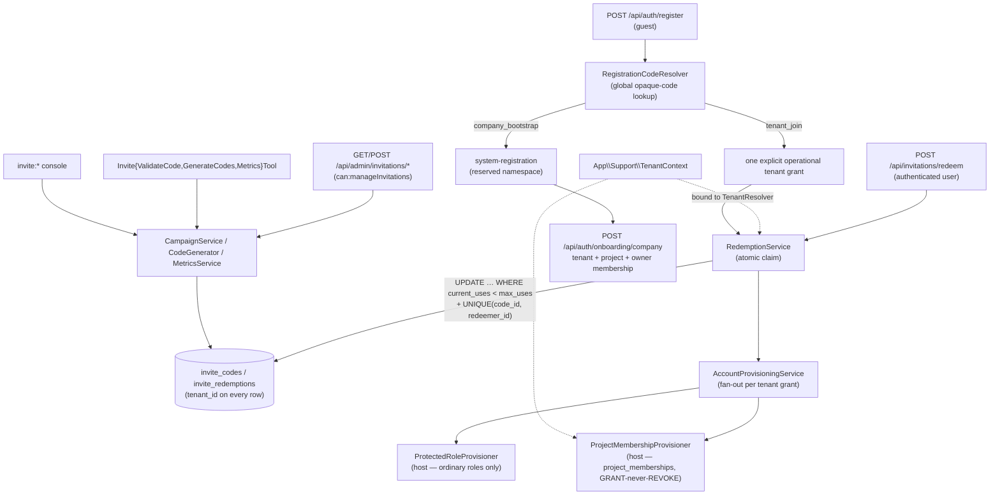

## Motivation

A closed-beta or seat-controlled product needs more than "send a magic link".
It needs **campaigns** (a launch wave, an investor list, a conference QR), codes
that are **multi-use or single-use or vanity**, **referrals** that reward the
referrer when the invitee converts, a **waitlist** with queue-jumping, and an
**anti-abuse** layer so a leaked code can't be farmed into thousands of free
seats — all of it **multi-tenant**, because two customers may legitimately mint
codes for different operational purposes. AskMyDocs additionally uses invitation
codes as public registration credentials, so their normalized plaintext identity
is globally unique even though every package row remains tenant-partitioned.

AskMyDocs gets this from the standalone
[`padosoft/laravel-invitations`](https://github.com/padosoft/laravel-invitations)
engine rather than re-implementing it inline. The package is **vendor-neutral**:
it types against interfaces (`TenantResolver`, `Provisioner`, `InvitedAccount`),
not against `App\Models\User` or AskMyDocs's tenant context. The host's job is to
*bind those seams* — and to decide what an accepted invite actually grants.

That decision is the interesting part. In AskMyDocs an invite carries a
per-tenant **grant**: a Spatie role **and** a set of KB **project memberships**.
So a single code can onboard a user into the right tenant, with the right role,
scoped to the right projects, in one redemption.

## Theory — where the coupling lives

The engine is ~80% domain-agnostic. The only host-specific surface is *what
happens after a redemption commits* — applying the grant. The package isolates
that behind two contracts and a tag:

- **`TenantResolver`** — `current(): string`. Every invite table carries
  `tenant_id`; every query is scoped through this resolver. A plain app gets the
  package's single-tenant default; a multi-tenant host binds its own.
- **`InvitedAccount`** — `getInviteEmail(): ?string` + `getInviteGuardName():
  string`. The engine reads only these two account attributes (email for
  abuse-correlation hashing, guard for role provisioning) so it never couples to
  a concrete user class.
- **`Provisioner`** (tagged `invitations.provisioners`) — `provision(Model
  $account, TenantGrant $grant): void`. The package ships
  `SpatiePermissionProvisioner` (grants ordinary roles); AskMyDocs replaces its
  service binding with `ProtectedRoleProvisioner` so neither `super-admin` nor
  `system-admin` can be minted by redemption, and adds more provisioners under
  the same tag. Two invariants the contract mandates: **GRANT-never-REVOKE** (only
  ever raise access) and **best-effort** (a fault is swallowed + logged, never
  thrown — the redemption is *already committed* when provisioning runs).

AskMyDocs satisfies all three without touching the engine. That is the whole
integration: three bindings and a config.

## Design


```mermaid
flowchart TD
    Redeem["POST /api/invitations/redeem<br/>(authenticated user)"] --> RS["RedemptionService<br/>(atomic claim)"]
    RS -->|"UPDATE … WHERE current_uses < max_uses<br/>+ UNIQUE(code_id, redeemer_id)"| DB[("invite_codes / invite_redemptions<br/>(tenant_id on every row)")]
    RS --> APS["AccountProvisioningService<br/>(fan-out per tenant grant)"]
    APS --> P1["ProtectedRoleProvisioner<br/>(host — ordinary roles only)"]
    APS --> P2["ProjectMembershipProvisioner<br/>(host — project_memberships, GRANT-never-REVOKE)"]
    TR["App\\Support\\TenantContext"] -.->|"bound to TenantResolver"| RS
    TR -.-> P2
    Admin["GET/POST /api/admin/invitations/*<br/>(can:manageInvitations)"] --> Core["CampaignService / CodeGenerator / MetricsService"]
    MCP["Invite{ValidateCode,GenerateCodes,Metrics}Tool"] --> Core
    CLI["invite:* console"] --> Core
    Core --> DB
    Guest["POST /api/auth/register<br/>(guest)"] --> Resolver["RegistrationCodeResolver<br/>(global opaque-code lookup)"]
    Resolver -->|"company_bootstrap"| System["system-registration<br/>(reserved namespace)"]
    Resolver -->|"tenant_join"| Grant["one explicit operational tenant grant"]
    System --> Onboarding["POST /api/auth/onboarding/company<br/>tenant + project + owner membership"]
    Grant --> RS
```

Three things the host wires, all in `App\Providers\AppServiceProvider::boot()`
so they win over the package's `packageRegistered()` defaults (the same
boot-vs-register ordering AskMyDocs uses for its MCP and evidence-risk-review
adapters):

1. **`TenantResolver` → `App\Support\TenantContext`.** An anonymous class adapts
   the host context's `current()` to the package contract. The package binds its
   single-tenant default with `bindIf()`; an explicit `bind()` in `boot()`
   overrides it definitively. Result: every invite read/write is scoped to the
   tenant the request resolved (R30).
2. **Protected role binding + `ProjectMembershipProvisioner`.** The package's
   `SpatiePermissionProvisioner` service key resolves to
   `App\Invitations\ProtectedRoleProvisioner`, which preserves
   grant-never-revoke for ordinary roles while rejecting both protected admin
   boundaries. `App\Invitations\ProjectMembershipProvisioner` is added to the
   `invitations.provisioners` tag alongside the replaced package provisioner
   service key. The package's contextual
   `giveTagged('invitations.provisioners')` for `AccountProvisioningService`
   resolves the tag lazily at redemption time, so both provisioners run: the
   protected adapter raises an ordinary application role, while the membership
   adapter raises per-project access.
3. **`manageInvitations` gate + `config/invitations.php`.** The package routes
   carry no internal authorization — admin gating is entirely the host
   `admin_middleware` config (R32). AskMyDocs sets it to its standard admin stack
   plus `can:manageInvitations`.

## Data model

The package owns 9 tenant-aware tables (created by its own migrations, R30/R31
enforced in its CI):

| Table | Holds |
|---|---|
| `invite_campaigns` | a named wave with a default grant |
| `invite_codes` | a code (multi-use / single-use / vanity) with `current_uses` / `max_uses` and its own grant override |
| `invitations` | a direct, addressed invitation (high-entropy link token) |
| `invite_redemptions` | the claim ledger — `UNIQUE(code_id, redeemer_id)` is the idempotency + concurrency anchor |
| `invite_referrals` | referrer → invitee links for the K-factor loop |
| `invite_rewards` | the reward ledger (states + reversal) |
| `invite_waitlist` | waitlist entries with queue-jump on referral |
| `invite_abuse_signals` | rolling fraud signals (HMAC'd subjects, never plaintext) |
| `invite_analytics_events` | funnel + virality events |

The host keeps the package tables as the invitation source of truth, but adds two
database invariants required by public registration:

- `invite_codes.code` has the global unique index
  `uq_invite_codes_code_global`, because a guest has no tenant context from which
  to begin lookup;
- the existing `tenants` registry gains `is_system` (boolean, default `false`)
  and an idempotently seeded `system-registration` row with `is_system=true`.

An accepted tenant-linked invite writes into the existing
`project_memberships` table (via the provisioner) and assigns an existing
ordinary Spatie role. A company-bootstrap invite writes no membership at
registration time.

The **grant** is a pure value object (`TenantGrant`): `tenantId`, `role`,
`projects[]`, `projectRole`, `scopeAllowlist`. An invite can carry several, so
one code provisions across one *or more* tenants ("teams") at once.
That remains true for the package's authenticated redemption surface. The public
registration resolver is intentionally narrower: it accepts exactly one tenant
grant for `tenant_join`, or an empty grant for `company_bootstrap`.

## Decision rationale

The load-bearing choices (ADR-style; cross-links to [the ADR
index](/architecture/decisions)):

- **Reuse the standalone engine, bind the seams — don't fork it inline.** The
  invite engine is general-purpose and battle-tested; AskMyDocs is one consumer.
  Keeping it a package means its concurrency-safety and anti-abuse logic improve
  for every consumer at once, and AskMyDocs only owns the ~70-line provisioner +
  the bindings.
- **Atomic redemption is the engine's, and it is not negotiable.** Seat-count
  safety comes from a single conditional `UPDATE … WHERE current_uses <
  max_uses` plus `UNIQUE(code_id, redeemer_id)` — never a read-then-write. Two
  concurrent redemptions of the last seat cannot both win (mirrors AskMyDocs's
  own R21 "security invariants are atomic or absent").
- **GRANT-never-REVOKE provisioning.** `ProjectMembershipProvisioner` uses
  `firstOrCreate` on `(tenant_id, user_id, project_key)`. A pre-existing
  membership at a higher role is **never** downgraded; an invite can only *raise*
  access. This makes redemption safe to replay and safe to over-grant.
- **Best-effort provisioning.** The redemption commits first; provisioning runs
  after. A provisioning fault is logged (with the exception class for triage) and
  swallowed — a transient DB hiccup while writing a membership must not roll back
  a redemption the user already sees as successful.
- **`INVITE_REQUIRED` defaults OFF (R43 both-states) at package level.**
  Installing the package does not force its generic redemption middleware into
  closed-beta mode. AskMyDocs's host `POST /api/auth/register` contract is
  separately and always invite-only; this flag cannot open public signup.
- **The 9 invite tables stay package-owned.** They are not added to the host
  `TenantIdMandatoryTest` enumeration (which only iterates `App\Models\*`) — the
  package enforces R30/R31 on its own models in its own CI, exactly as the
  `askmydocs-connector-base` tables do.
- **A reserved slug, not a reserved numeric ID range.** Tenant-aware foreign
  keys use the string slug as `tenant_id`; the optional registry's numeric
  primary key carries no authorization meaning. `system-registration` therefore
  provides a stable technical namespace without moving operational tenant IDs
  or introducing a second invitation table. See ADR 0025.

## Worked example — a launch-wave campaign that grants editor + two projects

```php
// 1. A campaign whose codes grant the 'editor' role + membership in two projects,
//    in the current tenant.
$campaign = app(\Padosoft\Invitations\Services\CampaignService::class)->create([
    'name'  => 'Launch wave',
    'grant' => [
        'role'         => 'editor',
        'projects'     => ['hr-portal', 'engineering'],
        'project_role' => 'member',
    ],
]);

// 2. Generate 100 single-use codes for it (PHP surface; same as
//    POST /api/admin/invitations/codes and the InviteGenerateCodesTool MCP tool).
$codes = app(\Padosoft\Invitations\Services\CodeGenerator::class)
    ->generate($campaign->id, count: 100, maxUses: 1);
```

When a logged-in user posts one of those codes to `POST
/api/invitations/redeem`, the engine claims the seat atomically and then fans the
grant out to both provisioners: the user is assigned the `editor` Spatie role and
gains `member` `project_memberships` rows on `hr-portal` and `engineering` —
scoped to the redemption tenant. Re-redeeming (or a code that grants a project
the user already owns at a higher role) changes nothing: GRANT-never-REVOKE.

Read the funnel three ways (R44) — `GET /api/admin/invitations/metrics`, the
`InviteMetricsTool` MCP tool, or `MetricsService::summary()` in PHP.

## Worked example — public registration with or without an existing company

The trusted public issuer is the `registration-invite:create` Artisan command.
Omit `--tenant` to authorize creation of a new company:

```bash
php artisan registration-invite:create --uses=1
```

The returned code has the `company_bootstrap` intent and an empty grant. After
registration the account session is valid, but `/api/auth/me` returns
`onboarding.required=true` and no teams. `/app` routes to `/app/onboarding`.
Submitting the company form calls:

```http
POST /api/auth/onboarding/company
Content-Type: application/json

{
  "company_name": "Acme S.p.A.",
  "tenant_slug": "acme",
  "project_key": "acme-kb"
}
```

One transaction creates the active tenant, initial project and `owner`
membership; the creator receives the tenant `super-admin` role. Reloading or
logging in again before this request succeeds returns to the same onboarding
gate.

To invite a person into an existing company instead:

```bash
php artisan registration-invite:create \
  --tenant=acme \
  --project=acme-kb \
  --role=viewer \
  --membership-role=member \
  --uses=1
```

The issuer verifies that `acme` is active/non-system and that `acme-kb` belongs
to it. Registration redeems the one-tenant grant and the SPA opens that tenant
directly, without showing company onboarding.

## Admin UI — native, in-app

The admin surface is a **native tabbed page** at `/app/{team}/admin/invitations`,
inside the unified admin chrome and team switcher — not a new tab. Every tab
reads the same `/api/admin/invitations/*` core that the MCP tools and PHP
services use (R44 — one core, many surfaces), so the UI is a thin consumer with
no parallel backend. The `X-Tenant-Id` header rides the shared SPA client, so
every read is tenant-scoped automatically (R30).

| Tab | What it shows / does | Core endpoint(s) |
|---|---|---|
| **Overview** | all 11 live funnel KPIs (k-factor, acceptance / conversion rate, time-to-redeem p50/p90, distinct referrers…) + a proportional acquisition funnel; campaign + window filters | `GET …/metrics` |
| **Campaigns** | list + create/edit with the **multi-tenant grant editor** (a Spatie role + KB projects across one or more tenants); `key` + `type` are immutable on edit; `super-admin` and `system-admin` are rejected client- and server-side/host-boundary | `GET/POST …/campaigns`, `PATCH …/campaigns/{id}`, `GET …/tenants` |
| **Codes** | inventory + batch generation (count 1–1000, max-uses, length, expiry) with Copy-all + CSV export, and inline-confirm revoke | `GET/POST …/codes`, `POST …/codes/{id}/revoke` |
| **Invite** | send a direct invitation (recipient / channel / role / context); session-scoped sent list, since the core API has no list endpoint | `POST …/invitations` |
| **Referrals / Rewards / Waitlist / Anti-abuse** | filtered read tables; the waitlist email is masked and anti-abuse subjects stay server-hashed | `GET …/{referrals,rewards,waitlist,abuse-signals}` |

Two deliberate honesties:

- **Truncation is visible.** The core read surfaces cap at 500 rows with no
  pagination; when a table hits the cap it shows a *"first 500 rows — refine the
  filters"* notice rather than pretending the list is complete (R3/R14).
- **The "Advanced" panel link is gated on a server-truthful flag.** The
  standalone `padosoft/laravel-invitations-admin` panel (campaign builder +
  multi-tenant grant editor — the parts not yet native) is offered as an
  **"Advanced"** launcher *only when* `INVITATIONS_ADMIN_ENABLED=true`. The SPA
  learns this from the additive `features.invitations_admin` field on
  `/api/auth/me` (R27); when the mount is OFF the package route is unregistered
  and the link is hidden, so it never dead-ends on the `/admin/invitations` 404
  (R14/R43).

## Invite-only sign-up (SPA registration)

Since v8.26 the public auth UI is **entirely React**: `/login`, `/register`,
`/forgot-password` and `/reset-password` all render the SPA shell (`view('app')`
via `SpaController`) even on a hard page load, so a cache-cleared reload no longer
falls back to the old Blade auth page (those views, and the web
`PasswordResetController`, were removed).

The `/register` screen posts to **`POST /api/auth/register`** — a guest route in
the `web` middleware group, throttled `6/min` per IP (`throttle:register`, defined
in `AppServiceProvider`) so it can't be used to brute-force invite codes. The
controller is a thin HTTP adapter over the same invite core (R44) and follows a
deliberate order so the invite-only invariant can never leak:

1. **Resolve and pre-validate** the globally unique opaque code with
   `RegistrationCodeResolver`, which delegates state/capacity validation to
   `CodeValidator`, *before* touching `users` — an invalid / expired / exhausted
   code never mints an orphan account.
2. **Create** the account (no role yet).
3. **Redeem authoritatively** with `RedemptionService` (the atomic conditional
   `UPDATE … WHERE current_uses < max_uses` + the tagged Spatie-role / project
   provisioners). Redeem runs **outside** any DB transaction by design: on
   PostgreSQL a UNIQUE-violation aborts the connection for the rest of a
   transaction, which would poison the package's compensation follow-ups. On an
   exhausted-between-checks race the brand-new account is **force-deleted**.
4. **Floor** the account at `viewer` (layered on any grant role redeem already
   provisioned — GRANT-never-revoke), open the SPA session, fire `Registered`.

The resolver then determines the post-registration state:

- `tenant_join` must contain exactly one explicit grant to an active
  operational tenant and real projects. Redemption provisions the membership,
  so `/app` opens the tenant directly.
- `company_bootstrap` must contain an empty grant. The account remains without
  memberships and `/app` forces resumable company onboarding.

The technical namespace and the legacy literal `default` never appear as
operational teams. A normal account with zero operational memberships receives
the same onboarding requirement on every login; a `platform.admin` identity
instead enters the global system control plane.

Every invite-code failure is mapped to a **422 field error on `invite_code`**
(R14 — never a 200 with an empty body) with a localized message
(`lang/{en,it}/register.php`; the machine-readable `RedemptionError` stays
English, R24). `invite_code` is **always required** at this endpoint regardless of
the `INVITE_REQUIRED` gate — the host SPA sign-up endpoint is invite-only by
product decision. The `INVITE_REQUIRED` / `invitations.invitation_required` flag is
the **package-level** gate (read by `padosoft/laravel-invitations`, not by the host
register endpoint), so flipping it does **not** open a non-invite registration path
on AskMyDocs.

## Gotchas

- **`manageInvitations` is super-admin + admin.** Issuing access-granting codes
  is an administrative act; dpo / editor / viewer are excluded. The user *redeem*
  surface (`/api/invitations/*`) only requires authentication — any logged-in
  account may redeem a code it holds.
- **Provisioning runs in the redemption tenant *and* any explicit grant
  tenants.** A grant's `tenantId` is authoritative for that slice — a single code
  can seed memberships in several tenants at once. The host provisioner writes
  each membership in **its grant's** tenant, not the request's active tenant.
- **A provisioning failure never fails the redemption.** If you don't see a
  membership after a successful redeem, check the logs for
  `invitations.provision.project_membership_failed` (it carries the exception
  class) — the redemption itself still succeeded by design.
- **`INVITE_REQUIRED` does not control host registration.** The host
  `/api/auth/register` request always requires `invite_code`; the flag only
  changes package-level generic invitation middleware.
- **Do not issue public registration codes from `default`.** Use
  `registration-invite:create`; its codes live in `system-registration`, carry a
  validated intent and cannot accidentally grant access to the technical
  namespace.
- **Campaign creation writes a grant — protected admins stay out.** The
  campaign builder's grant editor provisions a Spatie role + KB projects across
  one or more tenants on redemption; `super-admin` and `system-admin` are
  rejected and a campaign's `key` + `type` are immutable after creation (the
  update rules don't accept them). The standalone
  `padosoft/laravel-invitations-admin` panel remains reachable via the gated
  **"Advanced"** launcher (`INVITATIONS_ADMIN_ENABLED=true`) for parity, but the
  native tabs now cover the full create/edit/send surface.
