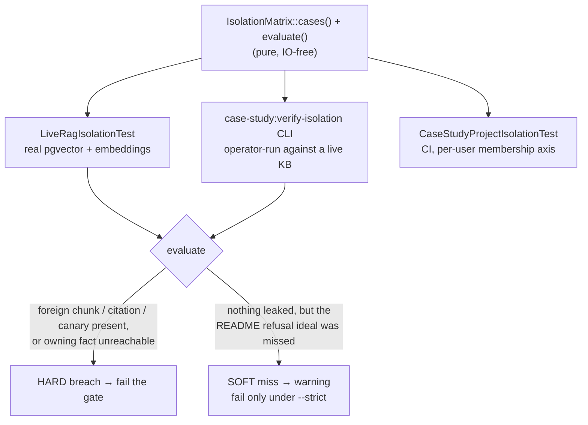

## Motivation

[Multi-tenant isolation](/multi-tenant-isolation) is enforced by R30 scoping and an
architecture test that inspects the code. But the highest-value question an operator
asks is empirical, not static: *"with my real corpus ingested, can user A or
project A actually retrieve B's content?"* Answering that needs a check that runs
against a **real** pgvector index with **real** embeddings — and one that does not
cry wolf when the model merely phrases a refusal imperfectly.

The **isolation matrix** is that check. It is a single executable specification of
the isolation cases, consumed identically by an automated test and an operator CLI,
so the two can never drift.

## Design — one matrix, two surfaces



| Surface | Path | Runs where |
|---|---|---|
| Shared matrix | `app/Support/CaseStudy/IsolationMatrix.php` | pure logic — `cases()` + `evaluate()`, no I/O |
| Live E2E | `tests/Live/Rag/LiveRagIsolationTest.php` | opt-in: `LIVE_RAG=1` + real provider key + reachable pgvector; throwaway tenant, full teardown |
| Operator CLI | `app/Console/Commands/CaseStudyVerifyIsolationCommand.php` | `php artisan case-study:verify-isolation` against an already-ingested KB |
| Per-user axis | `tests/Feature/Rbac/CaseStudyProjectIsolationTest.php` | CI (SQLite) — proves membership-based isolation through the real `AccessScopeScope` |
| Fixtures | `database/seeders/CaseStudyUsersSeeder.php` | per-user, single-project memberships for the membership axis |

## HARD vs SOFT — the key distinction

Coupling an *isolation* test to *refusal-threshold calibration* would make it flaky
and untrustworthy. The matrix keeps them apart:

- **HARD breach** — a real leak: a foreign chunk, citation, or canary string
  surfaces in the retrieved set, **or** an owning tenant/project's own fact is
  unreachable. This always **fails** the gate.
- **SOFT miss** — nothing leaked, but the model did not produce the README's *ideal*
  refusal wording. This is a **warning**; it fails only under `--strict`.

The SOFT check is guarded on `hard === []`, so a real leak can never be downgraded
to a warning.

## Why it catches real regressions

`evaluate()` reads `project_key` off the **chunk** (not the document relation),
mirroring the provenance regression class fixed in v8.8, and the negative cases
assert that specific **foreign canaries** are absent from the retrieved haystack. If
the hard `where project_key IN (…)` retrieval filter ever relaxed to a soft boost,
foreign chunks would surface and the canary assertion would fire — so the matrix
fails loudly instead of passing vacuously.

## R43 — both states of project isolation

`CaseStudyProjectIsolationTest` exercises `KB_PROJECT_ISOLATION_ENABLED` in **both**
states: **OFF**, a user without `kb.read.all_projects` still sees all seeded
projects; **ON**, `canReadAllProjects()` returns false and `KnowledgeDocument`
queries are confined to the user's memberships — each company user sees only its own
canary, not the other two. Flipping the flag holds no surprises.

## Worked example

```bash
# Operator: verify isolation against the live KB (warnings allowed)
php artisan case-study:verify-isolation

# Strict gate: SOFT refusal-ideal misses also fail (use in a release gate)
php artisan case-study:verify-isolation --strict

# Full retrieval-level proof with real pgvector + embeddings (opt-in)
LIVE_RAG=1 vendor/bin/phpunit tests/Live/Rag/LiveRagIsolationTest.php
```

## Gotchas

- **The live test is opt-in.** In normal CI it `markTestSkipped`s (no provider key / no pgvector); the *retrieval-level* guarantee is only proven when an operator runs it. The membership axis (`CaseStudyProjectIsolationTest`) runs in CI on SQLite and covers the RBAC half continuously.
- **HARD vs SOFT is deliberate.** Don't promote SOFT refusal-wording misses to failures outside `--strict` — that re-couples isolation to model-phrasing calibration and reintroduces flakiness.
- **Teardown is R41-safe.** The live test cleans up its throwaway tenant (including the FK-less `kb_canonical_audit` rows) and runs `cleanup()` before `parent::tearDown()`.

See also: [Multi-tenant isolation](/multi-tenant-isolation), [The team switcher](/team-switcher).
