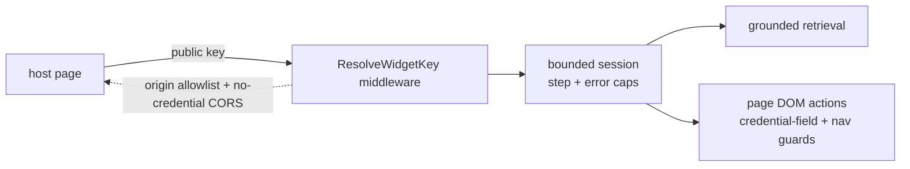

## Motivation

Most "chat widget" products are a stateless text box bolted to a generic LLM.
**KITT** is the embeddable surface of the *same* AskMyDocs retrieval + agentic
stack — so a public website gets grounded, cited answers backed by your canonical
KB, plus optional agentic actions on the page.

## What it does

- **Grounded Q&A with citations** — every answer is backed by your KB, same
  retrieval pipeline as the main chat (see [chat & retrieval](/chat-and-retrieval)).
- **Page-aware** — KITT reads a snapshot of the host page so it can answer about
  what the visitor is looking at.
- **Agentic** — when allowed, the LLM emits tool calls executed in the page DOM
  (`click` / `type` / `select` / `navigate_to` / `submit_form` / `wait_for` + more)
  or server-side via `/exec-tool` (e.g. `search_knowledge_base`), in a bounded
  loop with per-session step + consecutive-error caps.
- **Skills** — JSON manifests under `resources/widget/skills/*` declare which
  tools are available, auto-annotation rules, and run policies.

## Embedding it

```html
<script src="https://your-host/widget/askmydocs-widget.js"
        data-public-key="pk_live_..."></script>
```

The loader reads its config from the script tag (`data-public-key`, optional
`data-api-base`) or from a `window.AskMyDocsWidget` global. The widget
authenticates with that **public key** (minted in the admin under
`/app/admin/widget`, super-admin gated) over a dedicated public channel
(`widget.key` middleware), separate from the Sanctum admin stack. Use
`data-kitt-skip` on any host-page DOM region to keep sensitive content out of the
page snapshot (the `data-kitt-*` attributes annotate the host page for the agent;
they are distinct from the loader's `data-public-key`).

## Security model



KITT enforces tenant isolation, an exact-match origin allowlist, no-credential
CORS, credential-field and navigation guards, and a per-session rate limit. The
inherent risks of a public embeddable agent (public-key abuse, prompt-injection,
data egress to the LLM) and the operator mitigations are documented in the
integration guide's threat-model section.

## Gotchas & operations

- The widget key is **public** — treat it like a publishable key; rotate via the
  admin (super-admin only).
- `data-kitt-skip` is the operator's lever to keep sensitive regions out of the
  snapshot — use it on auth'd/account areas.
- Agentic actions are bounded (step + consecutive-error caps + a snapshot byte
  cap) — these are safety limits, not tuning knobs to crank.

<CardGroup cols={2}>
  <Card title="Chat & retrieval" icon="comments" href="/chat-and-retrieval">
    The grounded retrieval KITT shares with the main chat.
  </Card>
  <Card title="Multi-tenant isolation" icon="building-shield" href="/multi-tenant-isolation">
    How KITT sessions stay scoped to one tenant.
  </Card>
</CardGroup>
