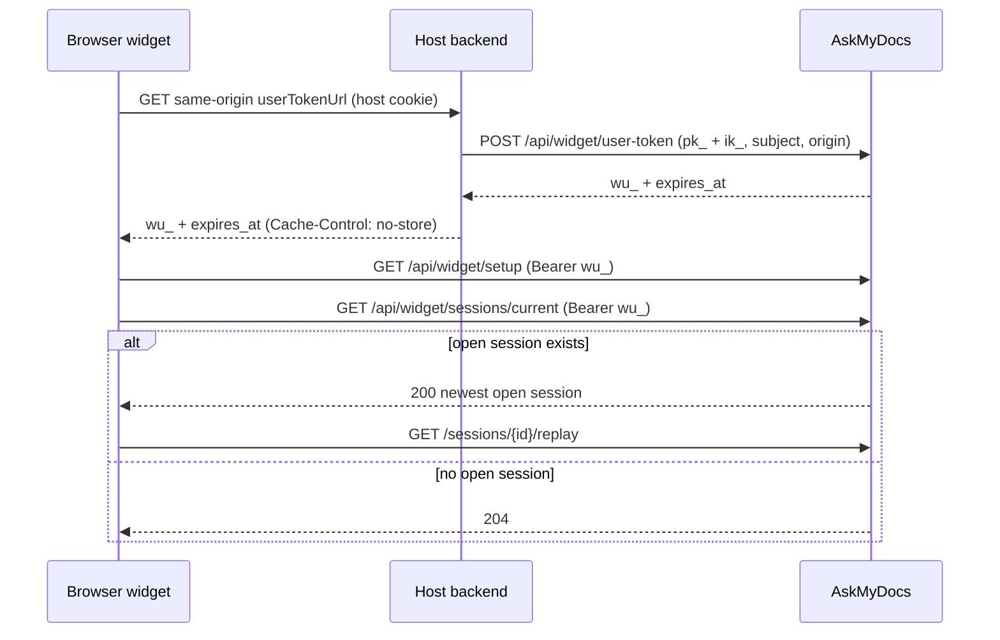
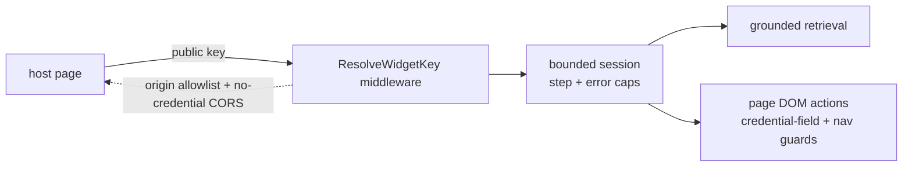

## Motivation

Most "chat widget" products are a stateless text box bolted to a generic LLM.
**KITT** is the embeddable surface of the *same* AskMyDocs retrieval + agentic
stack — so a public website gets grounded, cited answers backed by your canonical
KB, plus optional agentic actions on the page.

## What it does

- **Grounded Q&A with citations** — every answer is backed by your KB, same
  retrieval pipeline as the main chat (see [chat & retrieval](/chat-and-retrieval)).
- **Page-aware** — KITT reads a snapshot of the host page so it can answer about
  what the visitor is looking at.
- **Agentic** — when allowed, the LLM emits tool calls executed in the page DOM
  (`click` / `type` / `select` / `navigate_to` / `submit_form` / `wait_for` + more)
  or server-side via `/exec-tool` (e.g. `search_knowledge_base`), in a bounded
  loop with per-session step + consecutive-error caps.
- **Skills** — JSON manifests under `resources/widget/skills/*` declare which
  tools are available, auto-annotation rules, and run policies.

## Embedding it

```html
<script src="https://your-host/widget/askmydocs-widget.js"
        data-public-key="pk_live_..."></script>
```

The loader reads its config from the script tag (`data-public-key`, optional
`data-api-base`) or from a `window.AskMyDocsWidget` global. The widget
authenticates with that **public key** (minted in the admin under
`/app/admin/widget`, super-admin gated) over a dedicated public channel
(`widget.key` middleware), separate from the Sanctum admin stack. Use
`data-kitt-skip` on any host-page DOM region to keep sensitive content out of the
page snapshot (the `data-kitt-*` attributes annotate the host page for the agent;
they are distinct from the loader's `data-public-key`).

KITT has three layout modes: `helper` (floating launcher), `inline` (fills a
host mount element) and `fullscreen` (always-open viewport). Fullscreen is an
embed-time mode, not an enter/exit toggle inside the chat:

```html
<script>
  window.AskMyDocsWidget = {
    key: 'pk_live_…',
    apiBase: 'https://kb.example.com',
    mode: 'fullscreen',
    userTokenUrl: '/api/askmydocs/widget-user-token'
  };
</script>
<script src="https://kb.example.com/widget/askmydocs-widget.js" defer></script>
```

The fullscreen panel is an accessible `region`, has no launcher/close control,
and does not force focus during bootstrap. While identity and history load it
exposes `data-state="loading"` and `aria-busy="true"` and keeps the composer
disabled.

## Page-native welcome content

Before the first message, KITT can render a branded empty-state card explaining
what the chat is for. Configure a reusable default on the widget key, then let
the host backend override it per page through `window.AskMyDocsWidget.intro`:

```html
<script>
  window.AskMyDocsWidget = {
    key: 'pk_live_…',
    intro: {
      enabled: true,
      variant: 'hero',
      eyebrow: 'Product help',
      title: 'Find the right answer quickly',
      subtitle: 'Grounded in official documentation',
      body: 'Ask about setup, procedures, features and troubleshooting.',
      imageUrl: 'https://cdn.example.com/product-help.webp',
      imageAlt: 'Product help assistant',
      icon: 'sparkles',
      bullets: ['Verified sources', 'Page-aware assistance'],
      suggestions: [
        { label: 'Get started', prompt: 'Explain how to get started' }
      ],
      dismissible: true,
      hideAfterFirstMessage: true
    }
  };
</script>
```

The runtime precedence is key default → host override; `intro: false` disables a
saved card on a specific page. Existing authenticated history suppresses the
card. Suggestion chips send their `prompt` as the first user message. All fields
are bounded plain text, images must use HTTPS and arbitrary HTML is never
accepted, so tenant-controlled content cannot escape the Shadow DOM renderer.

The admin's **Appearance → Welcome** tab provides the same contract with a live
preview. Operators can also inspect or update it with `widget:intro`, while the
read-only `WidgetIntroConfigTool` exposes the resolved configuration to MCP
clients without returning widget credentials.

## Authenticated users and history

Enable **Authenticated users** on a widget key to receive a one-time,
server-only `ik_` credential. The host backend—not browser JavaScript—exchanges
an immutable internal subject for a short-lived, origin-bound `wu_`:


```mermaid
sequenceDiagram
    participant B as Browser widget
    participant H as Host backend
    participant A as AskMyDocs
    B->>H: GET same-origin userTokenUrl (host cookie)
    H->>A: POST /api/widget/user-token (pk_ + ik_, subject, origin)
    A-->>H: wu_ + expires_at
    H-->>B: wu_ + expires_at (Cache-Control: no-store)
    B->>A: GET /api/widget/setup (Bearer wu_)
    B->>A: GET /api/widget/sessions/current (Bearer wu_)
    alt open session exists
        A-->>B: 200 newest open session
        B->>A: GET /sessions/{id}/replay
    else no open session
        A-->>B: 204
    end
```

The subject should be an immutable UUID or a host-side HMAC, not an email.
AskMyDocs stores only a keyed hash. `userTokenUrl` must be same-origin with the
host page, session-protected, and return exactly:

```json
{"token":"wu_…","expires_at":"2026-07-28T12:15:00+00:00"}
```

`GET /api/widget/sessions/current` is separate from paginated history. It
filters `active`, `waiting_user`, and `waiting_tool`, orders by `updated_at
DESC, id DESC`, and returns one row or `204`. Tenant, widget key, project and
pseudonymous identity are enforced on the server, so a different user or key
cannot restore the conversation.

### Credential and token lifecycle

| Operator action | New minting | Existing `wu_` | Existing identity `wt_` |
|---|---|---|---|
| Rotate `ik_` | old `ik_` rejected immediately | valid until TTL | valid until use/TTL |
| Disable user auth | rejected | rejected immediately | rejected immediately |
| Re-enable | new one-time `ik_` | previously issued tokens remain rejected by the disable boundary | previously issued tokens remain rejected |

Every mutation carries the current `identity_credential_version`. A stale
admin tab receives `409 identity_credential_conflict` instead of overwriting a
newer credential. Mutations are tenant-scoped, row-locked, transactional and
audited without plaintext or hashes.

There is no MCP mutation for `ik_`. This is a deliberate R44 exception: a
one-time server credential must not appear in an agent transcript. PHP
(`WidgetIdentityCredentialService` and `widget:identity-credential`) and the
RBAC-gated admin HTTP surface share the same core.

### Operator examples

```bash
php artisan widget:identity-credential status 42 --tenant=acme
php artisan widget:identity-credential rotate 42 --tenant=acme \
  --expected-version=3 --force
```

Admin HTTP adapters:

- `PATCH /api/admin/widget-keys/{id}` with
  `{ "user_auth_enabled": false, "identity_credential_version": 3 }`;
- `POST /api/admin/widget-keys/{id}/rotate-identity-secret` with
  `{ "identity_credential_version": 3 }`.

The plaintext is returned only when enable creates it or rotate replaces it.
Store it in the host secret manager before closing the response.

## Security model


```mermaid
flowchart LR
    PAGE[host page] -->|public key| GATE[ResolveWidgetKey middleware]
    GATE --> SESS[bounded session<br/>step + error caps]
    SESS --> RET[grounded retrieval]
    SESS --> ACT[page DOM actions<br/>credential-field + nav guards]
    GATE -.->|origin allowlist + no-credential CORS| PAGE
```

KITT enforces tenant isolation, an exact-match origin allowlist, no-credential
CORS, credential-field and navigation guards, and a per-session rate limit. The
inherent risks of a public embeddable agent (public-key abuse, prompt-injection,
data egress to the LLM) and the operator mitigations are documented in the
integration guide's threat-model section.

For authenticated embeds, add these controls:

- never put `ik_`, the raw subject or a static long-lived `wu_` in HTML;
- require the host's normal authenticated session on `userTokenUrl`;
- send `Cache-Control: no-store` and keep `wu_` memory-only;
- keep the configured origin exact, including scheme and non-default port;
- on logout, stop serving the host-token endpoint and reload/remove the widget;
- use disable—not rotation—when immediate user-token revocation is required.

## Gotchas & operations

- The widget key is **public** — treat it like a publishable key; rotate via the
  admin (super-admin only).
- `ik_` is **not public** — it belongs in the host backend's secret manager.
- A host-token failure is a hard authenticated-mode error: KITT does not fall
  back to a guest conversation.
- `data-kitt-skip` is the operator's lever to keep sensitive regions out of the
  snapshot — use it on auth'd/account areas.
- Agentic actions are bounded (step + consecutive-error caps + a snapshot byte
  cap) — these are safety limits, not tuning knobs to crank.

<CardGroup cols={2}>
  <Card title="Chat & retrieval" icon="comments" href="/chat-and-retrieval">
    The grounded retrieval KITT shares with the main chat.
  </Card>
  <Card title="Multi-tenant isolation" icon="building-shield" href="/multi-tenant-isolation">
    How KITT sessions stay scoped to one tenant.
  </Card>
</CardGroup>
