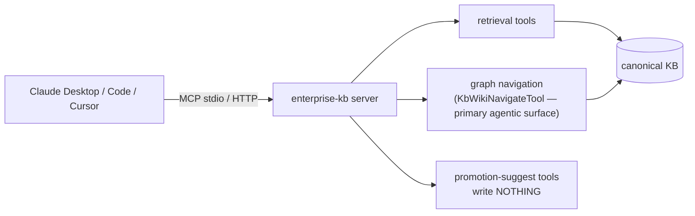

## Motivation

Retrieval is most useful when an *agent* can reach it. AskMyDocs exposes its
knowledge base as **MCP (Model Context Protocol) tools**, so Claude Desktop,
Claude Code, Cursor, or any custom agent can search, navigate the graph, and
surface promotion candidates — over the same retrieval stack the chat UI uses.

## The `enterprise-kb` server

The MCP server (`app/Mcp/Servers/KnowledgeBaseServer.php`, registered name
`enterprise-kb`) exposes **25 tools** — read-only retrieval + graph navigation,
plus write-nothing promotion-suggest tools that surface candidate artifacts for
human review (no tool commits canonical storage — promotion stays human-gated,
see [canonical & promotion](/canonical-and-promotion)).

Tool categories include hybrid search, canonical lookups, graph expansion, the
multi-hop **`KbWikiNavigateTool`** (navigate the wiki — the primary agentic
surface, see [Auto-Wiki](/auto-wiki)), evidence-tier set/get, and
promotion-suggest. New capabilities land tri-surface (R44): every Auto-Wiki and
KB capability is also an MCP tool.

## Connecting a client

Expose the server and point your MCP client at it. The host ships an
`mcp:connect` Artisan helper that prints the bootstrap snippet for a consumer
client. Access is **token-gated** — mint a personal access token (Sanctum) or an
MCP token in the admin (`/app/admin/mcp/tokens`) and the per-tool authorizer
enforces the caller's RBAC on every invocation.

## The MCP pack

The transport, multi-turn tool-calling orchestrator, hash-only audit, and RBAC
hooks are factored into the standalone **`padosoft/askmydocs-mcp-pack`** package
(framework-agnostic; AskMyDocs pins `^1.5`). The host binds three adapters
(`McpHostBridge`, server registry, tool authorizer) so the pack drives the real
AskMyDocs retrieval + Spatie RBAC + Eloquent audit. A companion admin SPA
(`/app/admin/mcp-tools`) surfaces server CRUD, the tool catalogue, the audit log,
and a circuit-breaker dashboard.

## Gotchas & operations

- No MCP tool commits canonical storage — promotion is human-gated; the suggest
  tools write nothing.
- Every tool invocation is RBAC-authorized + audited (hash-only) — bypassing the
  authorizer is a defect.
- Adding a new MCP tool: extend `Laravel\Mcp\Server\Tool`, register it on
  `KnowledgeBaseServer::$tools`, and bump the registration-count test.

<CardGroup cols={2}>
  <Card title="Auto-Wiki" icon="wand-magic-sparkles" href="/auto-wiki">
    The agentic navigation surface MCP exposes.
  </Card>
  <Card title="Sister packages" icon="cubes" href="/sister-packages">
    The padosoft/* ecosystem, including the MCP pack.
  </Card>
</CardGroup>
