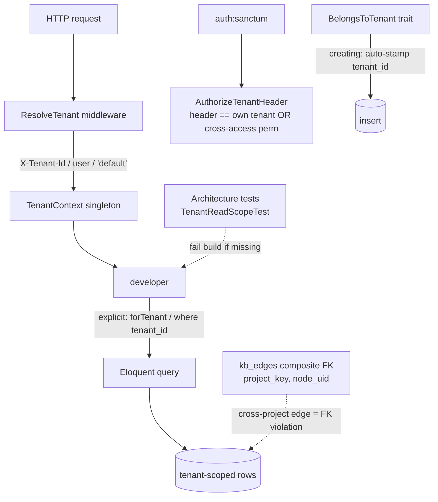

## Motivation / problem

AskMyDocs is multi-tenant: many customers' knowledge lives in one deployment. A
single query that forgets its tenant scope is not a bug — it is a **GDPR-class
data breach**. And the obvious scope (`project_key`) is *not* safe: two different
customers can legitimately both own a project called `engineering`. The only safe
boundary is the **tenant**.

## Theory & background

Tenant isolation must be **structural, not disciplinary**. Relying on every
developer to remember a `where('tenant_id', …)` clause guarantees a leak
eventually. The design therefore pushes isolation into three layers that are hard
to bypass: a request-scoped context, a model trait that auto-stamps on write and
provides an explicit `forTenant()` scope, and architecture tests that fail the
build when any controller or service reads a tenant-aware table without scoping.

## Design



- **`ResolveTenant`** (middleware, runs early) sets the active tenant on the
  request-scoped **`TenantContext`** singleton — from the `X-Tenant-Id` header, the
  authenticated user's `tenant_id`, or `'default'` (v3 backward-compat).
- **`AuthorizeTenantHeader`** (after `auth:sanctum`) closes the escalation hole:
  a header that differs from the user's own tenant is rejected `403` unless the
  user holds the `tenant.cross-access` permission (audited).
- **`BelongsToTenant`** trait: a `creating` hook auto-stamps `tenant_id` on every
  insert; it also exposes `scopeForTenant(string $tenantId)` for explicit
  query scoping. **There is no global read scope** — every read query must call
  `->forTenant($tenantId)` (or an equivalent explicit `where('tenant_id', …)`)
  explicitly. The `TenantReadScopeTest` architecture test fails the build when a
  controller or service omits this.
- **Project-scoped composite FKs** on `kb_edges` → `kb_nodes`
  (`(project_key, node_uid)`) enforce referential integrity within a project;
  combined with the `tenant_id` filter at query time, cross-tenant edges are
  prevented at both the application and DB layers.

## Data model / contract

- Every tenant-aware table carries `string('tenant_id', 50)->default('default')->index()`,
  and composite uniques start with `tenant_id`.
- Tenant-aware tables include: `knowledge_documents`, `knowledge_chunks`,
  `chat_logs`, `conversations`, `messages`, `kb_nodes`, `kb_edges`,
  `kb_canonical_audit`, `project_memberships`, plus the admin/insights tables —
  the canonical list is enumerated in the architecture tests.
  **`embedding_cache` is intentionally cross-tenant** (no `tenant_id` column) so
  that identical text from any tenant reuses the same cached embedding vector.
- Rules **R30** (scope every tenant-aware query) and **R31** (`tenant_id`
  mandatory on every tenant-aware model + migration) codify this.

## Decision rationale (ADR-style)

- **Why the tenant boundary, not `project_key`?** Project keys are
  customer-chosen and collide across tenants by design — sharing `dec-cache-v2`
  is legitimate. Only `tenant_id` is a safe isolation scope.
- **Why explicit `forTenant()` instead of a global scope?** A global scope is
  invisible at the call site — it can be accidentally bypassed by `withoutGlobalScope()`
  or by a raw `DB::table()` query. Explicit `->forTenant($tenantId)` makes the
  scoping visible and auditable, and the `TenantReadScopeTest` architecture test
  fails the build if a controller or service forgets it. Defense-in-depth: fail
  loudly at CI, not silently at runtime.
- **Why project-scoped composite FKs on `kb_edges`?** Referential integrity at
  the DB level catches bugs that application-layer discipline alone would miss.
  `(project_key, node_uid)` ensures an edge cannot reference a node that does
  not exist in the same project.
- **Why architecture tests?** `TenantIdMandatoryTest` + the read-scope test
  enumerate the tenant-aware model list and **fail the build** when a new model
  forgets the trait — so isolation cannot silently regress.

## Worked example

```php
// Reads require explicit scoping — BelongsToTenant has NO global read scope:
$docs = KnowledgeDocument::query()->forTenant($tenantId)->get();  // safe

// Without forTenant(), all tenants' rows are returned — the architecture test
// (TenantReadScopeTest) blocks this pattern from reaching main.

// A cross-project edge cannot be inserted: the (project_key, node_uid) composite
// FK rejects a to_node_uid that does not exist in that project.
```

A request carrying `X-Tenant-Id: victim` from a user whose own tenant is `acme`
is rejected `403 tenant_forbidden` unless that user holds `tenant.cross-access`.

## Gotchas & operations

- A new tenant-aware model must `use BelongsToTenant;` **and** be added to **both**
  architecture-test completeness lists (`TenantIdMandatoryTest` FQCN list and the
  read-scope test short-name list) — run the full `tests/Architecture` suite, not
  one file.
- Queue workers re-bind the tenant via a try/finally restore — background jobs are
  tenant-scoped too.
- `KB_PROJECT_ISOLATION_ENABLED` (default-off) adds optional per-project isolation
  *within* a tenant; it does not replace the tenant boundary.

<CardGroup cols={2}>
  <Card title="Architecture overview" icon="share-nodes" href="/architecture/overview">
    The project-scoped composite FKs and canonical graph schema.
  </Card>
  <Card title="Core concepts" icon="lock" href="/core-concepts">
    The full isolation and auth posture in context.
  </Card>
</CardGroup>
