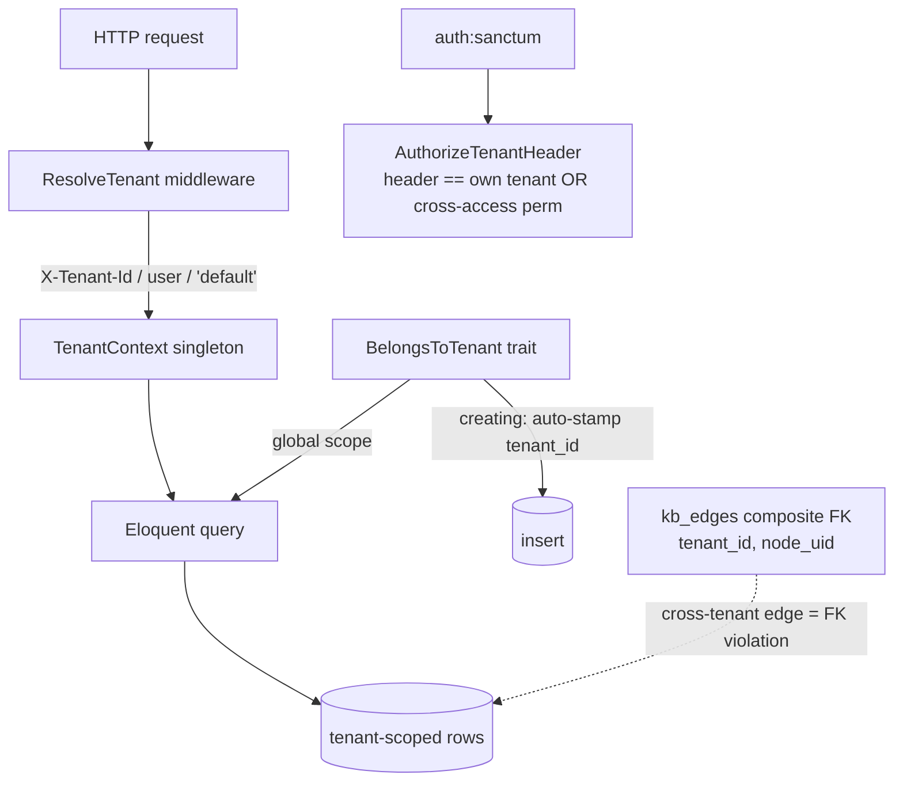

## Motivation / problem

AskMyDocs is multi-tenant: many customers' knowledge lives in one deployment. A
single query that forgets its tenant scope is not a bug — it is a **GDPR-class
data breach**. And the obvious scope (`project_key`) is *not* safe: two different
customers can legitimately both own a project called `engineering`. The only safe
boundary is the **tenant**.

## Theory & background

Tenant isolation must be **structural, not disciplinary**. Relying on every
developer to remember a `where('tenant_id', …)` clause guarantees a leak
eventually. The design therefore pushes isolation into three layers that are hard
to bypass: a request-scoped context, a model trait that auto-scopes + auto-stamps,
and database-level composite foreign keys that make cross-tenant relationships
*impossible to insert*.

## Design



- **`ResolveTenant`** (middleware, runs early) sets the active tenant on the
  request-scoped **`TenantContext`** singleton — from the `X-Tenant-Id` header, the
  authenticated user's `tenant_id`, or `'default'` (v3 backward-compat).
- **`AuthorizeTenantHeader`** (after `auth:sanctum`) closes the escalation hole:
  a header that differs from the user's own tenant is rejected `403` unless the
  user holds the `tenant.cross-access` permission (audited).
- **`BelongsToTenant`** trait: a global scope filters reads to
  `TenantContext::current()`, and a `creating` hook auto-stamps `tenant_id` so
  inserts cannot forget it.
- **Composite tenant-scoped FKs** on `kb_edges` → `kb_nodes` (`(tenant_id,
  node_uid)`) make a cross-tenant edge a foreign-key violation — structurally
  impossible.

## Data model / contract

- Every tenant-aware table carries `string('tenant_id', 50)->default('default')->index()`,
  and composite uniques start with `tenant_id`.
- Tenant-aware tables include: `knowledge_documents`, `knowledge_chunks`,
  `embedding_cache`, `chat_logs`, `conversations`, `messages`, `kb_nodes`,
  `kb_edges`, `kb_canonical_audit`, `project_memberships`, plus the admin/insights
  tables — the canonical list is enumerated in the architecture tests.
- Rules **R30** (scope every tenant-aware query) and **R31** (`tenant_id`
  mandatory on every tenant-aware model + migration) codify this.

## Decision rationale (ADR-style)

- **Why the tenant boundary, not `project_key`?** Project keys are
  customer-chosen and collide across tenants by design — sharing `dec-cache-v2`
  is legitimate. Only `tenant_id` is a safe isolation scope.
- **Why a global scope + trait instead of manual `where`?** Defense in depth: the
  trait makes the safe path the default path, so forgetting a clause fails
  closed, not open. Admin/backfill flows opt out explicitly with
  `withoutGlobalScope`.
- **Why composite FKs?** Code discipline can be bypassed; a database constraint
  cannot. Making cross-tenant edges a FK violation turns a class of bug into an
  impossibility.
- **Why architecture tests?** `TenantIdMandatoryTest` + the read-scope test
  enumerate the tenant-aware model list and **fail the build** when a new model
  forgets the trait — so isolation cannot silently regress.

## Worked example

```php
// Behind the tenant stack, this query is already scoped — no manual where():
$docs = KnowledgeDocument::query()->get();   // only the active tenant's rows

// A cross-tenant edge cannot be inserted: the composite FK rejects it.
// kb_edges (tenant_id='A', from_node_uid pointing at a tenant 'B' node) → FK violation.
```

A request carrying `X-Tenant-Id: victim` from a user whose own tenant is `acme`
is rejected `403 tenant_forbidden` unless that user holds `tenant.cross-access`.

## Gotchas & operations

- A new tenant-aware model must `use BelongsToTenant;` **and** be added to **both**
  architecture-test completeness lists (`TenantIdMandatoryTest` FQCN list and the
  read-scope test short-name list) — run the full `tests/Architecture` suite, not
  one file.
- Queue workers re-bind the tenant via a try/finally restore — background jobs are
  tenant-scoped too.
- `KB_PROJECT_ISOLATION_ENABLED` (default-off) adds optional per-project isolation
  *within* a tenant; it does not replace the tenant boundary.

<CardGroup cols={2}>
  <Card title="Canonical graph (architecture)" icon="share-nodes" href="/architecture/canonical-graph">
    The composite tenant-scoped FKs in detail.
  </Card>
  <Card title="Security & threat model" icon="lock" href="/architecture/security-and-threat-model">
    The full isolation + auth posture.
  </Card>
</CardGroup>
